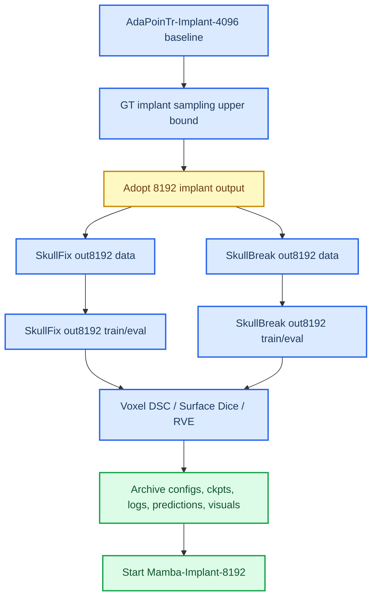

# AdaPoinTr-Implant 8192-output SkullFix 与 SkullBreak Baseline 完整报告

_记录 AdaPoinTr-Implant 在 SkullFix 与 SkullBreak 上升级到 8192 implant output 后的实验协议、结果、问题分析、归档状态与后续 Mamba-Implant-8192 改进方向。更新于 2026-07-09。_

---

## 摘要

本阶段在已经完成 `AdaPoinTr-Implant-4096` SkullFix/SkullBreak seed-0 baseline 的基础上，进一步验证并固定新的 `8192-output` 协议。新的主协议定义为：

```text
input  = defective skull point cloud, 8192 points
target = implant / defect-region point cloud, 8192 points
output = predicted implant point cloud, 8192 points
final reconstruction = defective skull union predicted implant
```

采用 8192 个 implant 输出点的动机来自 GT 采样上限分析：在 SkullFix test set 上，即使直接从 GT implant 采样，`4096` 点也会明显低估 implant 体积，导致 voxel DSC 与 RVE 受限；提升到 `8192` 点后，GT point CD、HD95、voxel DSC、Surface Dice@1mm 与 RVE 均明显改善。因此，后续 Mamba 主实验若继续使用 `4096` output，可能会把点数瓶颈误当作模型瓶颈。

本阶段得到的主要结论如下：

- SkullFix 上，8192-output 明显改善 implant 体积表达、implant DSC、absolute RVE 与 rim CD，但 surface/rim 精细贴合仍不稳定。
- SkullBreak 上，8192-output 相比 4096-output 在 implant DSC、RVE、point CD/HD95、rim contact 指标上均有更稳定提升。
- 在两个数据集上，8192-output 都没有彻底解决 final Surface Dice@1mm 低于 defective input 的问题，说明“更多输出点”主要改善 coverage/volume，不自动带来严密边界贴合。
- 后续 `Mamba-Implant-8192` 应把 `AdaPoinTr-Implant-8192` 作为公平 baseline，而不是与旧的 `4096-output` baseline 直接做主对比。

---

## 实验背景与协议变化

### 为什么从 4096-output 升级到 8192-output

此前正式 baseline 使用：

```text
input defective skull = 8192 points
output implant        = 4096 points
```

该协议能跑通 AdaPoinTr-Implant，但在 voxel 指标上存在明显欠填充现象，尤其是 implant DSC 偏低、signed RVE 长期为负。为了判断这是模型能力不足还是输出点数上限导致，先进行了 GT implant 采样上限分析。

SkullFix GT implant sampling upper bound 结果如下：

| GT implant 点数 | Point CD [mm] | Point HD95 [mm] | Voxel DSC | Surface Dice@1mm | RVE |
| ---: | ---: | ---: | ---: | ---: | ---: |
| 1024 | 0.9188 | 3.5693 | 0.1078 | 0.6689 | -0.9112 |
| 2048 | 0.6547 | 2.5487 | 0.1833 | 0.8662 | -0.8374 |
| 4096 | 0.4588 | 1.7868 | 0.2824 | 0.9733 | -0.7209 |
| 8192 | 0.3132 | 1.2246 | 0.3765 | 0.9985 | -0.5775 |
| 16384 | 0.1962 | 0.8562 | 0.4341 | 1.0000 | -0.4560 |

该结果说明：

- `4096 -> 8192` 能显著降低 GT 采样误差。
- `8192` 对 implant voxel DSC 和 RVE 更友好。
- 即使使用 GT 采样，RVE 仍然为负，说明当前 `splat_radius_mm=1.0` 的点云转体素协议天然会低估体积；因此 RVE 更适合在同一协议内做相对比较，而不能解释为绝对真实体积。

### 新的公平对比原则

后续主实验应使用：

```text
AdaPoinTr-Implant-8192 vs Mamba-Implant-8192
```

不建议把：

```text
AdaPoinTr-Implant-4096 vs Mamba-Implant-8192
```

作为主对比，因为那会混淆“模型结构改进”和“输出点数增加”的贡献。

---

## 数据与任务定义

### 任务定义

所有实验统一采用 implant prediction，而不是 complete skull reconstruction：

```text
input  = defective skull point cloud
target = implant / defect-region point cloud
output = predicted implant point cloud
final reconstruction = defective skull union predicted implant
```

评估对象分为三层：

| 层级 | 比较对象 | 作用 |
| --- | --- | --- |
| Implant-level | predicted implant vs GT implant | 主任务质量，重点看缺损区预测 |
| Final-level | defective skull union predicted implant vs complete skull | 判断最终修复结果是否改善完整颅骨 |
| Input baseline | defective skull vs complete skull | 零模型基线，防止 whole-skull 指标掩盖 implant 错误 |
| Rim contact | predicted implant contact band vs GT contact band | 诊断边界贴合与骨窗连续性 |

### SkullFix 数据协议

SkullFix 使用固定 `80/10/10` case-level split：

| Split | 病例数 |
| --- | ---: |
| Train | 80 |
| Val | 10 |
| Test | 10 |

SkullFix out8192 使用与 seed-0 baseline 一致的 test split：

```text
000, 001, 014, 030, 047, 053, 054, 056, 079, 092
```

关键设置：

```text
data conversion seed = 20260628
training seed        = 0
input points         = 8192
implant target       = 8192
model output         = 8192
```

### SkullBreak 数据协议

SkullBreak 必须按原始 skull 分组，不能让同一个 complete skull 的不同 defect 跨 split。

官方 split：

| Official split | Skulls | Defects/skull | Cases |
| --- | ---: | ---: | ---: |
| Train | 114 | 5 | 570 |
| Test | 20 | 5 | 100 |
| Total | 134 | 5 | 670 |

五种 defect type：

- `bilateral`
- `frontoorbital`
- `parietotemporal`
- `random_1`
- `random_2`

SkullBreak out8192 数据转换检查结果：

| 检查项 | 结果 |
| --- | ---: |
| Manifest records | 670 |
| Official train skulls | 114 |
| Official train cases | 570 |
| Official test skulls | 20 |
| Official test cases | 100 |
| Gate train cases | 455 |
| Gate val cases | 55 |
| Gate test cases | 60 |
| Each defect type | 134 |
| Implant/missing IoU minimum | 1.000000 |
| Implant/missing IoU mean | 1.000000 |
| Official train/test complete hash overlap | 0 |

关键设置：

```text
data conversion seed = 20260703
training seed        = 0
input points         = 8192
implant target       = 8192
model output         = 8192
```

---

## 实验流程



### 训练与后处理

两个数据集均采用相同的 AdaPoinTr-Implant 8192-output 主干设置：

| 项目 | 设置 |
| --- | --- |
| Model | AdaPoinTr |
| Input | defective skull, 8192 points |
| Target | implant, 8192 points |
| Output | implant, 8192 points |
| `num_query` | 256 |
| `num_points` | 8192 |
| Query selection | `learned_only` |
| Denoising weight | `0.0` |
| Fine coverage weight | `1.0` |
| Fine local weight | `0.0` |
| Optimizer | AdamW |
| Initial LR | `1e-4` |
| Epochs | 100 |
| Training seed | 0 |
| Post-process | BatchNorm recalibration |

继续保留 BN calibration 的原因是，前期 Gate 实验证实小样本与医学点云 setting 下 AdaPoinTr 存在明显 train/eval BatchNorm 统计偏移。最终 checkpoint 使用 `ckpt-last-bncal.pth`。

---

## SkullFix out8192 实验结果

### Point/rim 结果

SkullFix 使用相同 test split 对比 4096-output 与 8192-output。

| 指标 | 4096-output | 8192-output | 变化 |
| --- | ---: | ---: | --- |
| Implant CD-L1 [mm] | 2.9560 | 2.8210 | 改善 |
| Implant HD95 [mm] | 6.3255 | 6.5811 | 略差 |
| Implant NSD@1mm | 0.1268 | 0.1986 | 改善 |
| Final CD-L1 [mm] | 2.6191 | 2.8151 | 变差 |
| Final HD95 [mm] | 5.8998 | 6.6819 | 变差 |
| Final NSD@1mm | 0.1070 | 0.0941 | 变差 |
| Input CD-L1 [mm] | 2.6988 | 2.6988 | 基线不变 |
| Input HD95 [mm] | 4.9918 | 4.9918 | 基线不变 |
| Input NSD@1mm | 0.1231 | 0.1231 | 基线不变 |
| Rim CD-L1 [mm] | 8.1547 | 5.9522 | 改善 |
| Rim HD95 [mm] | 29.0267 | 29.8651 | 基本持平/略差 |
| Rim NSD@1mm | 0.3454 | 0.4256 | 改善 |

SkullFix point-level 的现象是：8192-output 对 implant 自身覆盖与 rim 平均误差有帮助，但 final reconstruction 的全局点云距离并没有稳定提升。

### Voxel 结果

| 指标 | 4096-output | 8192-output | 变化 |
| --- | ---: | ---: | --- |
| Implant DSC | 0.2686 | 0.3294 | 改善 |
| Implant RVE | -0.4572 | -0.4100 | 欠填充减轻 |
| Implant absolute RVE | 0.4959 | 0.4100 | 改善 |
| Implant surface ASSD [mm] | 2.4570 | 2.8086 | 变差 |
| Implant surface HD95 [mm] | 7.1255 | 6.8949 | 小幅改善 |
| Implant Surface Dice@1mm | 0.3566 | 0.3388 | 略差 |
| Final DSC | 0.9470 | 0.9543 | 改善 |
| Final RVE | -0.0606 | -0.0397 | 改善 |
| Final absolute RVE | 0.0611 | 0.0397 | 改善 |
| Final surface ASSD [mm] | 0.2971 | 0.3414 | 变差 |
| Final surface HD95 [mm] | 2.2036 | 2.9236 | 变差 |
| Final Surface Dice@1mm | 0.9074 | 0.9157 | 小幅改善 |
| Input DSC | 0.9476 | 0.9541 | 注意：不同数据记录口径下略有差异 |
| Input surface ASSD [mm] | 0.7402 | 0.4286 | 输入基线 |
| Input Surface Dice@1mm | 0.9468 | 0.9640 | 输入基线 |
| Rim CD-L1 [mm] | 2.9853 | 2.7019 | 改善 |
| Rim HD95 [mm] | 15.4752 | 16.1085 | 略差 |
| Rim NSD@1mm | 0.5933 | 0.5845 | 基本持平 |

SkullFix 8192-output paired final vs input：

| 指标 | Improved cases | Mean delta | 95% CI |
| --- | ---: | ---: | --- |
| DSC | 7/10 | +0.0002 | [-0.0073, 0.0060] |
| Absolute RVE | 10/10 | -0.0481 | [-0.0530, -0.0433] |
| Surface ASSD | 9/10 | -0.0872 | [-0.2314, 0.1347] |
| Surface HD95 | 0/10 | +2.9236 | [1.6782, 4.9021] |
| Surface Dice@1mm | 0/10 | -0.0483 | [-0.0638, -0.0365] |

结论：SkullFix 上 8192-output 适合解决体积欠填充，但不能单独作为 surface/rim 精修方案。

### SkullFix out8192 归档状态

SkullFix out8192 消融已经正式归档，并在本地完成 SHA256 校验。

服务器归档文件：

```text
~/baseline_archives/skullfix_adapointr_implant_out8192_ablation_seed20260628_v1.tar
~/baseline_archives/skullfix_adapointr_implant_out8192_ablation_seed20260628_v1.tar.sha256
```

本地备份目录：

```text
D:\ResearchBackups\AdaPoinTr\SkullFix_point_count_ablation\out8192_archive
```

SHA256 校验结果：

```text
actual == expected -> True
checksum = 7cb6619d0d67555bd82178a6092d151e90d8303e5c885119b7910f01366f8928
```

---

## SkullBreak out8192 实验结果

### 内部 checkpoint 指标

SkullBreak 8192-output full baseline 跑完后，BN-calibrated checkpoint 元信息为：

```text
F-Score = 0.33995450735092164
CDL1    = 15.154537010192872
CDL2    = 0.6842170178890228
EMD     = 0.0
```

相比此前 4096-output full baseline：

```text
F-Score = 0.2111963477730751
CDL1    = 18.22322952270508
CDL2    = 0.9367437452077866
```

内部点云指标显示 8192-output 明显优于 4096-output。

### Official test point/rim 结果

SkullBreak official test set 为 20 skulls / 100 cases。8192-output 结果如下：

| 指标 | 8192-output |
| --- | ---: |
| Samples | 100 |
| Skulls | 20 |
| Implant CD-L1 [mm] | 2.4232 |
| Implant HD95 [mm] | 6.1951 |
| Implant NSD@0.5mm | 0.0418 |
| Implant NSD@1mm | 0.2178 |
| Implant NSD@2mm | 0.5707 |
| Final CD-L1 [mm] | 2.3279 |
| Final HD95 [mm] | 5.0913 |
| Final NSD@0.5mm | 0.0280 |
| Final NSD@1mm | 0.1415 |
| Final NSD@2mm | 0.4212 |
| Input CD-L1 [mm] | 2.6470 |
| Input HD95 [mm] | 6.2572 |
| Input NSD@0.5mm | 0.0379 |
| Input NSD@1mm | 0.1851 |
| Input NSD@2mm | 0.4985 |
| Rim CD-L1 [mm] | 4.1777 |
| Rim HD95 [mm] | 19.8184 |
| Rim NSD@0.5mm | 0.4891 |
| Rim NSD@1mm | 0.4948 |
| Rim NSD@2mm | 0.5237 |

相对 input defective baseline：

- Final CD 从 `2.6470` 降至 `2.3279`，说明整体平均距离改善。
- Final HD95 从 `6.2572` 降至 `5.0913`，说明严重偏差有缓解。
- Final NSD@1mm 从 `0.1851` 降至 `0.1415`，说明严格 1mm 表面贴合比例反而下降。

### Voxel 结果

SkullBreak 8192-output voxel evaluation 使用：

```text
splat_radius_mm = 1.0
rim_band_mm     = 2.0
dataset_label   = skullbreak
output_prefix   = skullbreak_voxel
```

结果文件：

```text
D:\ResearchBackups\AdaPoinTr\SkullBreak_implant_out8192_seed0_v1\voxel_evaluation\skullbreak_voxel_voxel_per_sample.csv
D:\ResearchBackups\AdaPoinTr\SkullBreak_implant_out8192_seed0_v1\voxel_evaluation\skullbreak_voxel_voxel_summary.json
```

核心结果：

| 指标 | 8192-output |
| --- | ---: |
| Samples | 100 |
| Skulls | 20 |
| Implant DSC | 0.3638 |
| Implant RVE | -0.1243 |
| Implant absolute RVE | 0.3705 |
| Implant surface ASSD [mm] | 2.3721 |
| Implant surface HD95 [mm] | 6.7875 |
| Implant Surface Dice@1mm | 0.3648 |
| Final DSC | 0.9464 |
| Final RVE | -0.0352 |
| Final absolute RVE | 0.0407 |
| Final surface ASSD [mm] | 0.3805 |
| Final surface HD95 [mm] | 2.6647 |
| Final Surface Dice@1mm | 0.8852 |
| Input DSC | 0.9476 |
| Input RVE | -0.0981 |
| Input absolute RVE | 0.0981 |
| Input surface ASSD [mm] | 0.7402 |
| Input surface HD95 [mm] | 3.7578 |
| Input Surface Dice@1mm | 0.9468 |
| Rim CD-L1 [mm] | 2.3138 |
| Rim HD95 [mm] | 12.5600 |
| Rim NSD@1mm | 0.6334 |

SkullBreak 8192-output paired final vs input：

| 指标 | Improved cases | Mean delta | 95% CI |
| --- | ---: | ---: | --- |
| DSC | 45/100 | -0.0012 | [-0.0029, 0.0006] |
| RVE | 100/100 | -0.0574 | [-0.0614, -0.0532] |
| Absolute RVE | 100/100 | -0.0574 | [-0.0614, -0.0531] |
| Surface ASSD | 82/100 | -0.3597 | [-0.4523, -0.2790] |
| Surface HD95 | 35/100 | -1.0931 | [-2.1414, -0.1532] |
| Surface Dice@1mm | 0/100 | -0.0616 | [-0.0658, -0.0573] |

### 与 SkullBreak 4096-output 的对比

| 指标 | 4096-output | 8192-output | 变化 |
| --- | ---: | ---: | --- |
| Implant DSC | 0.2686 | 0.3638 | 明显改善 |
| Implant RVE | -0.4572 | -0.1243 | 欠填充大幅缓解 |
| Implant absolute RVE | 0.4959 | 0.3705 | 改善 |
| Implant surface ASSD [mm] | 2.4570 | 2.3721 | 小幅改善 |
| Implant surface HD95 [mm] | 7.1255 | 6.7875 | 改善 |
| Implant Surface Dice@1mm | 0.3566 | 0.3648 | 小幅改善 |
| Final DSC | 0.9470 | 0.9464 | 基本持平 |
| Final absolute RVE | 0.0611 | 0.0407 | 改善 |
| Final surface ASSD [mm] | 0.2971 | 0.3805 | 变差 |
| Final surface HD95 [mm] | 2.2036 | 2.6647 | 变差 |
| Final Surface Dice@1mm | 0.9074 | 0.8852 | 变差 |
| Rim CD-L1 [mm] | 2.9853 | 2.3138 | 改善 |
| Rim HD95 [mm] | 15.4752 | 12.5600 | 改善 |
| Rim NSD@1mm | 0.5933 | 0.6334 | 改善 |

SkullBreak 的结论比 SkullFix 更积极：8192-output 不仅改善体积表达，也改善 rim contact；但 final reconstruction 的 Surface Dice@1mm 仍低于 input baseline。

---

## 关键问题与解决方案

### 问题一：4096-output 存在体积表达上限

现象：

- GT 采样上限中，4096 点的 DSC 与 RVE 明显低于 8192 点。
- 4096-output baseline 的 implant DSC 与 RVE 都偏弱。

解决：

- 增加 `n_implant`、`N_POINTS`、`model.num_points` 到 8192。
- 保持 input、split、seed、BN calibration 与 evaluator 口径不变。
- 重新建立 `AdaPoinTr-Implant-8192` baseline，作为后续 Mamba 公平对照。

### 问题二：output 点数增加不等于 surface/rim 精度提升

现象：

- SkullFix 中，8192-output 改善 implant DSC/RVE，但 final HD95 与 Surface Dice@1mm 不稳定。
- SkullBreak 中，8192-output 改善 point/rim 和 implant voxel 指标，但 final Surface Dice@1mm 仍低于 input baseline。

解释：

- 更多点能提升覆盖率和体积表达。
- 但模型可能生成偏离真实表面的额外点或边界不贴合点。
- whole-skull Surface Dice 对 input 已经存在的健康颅骨表面很敏感，预测 implant 引入的局部扰动会降低 tight-tolerance 指标。

应对：

- 后续创新不能只靠继续增加点数。
- 需要 rim-aware、defect-local、surface-aware 与 refinement 机制。

### 问题三：SkullBreak 原始数据只在 Windows

现象：

- 服务器没有 SkullBreak 原始 NRRD。
- 8192-output 点云必须在 Windows 本机重新转换。

解决：

Windows 本机转换：

```powershell
python tools\prepare_skullbreak_pointcloud.py `
  --training_root "D:\dataset\SkullBreak\raw\train" `
  --evaluation_root "D:\dataset\SkullBreak\raw\test" `
  --output_root "D:\dataset\SkullBreakPC_out8192" `
  --n_partial 8192 `
  --n_complete 8192 `
  --n_implant 8192 `
  --seed 20260703 `
  --gate_split 0.8,0.1,0.1 `
  --monitor_skulls 10 `
  --strict_geometry `
  --workers 4 `
  --overwrite
```

再打包上传服务器训练。

### 问题四：服务器存储空间紧张

现象：

- 服务器 `/home/jovyan` 只有 50G。
- 训练、checkpoint、prediction、visualization、archive 很容易占满。

解决：

- 删除已本地校验的归档副本。
- 删除 overlay 压缩包。
- 删除中间 `ckpt-epoch-*.pth`。
- 删除 split mismatch、identity、sanity 等不再需要的诊断实验。
- 在 out8192 配置中关闭频繁保存 final epoch checkpoint：

```yaml
save_best_checkpoint: false
save_final_epoch_checkpoints: false
```

### 问题五：本机缺少专用 SkullBreak voxel evaluator 文件名

现象：

```text
can't open file 'tools/evaluate_skullbreak_voxel_metrics.py'
```

解决：

使用通用的 `evaluate_skullfix_voxel_metrics.py`，通过参数指定：

```powershell
--dataset_label skullbreak
--output_prefix skullbreak_voxel
```

成功得到：

```text
skullbreak_voxel_voxel_per_sample.csv
skullbreak_voxel_voxel_summary.json
```

---

## 综合分析

### 8192-output 解决了什么

1. 改善 implant 体积覆盖。
2. 降低 signed/absolute RVE。
3. 在 SkullBreak 上显著改善 implant DSC。
4. 在 SkullBreak 上改善 rim CD、rim HD95 和 rim NSD@1mm。
5. 缓解 `4096` 输出稀疏导致的欠填充问题。

### 8192-output 没有解决什么

1. 没有稳定提升 final Surface Dice@1mm。
2. 没有保证 final DSC 超过 input baseline。
3. 没有彻底解决 rim 边界贴合。
4. 不能抑制局部离群点或边界过冲。
5. 不能自动学习缺损边缘的接触连续性。

### 为什么 final Surface Dice@1mm 容易低于 input

Defective input 的健康颅骨区域本身已经与 complete skull 高度一致，因此 whole-skull Surface Dice@1mm 起点很高。模型加入 predicted implant 后：

- 如果 implant 点云没有严格贴合 GT 表面，会在 defect region 引入额外误差。
- 即使平均 CD/HD95 变好，1mm tight tolerance 仍可能下降。
- 因此 Surface Dice@1mm 是更严苛的局部精度指标，不应只用 whole-skull DSC 掩盖。

### SkullFix 与 SkullBreak 的差异

| 方面 | SkullFix out8192 | SkullBreak out8192 |
| --- | --- | --- |
| 数据规模 | 100 cases，总 test 10 cases | 670 cases，official test 100 cases |
| 8192 对 implant DSC | 明显提升 | 明显提升 |
| 8192 对 RVE | 改善 | 显著改善 |
| 8192 对 rim | 部分改善，HD95 不稳定 | CD/HD95/NSD 均改善 |
| Final Surface Dice@1mm | 仍弱于 input | 仍弱于 input |
| 结论强度 | 小样本支持 | 大样本更支持 |

SkullBreak 的 100-case official test 更能支撑 8192-output 成为正式 baseline；SkullFix 的价值主要是补充医学数据接入和小样本对照。

---

## 后续创新改进点

### 方向一：Mamba-Implant-8192 主干替换

目标是在相同 input/output 点数下验证 Mamba 是否能比 AdaPoinTr 更好建模长程颅骨几何与缺损区上下文。

公平比较要求：

```text
same train/test split
same input points
same output points
same normalization
same BN/calibration policy when applicable
same point/rim evaluator
same voxel evaluator
same visualization protocol
```

### 方向二：Defect-local / rim-aware 特征建模

当前模型主要靠全局 defective skull 输入推断缺损区。后续可以加入非泄漏 rim-local 输入：

| 协议 | 是否使用 GT implant | 用途 |
| --- | --- | --- |
| `global8192` | 否 | 当前正式 baseline |
| `global8192_gt_rim2048` | 是 | Oracle upper bound |
| `global8192_defective_rim2048` | 否 | 正式可用的 rim-local 输入 |
| `global8192_pred_rim2048` | 否 | 两阶段 refinement |

正式实验中不能使用 GT implant 定义 rim-local，否则存在信息泄漏。可行替代方案包括：

- defective mask morphology closing/filling
- defective surface boundary scoring
- local PCA / normal variation / density drop
- stage-1 predicted implant 引导的 predicted-rim

### 方向三：Surface-aware 与 rim-aware loss

8192-output 已经改善 coverage，但 surface/rim 精度仍不足。后续可以考虑：

- 增加 rim band 内的加权 Chamfer
- 分别约束 pred-to-ref 与 ref-to-pred 方向
- 对边界 contact band 设定局部 HD95/NSD loss
- 对离群点加入 outlier-robust penalty
- 引入 multi-scale local surface consistency

### 方向四：Coarse-to-fine / iterative refinement

当前 AdaPoinTr 一次性生成 implant。后续可改为：

```text
stage 1: global defective skull -> coarse implant
stage 2: defective skull + coarse implant / predicted rim -> refined implant
```

这与已阅读的颅骨点云补全论文思路一致，也适合 Mamba 进行序列式局部 refinement。

### 方向五：预测后处理与可制造性约束

当前点云输出还没有显式保证：

- 连通性
- watertight mesh
- 厚度合理性
- 与骨窗边界连续
- 无远离 defect 的离群分量

后续若从点云走向可制造 implant，需要增加：

- 点云到 mesh 的统一重建流程
- connected component filtering
- rim snapping / boundary smoothing
- implant thickness 或 implicit surface 约束
- valid implant rate 统计

---

## 建议的下一步

### 短期

1. SkullBreak out8192 baseline 已完成服务器归档：

```text
~/baseline_archives/skullbreak_adapointr_implant_out8192_seed0_v1.tar
~/baseline_archives/skullbreak_adapointr_implant_out8192_seed0_v1.tar.sha256
```

2. 本地备份目录为：

```text
D:\ResearchBackups\AdaPoinTr\SkullBreak_implant_out8192_seed0_v1\
```

3. 本地 SHA256 校验已通过：

```text
actual == expected -> True
checksum = a973b796c34984359069f806b83e45f0bb53fb22a703643f59b16245c3d2b8f3
```

4. Windows voxel evaluation 结果已与服务器归档包放在同一备份目录。

### 中期

1. 更新主实验协议文档，明确后续采用：

```text
AdaPoinTr-Implant-8192
Mamba-Implant-8192
```

2. 对 SkullFix 与 SkullBreak 各自保留：

```text
4096-output historical baseline
8192-output official baseline
```

3. 开始实现 `Mamba-Implant-8192`，优先复用已经稳定的数据、评估、归档与可视化脚本。

### 长期

建议将论文创新点从“单纯增加点数”转向：

```text
8192-output provides enough representation capacity;
Mamba / rim-aware / local-refinement modules improve where AdaPoinTr still fails:
boundary consistency, local surface accuracy, and implant manufacturability.
```

---

## 当前状态清单

| 项目 | 状态 |
| --- | --- |
| SkullFix GT sampling upper bound | 已完成 |
| SkullFix AdaPoinTr-Implant-8192 point eval | 已完成 |
| SkullFix AdaPoinTr-Implant-8192 voxel eval | 已完成 |
| SkullFix out8192 archive | 已完成并本地 SHA256 校验 |
| SkullBreakPC_out8192 data conversion | 已完成 |
| SkullBreakPC_out8192 integrity check | 已通过 |
| SkullBreak AdaPoinTr-Implant-8192 train | 已完成 |
| SkullBreak AdaPoinTr-Implant-8192 point/rim eval | 已完成 |
| SkullBreak AdaPoinTr-Implant-8192 voxel eval | 已完成 |
| SkullBreak out8192 archive | 已完成并本地 SHA256 校验 |
| Mamba-Implant-8192 | 待开始 |

---

## 结论

`AdaPoinTr-Implant-8192` 应作为后续 Mamba 实验的正式公平 baseline。它比 `4096-output` 更合理，因为 8192 点明显缓解 implant 体积欠填充，并在 SkullBreak official test 上显著改善 implant DSC、RVE、point/rim 指标。

但该 baseline 同时暴露出清晰的后续创新空间：即使输出点数增加，final Surface Dice@1mm 仍低于 defective input，说明当前模型缺少足够强的边界感知、局部表面贴合和 rim continuity 建模能力。后续 Mamba-Implant-8192 不应只强调点数或全局重建，而应围绕 defect-local context、rim-aware feature modeling、surface-aware loss 与 coarse-to-fine refinement 展开。
