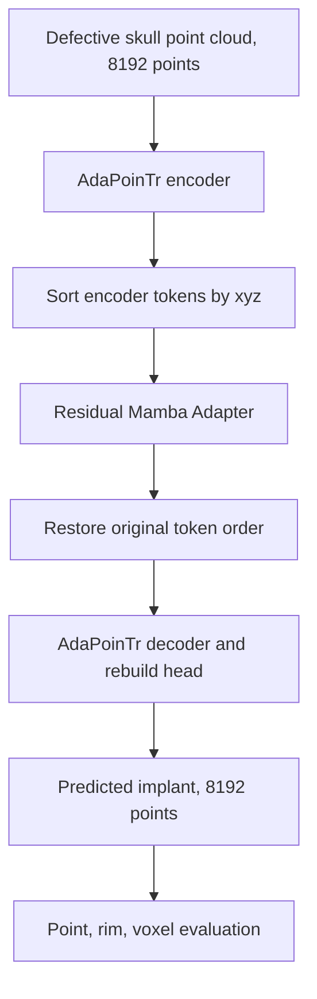

# Mamba Adapter-Implant 8192-output V1 Diagnostic Baseline 中文报告

_记录 Mamba Adapter v1 在 AdaPoinTr-Implant-8192 协议下的实现、环境、实验结果、失败模式、归档状态与下一步改进方案。更新于 2026-07-12。_

---

## 摘要

本阶段在已经固定的 `AdaPoinTr-Implant-8192` SkullFix / SkullBreak baseline 之上，完成了第一版低侵入式 `Mamba Adapter` 改造。该版本不替换 AdaPoinTr 的 encoder、decoder、query generator 或 rebuild head，而是在 AdaPoinTr encoder 输出之后、decoder 之前插入一个残差式 Mamba 序列适配器：

```text
input defective skull points
  -> DGCNN / point proxy extraction
  -> AdaPoinTr encoder
  -> Mamba Adapter
  -> AdaPoinTr decoder / query / rebuild head
  -> predicted implant, 8192 points
```

本版本的定位不是最终改进模型，而是 `Mamba Adapter v1 diagnostic baseline`。其核心价值是验证一个最小结构改动的问题：在不引入 GT implant、GT rim 或 complete skull 泄漏的情况下，仅通过 encoder token 的 `xyz` 确定性序列化和 Mamba 残差建模，是否能稳定提升 cranial implant prediction。

实验结论比较明确：

- 在 SkullFix 上，Mamba Adapter v1 对 rim contact 和部分 implant 覆盖指标有一定收益；但 final surface 指标并不稳定。
- 在 SkullBreak 上，Mamba Adapter v1 整体弱于 AdaPoinTr-Implant-8192 baseline，尤其 `frontoorbital` 缺损类型退化明显。
- 该版本证明了“encoder 后直接接 Mamba Adapter + 单一 `xyz` serialization”不是稳定收益方案。
- 下一版应优先解决序列化、残差扰动强度和局部/对称条件注入问题，而不是简单加深 Mamba 或直接扩大训练。

本阶段产物已经以 diagnostic baseline 形式归档，归档文件为：

```text
/home/jovyan/baseline_archives/mamba_adapter_implant_out8192_v1_diagnostic_seed0_lite.tar
/home/jovyan/baseline_archives/mamba_adapter_implant_out8192_v1_diagnostic_seed0_lite.tar.sha256
```

本地 SHA256 校验已通过。

---

## 实验目标与边界

### 目标

本阶段主要回答四个问题：

1. `Mamba Adapter` 能否在不破坏 AdaPoinTr 主干的前提下插入到 implant prediction 协议中。
2. `mamba-ssm` fast path 能否在服务器环境中稳定运行。
3. Mamba Adapter v1 在 SkullFix / SkullBreak 两个数据集上是否优于 AdaPoinTr-Implant-8192 baseline。
4. 如果结果不稳定，失败是否具有可解释的 defect-type 或指标层面模式。

### 不在本阶段解决的问题

本阶段不尝试：

- 直接替换 AdaPoinTr 的所有 Transformer block。
- 修改 query generator、decoder cross-attention 或 rebuild head。
- 使用 GT implant 或 GT rim 构造输入特征。
- 引入 symmetry-aware serialization 的完整学习模块。
- 使用 rim-local GT oracle 作为正式输入。

这些方向会留给后续 `Mamba v1.1`、`Mamba v1.2` 或 `Mamba v2`。

---

## 模型改动

### 插入位置

Mamba Adapter 插入在 AdaPoinTr encoder 输出之后：

```text
x = encoder(x + positional_encoding, coor)
x = mamba_adapter(x, coor)
decoder(x, coor, query)
```

这样做的好处是：

- 保留 AdaPoinTr 已经跑通的 encoder / decoder / query / rebuild 结构。
- 只改变 encoder token 的上下文融合方式。
- 便于和 AdaPoinTr-Implant-8192 做公平对照。
- 如果 `mamba_adapter.enabled=false`，模型行为可以退回原始 AdaPoinTr 路径。

### Adapter 形式

核心结构为：

```text
x_out = x + alpha * DropPath(MambaBlock(LayerNorm(x)))
```

本轮使用的主要配置为：

| 参数 | 设置 |
| --- | ---: |
| `adapter_type` | `mamba_ssm` |
| `depth` | 2 |
| `d_state` | 16 |
| `d_conv` | 4 |
| `expand` | 2 |
| `drop_path` | 0.05 |
| `alpha_init` | 0.1 |
| `order` | `xyz` |
| `use_fast_path` | `true` |

`alpha_init=0.1` 的设计初衷是让 Adapter 初始时接近原 AdaPoinTr 行为，避免训练初期过度扰动 encoder token。但从 SkullBreak 结果看，这个扰动强度仍可能偏大，尤其对复杂前额眶区域缺损不稳。

### 点云序列化

Mamba 是序列模型，而点云 token 本身无序。本版本使用 encoder proxy center `coor` 做确定性排序：

```text
token centers coor -> sort by xyz -> Mamba -> inverse sort -> decoder
```

该序列化只依赖输入 defective skull 产生的 token 坐标，不使用 GT implant、GT rim 或 complete skull，因此没有标签泄漏。

但该方案也有明显局限：

- `xyz` 单序列不一定符合颅骨解剖连续性。
- frontoorbital 区域曲率复杂，简单坐标排序可能把结构关系串错。
- 左右对称关系没有被显式编码。
- Mamba 的顺序敏感性可能把原本 permutation-friendly 的点云 token 变成“错误序列”。

### 实验流程图



---

## 环境与工程问题

### Mamba 环境单独隔离

由于 `mamba-ssm`、`causal-conv1d`、PyTorch、Triton、CUDA/cuDNN/NCCL 之间版本耦合强，本阶段没有继续污染稳定的 `adapointr-server` 环境，而是建立了独立环境：

```text
conda env: adapointr-mamba
python:    3.10
torch:     2.4.1+cu118
torchvision: 0.19.1+cu118
triton:    3.0.0
causal-conv1d: 1.6.2.post1
mamba-ssm: 2.3.1
```

最终验证通过：

```text
conv1d ok
mamba fast path ok
MambaSequenceAdapter forward ok
```

### 主要环境问题与解决方案

| 问题 | 表现 | 原因 | 解决方案 |
| --- | --- | --- | --- |
| `mamba-ssm` build isolation 找不到 torch | `ModuleNotFoundError: No module named 'torch'` | pip build isolation 隔离了当前环境 | 使用 `--no-build-isolation` |
| `causal_conv1d` 旧版本接口不匹配 | `causal_conv1d_fwd_function is None` | `mamba-ssm` 期望新接口 | 从源码构建 `causal-conv1d==1.6.2.post1` |
| `mamba-ssm` 新版本导入 Mamba3 报错 | `triton.set_allocator` 缺失 | Triton / mamba-ssm 版本不匹配 | 使用 `mamba-ssm==2.3.1`，并从 `mamba_ssm.modules.mamba_simple` 导入 |
| CUDA13 包污染环境 | cuDNN / NCCL 符号错误 | 误装了 CUDA13 系列 nvidia 包 | 清理 CUDA13 包，保留 cu11 依赖 |
| `libcudnn.so.9` 缺失 | torch import 失败 | cuDNN wheel 不完整 | 重装 `nvidia-cudnn-cu11==9.1.0.70` |
| `ncclCommRegister` undefined | torch CUDA 加载失败 | NCCL 包状态不一致 | 重装 `nvidia-nccl-cu11==2.20.5` |
| pandas 分析缺 `pytz` | per-sample 对比脚本失败 | Mamba 环境依赖不完整 | 可补 `pytz/tzdata`，或用 Python 标准库替代 |
| 可视化 `tostring_rgb` 不兼容 | Matplotlib 新版本报错 | canvas API 变化 | `utils/misc.py` 增加 `buffer_rgba()` fallback |

### 脚本环境切换问题

已有 SkullBreak eval / visualize 脚本会强制执行：

```bash
conda activate adapointr-server
```

这会导致 Mamba checkpoint 无法加载。因此 Mamba 阶段的 eval / visual 没有直接调用脚本，而是在 `adapointr-mamba` 环境中直接运行底层 Python 工具：

```bash
python tools/recalibrate_skullfix_batchnorm.py ...
python tools/evaluate_skullfix_implant.py ...
python tools/visualize_skullfix_implant.py ...
```

这是一个需要后续工程化修正的问题：Mamba 专用脚本不应强制切到 `adapointr-server`。

---

## 数据与训练协议

### 统一任务定义

```text
input  = defective skull point cloud, 8192 points
target = implant / defect-region point cloud, 8192 points
output = predicted implant point cloud, 8192 points
final reconstruction = defective skull union predicted implant
```

### SkullFix

| 项目 | 设置 |
| --- | --- |
| 数据 | `SkullFixPC_out8192_seed20260628` |
| Split | 固定 `80/10/10` |
| Test cases | `000, 001, 014, 030, 047, 053, 054, 056, 079, 092` |
| Training seed | 0 |
| Epochs | 100 |
| BatchNorm calibration | 训练后执行 |
| 评估 | point / rim / voxel |

### SkullBreak

| 项目 | 设置 |
| --- | --- |
| 数据 | `SkullBreakPC_out8192` |
| Data conversion seed | 20260703 |
| Official train | 114 skulls x 5 defects = 570 cases |
| Official test | 20 skulls x 5 defects = 100 cases |
| Training seed | 0 |
| Epochs | 100 |
| BatchNorm calibration | 训练后执行 |
| 评估 | point / rim / voxel / defect-type breakdown |

---

## Gate 结果

### Gate 1: SkullFix sanity

`SkullFix Mamba Adapter sanity out8192` 跑通了最小训练、验证和 checkpoint 保存流程。该阶段主要验证：

- `mamba-ssm` fast path 可在训练流程中加载。
- `MambaSequenceAdapter` 与 AdaPoinTr encoder / decoder 张量形状兼容。
- 配置中的 `mamba_adapter.enabled=true` 可以被模型正确解析。
- `max_samples` 小样本配置可用于快速调试。

### Gate 2: SkullFix single-case overfit

单样本 overfit 训练到 300 epochs 后，训练 dense loss 下降到约 `20.7`。BNCal 前后差异明显：

| 阶段 | Implant CD [mm] | HD95 [mm] | NSD@1 |
| --- | ---: | ---: | ---: |
| BNCal 前 | 8.3085 | 34.6845 | 0.0780 |
| BNCal 后 | 0.7664 | 1.8739 | 0.7358 |

BNCal 后 overfit case 指标：

| 指标层级 | CD [mm] | HD95 [mm] | NSD@1 |
| --- | ---: | ---: | ---: |
| Implant | 0.7664 | 1.8739 | 0.7358 |
| Final reconstruction | 2.4961 | 4.8529 | 0.1032 |
| Rim contact | 0.8407 | 4.4106 | 0.7718 |

该 gate 说明 Mamba Adapter v1 至少具备记忆单个 implant 的能力，且 BatchNorm recalibration 对小样本和 implant 任务仍然关键。

### Gate 3: SkullFix small20

Small20 训练后，BNCal official small test 指标为：

| 指标层级 | CD [mm] | HD95 [mm] | NSD@1 |
| --- | ---: | ---: | ---: |
| Implant | 2.3158 | 5.5830 | 0.2241 |
| Final reconstruction | 2.5873 | 5.4416 | 0.0976 |
| Input defective baseline | 2.7086 | 4.9573 | 0.1239 |
| Rim contact | 4.9291 | 23.1523 | 0.4037 |

Small20 结果显示模型可以学习到一定 implant 覆盖，但 final / rim 仍然不够稳定。因此跳过 small75，直接进入 SkullFix full seed-0，以判断 full protocol 下是否有稳定收益。

---

## SkullFix full seed-0 结果

### Point / rim 指标对比

| 指标 | AdaPoinTr out8192 | Mamba Adapter v1 | 差值 Mamba-Ada | 判断 |
| --- | ---: | ---: | ---: | --- |
| Implant CD [mm] | 2.8210 | 2.7610 | -0.0600 | 小幅改善 |
| Implant HD95 [mm] | 6.5811 | 6.4096 | -0.1716 | 小幅改善 |
| Implant NSD@1 | 0.1986 | 0.1867 | -0.0119 | 退化 |
| Final CD [mm] | 2.8151 | 2.7911 | -0.0239 | 轻微改善 |
| Final HD95 [mm] | 6.6819 | 6.3848 | -0.2971 | 改善 |
| Final NSD@1 | 0.0941 | 0.0940 | -0.0002 | 基本持平 |
| Rim CD [mm] | 5.9522 | 4.9828 | -0.9694 | 改善 |
| Rim HD95 [mm] | 29.8651 | 23.1610 | -6.7042 | 改善 |
| Rim NSD@1 | 0.4256 | 0.4604 | +0.0349 | 改善 |

逐样本统计显示：

| 指标 | Mean delta | Mamba 更优 cases |
| --- | ---: | ---: |
| Implant CD | -0.0600 | 4 / 10 |
| Implant HD95 | -0.1716 | 5 / 10 |
| Implant NSD@1 | -0.0119 | 3 / 10 |
| Final CD | -0.0239 | 4 / 10 |
| Final HD95 | -0.2971 | 4 / 10 |
| Final NSD@1 | -0.0002 | 4 / 10 |
| Rim CD | -0.9694 | 6 / 10 |
| Rim HD95 | -6.7042 | 6 / 10 |
| Rim NSD@1 | +0.0349 | 8 / 10 |

SkullFix 上的主要信号是 rim contact 改善比较一致，尤其 `rim_contact_nsd_at_1mm` 有 8/10 case 更好。但 implant NSD@1 与 final NSD@1 没有同步改善，说明 Adapter 可能改善了粗略接触带，却没有稳定提升整体表面贴合。

### Voxel 指标对比

| 指标 | AdaPoinTr out8192 | Mamba Adapter v1 | 判断 |
| --- | ---: | ---: | --- |
| Implant DSC | 0.3294 | 0.3504 | 改善 |
| Implant absolute RVE | 0.4100 | 0.3820 | 改善 |
| Implant surface ASSD [mm] | 2.8086 | 2.7659 | 小幅改善 |
| Implant surface HD95 [mm] | 6.8949 | 6.7609 | 小幅改善 |
| Implant Surface Dice@1 | 0.3388 | 0.3286 | 退化 |
| Final DSC | 0.9543 | 0.9551 | 小幅改善 |
| Final absolute RVE | 0.0397 | 0.0372 | 小幅改善 |
| Final surface ASSD [mm] | 0.3414 | 0.3510 | 退化 |
| Final surface HD95 [mm] | 2.9236 | 3.0096 | 退化 |
| Final Surface Dice@1 | 0.9157 | 0.9101 | 退化 |
| Rim CD [mm] | 2.7019 | 2.2955 | 改善 |
| Rim HD95 [mm] | 16.1085 | 13.1800 | 改善 |
| Rim NSD@1 | 0.5845 | 0.6213 | 改善 |

SkullFix voxel 结果支持同一个判断：Mamba Adapter v1 对 implant volume / rim contact 有正向信号，但 final surface quality 不稳定。它不能被视为全面优于 AdaPoinTr，而应视为“局部边界信号有价值，但表面质量仍有代价”的诊断结果。

---

## SkullBreak full seed-0 结果

### Training / validation

SkullBreak full seed-0 训练完成 100 epochs，monitor validation 最终为：

| 指标 | 数值 |
| --- | ---: |
| F-Score | 0.3025 |
| CDL1 | 16.2759 |
| CDL2 | 0.7876 |
| EMDistance | 0.0000 |

BNCal 对 SkullBreak full 的影响较小：

| 阶段 | CD [mm] | HD95 [mm] | NSD@1 | P->R [mm] | R->P [mm] |
| --- | ---: | ---: | ---: | ---: | ---: |
| BNCal 前 | 1.7700 | 3.9534 | 0.2701 | 2.0890 | 1.4509 |
| BNCal 后 | 1.7643 | 3.9389 | 0.2686 | 2.0868 | 1.4417 |

### Point / rim 指标对比

| 指标 | AdaPoinTr out8192 | Mamba Adapter v1 | 差值 Mamba-Ada | 判断 |
| --- | ---: | ---: | ---: | --- |
| Implant CD [mm] | 2.4232 | 3.4818 | +1.0586 | 明显退化 |
| Implant HD95 [mm] | 6.1951 | 8.2139 | +2.0188 | 明显退化 |
| Implant NSD@1 | 0.2178 | 0.1997 | -0.0181 | 退化 |
| Final CD [mm] | 2.3279 | 2.4608 | +0.1329 | 退化 |
| Final HD95 [mm] | 5.0913 | 5.7377 | +0.6464 | 退化 |
| Final NSD@1 | 0.1415 | 0.1406 | -0.0010 | 基本持平略差 |
| Input CD [mm] | 2.6470 | 2.6470 | 0.0000 | 参考 |
| Input HD95 [mm] | 6.2572 | 6.2572 | 0.0000 | 参考 |
| Input NSD@1 | 0.1851 | 0.1851 | 0.0000 | 参考 |
| Rim CD [mm] | 4.1777 | 4.9023 | +0.7246 | 退化 |
| Rim HD95 [mm] | 19.8184 | 22.1017 | +2.2833 | 退化 |
| Rim NSD@1 | 0.4948 | 0.4623 | -0.0325 | 退化 |

逐样本统计为：

| 指标 | Mean delta | Mamba 更优 cases |
| --- | ---: | ---: |
| Implant CD | +1.0586 | 36 / 100 |
| Implant HD95 | +2.0188 | 35 / 100 |
| Implant NSD@1 | -0.0181 | 40 / 100 |
| Final CD | +0.1329 | 41 / 100 |
| Final HD95 | +0.6464 | 44 / 100 |
| Final NSD@1 | -0.0010 | 40 / 100 |
| Rim CD | +0.7571 | 39 / 100 |
| Rim HD95 | +2.2997 | 44 / 100 |
| Rim NSD@1 | -0.0346 | 37 / 100 |

### Defect-type 点云分组

| Defect type | n | Implant CD delta | Final CD delta | Rim CD delta | 判断 |
| --- | ---: | ---: | ---: | ---: | --- |
| `bilateral` | 20 | +0.3349 | +0.0120 | +1.5955 | rim 退化明显 |
| `frontoorbital` | 20 | +4.3041 | +0.4749 | +0.9891 | 主要失败类型 |
| `parietotemporal` | 20 | +0.2369 | +0.0661 | -0.7339 | rim 有收益 |
| `random_1` | 20 | +0.5145 | +0.1292 | +2.6235 | rim 退化明显 |
| `random_2` | 20 | -0.0977 | -0.0175 | -0.6773 | 有收益 |

最关键的失败模式是 `frontoorbital`：implant CD 平均比 AdaPoinTr 高 `4.3041 mm`。这说明 Mamba v1 在前额眶复杂区域并没有学到可靠的空间序列关系，反而可能扰乱 AdaPoinTr encoder feature。

### Voxel 指标对比

| 指标 | AdaPoinTr out8192 | Mamba Adapter v1 | 判断 |
| --- | ---: | ---: | --- |
| Implant DSC | 0.3638 | 0.3424 | 退化 |
| Implant absolute RVE | 0.3705 | 0.3835 | 退化 |
| Implant surface ASSD [mm] | 2.3721 | 3.5508 | 明显退化 |
| Implant surface HD95 [mm] | 6.7875 | 8.9440 | 明显退化 |
| Implant Surface Dice@1 | 0.3648 | 0.3427 | 退化 |
| Final DSC | 0.9464 | 0.9453 | 略退化 |
| Final absolute RVE | 0.0407 | 0.0410 | 基本持平略差 |
| Final surface ASSD [mm] | 0.3805 | 0.4452 | 退化 |
| Final surface HD95 [mm] | 2.6647 | 3.2110 | 退化 |
| Final Surface Dice@1 | 0.8852 | 0.8816 | 略退化 |
| Rim CD [mm] | 2.3138 | 2.8367 | 退化 |
| Rim HD95 [mm] | 12.5600 | 14.0858 | 退化 |
| Rim NSD@1 | 0.6334 | 0.5998 | 退化 |

与 defective input 的 paired final 对比：

| 指标 | Improved cases | Mean delta | 95% CI | 解释 |
| --- | ---: | ---: | --- | --- |
| Final DSC | 45 / 100 | -0.0023 | [-0.0045, -0.0002] | 显著低于 input |
| RVE | 99 / 100 | -0.0570 | [-0.0611, -0.0527] | 体积误差改善 |
| Absolute RVE | 99 / 100 | -0.0570 | [-0.0612, -0.0525] | 体积误差改善 |
| Surface ASSD | 74 / 100 | -0.2950 | [-0.4055, -0.1733] | 平均距离改善 |
| Surface HD95 | 34 / 100 | -0.5469 | [-1.7030, 0.6613] | 不稳定 |
| Surface Dice@1 | 0 / 100 | -0.0652 | [-0.0698, -0.0607] | 全部退化 |

这个结果非常重要：Mamba v1 对 final reconstruction 的体积误差和平均表面距离仍有一定修补效果，但 Surface Dice@1 对 input 是 `0/100` 改善，说明它填补了缺损，却损害了细粒度表面贴合。

### Defect-type voxel 分组

| Defect type | Implant DSC | Implant abs RVE | Implant ASSD [mm] | Final DSC | Final abs RVE | Final ASSD [mm] | Rim CD [mm] | Rim NSD@1 |
| --- | ---: | ---: | ---: | ---: | ---: | ---: | ---: | ---: |
| `bilateral` | 0.3326 | 0.3934 | 2.7988 | 0.9290 | 0.0644 | 0.4784 | 2.9510 | 0.6111 |
| `frontoorbital` | 0.3514 | 0.5310 | 7.0306 | 0.9742 | 0.0117 | 0.4138 | 2.5479 | 0.5997 |
| `parietotemporal` | 0.3506 | 0.2704 | 2.8363 | 0.9534 | 0.0224 | 0.4212 | 2.5644 | 0.6005 |
| `random_1` | 0.3254 | 0.3578 | 2.8539 | 0.9368 | 0.0495 | 0.4803 | 3.6528 | 0.5703 |
| `random_2` | 0.3519 | 0.3650 | 2.2343 | 0.9331 | 0.0571 | 0.4323 | 2.4528 | 0.6177 |

`frontoorbital` 的 voxel 分组有一个特殊现象：`final_dsc=0.9742` 和 `final_absolute_rve=0.0117` 很好，但 `implant_surface_assd=7.0306 mm` 极差。这说明最终完整颅骨体积层面可能看起来接近，但 implant 本身几何位置或表面形态没有贴准真实缺损。该现象强化了后续必须独立报告 implant-level 指标，而不能只看 final whole-skull 指标。

---

## 结果分析

### 为什么 SkullFix 有局部收益

SkullFix test set 只有 10 cases，缺损分布较窄。Mamba Adapter v1 在该集合上对 rim contact 有明显收益，可能来自：

- encoder token 被 `xyz` 序列化后，Mamba 在局部坐标连续区域中增强了边界上下文。
- 残差结构没有完全覆盖 AdaPoinTr 原有特征，因此保留了 baseline 的主体能力。
- SkullFix 缺损样式对单一 `xyz` order 的敏感性较低。

但 SkullFix 的收益主要集中在 rim 和体积覆盖，不足以证明 Mamba v1 是全面改进。

### 为什么 SkullBreak 整体退化

SkullBreak 更难，原因包括：

- 一个 complete skull 对应五种 defect，缺损类型变化更大。
- `frontoorbital`、`bilateral` 等缺损涉及中线、前额、眶周复杂曲率。
- `xyz` 单序列与解剖结构连续性不一致。
- Mamba 对 token 顺序敏感，错误顺序会引入错误的长程依赖。
- `alpha_init=0.1` 可能仍然对 AdaPoinTr encoder feature 造成过强扰动。

SkullBreak 结果说明：在复杂 defect 分布下，简单 Mamba Adapter 不能稳定学习到有益的点云序列结构。

### 关键失败模式

| 失败模式 | 证据 | 解释 |
| --- | --- | --- |
| `frontoorbital` implant 几何严重退化 | Point implant CD delta +4.3041 mm；voxel implant ASSD 7.0306 mm | 前额眶区域曲率复杂，单一 `xyz` 顺序可能破坏解剖邻接 |
| Surface Dice 对 input 全部下降 | SkullBreak final Surface Dice@1 improved 0 / 100 | 填补体积后边界表面不够贴合 |
| Rim 在 SkullFix 改善但 SkullBreak 退化 | SkullFix rim NSD@1 +0.0349；SkullBreak rim NSD@1 -0.0346 | 当前 Adapter 对缺损类型泛化不足 |
| Final whole-skull 指标掩盖 implant 错误 | frontoorbital final DSC 高但 implant ASSD 极差 | final-level 指标受完整颅骨大体积主导 |

---

## 归档状态

### 服务器归档

最终采用 lite 归档，避免重复保存 `ckpt-best.pth`、`ckpt-last.pth`、`ckpt-epoch-099.pth`、`ckpt-epoch-100.pth` 等冗余 checkpoint。

归档文件：

```text
/home/jovyan/baseline_archives/mamba_adapter_implant_out8192_v1_diagnostic_seed0_lite.tar
/home/jovyan/baseline_archives/mamba_adapter_implant_out8192_v1_diagnostic_seed0_lite.tar.sha256
```

归档大小：

```text
815M
```

归档内容包括：

| 类型 | 内容 |
| --- | --- |
| 模型代码 | `models/AdaPoinTr.py` |
| 工具兼容 patch | `utils/misc.py` |
| Mamba 依赖说明 | `requirements_mamba.txt` |
| SkullFix config | `cfgs/SkullFix_models/MambaAdapter_implant_full100_out8192_bncal.yaml` |
| SkullBreak config | `cfgs/SkullBreak_models/MambaAdapter_implant_full100_out8192_seed0.yaml` |
| SkullFix checkpoint | `ckpt-last-bncal.pth` |
| SkullBreak checkpoint | `ckpt-last-bncal.pth` |
| BNCal metadata | `ckpt-last-bncal.pth.json` |
| 训练日志 | SkullFix / SkullBreak experiment logs |
| 点云评估 | summary JSON / per-sample CSV |
| Predictions | `predictions_manifest.jsonl` 和 `.npz` |
| 可视化 | SkullFix / SkullBreak visualizations |

本地归档建议目录：

```text
D:\ResearchBackups\AdaPoinTr\MambaAdapter_implant_out8192_v1_diagnostic_seed0\
```

本地 SHA256 校验已通过。

### 服务器空间问题

第一次归档失败，原因是服务器 `/home/jovyan` 空间满：

```text
No space left on device
Unexpected EOF in archive
```

损坏 tar 已删除。随后清理了：

- `~/datasets/ShapeNet55-34`
- 旧 Mamba gate checkpoint 目录
- `~/wheelhouse`
- pip / torch extension / matplotlib cache

空间从约 `340M` 可用恢复到约 `19G` 可用，之后精简归档成功。

---

## 当前结论

### 可以确认的结论

1. Mamba Adapter v1 的代码路径、fast path 环境、训练、BNCal、评估和可视化全流程已经跑通。
2. SkullFix 上存在局部正向信号，尤其 rim contact。
3. SkullBreak 上整体不如 AdaPoinTr-Implant-8192 baseline。
4. `frontoorbital` 是最关键失败类型，说明当前 `xyz` serialization 不适合复杂前额眶结构。
5. Mamba v1 应归档为 diagnostic baseline，而不是作为正式改进模型。

### 不应做的结论

不能说：

```text
Mamba Adapter v1 全面优于 AdaPoinTr-Implant-8192。
```

也不能只基于 SkullFix rim improvement 宣称 Mamba 有稳定收益。更合理的表述是：

```text
Mamba Adapter v1 在 SkullFix rim contact 上显示局部潜力，
但在 SkullBreak official test 上整体退化，尤其 frontoorbital 缺损失败明显。
该结果支持继续研究 Mamba，但必须重新设计序列化和条件注入。
```

---

## 下一步解决方案

### Mamba v1.1: 降低扰动强度

优先尝试：

| 改动 | 目的 |
| --- | --- |
| `alpha_init: 0.01` 或 `0.03` | 降低训练初期对 AdaPoinTr encoder feature 的扰动 |
| Adapter warmup | 前若干 epoch 逐步放大 alpha |
| 更低 Adapter learning rate | 防止 Mamba 分支过快主导 |
| 只训练 Adapter 的短实验 | 判断 Mamba 分支是否本身可学习稳定补充 |

建议先在 SkullFix small/full 和 SkullBreak small monitor 上验证，不直接大规模 full training。

### Mamba v1.2: 多顺序或双向序列化

当前 `xyz` 单序列可能是最大问题。可尝试：

| 方案 | 说明 |
| --- | --- |
| `xyz + zyx` 双序列 | 两个 Mamba 分支融合，降低单序列偏置 |
| `x/y/z` 单轴消融 | 判断哪个轴顺序更适合颅骨 token |
| PCA canonical order | 使用输入 defective skull 的主轴对齐 |
| Morton / Hilbert-like order | 更接近空间填充曲线，减少局部邻接破坏 |
| Bidirectional Mamba | 正向和反向序列结果融合 |

建议第一轮先做 `xyz` vs `zyx` vs `bidirectional xyz`，成本最低。

### Mamba v2: 非泄漏 rim / symmetry 条件

如果 v1.1 / v1.2 证明 Mamba 有稳定收益，再进入更强结构：

```text
defective skull only
  -> non-leaking rim candidate extraction
  -> symmetry / canonical axis estimation
  -> healthy-side context or symmetry code
  -> conditional Mamba Adapter
```

关键原则：

- 不使用 GT implant 定义 rim-local input。
- 不使用 GT complete skull 估计对称轴。
- rim / symmetry 条件必须只来自 defective skull。
- GT-based rim-local 只能作为 oracle upper bound，不进入正式主协议。

### 评估协议改进

后续每个 Mamba 版本都应固定报告：

| 层级 | 必报指标 |
| --- | --- |
| Implant point | CD, HD95, NSD@1 |
| Rim contact | CD, HD95, NSD@1 |
| Final reconstruction | CD, HD95, NSD@1 |
| Implant voxel | DSC, RVE, ASSD, HD95, Surface Dice@1 |
| Final voxel | DSC, RVE, ASSD, HD95, Surface Dice@1 |
| Defect breakdown | 至少 SkullBreak 五类 defect |
| Paired comparison | Mamba vs AdaPoinTr per-sample delta |

特别注意：不能只看 final whole-skull 指标，因为它可能掩盖 implant geometry 的失败。

---

## 推荐后续路线

短期建议：

1. 将本版本固定为 `Mamba Adapter v1 diagnostic baseline`。
2. 写入阶段报告并提交代码。
3. 不再继续扩大 v1 full training。
4. 开始 `Mamba v1.1`：降低 `alpha_init`、加入 warmup、保留 `xyz`，验证是否缓解 SkullBreak 退化。
5. 若 v1.1 仍退化，进入 `Mamba v1.2`：多顺序 / 双向序列化。

中期建议：

1. 针对 `frontoorbital` 单独做可视化和 per-sample failure analysis。
2. 设计 non-leaky rim extraction。
3. 设计 symmetry-aware serialization 或 conditional Mamba。
4. 将 SkullBreak defect-type breakdown 作为每次 Mamba 版本的必需 gate。

最终目标不是简单证明“Mamba 更强”，而是找到适合 cranial implant point cloud 的序列化和条件建模方式。当前 v1 的价值正在于它明确暴露了失败边界：Mamba 有局部潜力，但 naive sequence adapter 不够。
