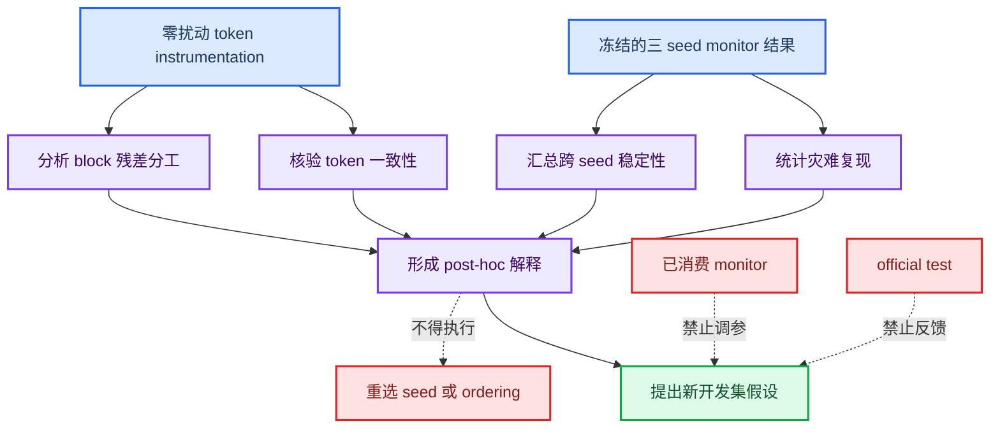

# Mamba Adapter v1.1 O0-xyz 多 seed 完整 monitor post-hoc 内部诊断报告

_SkullBreak out8192，seed-0/1/2；事后机制分析与下一阶段假设生成，2026-08-04_

---

## 结论摘要

本报告汇总冻结的 `Mamba Adapter v1.1 O0=xyz out8192` 在 SkullBreak monitor 上的三 seed 稳定性复核，以及对完整 `50 cases x 3 seeds` 开展的内部 token instrumentation。该阶段没有新增训练、没有运行 official test，也不得用于重新选择 seed、ordering 或模型。

主要结论如下：

1. **序列化输入不是 seed 差异来源。** 三个 seed 的实际 512-token 坐标、排序索引和排序后坐标逐元素完全一致，最大坐标差为 `0.0`。
2. **最终重建总体稳定，但 implant 与 rim 明显 seed 敏感。** 三 seed 的 final CD-L1 为 `2.3057 +/- 0.0674 mm`，而 implant CD-L1 为 `3.0524 +/- 0.7522 mm`，rim contact CD-L1 为 `4.6012 +/- 0.9603 mm`。
3. **灾难失败具有 seed 与病例交互特征。** seed-0、seed-1、seed-2 分别出现 `0/50`、`2/50`、`3/50` 个灾难记录；5 条灾难记录对应 4 个独立病例，只有 `train__064__random_1` 在两个 seed 中复现，没有病例在三个 seed 中均失败。
4. **Mamba block 的层间残差分工随 seed 大幅重排。** seed-0 以 Block 0 为主，seed-1 的 Block 0 近乎静默而 Block 1 主导，seed-2 两层均活跃且 Block 1 更强。这说明相同架构可能收敛到不同的深度分工模式。
5. **现有标量 instrumentation 不能充分预测病例级失败。** case-centered 分析中，内部特征与 Rim HD95 的最大绝对 Pearson 相关仅为 `0.1561`；`block1_residual_rms` 的 Pearson 相关仅为 `0.0362`。
6. **不能得出“残差越大越危险”或“Block 0 越弱越危险”的因果结论。** 灾难组与非灾难组的 pooled 对照受到 seed 分布混杂，且灾难样本只有 5 条。
7. **下一阶段应转向新的 skull-level development folds。** 优先增加 query/coarse/decoder/rebuild head 的零扰动 instrumentation，并预注册层间残差预算或归一化门控候选；不得继续使用已消费的 monitor 调参。

> **冻结结论：** O0=`xyz` 的既有冻结状态不变。本报告只解释已冻结结果并生成新假设，不产生新的 winner。

## 研究定位与边界

### 与前序实验的关系

本阶段建立在以下冻结事实之上：

- ordering ablation 已在严格 monitor protocol 下选择 O0=`xyz`；
- seed-0 official test 已按冻结流程执行，不能再次用于开发反馈；
- seed-1 和 seed-2 仅用于复核冻结 O0 的随机种子稳定性；
- 完整 monitor instrumentation 是在 R1 结果完成后声明的 post-hoc 机制分析。

对应协议文件：

- [多 seed 与 instrumentation 预注册协议](./mamba_adapter_v11_o0_multiseed_instrumentation_preregistered_protocol_zh.md)
- [完整 monitor post-hoc 协议](./mamba_adapter_v11_o0_multiseed_full_monitor_posthoc_protocol_zh.md)
- [机器可读 post-hoc 协议](./protocols/mamba_v11_o0_multiseed_full_monitor_posthoc_v1.json)

### 固定分析设置

| 项目 | 固定值 |
| --- | --- |
| 模型 | Mamba Adapter v1.1 O0=`xyz` out8192 |
| seeds | `0`、`1`、`2` |
| 数据范围 | 完整 monitor，50 cases / 10 skulls |
| 总记录数 | 150 seed-case records |
| 灾难规则 | `rim_contact_hd95_mm > 50.0 mm` 或非有限值 |
| 新训练 | 无 |
| official test | 未运行 |
| 允许用途 | 描述机制、生成新开发集假设 |
| 禁止用途 | 选择 seed、重开 ordering、修改阈值或模型 |

### 分析边界流程



## 数据完整性与可复现性

### 完整性检查

本轮输出满足以下条件：

- records：`150`，对应 `3 seeds x 50 cases`；
- unique cases：`50`；
- 三个 seed 使用同一完整 monitor 病例集合；
- token 坐标与排序跨 seed 完全一致：`True`；
- 最大 token 坐标差：`0.0`；
- 分析流程明确记录 `official_test=False`；
- 结果树哈希清单已生成并通过自检。

哈希文件位于：

```text
logs/skullbreak_mamba_v11_o0_multiseed/posthoc_full_monitor/posthoc_tree_sha256.txt
logs/skullbreak_mamba_v11_o0_multiseed/posthoc_full_monitor/posthoc_tree_sha256.txt.sha256
```

验证结果为：

```text
logs/skullbreak_mamba_v11_o0_multiseed/posthoc_full_monitor/posthoc_tree_sha256.txt: OK
```

### 主要结果文件

| 文件 | 内容 |
| --- | --- |
| `analysis/posthoc_summary.json` | 机器可读诊断摘要 |
| `analysis/posthoc_report_zh.md` | 服务器自动生成报告 |
| `analysis/monitor_seed_case_instrumentation.csv` | 150 条 seed-case 合并记录 |
| `analysis/instrumentation_correlations.csv` | pooled、per-seed 与 case-centered 相关 |
| `analysis/catastrophe_feature_contrasts.csv` | 灾难与非灾难特征对照 |
| `analysis/catastrophe_case_profiles.csv` | 灾难病例内部状态画像 |
| `analysis/token_equality_per_case.csv` | 跨 seed token 一致性核验 |

以上相对路径均位于：

```text
logs/skullbreak_mamba_v11_o0_multiseed/posthoc_full_monitor/
```

## 多 seed 性能稳定性复核

### 每个 seed 的 monitor 结果

| Seed | Implant CD-L1 (mm) | Implant HD95 (mm) | Implant NSD@1 | Final CD-L1 (mm) | Final HD95 (mm) | Final NSD@1 |
| ---: | ---: | ---: | ---: | ---: | ---: | ---: |
| 0 | 2.7381 | 7.6740 | 0.2252 | 2.2422 | 4.8249 | 0.1507 |
| 1 | 2.5083 | 6.5262 | 0.2287 | 2.2985 | 5.1337 | 0.1502 |
| 2 | 3.9108 | 9.6728 | 0.2025 | 2.3764 | 5.4929 | 0.1485 |

| Seed | Rim CD-L1 (mm) | Rim HD95 (mm) | Rim NSD@1 | 灾难数 | 灾难率 |
| ---: | ---: | ---: | ---: | ---: | ---: |
| 0 | 4.1694 | 17.1584 | 0.4994 | 0 | 0.0% |
| 1 | 3.9326 | 17.5467 | 0.5233 | 2 | 4.0% |
| 2 | 5.7016 | 19.6718 | 0.4796 | 3 | 6.0% |

### 三 seed 汇总

| 指标 | Mean | Std | 最小值 | 最大值 | 变异系数 |
| --- | ---: | ---: | ---: | ---: | ---: |
| Implant CD-L1 (mm) | 3.0524 | 0.7522 | 2.5083 | 3.9108 | 24.6% |
| Implant HD95 (mm) | 7.9577 | 1.5924 | 6.5262 | 9.6728 | 20.0% |
| Implant NSD@1 | 0.2188 | 0.0142 | 0.2025 | 0.2287 | 6.5% |
| Final CD-L1 (mm) | 2.3057 | 0.0674 | 2.2422 | 2.3764 | 2.9% |
| Final HD95 (mm) | 5.1505 | 0.3343 | 4.8249 | 5.4929 | 6.5% |
| Final NSD@1 | 0.1498 | 0.0011 | 0.1485 | 0.1507 | 0.8% |
| Rim CD-L1 (mm) | 4.6012 | 0.9603 | 3.9326 | 5.7016 | 20.9% |
| Rim HD95 (mm) | 18.1257 | 1.3530 | 17.1584 | 19.6718 | 7.5% |
| Rim NSD@1 | 0.5008 | 0.0219 | 0.4796 | 0.5233 | 4.4% |

变异系数按 `Std / Mean` 计算，仅用于直观比较不同指标的跨 seed 波动，不作为统计显著性检验。

### 稳定性评价

最终重建指标明显比 implant 与 rim 指标稳定。尤其是 final CD-L1 和 final NSD@1 的变异系数分别约为 `2.9%` 和 `0.8%`，而 implant CD-L1 与 rim CD-L1 分别约为 `24.6%` 和 `20.9%`。

这意味着全颅最终重建指标可能被大量未受影响区域稀释，不能单独反映植入体和接触边界的不稳定性。后续多 seed 报告仍应同时保留 implant、final 和 rim 三组指标，不能只报告 final reconstruction。

seed-1 的 implant 和 rim 平均值优于 seed-0，但仍出现 2 个灾难病例；seed-0 没有灾难，却不是所有均值上的最优 seed。因此不能用单一均值替代尾部风险，也不能据此选择 seed-1 作为新 winner。

## 灾难病例复现分析

### 灾难记录与独立病例

三 seed 共得到 `5/150` 条灾难记录，记录级灾难率为 `3.33%`。这些记录来自 4 个独立病例：

| 病例 | 失败 seeds | 复现次数 | 缺损类型 |
| --- | --- | ---: | --- |
| `train__064__parietotemporal` | 2 | 1 | parietotemporal |
| `train__064__random_1` | 1、2 | 2 | random_1 |
| `train__090__random_1` | 1 | 1 | random_1 |
| `train__098__random_1` | 2 | 1 | random_1 |

复现直方图为：

```text
只在 1 个 seed 失败：3 cases
在 2 个 seeds 失败：1 case
在 3 个 seeds 失败：0 cases
```

### 解释

没有病例在三个 seed 中都失败，说明这批灾难不是完全由固定输入几何决定。`train__064__random_1` 在 seed-1 和 seed-2 中重复失败，提示 skull 064 的该缺损构型具有较高脆弱性；但同一 skull 的 parietotemporal 只在 seed-2 失败，又说明缺损构型与随机优化结果共同参与。

`random_1` 占 5 条灾难记录中的 4 条，是值得进入新开发集分层分析的现象。但病例数量过少，且本轮是 post-hoc 观察，不能据此立即修改采样权重或损失函数。

## Token 一致性与 ordering 排除

### 一致性结果

三个 seed 的以下对象逐病例完全一致：

- encoder 输出的实际 512-token 坐标；
- `xyz` 排序索引；
- 排序后的 token 坐标；
- instrumentation 使用的病例集合。

最大坐标差为 `0.0`，因此三个模型看到的 token 几何与序列顺序一致。

### 可以排除的解释

本结果排除了“seed 改变了 token 采样坐标或排列，进而造成性能波动”这一直接解释。跨 seed 差异发生在相同 token 序列经过不同学习参数处理之后。

### 不能排除的解释

token 坐标相同并不代表 token feature 相同。不同 seed 可能形成不同的：

- 特征方向与子空间；
- 通道尺度分配；
- Mamba 状态传播模式；
- query 初始化与选择结果；
- decoder 交互和 rebuild offset。

因此，本结论只排除了输入坐标和排序差异，不能排除 `xyz` 单向扫描与已学习特征之间的交互效应。

## Mamba block 残差分工

### 跨 seed 均值

| Seed | Block 0 residual/input | Block 1 residual/input | Block 0 tail/head | Block 1 tail/head |
| ---: | ---: | ---: | ---: | ---: |
| 0 | 0.058669 | 0.014176 | 1.198267 | 1.158785 |
| 1 | 0.000435 | 0.037613 | 1.797026 | 2.611516 |
| 2 | 0.031409 | 0.046582 | 0.730648 | 0.997359 |

### 层间角色重排

seed-0 中 Block 0 的 residual/input 约为 Block 1 的 `4.14` 倍，表现为前层主导。seed-1 中 Block 0 几乎静默，Block 1 的 residual/input 约为 Block 0 的 `86.5` 倍，并出现明显的序列尾部增强。seed-2 则是两层均活跃、Block 1 略强的模式。

这说明 alpha warmup 没有强制不同 seed 收敛到一致的层间功能分配。网络可以通过不同 block 组合实现近似的 final reconstruction 均值，但 implant 和 rim 指标以及尾部失败风险会发生变化。

### 与性能的非单调关系

层间分工与性能之间不是简单单调关系：

- seed-0 前层主导、后层较弱，没有灾难病例；
- seed-1 前层近乎静默、后层主导，平均 implant/rim 指标较好，但出现 2 个灾难病例；
- seed-2 两层均较活跃且后层最强，平均 implant/rim 指标最差，并出现 3 个灾难病例。

这组结果支持“层间分工是 seed 的全局优化指纹”，但不足以证明某个固定残差大小或 tail/head 比值直接导致灾难。

## 病例内跨 seed 相关分析

### 为什么使用 case-centered 相关

pooled 相关会混合病例固有难度和 seed 差异。case-centered 分析先对每个病例减去其三个 seed 的均值，再评估同一病例在不同 seed 下的内部状态变化是否与 Rim HD95 同步，因此更适合本轮问题。

### 与 Rim HD95 的主要结果

| Feature | Pearson | Spearman | N |
| --- | ---: | ---: | ---: |
| `block0_input_rms` | 0.1561 | 0.1154 | 150 |
| `block0_output_rms` | 0.1546 | 0.1164 | 150 |
| `block1_input_rms` | 0.1546 | 0.1164 | 150 |
| `block1_output_rms` | 0.1517 | 0.1125 | 150 |
| `block0_input_residual_cosine` | 0.1244 | 0.0937 | 150 |
| `block1_effective_alpha` | 0.1218 | 0.1003 | 150 |
| `block0_residual_tail_to_head_ratio` | -0.1031 | -0.0750 | 150 |
| `block1_residual_to_input_token_ratio_max` | 0.0949 | 0.0949 | 150 |
| `block0_residual_max_position_fraction` | -0.0600 | -0.0503 | 150 |
| `block1_residual_tail_to_head_ratio` | -0.0572 | -0.0493 | 150 |
| `block1_residual_rms` | 0.0362 | 0.0083 | 150 |

所有列出的相关都较弱，最大绝对 Pearson 仅为 `0.1561`。这表明仅依赖 RMS、残差比例、cosine、tail/head 或尖峰位置等标量摘要，无法可靠解释同一病例为何在某个 seed 中出现更高 Rim HD95。

该结果不是“Adapter 内部状态无关”的证据，而是说明当前 instrumentation 的压缩粒度过粗。真正相关的信息可能存在于通道方向、局部 token 子集、状态空间轨迹或后续 decoder/query 路径中。

## 灾难与非灾难特征对照

### 主要描述性差异

| Feature | 灾难均值 | 对照均值 | 比值 |
| --- | ---: | ---: | ---: |
| `block0_residual_to_input_rms` | 0.017444 | 0.030610 | 0.570 |
| `block0_residual_to_input_token_ratio_p95` | 0.034920 | 0.063989 | 0.546 |
| `block0_residual_to_input_token_ratio_max` | 0.097149 | 0.192806 | 0.504 |
| `block0_residual_rms` | 0.021384 | 0.035713 | 0.599 |
| `block0_residual_max_position_fraction` | 0.605490 | 0.474321 | 1.277 |
| `block1_residual_head_token_norm_mean` | 0.541216 | 0.426961 | 1.268 |
| `block0_input_residual_cosine` | 0.036001 | 0.021929 | 1.642 |

### 必须保留的混杂解释

上述比较不能用于因果归因。全部灾难记录来自 seed-1 和 seed-2，而这两个 seed 的 Block 0 在全局上本来就比 seed-0 弱。因此“灾难组 Block 0 residual 较低”可能只是 seed 分布差异，而不是病例失败机制。

`block1_input_residual_cosine` 的灾难均值为 `0.00656`、对照均值为 `-0.00222`。由于对照均值接近零且符号不同，自动报告中的比值 `-2.9501` 没有稳定的物理含义，应以绝对差和分布为主，不应引用该比值支持结论。

此外，灾难组只有 5 条记录，且对应 4 个病例。样本不独立、数量很小，不适合进行模型选择意义上的显著性判断。

## 机制判断

### 得到支持的判断

1. **seed 稳定性不足主要集中在 implant 和 rim。** final reconstruction 的稳定并不能代表接触边界稳定。
2. **序列坐标和排序不是跨 seed 差异来源。** 三个 seed 的 512-token 几何输入完全相同。
3. **训练会形成不同的 block 功能分配。** 两个 Adapter block 的残差预算和序列位置分布随 seed 显著变化。
4. **灾难是病例几何与优化结果的交互。** 既不是完全固定病例失败，也不是完全随机的全局噪声。
5. **当前标量 instrumentation 不足以定位病例级机制。** 需要观测特征方向和 Adapter 下游路径。

### 不得到支持的判断

1. 不能声称“残差越大越容易灾难失败”；
2. 不能声称“Block 0 越弱越容易灾难失败”；
3. 不能声称“xyz ordering 已经解决序列化问题”；
4. 不能声称 seed-0、seed-1 或 seed-2 是新的最佳 seed；
5. 不能根据本轮结果回到 O1/O2/O3 重新选择 ordering；
6. 不能把弱相关解释为 Adapter 对失败没有作用；
7. 不能将 5 条灾难记录用于无约束地设计并筛选大量新候选。

### 当前最合理的工作假设

目前更值得检验的假设是：不同 seed 先形成不同的 Mamba 特征方向和层间分工，这些差异在 query generator、coarse prediction、decoder cross-attention 或 rebuild head 中被几何放大，最终表现为局部 rim 覆盖不足、偏移或尾部灾难。

这是下一阶段的待验证假设，不是本报告已证明的因果链。

## 下一阶段方案

### 第一步：冻结并归档 R1 与 P1

在启动新实验前，应归档以下内容：

- seed-0/1/2 的配置、checkpoint、monitor CSV 和 summary；
- strict-train 与完整 monitor instrumentation；
- post-hoc 分析 CSV、JSON、自动报告和本报告；
- protocol 文件、运行脚本、环境信息和 SHA256 清单；
- 明确声明未运行新的 official test。

归档后不得删除或覆盖原始 CSV，也不得修改既有灾难阈值。

### 第二步：建立新的 skull-level development folds

monitor 已被 ordering 选择、R1 稳定性复核和 P1 post-hoc 分析多次读取，不能继续承担候选筛选职责。下一阶段必须从 strict train 范围中构建新的 skull-level folds，并满足：

- 同一 skull 不跨 train/dev；
- 固定并哈希病例清单；
- 在训练前预注册候选、主指标和灾难规则；
- 至少保留一个完全未参与候选筛选的内部确认 fold；
- 不读取 official test 结果修改候选。

### 第三步：扩展零扰动 instrumentation

下一轮应优先补充 Adapter 下游观测：

| 模块 | 建议记录 |
| --- | --- |
| Encoder/Adapter | token feature 的通道协方差、主子空间和跨 seed cosine |
| Query generator | query score、选择索引、query feature RMS 与空间覆盖 |
| Coarse output | 质心、尺度、主轴、GT-rim coverage 与离群点比例 |
| Decoder | 各层 self/cross residual、query displacement 和局部尖峰 |
| Rebuild head | 每 query offset 范数、局部密度、rim 最近距离与尾部误差 |

所有 instrumentation 必须继续通过输出 bitwise equal 和 RNG 状态不变检查，默认关闭，只允许 `eval()` 显式启用。

### 第四步：预注册少量机制候选

在新 development folds 中，建议按优先级只比较少量候选：

1. **层间残差预算归一化。** 约束两个 block 的有效 residual/input 落入可比较范围，减少一个 block 近乎静默、另一个独占残差预算的情况。
2. **per-block normalized gate。** 保留 alpha warmup，但对 mixer residual 做输入尺度归一化，再使用可学习门控。
3. **双向 `xyz` 扫描。** 作为既有 S1 假设，检验单向状态传播的方向偏置；不得使用当前 monitor 选择融合权重。
4. **query/coarse 几何稳定约束。** 只有在扩展 instrumentation 显示灾难在 query/coarse 阶段已经出现时才进入候选。

每个候选应同时报告均值、跨 seed 标准差、最坏病例、灾难率和 defect-type 分层结果。候选选择不能只看平均 CD。

### 暂不建议的方向

- 暂不直接将全部 Transformer block 替换为 Mamba；
- 暂不继续在已消费 monitor 上扫描 alpha、depth 或 loss 权重；
- 暂不根据 4 个灾难病例定制训练样本权重；
- 暂不把 pooled 特征比值作为新正则项的唯一依据；
- 暂不再次运行 official test。

## 完成判定

本轮 post-hoc 诊断满足以下完成条件：

- [x] 完整覆盖 50 个 monitor cases 和三个 seeds
- [x] 核验实际 512-token 坐标与排序跨 seed 一致
- [x] 汇总多 seed 的 implant、final、rim 指标与灾难率
- [x] 统计灾难病例的跨 seed 复现情况
- [x] 完成 per-seed、pooled 和 case-centered 描述性分析
- [x] 明确记录 seed 混杂、样本不独立和弱相关限制
- [x] 生成并验证结果树 SHA256 清单
- [x] 明确声明未运行 official test
- [x] 不重新选择 seed、ordering 或模型

因此，**P1 完整 monitor post-hoc 内部诊断可以正式结束**。下一阶段应先完成归档与新 skull-level development protocol 预注册，再开展新的机制候选实验。

## 相关文档

- [Ordering ablation 实验报告](./mamba_adapter_v11_ordering_ablation_skullbreak_seed0_experiment_report_zh.md)
- [O0 多 seed instrumentation 预注册协议](./mamba_adapter_v11_o0_multiseed_instrumentation_preregistered_protocol_zh.md)
- [完整 monitor post-hoc 协议](./mamba_adapter_v11_o0_multiseed_full_monitor_posthoc_protocol_zh.md)
