# Mamba Adapter v1.1 Ordering Ablation 预注册实验协议

_协议版本：`skullbreak-ordering-monitor-v1`；选择规则版本：
`mamba-v1.1-ordering-selection-v1`；冻结日期：2026-07-23。本文在
O0/O1/O2/O3 严格 monitor 结果产生前固定数据边界、灾难失败定义、
非劣效门槛、排序规则和 official-test 解锁流程。_

---

## 目的与约束

本阶段只回答一个问题：

> 在固定 Mamba Adapter v1.1 结构、训练设置和 seed-0 的条件下，
> 哪一种点 proxy 序列化顺序在 SkullBreak held-out monitor split
> 上最稳定？

本轮不调整 Adapter 深度、状态维度、卷积宽度、alpha、warmup、
loss、query、decoder、输出点数、训练轮数或 BatchNorm 校准方式。
唯一实验变量是 `mamba_adapter.order`。

以下约束在看到四个严格 monitor 结果前冻结：

1. 候选集合固定为 O0/O1/O2/O3，不增删候选。
2. 灾难失败阈值固定，不根据结果移动阈值。
3. final 非劣效门槛固定，不根据结果放宽。
4. 排序优先级固定，不根据某个候选的优势改权重。
5. ordering 只由 monitor point/rim 结果选择。
6. official test 不参与选择，也不用于返回修改候选或规则。
7. 获胜 ordering 冻结后只执行一次 SkullBreak official test。

```mermaid
flowchart LR
    accTitle: Strict ordering ablation workflow
    accDescr: The official training set excludes the held-out monitor skulls. Four fixed candidates are trained and compared on monitor data, a decision file freezes the winner, and only then is one official-test run unlocked.

    manifest["Frozen SkullBreak manifest"]
    audit["Protocol audit<br/>split and hash isolation"]
    strict_train["Strict train<br/>520 cases, 104 skulls"]
    monitor["Held-out monitor<br/>50 cases, 10 skulls"]
    candidates["O0/O1/O2/O3<br/>seed 0"]
    selector["Pre-registered selector<br/>disaster first"]
    decision["Frozen decision JSON<br/>SHA256"]
    official["One official test<br/>100 cases, 20 skulls"]
    receipt["Official receipt<br/>selection stays closed"]

    manifest --> audit
    audit --> strict_train
    audit --> monitor
    strict_train --> candidates
    candidates --> monitor
    monitor --> selector
    selector --> decision
    decision --> official
    official --> receipt

    classDef data fill:#dbeafe,stroke:#2563eb,stroke-width:2px,color:#1e3a5f
    classDef process fill:#fef9c3,stroke:#ca8a04,stroke-width:2px,color:#713f12
    classDef frozen fill:#dcfce7,stroke:#16a34a,stroke-width:2px,color:#14532d

    class manifest,strict_train,monitor data
    class audit,candidates,selector process
    class decision,official,receipt frozen
```



---

## Monitor 协议审计

### 发现的问题

原始 SkullBreak 点云清单中，monitor 是 official train 内的 10 个
skull 标记：

```text
official_split = train
monitor_split = monitor
```

旧 v1.1 配置的训练 loader 只过滤：

```text
official_split = train
```

因此旧训练使用全部 570 cases，其中包括 50 个 monitor cases。
旧 monitor 结果属于训练内监测，不能承担 ordering 模型选择功能。
这不会使已经完成的 official-test 评价本身失效，但会使旧 monitor
数值失去独立选择集资格。

### 严格修正

正式 ordering 配置的训练 loader 同时执行：

```yaml
split_field: official_split
manifest_split: train
exclude_split_field: monitor_split
exclude_manifest_split: monitor
```

固定划分如下：

| 子集 | Cases | Skulls | 来源 | 用途 |
| --- | ---: | ---: | --- | --- |
| Official train 全集 | 570 | 114 | 官方训练集 | 仅作为母集合 |
| Strict train | 520 | 104 | Official train 减去 monitor | 训练与 BNCal |
| Monitor | 50 | 10 | Official train 中冻结的 monitor skulls | ordering 选择 |
| Official test | 100 | 20 | 官方测试集 | 获胜版本最终评价 |

每个 skull 必须含 5 种缺损：

- `bilateral`
- `frontoorbital`
- `parietotemporal`
- `random_1`
- `random_2`

Monitor 中每类缺损固定为 10 cases。审计工具还必须确认：

- `case_id` 无重复；
- strict train、monitor、official test 的 skull 集合两两不重叠；
- 三者的 complete-skull SHA256 集合两两不重叠；
- monitor 全部来自 official train；
- manifest SHA256 和各子集 case-ID SHA256 被记录。

执行：

```bash
python tools/audit_skullbreak_ordering_protocol.py \
  --manifest data/SkullBreakPC_out8192/manifest.jsonl \
  --output logs/skullbreak_mamba_ordering_v11_out8192/strict_monitor_protocol_audit.json
```

任何审计失败都必须停止实验，不能跳过。

---

## 候选与控制变量

### Ordering 候选

| 编号 | Ordering | 研究目的 |
| --- | --- | --- |
| O0 | `xyz` | v1.1 母版的严格 held-out 重跑对照 |
| O1 | `identity` | 判断显式坐标排序是否优于 encoder 原顺序 |
| O2 | `zyx` | 检查主排序轴由 x 改为 z 的影响 |
| O3 | `xzy` | 保持 x 为主轴，检查 y/z 次序敏感性 |

旧的 O0 monitor 结果不能复用。O0 必须和 O1/O2/O3 一样，在
520-case strict train 上从头训练。这样四个候选的训练样本、BNCal
样本和 monitor 独立性才一致。

### 固定模型设置

| 项目 | 固定值 |
| --- | --- |
| Backbone | AdaPoinTr implant |
| Input points | 8192 |
| Output implant points | 8192 |
| Adapter depth | 2 |
| `d_state` | 16 |
| `d_conv` | 4 |
| `expand` | 2 |
| Fast path | `true` |
| DropPath | 0.05 |
| `alpha_init` | 0.01 |
| Alpha warmup | epoch 0 至 20，scale 0 至 1 |
| Query selection | `learned_only` |
| Denoise weight | 0 |
| Fine coverage weight | 1 |
| Fine local weight | 0 |
| Optimizer | AdamW |
| Learning rate | 0.0001 |
| Epochs | 100 |
| Total batch size | 8 |
| Seed | 0 |
| Deterministic mode | 开启 |

### 固定 BNCal 设置

BNCal 只读取 strict train，不得接触 monitor：

| 参数 | 固定值 |
| --- | ---: |
| Batch size | 8 |
| 最大 batches | 65 |
| 实际覆盖 | 520 / 520 strict-train cases |
| Shuffle | 关闭 |
| Reset running stats | 开启 |
| Seed | 0 |

---

## 预定义灾难失败

### Case 级定义

单个 monitor case 满足以下任意条件即记为一次灾难失败：

```text
Rim CD、Rim HD95、Rim NSD@1 任一为 NaN 或 Inf
或 Rim CD > 50 mm
或 Rim HD95 > 50 mm
```

阈值为严格大于关系，因此恰好 `50.0 mm` 不触发阈值，
`50.0001 mm` 触发。

核心字段固定为：

```text
rim_contact_cd_l1_mm
rim_contact_hd95_mm
rim_contact_nsd_at_1mm
```

灾难性但仍为有限数的 case 不从均值中删除。它必须继续进入均值，
使候选为严重失败付出完整代价。非有限值不进入对应数值均值，但已
通过灾难计数获得最高优先级惩罚。

### 为什么灾难优先

SkullBreak v1.1-xyz official test 已出现单个 frontoorbital case
显著抬高均值的现象。临床 implant 重建不能用多数病例的小幅收益
掩盖少数病例的极端失效，因此选择规则首先比较灾难失败总数，
其次比较 frontoorbital 灾难失败数。

---

## Final 非劣效门槛

Ordering 的目标是改善序列建模和 rim 稳定性，不能以明显损害
完整颅骨重建为代价。除 O0 外，每个候选必须同时满足相对严格 O0
的 monitor 均值门槛：

| 指标 | 候选相对 O0 的最大允许退化 |
| --- | ---: |
| Final CD | `+0.10 mm` |
| Final HD95 | `+0.50 mm` |
| Final NSD@1 | `-0.01` |

门槛是 AND 关系。任一项失败，该候选标记为 non-inferior=false，
不进入 ordering 排名。O0 自动通过并作为保底候选。

如果 O1/O2/O3 全部未通过，则 O0 自动获胜。不得因为“没有新候选
获胜”而在看到 monitor 结果后放宽门槛。

---

## 确定性选择规则

通过 final 非劣效门槛的候选按以下字典序排名：

1. 总灾难失败数，升序；
2. `frontoorbital` 灾难失败数，升序；
3. Overall Rim HD95，升序；
4. Overall Rim CD，升序；
5. Overall Rim NSD@1，降序；
6. `frontoorbital` Implant HD95，升序；
7. `frontoorbital` Implant CD，升序；
8. `frontoorbital` Rim HD95，升序；
9. `frontoorbital` Rim CD，升序；
10. `frontoorbital` Rim NSD@1，降序；
11. Overall Implant HD95，升序；
12. Overall Implant CD，升序；
13. Overall Implant NSD@1，降序；
14. Overall Final HD95，升序；
15. Overall Final CD，升序；
16. Overall Final NSD@1，降序；
17. Candidate ID，升序，作为最终确定性 tie-break。

数值比较统一四舍五入至小数点后 6 位，避免机器浮点尾差改变选择。
选择器不接受 official-test CSV 参数，也不读取任何 official-test
结果。Monitor voxel 指标不参与本轮选择，以避免跨 Windows/server
评价链引入额外选择自由度。

---

## 执行顺序

### 1. 运行四个严格候选

正式运行必须放入 tmux 会话，防止 SSH 或 notebook terminal 断开
终止训练。推荐使用预置 launcher：

```bash
TMUX_SESSION=mamba-ordering-v11-seed0 \
bash scripts/launch_skullbreak_mamba_ordering_tmux.sh
```

进入会话：

```bash
tmux attach -t mamba-ordering-v11-seed0
```

从会话分离但不中断实验：按 `Ctrl-b`，松开后按 `d`。查看最近输出：

```bash
tmux capture-pane -pt mamba-ordering-v11-seed0 | tail -40
```

如果需要分批运行，仍通过 tmux launcher 固定候选集合，例如：

```bash
CANDIDATES="O0 O1" \
TMUX_SESSION=mamba-ordering-v11-part1 \
bash scripts/launch_skullbreak_mamba_ordering_tmux.sh

CANDIDATES="O2 O3" \
TMUX_SESSION=mamba-ordering-v11-part2 \
bash scripts/launch_skullbreak_mamba_ordering_tmux.sh
```

候选脚本只执行：

```text
strict-train training
-> strict-train BNCal
-> monitor point/rim evaluation
```

它不会运行 test split，不会导出 official-test predictions，也不会
生成 official-test 可视化。

训练、BNCal 和 monitor evaluation 均显示 tqdm 进度条。Launcher
设置 `PYTHONUNBUFFERED=1` 和 `TQDM_MININTERVAL=1`，tmux 内可实时
观察进度，同时将总输出保存到：

```text
logs/skullbreak_mamba_ordering_v11_out8192/tmux_<timestamp>.log
```

### 2. 在 monitor 上选择并冻结

四个 monitor CSV 全部产生后执行：

```bash
bash scripts/select_skullbreak_mamba_ordering_monitor.sh
```

选择器在冻结前再次确认：

- 四份 config 除 `order` 外逐项一致；
- 四份 config 都排除了 monitor；
- 四份 CSV 恰好包含同一批 50 monitor cases；
- 每份 CSV 无重复病例且含 10 个 frontoorbital cases；
- config、checkpoint、monitor CSV 的 SHA256 均被写入决策。

输出：

```text
logs/skullbreak_mamba_ordering_v11_out8192/
  ordering_decision_seed0.json
  ordering_decision_seed0.json.sha256
```

已有决策文件时选择器拒绝覆盖。候选训练脚本检测到决策文件后也会
拒绝继续训练，从流程上防止冻结后追加候选。

### 3. 审查冻结决策

执行：

```bash
python tools/select_skullbreak_mamba_ordering.py verify \
  --repo_root . \
  --manifest data/SkullBreakPC_out8192/manifest.jsonl \
  --decision logs/skullbreak_mamba_ordering_v11_out8192/ordering_decision_seed0.json
```

可以查看 JSON 中的：

- `eligible_ranking`
- `selected`
- 每个候选的 `disaster_count`
- `frontoorbital_disaster_count`
- `final_noninferiority`
- Overall 与 frontoorbital 均值
- 所有输入文件 SHA256

人工审查只用于确认工具按预注册规则工作，不得人工改选 winner。

### 4. 单次运行 official test

确认决策后执行：

```bash
bash scripts/run_skullbreak_mamba_ordering_winner_official_once.sh
```

脚本先验证 decision SHA256、manifest、获胜 config 和 checkpoint，
并在 evaluator 启动前写入不可覆盖的 attempt lock，然后只对
JSON 中的 winner 运行 SkullBreak official test。成功后写入：

```text
logs/skullbreak_mamba_ordering_v11_out8192/
  official_test_attempt_seed0.json
  official_test_attempt_seed0.json.sha256
  official_test_receipt_seed0.json
  official_test_receipt_seed0.json.sha256
```

Attempt 或 receipt 任一存在时，脚本都拒绝第二次运行。若评价因
基础设施中断，attempt 仍保留，不能自动重试；必须先归档中断原因
并对后续处置另作书面决定。Official test 结果无论好坏都只能作为
最终外部评价，不能返回：

- 替换 winner；
- 新增 ordering；
- 修改灾难阈值；
- 修改 final 非劣效门槛；
- 修改排序优先级；
- 选择另一个 checkpoint。

---

## 技术失败与模型失败

在决策文件产生前，以下属于技术失败，可以用完全相同的配置重跑：

- 服务器中断；
- 文件系统写满；
- CUDA/OOM；
- checkpoint 文件损坏；
- evaluator 因环境依赖中断。

重跑时不得修改 seed、训练轮数、batch size 或模型设置。若训练和
评价正常完成，但产生 NaN rim、极大 Rim CD/HD95 或较差均值，
这属于模型结果，不得以“疑似异常”为由删除病例或重跑择优。

如果某个候选无法在冻结配置下技术完成，则本轮 ablation 应暂停并
修复共同基础设施；不能只跳过该候选后从剩余候选中选择。

---

## 输出目录

训练 checkpoint：

```text
experiments/MambaAdapterV11OrderingO0_xyz_out8192_monitor/
experiments/MambaAdapterV11OrderingO1_identity_out8192_monitor/
experiments/MambaAdapterV11OrderingO2_zyx_out8192_monitor/
experiments/MambaAdapterV11OrderingO3_xzy_out8192_monitor/
```

Monitor 评价：

```text
logs/skullbreak_mamba_ordering_v11_out8192_eval/
  O0_xyz_monitor/
  O1_identity_monitor/
  O2_zyx_monitor/
  O3_xzy_monitor/
```

获胜版本 official test：

```text
logs/skullbreak_mamba_ordering_v11_out8192_official/
  <candidate>_<order>_seed0/
  <candidate>_<order>_seed0_predictions/
```

---

## 预注册结论边界

本实验最多支持以下结论：

> 在固定 SkullBreak strict-train seed-0、Mamba Adapter v1.1 和
> 预注册 monitor 选择规则下，获胜 ordering 在四个候选中排名第一。

单个 seed 的结果不能证明普遍最优。Official test 完成后，下一步
应对冻结 winner 增加额外 seeds，或将相同选择结果作为后续
PCA/Morton/对称感知序列化研究的固定起点。任何新候选都属于新的
预注册实验，不得回到本轮 official test 继续调参。
