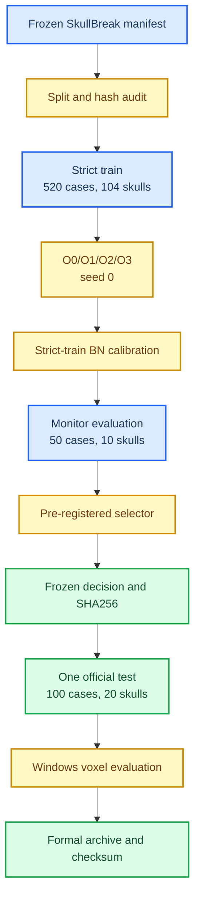

# Mamba Adapter v1.1 Ordering Ablation SkullBreak Seed-0 实验报告

_基于预注册协议 `skullbreak-ordering-monitor-v1` 与选择规则`mamba-v1.1-ordering-selection-v1`，完整记录严格数据隔离、O0/O1/O2/O3训练与 monitor 选择、冻结获胜 ordering 后的单次 official test、Windows体素评价、失败病例、工程问题、归档证据和后续研究方案。实验完成日期：2026-07-24。_

---

## 摘要

本实验以已经稳定化的 Mamba Adapter v1.1 为母版，固定`alpha_init=0.01`、20-epoch alpha warmup、两层 Mamba Adapter、AdaPoinTr encoder/decoder、8192 输入/输出点、训练超参数、BNCal 流程和 seed-0，仅改变 encoder proxy 进入 Mamba 前的序列化顺序。

四个预注册候选为：

| 编号 | Ordering | 含义 |
| --- | --- | --- |
| O0 | `xyz` | 按 x、y、z 优先级排序，v1.1 母版对照 |
| O1 | `identity` | 不显式排序，保留 encoder 原始 token 顺序 |
| O2 | `zyx` | 按 z、y、x 优先级排序 |
| O3 | `xzy` | 按 x、z、y 优先级排序 |

实验首先发现旧 SkullBreak v1.1 训练把 50 个 monitor cases 包含在570-case official train 中，因此旧 monitor 结果不能用于 ordering
选择。正式 ablation 改为从 official train 中排除 monitor skulls，形成 520 cases / 104 skulls 的 strict train，并将 50 cases /10 skulls 的 monitor 作为独立选择集。

预注册选择器给出的排序为：

```text
O0 > O2 > O3 > O1
```

O0=`xyz` 与 O2=`zyx` 在 monitor 上均为 0 次灾难失败。根据预注册的字典序规则，在灾难数和 frontoorbital 灾难数打平后，首先比较
Overall Rim HD95；O0 为 `17.1584 mm`，优于 O2 的 `17.7396 mm`，因此 O0 被确定性选中。O3 虽具有更低的 Overall Rim HD95 和更好的frontoorbital 均值，但发生 1 次灾难失败；O1 发生 2 次灾难失败，二者不能越过灾难优先级。

获胜 O0 冻结后只运行了一次 SkullBreak official test。主要 official point/rim 结果为：

| 层级 | CD [mm] | HD95 [mm] | NSD@1 |
| --- | ---: | ---: | ---: |
| Implant | 2.8181 | 7.5196 | 0.2085 |
| Final reconstruction | 2.3466 | 5.1745 | 0.1418 |
| Defective input | 2.6470 | 6.2572 | 0.1851 |
| Rim contact | 5.0241 | 20.7202 | 0.4664 |

Windows voxel 评价显示，O0 的 final reconstruction 与 AdaPoinTr接近，但 implant surface 与 rim-contact 仍弱于 AdaPoinTr。相对defective input，O0 在 98/100 cases 上改善 absolute RVE，在78/100 cases 上改善 ASSD；然而 `Surface Dice@1` 为 0/100 cases
改善。Official point 结果中按同一灾难阈值进行事后描述，共发现5/100 个 rim 灾难病例，说明 monitor 上的 0 灾难没有完全外推到
official test。

本轮结论不是“XYZ ordering 或 Mamba 已经优于 AdaPoinTr”，而是：

> 在冻结的四个简单 ordering 候选、strict-monitor seed-0 协议和灾难优先选择规则下，`xyz` 是最稳定的候选；它保护了 final reconstruction，但尚未解决 implant surface、rim-contact 和official-test 灾难失败问题。

---

## 研究背景与目标

### 为什么必须进行 ordering ablation

Mamba 将 token 作为有方向的序列处理，而点云本身没有自然顺序。如果 encoder proxy 的排列只由文件存储顺序或采样实现偶然决定，Mamba 的状态传播可能学习到不稳定、与解剖结构无关的邻接关系。

Mamba Adapter v1.1 已经通过较小的残差初值和 warmup 缓解了 v1对 AdaPoinTr feature 的过强早期扰动，但 v1.1-xyz 仍存在：

- SkullBreak implant CD/HD95 相对 AdaPoinTr 退化；
- rim-contact 指标总体退化；
- `frontoorbital` 曾出现极端失败；
- SkullFix 与 SkullBreak 的 tight-tolerance surface 指标未稳定改善。

因此，在继续研究对称感知序列化、局部 Mamba 替换或全 Mamba主干之前，需要先回答一个更基础的问题：模型是否对简单坐标
ordering 敏感，以及哪一个简单候选最稳定。

### 本实验回答的问题

本轮只回答：

> 在固定 SkullBreak strict train、Mamba Adapter v1.1、训练协议和seed-0 的条件下，O0/O1/O2/O3 中哪个 ordering 在独立 monitor split 上按预注册规则排名第一？

本轮不回答：

- Mamba Adapter 是否显著优于 AdaPoinTr；
- `xyz` 是否在所有数据集和 seed 上普遍最优；
- PCA、Morton、Hilbert 或 symmetry-aware ordering 是否更优；
- 全部 Transformer block 是否应替换为 Mamba；
- rim-aware loss 是否有效。

### 版本关系

| 版本 | 主要变化 | 本轮角色 |
| --- | --- | --- |
| AdaPoinTr-Implant-8192 | 无 Mamba Adapter | Transformer 正式对照 |
| Mamba Adapter v1 | `alpha_init=0.1`，无 warmup | 早期诊断版本 |
| Mamba Adapter v1.1-xyz | `alpha_init=0.01`，20-epoch warmup | 稳定母版 |
| Ordering O0/O1/O2/O3 | 只改变 `mamba_adapter.order` | 本轮实验对象 |

---

## 严格实验协议

### 数据泄漏审计与修正

原始 SkullBreak manifest 对 monitor 的定义是：

```text
official_split = train
monitor_split = monitor
```

旧 v1.1 训练 loader 仅过滤 `official_split=train`，因此训练使用全部 570 cases，其中包含 50 个 monitor cases。旧 monitor 只能
视为训练内监测结果，不能承担独立模型选择功能。

正式 ordering 配置同时设置：

```yaml
split_field: official_split
manifest_split: train
exclude_split_field: monitor_split
exclude_manifest_split: monitor
```

修正后的固定数据边界为：

| 子集 | Cases | Skulls | 用途 |
| --- | ---: | ---: | --- |
| Official train 母集 | 570 | 114 | 定义训练数据母集合 |
| Strict train | 520 | 104 | O0/O1/O2/O3 训练与 BNCal |
| Monitor | 50 | 10 | ordering 选择 |
| Official test | 100 | 20 | 冻结 winner 的单次最终评价 |

Monitor 中每种缺损固定为 10 cases：

```text
bilateral
frontoorbital
parietotemporal
random_1
random_2
```

协议审计确认：

- strict train、monitor、official test 的 skull 集合两两不重叠；
- 三个集合的 case IDs 两两不重叠；
- monitor 完全来自 official train 母集；
- 每个 monitor candidate 恰好评价相同的 50 cases；
- 每个候选均包含 10 个 frontoorbital cases；
- manifest、case-ID 集合、config、checkpoint 和 monitor CSV 均记录
  SHA256。

关键数据指纹如下：

| 对象 | SHA256 |
| --- | --- |
| SkullBreak manifest | `f1f8cae47ed7d5529dc2ca244179cedddbc039981cdc0ff24b25a5c81ad30538` |
| Strict-train case IDs | `9b5118bee7260e04e65d32aa99d6b9141ff33af5c76d0edc5a5e7bc9e3548a22` |
| Monitor case IDs | `205712c2e8fa9fefead6373fdd73b1f4d1963d3ee8d2bde00a0d4dcf177be8b0` |
| Official-test case IDs | `e270e1d43a7ad8ac1bda6600d2ef47e26215e9dbe10498f73b33afaf628fd3` |

完整预注册协议见
[Mamba Adapter v1.1 ordering ablation 预注册协议](mamba_adapter_v11_ordering_ablation_preregistered_protocol_zh.md)。

### 实验流程



### 固定模型与训练参数

| 项目 | 固定值 |
| --- | --- |
| Backbone | AdaPoinTr implant |
| Input points | 8192 |
| Output implant points | 8192 |
| Number of queries | 256 |
| Encoder | Graph encoder，6 blocks，384 dimensions |
| Decoder | FC decoder，8 blocks，384 dimensions |
| Query selection | `learned_only` |
| Adapter depth | 2 |
| Mamba feature dimension | 384 |
| `d_state` | 16 |
| `d_conv` | 4 |
| `expand` | 2 |
| Fast path | `true` |
| DropPath | 0.05 |
| `alpha_init` | 0.01 |
| Alpha warmup | epoch 0 至 20，scale 0 至 1 |
| Denoise weight | 0 |
| Fine coverage weight | 1 |
| Fine local weight | 0 |
| Optimizer | AdamW |
| Learning rate | `1e-4` |
| Weight decay | `5e-4` |
| Epochs | 100 |
| Total batch size | 8 |
| Gradient accumulation | 1 |
| Seed | 0 |
| Deterministic mode | 开启 |

四份配置在选择前由工具规范化检查，除`model.mamba_adapter.order` 外必须逐项一致。

### 固定 BN calibration

| 参数 | 固定值 |
| --- | ---: |
| 数据 | Strict train |
| Batch size | 8 |
| 最大 batches | 65 |
| 实际覆盖 | 520/520 cases |
| Shuffle | 关闭 |
| Reset running statistics | 开启 |
| Seed | 0 |

BNCal 不读取 monitor 或 official test。正式评价统一使用`ckpt-last-bncal.pth`。

### tmux 与进度记录

四个候选通过 tmux launcher 顺序运行：

```bash
TMUX_SESSION=mamba-ordering-v11-seed0 \
bash scripts/launch_skullbreak_mamba_ordering_tmux.sh
```

训练、BNCal 和 monitor evaluation 均启用 tqdm。Launcher 设置`PYTHONUNBUFFERED=1` 和 `TQDM_MININTERVAL=1`，避免 notebook连接断开导致训练终止，并将完整输出保存到：

```text
logs/skullbreak_mamba_ordering_v11_out8192/
  tmux_20260723_145329.log
```

四个 strict-monitor 候选于 2026-07-23 完成，tmux 最终退出状态为`0`。

---

## 预注册选择规则

### 灾难失败定义

单个 monitor case 满足任一条件即记为灾难失败：

```text
Rim CD、Rim HD95、Rim NSD@1 任一为 NaN 或 Inf
或 Rim CD > 50 mm
或 Rim HD95 > 50 mm
```

阈值使用严格大于关系。有限但极端的指标仍保留在候选均值中，不能作为“异常值”删除。

选择时优先比较灾难失败，是因为少数极端 rim 失效不能被多数病例的小幅平均收益抵消。

### Final 非劣效门槛

O1/O2/O3 必须同时满足相对 O0 的 monitor 均值门槛：

| 指标 | 最大允许退化 |
| --- | ---: |
| Final CD | `+0.10 mm` |
| Final HD95 | `+0.50 mm` |
| Final NSD@1 | `-0.01` |

任一门槛失败即不进入排序。O0 自动通过并作为保底候选。

### 确定性字典序

通过非劣效门槛后，依次比较：

1. 总灾难失败数，升序；
2. frontoorbital 灾难失败数，升序；
3. Overall Rim HD95，升序；
4. Overall Rim CD，升序；
5. Overall Rim NSD@1，降序；
6. Frontoorbital Implant HD95，升序；
7. Frontoorbital Implant CD，升序；
8. Frontoorbital Rim HD95，升序；
9. Frontoorbital Rim CD，升序；
10. Frontoorbital Rim NSD@1，降序；
11. Overall Implant HD95，升序；
12. Overall Implant CD，升序；
13. Overall Implant NSD@1，降序；
14. Overall Final HD95，升序；
15. Overall Final CD，升序；
16. Overall Final NSD@1，降序；
17. Candidate ID，升序。

数值统一四舍五入到小数点后 6 位再比较。选择器不接受official-test CSV，也不读取 voxel 指标。

---

## Monitor 实验结果

### 非劣效检查与最终排名

| Rank | 候选 | Ordering | 灾难数 | FO 灾难数 | Final CD delta | Final HD95 delta | Final NSD@1 delta | 非劣效 |
| ---: | --- | --- | ---: | ---: | ---: | ---: | ---: | --- |
| 1 | O0 | `xyz` | 0 | 0 | 0 | 0 | 0 | 通过 |
| 2 | O2 | `zyx` | 0 | 0 | +0.0044 | +0.0077 | -0.0003 | 通过 |
| 3 | O3 | `xzy` | 1 | 0 | +0.0585 | +0.3643 | -0.0014 | 通过 |
| 4 | O1 | `identity` | 2 | 0 | +0.0408 | +0.2538 | -0.0009 | 通过 |

四个候选全部满足 final 非劣效门槛，因此都进入字典序排序。“进入排序”不等于“没有灾难失败”；O1 和 O3 仍因灾难计数受到最高优先级惩罚。

### Overall implant 与 final 指标

| 候选 | Implant CD [mm] | Implant HD95 [mm] | Implant NSD@1 | Final CD [mm] | Final HD95 [mm] | Final NSD@1 |
| --- | ---: | ---: | ---: | ---: | ---: | ---: |
| O0 `xyz` | 2.7381 | 7.6740 | 0.2252 | 2.2422 | 4.8249 | 0.1507 |
| O1 `identity` | 2.8276 | 7.9775 | 0.2191 | 2.2830 | 5.0787 | 0.1498 |
| O2 `zyx` | **2.5648** | **7.2806** | 0.2237 | 2.2465 | 4.8326 | 0.1504 |
| O3 `xzy` | 2.8587 | 8.0854 | 0.2166 | 2.3006 | 5.1892 | 0.1493 |

O2 的 Implant CD 和 HD95 最好，且 final 几乎与 O0 相同。这说明`zyx` 是一个有价值的 runner-up，但预注册规则并不把 implant 均值放在灾难和总体 rim 稳定性之前。

### Overall rim 指标

| 候选 | Rim CD [mm] | Rim HD95 [mm] | Rim NSD@1 |
| --- | ---: | ---: | ---: |
| O0 `xyz` | 4.1694 | 17.1584 | **0.4994** |
| O1 `identity` | 4.5613 | 18.4746 | 0.4859 |
| O2 `zyx` | **4.0178** | 17.7396 | 0.4958 |
| O3 `xzy` | 4.1694 | **16.6658** | 0.4907 |

如果只看均值，O3 的 Rim HD95 最低，O2 的 Rim CD 最低，O0 的Rim NSD@1 最高。但 O3 有 1 次灾难失败，因此不能用较好的均值
覆盖个体极端风险。

### Frontoorbital 分组结果

| 候选 | Implant CD [mm] | Implant HD95 [mm] | Rim CD [mm] | Rim HD95 [mm] | Rim NSD@1 |
| --- | ---: | ---: | ---: | ---: | ---: |
| O0 `xyz` | 2.2670 | 6.4969 | 3.4445 | 14.4531 | 0.5353 |
| O1 `identity` | 2.2334 | 6.4982 | 3.6159 | 15.7504 | 0.5240 |
| O2 `zyx` | 2.1332 | 6.2418 | 3.0532 | 13.6840 | 0.5481 |
| O3 `xzy` | **1.8761** | **5.2085** | **2.2929** | **11.5214** | **0.5986** |

O3 在 frontoorbital 的五项指标上均最好，而且其灾难病例并不属于frontoorbital。这表明 `xzy` 可能更适合部分前额眶病例，但它在其他缺损类型上的稳定性不足。该信号属于后续研究线索，不能推翻本轮按总体灾难优先得到的 O0。

### Monitor 灾难病例

| 候选 | Case ID | Defect type | Rim CD [mm] | Rim HD95 [mm] | Rim NSD@1 |
| --- | --- | --- | ---: | ---: | ---: |
| O1 | `train__048__random_1` | `random_1` | 10.4476 | 52.5608 | 0.3694 |
| O1 | `train__064__parietotemporal` | `parietotemporal` | 23.5053 | 54.8634 | 0.1065 |
| O3 | `train__064__parietotemporal` | `parietotemporal` | 17.5929 | 50.7178 | 0.1519 |

O1 与 O3 在同一个 `train__064__parietotemporal` 上均越过Rim HD95 50 mm 阈值，说明该病例可能暴露了对序列化方向敏感的
共同困难。O0 和 O2 在 monitor 上均无灾难病例。

### 为什么最终选择 O0

O0 和 O2 首先在以下两项打平：

```text
总灾难数 = 0
frontoorbital 灾难数 = 0
```

预注册规则的下一项是 Overall Rim HD95：

```text
O0 = 17.158389 mm
O2 = 17.739611 mm
```

因此 O0 在第三优先级获胜，后续的 Rim CD、Rim NSD、implant 与final 指标不再改变选择。选择器输出：

```text
eligible_ranking = [O0, O2, O3, O1]
selected = O0
selected_order = xyz
```

这不是人工综合印象，而是预注册字典序的确定性结果。

---

## 冻结与单次 official test

### 决策冻结

选择器于 2026-07-24 生成：

```text
logs/skullbreak_mamba_ordering_v11_out8192/
  ordering_decision_seed0.json
  ordering_decision_seed0.json.sha256
```

关键哈希：

| 对象 | SHA256 |
| --- | --- |
| Ordering decision | `bf207a5a5cd9163e099606602a3e56ed5bad3218cd6de8e108d28f57bf13aff5` |
| O0 config | `4f06e1dd0e7ba1a113e858c4cbd8c3db8b78b6709e04d752e193fd398287a5c4` |
| O0 BNCal checkpoint | `5c5cc5ab504888d2a8d7296f0e792ef5f2c471fb8d40e2355ea5741ccc530125` |
| O0 monitor CSV | `7e993085fcfa599fe0bbf39d30b6a08659fec920c054d91bf0ba2d44e5cdf160` |

Decision 文件存在后，选择器拒绝覆盖，候选训练脚本也拒绝继续追加候选。

### Official-test 一次性锁

Official evaluator 启动前写入 attempt lock，成功后写入 receipt：

```text
official_test_attempt_seed0.json
official_test_attempt_seed0.json.sha256
official_test_receipt_seed0.json
official_test_receipt_seed0.json.sha256
```

记录显示：

| 项目 | 数值 |
| --- | --- |
| Attempt started UTC | 2026-07-24 07:43:25 |
| Completed UTC | 2026-07-24 07:46:19 |
| Consumed runs | 1 |
| Automatic retry | 禁止 |
| Reopen selection | 禁止 |

Attempt 和 receipt 的 SHA256 均已验证通过。Official CSV 与预测manifest 的固定哈希为：

| 对象 | SHA256 |
| --- | --- |
| Official per-sample CSV | `86fcb11b48047c4603b8f3522fcca1730c2f9bee559c7f6e7a2f79f90f66d121` |
| Predictions manifest | `8e154a8149734366c53e4190a4833c22c818551e7c42caba00cb79d8367ee299` |

---

## Official-test point/rim 结果

### O0 总体指标

Official test 包含 100 cases / 20 skulls，每种缺损 20 cases。

| 层级 | CD [mm] | HD95 [mm] | NSD@1 |
| --- | ---: | ---: | ---: |
| Implant | 2.8181 | 7.5196 | 0.2085 |
| Final reconstruction | 2.3466 | 5.1745 | 0.1418 |
| Defective input | 2.6470 | 6.2572 | 0.1851 |
| Rim contact | 5.0241 | 20.7202 | 0.4664 |

训练 checkpoint 中保存的框架指标为：

```text
F-Score = 0.229874
CDL1 = 26.492079
CDL2 = 3.921113
EMDistance = 0
```

正式医学几何结论以毫米制 point/rim evaluator 和 Windows voxel evaluator 为准，而不是框架内部归一化指标。

### 与 AdaPoinTr-8192 的配对比较

| 指标 | AdaPoinTr | O0 `xyz` | O0-Ada | O0 更优病例 |
| --- | ---: | ---: | ---: | ---: |
| Implant CD [mm] | 2.4232 | 2.8181 | +0.3949 | 46/100 |
| Implant HD95 [mm] | 6.1951 | 7.5196 | +1.3244 | 41/100 |
| Implant NSD@1 | 0.2178 | 0.2085 | -0.0093 | 47/100 |
| Final CD [mm] | 2.3279 | 2.3466 | +0.0187 | 48/100 |
| Final HD95 [mm] | 5.0913 | 5.1745 | +0.0831 | 48/100 |
| Final NSD@1 | 0.1415 | 0.1418 | +0.0003 | 52/100 |
| Rim CD [mm] | 4.1777 | 5.0241 | +0.8464 | 39/100 |
| Rim HD95 [mm] | 19.8184 | 20.7202 | +0.9018 | 41/100 |
| Rim NSD@1 | 0.4948 | 0.4664 | -0.0285 | 40/100 |

结论很明确：

- Final reconstruction 基本保持 AdaPoinTr 水平；
- Implant CD、HD95 和 NSD@1 均弱于 AdaPoinTr；
- Rim 三项总体均弱于 AdaPoinTr；
- O0 被选中表示它在四个 Mamba ordering 候选中最稳定，不表示它
  超过 Transformer baseline。

### 缺损类型分析

O0 自身的分组均值为：

| Defect type | Implant CD | Implant HD95 | Final CD | Rim CD | Rim HD95 | Rim NSD@1 |
| --- | ---: | ---: | ---: | ---: | ---: | ---: |
| `bilateral` | 3.0517 | 8.2768 | 2.3376 | 5.0619 | 20.1664 | 0.4550 |
| `frontoorbital` | 3.2149 | 8.7090 | 2.3795 | 4.8072 | 16.4987 | 0.4940 |
| `parietotemporal` | 2.6832 | 7.0862 | 2.3637 | 5.7184 | 23.3390 | 0.4805 |
| `random_1` | 2.6070 | 6.7821 | 2.3529 | 4.2560 | 19.1612 | 0.4746 |
| `random_2` | 2.5338 | 6.7438 | 2.2992 | 5.2770 | 24.4355 | 0.4277 |

相对 AdaPoinTr 的分组差值为：

| Defect type | Implant CD delta | Final CD delta | Rim CD delta | Rim HD95 delta | Rim NSD@1 delta |
| --- | ---: | ---: | ---: | ---: | ---: |
| `bilateral` | +0.5076 | -0.0177 | +1.3151 | +1.5484 | -0.0364 |
| `frontoorbital` | +1.2236 | +0.1202 | +1.6248 | +2.2867 | -0.0895 |
| `parietotemporal` | +0.1931 | +0.0148 | +0.8000 | +1.7284 | -0.0109 |
| `random_1` | +0.0869 | +0.0064 | +0.6743 | +2.6657 | -0.0063 |
| `random_2` | -0.0368 | -0.0302 | -0.1822 | -3.7204 | +0.0008 |

`random_2` 是唯一在列出的 implant/final/rim 指标上整体不弱于AdaPoinTr 的缺损类型。`frontoorbital` 仍是 implant 均值退化最明显
的类别，但本轮 official point 灾难病例主要集中在`parietotemporal`，说明失败类型不应只用一个 defect label 概括。

### Official point 灾难病例

沿用预注册的 50 mm 阈值做事后描述，O0 official test 有 5/100灾难病例：

| Case ID | Defect type | Rim CD [mm] | Rim HD95 [mm] | Rim NSD@1 |
| --- | --- | ---: | ---: | ---: |
| `test__007__parietotemporal` | `parietotemporal` | 27.0667 | 99.5214 | 0.0614 |
| `test__016__random_2` | `random_2` | 11.4306 | 62.3231 | 0.4167 |
| `test__000__parietotemporal` | `parietotemporal` | 15.7737 | 56.1410 | 0.2343 |
| `test__013__parietotemporal` | `parietotemporal` | 11.5383 | 55.9945 | 0.3478 |
| `test__004__bilateral` | `bilateral` | 19.8997 | 55.2795 | 0.1918 |

AdaPoinTr 在相同 official point CSV 和同一阈值下为 4/100 灾难病例。O0 没有降低灾难失败率。

O0 指标分布进一步显示均值受到长尾影响：

| 指标 | Mean | Median | Max |
| --- | ---: | ---: | ---: |
| Implant CD [mm] | 2.8181 | 2.3466 | 19.2737 |
| Implant HD95 [mm] | 7.5196 | 6.2195 | 41.8700 |
| Rim CD [mm] | 5.0241 | 3.7294 | 27.0667 |
| Rim HD95 [mm] | 20.7202 | 14.5782 | 99.5214 |
| Rim NSD@1 | 0.4664 | 0.4824 | 最小值 0.0614 |

Monitor 上 O0 为 0 次灾难，official test 却出现 5 次，说明：

- 50-case monitor 对长尾 rim 风险的覆盖不足；
- 简单 `xyz` ordering 的稳定性仍有限；
- 灾难优先规则是必要的，但单个 monitor split 无法完全估计
  official-test 灾难率；
- official 结果不能用于返回改选 O2/O3，只能作为冻结模型的外部
  评价和下一项新研究的依据。

---

## Windows voxel 评价

### 评价协议

预测的 8192-point implant 通过固定半径表面 splatting 转换为 voxel：

| 参数 | 数值 |
| --- | ---: |
| Splat radius | 1.0 mm |
| Rim band | 2.0 mm |
| Surface tolerances | 0.5、1.0、2.0 mm |
| Samples | 100 |
| Skulls | 20 |
| Bootstrap samples | 2000 |
| Confidence | 95% |

Voxel DSC 依赖 point-to-voxel splatting，不应与未经过相同转换的原生voxel-output 模型直接比较。

### O0 与 AdaPoinTr voxel 结果

| 指标 | AdaPoinTr | O0 `xyz` | O0-Ada |
| --- | ---: | ---: | ---: |
| Implant DSC | 0.363770 | 0.355636 | -0.008134 |
| Implant absolute RVE | 0.370520 | 0.391185 | +0.020665 |
| Implant ASSD [mm] | 2.372089 | 2.891525 | +0.519437 |
| Implant HD95 [mm] | 6.787456 | 8.317369 | +1.529913 |
| Implant Surface Dice@1 | 0.364780 | 0.354801 | -0.009980 |
| Final DSC | 0.946371 | 0.946556 | +0.000185 |
| Final absolute RVE | 0.040672 | 0.041131 | +0.000460 |
| Final ASSD [mm] | 0.380453 | 0.388551 | +0.008098 |
| Final HD95 [mm] | 2.664681 | 2.759417 | +0.094736 |
| Final Surface Dice@1 | 0.885231 | 0.884589 | -0.000641 |
| Rim CD [mm] | 2.313752 | 3.013982 | +0.700230 |
| Rim HD95 [mm] | 12.560004 | 14.382324 | +1.822320 |
| Rim NSD@1 | 0.633355 | 0.597144 | -0.036211 |

Voxel 结果与 point 结果一致：

- Final reconstruction 几乎保持 AdaPoinTr 水平；
- Implant overlap、体积误差、ASSD、HD95 和 Surface Dice 均更差；
- Rim CD、HD95 和 NSD@1 均更差；
- O0 仍是稳定的 Mamba ordering 基线，而不是性能胜出的最终模型。

### O0 voxel 均值与分布

| 指标 | Mean | Median | 95% bootstrap CI |
| --- | ---: | ---: | --- |
| Implant DSC | 0.3556 | 0.3688 | [0.3335, 0.3769] |
| Implant absolute RVE | 0.3912 | 0.3672 | [0.3425, 0.4436] |
| Implant ASSD [mm] | 2.8915 | 2.2158 | [2.4584, 3.4699] |
| Implant HD95 [mm] | 8.3174 | 6.7052 | [7.1660, 9.7563] |
| Implant Surface Dice@1 | 0.3548 | 0.3784 | [0.3376, 0.3699] |
| Final DSC | 0.9466 | 0.9559 | [0.9406, 0.9520] |
| Final ASSD [mm] | 0.3886 | 0.3339 | [0.3515, 0.4293] |
| Final HD95 [mm] | 2.7594 | 2.3832 | [2.5072, 3.0385] |
| Final Surface Dice@1 | 0.8846 | 0.8918 | [0.8767, 0.8921] |
| Rim CD [mm] | 3.0140 | 2.1155 | [2.4518, 3.6521] |
| Rim HD95 [mm] | 14.3823 | 10.4704 | [12.3358, 16.5415] |
| Rim NSD@1 | 0.5971 | 0.6085 | [0.5714, 0.6217] |

Voxel rim 最差病例仍为 `test__007__parietotemporal`：

```text
Rim CD = 9.3977 mm
Rim HD95 = 55.4285 mm
Rim NSD@1 = 0.2475
```

point 与 voxel 两套 evaluator 都将该病例识别为最严重的 rim失效之一，说明它不是单一离散化实现造成的假象。

### Final reconstruction 相对 defective input

| 指标 | 改善病例 | Mean delta final-input | 95% CI |
| --- | ---: | ---: | --- |
| DSC | 49/100 | -0.0010 | [-0.0030, 0.0009] |
| Absolute RVE | 98/100 | -0.0569 | [-0.0612, -0.0527] |
| ASSD [mm] | 78/100 | -0.3516 | [-0.4520, -0.2602] |
| HD95 [mm] | 36/100 | -0.9984 | [-2.0649, -0.0150] |
| Surface Dice@1 | 0/100 | -0.0622 | [-0.0662, -0.0586] |

解读：

- O0 稳定改善缺损导致的体积低估，98/100 cases 的 absolute RVE下降；
- 平均表面距离总体改善，ASSD 的置信区间完全低于 0；
- HD95 虽然均值改善，但只有 36/100 cases 改善，且中位 delta 为`+1.3266 mm`，均值主要由少数大幅改善病例驱动；
- Final DSC 没有明确改善，置信区间跨 0；
- Surface Dice@1 在所有病例上下降，说明新增 implant 表面在1 mm 严格容差下仍不够贴合。

---

## 综合分析

### Ordering 对结果具有实质影响

四个候选的参数量、训练数据和优化设置完全相同，但 monitor灾难数从 0 到 2、Rim HD95 从 `16.6658` 到 `18.4746 mm`，说明 token 顺序不是无关实现细节。

`identity` 排名最后，表明 encoder 原始顺序不如显式坐标排序稳定。但该结论仅限 seed-0 和当前 proxy 构造，不能推广为“任意显式排序都优于 identity”。

### O2 是重要 runner-up，但不能事后改选

O2 具有：

- 0 次 monitor 灾难；
- 最好的 Overall Implant CD 和 HD95；
- 最低的 Overall Rim CD；
- 几乎与 O0 相同的 final 指标；
- 更好的 frontoorbital implant/rim 指标。

如果选择规则改成 implant 优先或 Rim CD 优先，O2 可能获胜。但规则已在结果产生前冻结，并把 Overall Rim HD95 放在 Rim CD 之前。因此 O0 的选择有效且不能事后修改。

O2 的正向信号应作为新实验假设，而不是本轮改选依据。

### O3 证明均值不能替代灾难统计

O3 拥有：

- 最低的 Overall Rim HD95；
- 最好的 frontoorbital implant 与 rim 均值；
- 但有 1 次 `Rim HD95 > 50 mm` 灾难失败。

如果只看总体平均值，O3 看起来可能最有吸引力；灾难优先规则阻止了多数病例的收益掩盖个体严重失败。这验证了预注册灾难定义的必要性。

### Final 指标仍会掩盖 implant 和 rim 退化

O0 相对 AdaPoinTr：

```text
Final CD delta = +0.0187 mm
Final HD95 delta = +0.0831 mm
Final NSD@1 delta = +0.0003
```

但同时：

```text
Implant HD95 delta = +1.3244 mm
Voxel Implant HD95 delta = +1.5299 mm
Voxel Rim HD95 delta = +1.8223 mm
```

完整颅骨中的大面积健康区域会稀释 implant 局部误差。因此 final 指标只能作为安全约束，不能作为主要 implant 质量指标。

### Monitor 选择成功，但风险估计不足

严格 monitor 协议成功完成了无泄漏候选选择，O0 的选择过程有效。但 O0 从 monitor 0 灾难变为 official point 5 灾难，说明当前
monitor 样本量不足以准确估计长尾风险。

这不使选择协议失效，因为 official test 从未参与选型；它揭示的是外推局限：

- 10 monitor skulls 对复杂几何变异覆盖有限；
- 每个 defect type 只有 10 monitor cases；
- 单 seed 的训练随机性尚未量化；
- 简单轴排序缺乏旋转不变性和解剖规范化。

### 当前科学结论边界

可以声称：

```text
在 strict-train seed-0、Mamba Adapter v1.1 和预注册 monitor
选择规则下，xyz 在 O0/O1/O2/O3 四个候选中排名第一。
```

可以声称：

```text
简单 ordering 会影响 Mamba Adapter 的 rim 稳定性和灾难失败率；
灾难优先选择比仅依据均值更适合本任务。
```

不可以声称：

```text
xyz 在所有空间序列化方法中最优。
Mamba Adapter O0 优于 AdaPoinTr。
O0 已解决 rim-contact 或 implant surface 问题。
单个 seed 足以证明稳定性。
```

---

## 遇到的问题与处理

### 旧 monitor 被训练集包含

问题：

```text
旧 train = official_split=train = 570 cases
monitor = 其中 50 cases
```

影响：旧 v1.1 monitor 数值不能作为独立选择依据。

处理：

- 在 `SkullBreakDataset.py` 增加 exclusion 过滤；
- strict train 明确排除 `monitor_split=monitor`；
- O0 与 O1/O2/O3 全部在 520-case strict train 上从头训练；
- 通过 case ID、skull ID 和 manifest SHA256 审计隔离。

### Ordering 脚本未随最初服务器代码出现

最初执行 `chmod` 和 tmux launcher 时出现：

```text
No such file or directory
```

原因是 ordering overlay 尚未上传或解压到服务器仓库。

处理：

- 单独生成并上传 strict-monitor overlay；
- 解压后再设置脚本执行权限；
- 将 overlay 文件及其 SHA256 纳入正式归档。

### Windows CRLF 导致 Linux checksum 文件解析失败

上传的 `.sha256` 文件含 `\r\n`，Linux `sha256sum -c` 将文件名末尾的 `\r` 视为路径字符，报告文件不存在。

处理：

- 使用已知 SHA256 对 tar 本体直接校验；
- 后续 checksum 文件统一使用 LF；
- 正式归档记录 overlay SHA256：
  `fc35a0f8a1426aa62b7c25887d5316b03751d96988695dd82ed93a1568f8b96a`。

### 长时训练需要 tmux 与可见进度

Notebook terminal 可能断开，单独运行 shell 会使实验状态难以确认。

处理：

- 所有候选由 tmux launcher 管理；
- 训练、BNCal 和 monitor evaluator 使用 tqdm；
- tmux 主日志持久保存；
- 最终记录 `[tmux] experiment exit status: 0`。

### Official receipt 校验时工作目录错误

在仓库根目录直接运行 `sha256sum -c` 时，checksum 内只记录 basename，导致工具找不到位于子目录中的 receipt。

处理：

- 切换到 `logs/skullbreak_mamba_ordering_v11_out8192` 后校验；
- attempt 与 receipt 最终均显示 `OK`；
- 这只是工作目录问题，不影响文件内容。

### Windows voxel evaluator 工作目录错误

最初在 `C:\Users\zhj` 运行：

```text
python tools/evaluate_skullfix_voxel_metrics.py
```

Python 无法找到仓库内脚本。

处理：先 `Set-Location` 到本地 PoinTr 仓库，再运行 evaluator。

### 服务器目录没有 Git 元数据

服务器代码由多个 overlay 部署，`~/adapointr_work/PoinTr` 不含`.git`，因此 `git rev-parse` 和 `git status` 返回 128。

处理：归档中同时记录：

```text
v1.1 base tag
v1.1 base commit
ordering overlay filename
ordering overlay SHA256
server_git_repository_present=false
```

这比在服务器临时 `git init` 更准确地表达代码来源。

### 初次环境元数据记录到了 base 环境

第一次生成 `runtime_environment.txt` 时 prompt 为 `(base)`，因此错误记录了 PyTorch 1.8.1 和缺失的 Mamba 包。

处理：

- 激活 `adapointr-mamba`；
- 覆盖运行时记录与 `pip_freeze.txt`；
- 最终环境为 Python 3.10.20、PyTorch 2.4.1+cu118、Mamba SSM 2.3.1、causal-conv1d 1.6.2.post1、Triton 3.0.0。

### Official test 出现 monitor 未覆盖的长尾失败

O0 在 monitor 为 0 灾难，但 official point 出现 5/100 灾难。

处理原则：

- 不重新运行 official test；
- 不返回改选 O2 或 O3；
- 不修改灾难阈值；
- 将 official 灾难病例完整归档；
- 在下一项独立预注册研究中改进风险估计和序列化。

---

## 归档与复现

### 代码来源

| 项目 | 值 |
| --- | --- |
| v1.1 base tag | `mamba-adapter-implant-out8192-v1.1-xyz-seed0` |
| v1.1 base commit | `ff768a5e9681664e7c1cb0f8efdb3e646d2c5721` |
| Ordering overlay | `mamba_v11_ordering_ablation_strict_monitor_overlay_20260723.tar.gz` |
| Overlay SHA256 | `fc35a0f8a1426aa62b7c25887d5316b03751d96988695dd82ed93a1568f8b96a` |

Ordering 专用 commit 与 Git tag 在本文整理时尚未创建，应在报告和代码审查完成后正式冻结。

### 运行环境

```text
Python 3.10.20
PyTorch 2.4.1+cu118
Torch CUDA 11.8
CUDA compiler 11.8
cuDNN 9.1
Mamba SSM 2.3.1
causal-conv1d 1.6.2.post1
Triton 3.0.0
GPU NVIDIA GeForce RTX 4090 D
```

### 正式服务器归档

本地路径：

```text
D:\ResearchBackups\AdaPoinTr\
  SkullBreak_mamba_ordering_O0_xyz_seed0\
  server_archive\
```

归档：

```text
skullbreak_mamba_v11_ordering_ablation_seed0_v1.tar
skullbreak_mamba_v11_ordering_ablation_seed0_v1.tar.sha256
```

归档 SHA256：

```text
f7134502a8f9ddddaffa97f997e164b909096f14baebc57c2d53af5716d5160d
```

Windows 验证结果：

```text
hash match: True
tar exit: 0
```

归档清单共 171 个源文件/结果文件，包含：

- O0/O1/O2/O3 各一个 `ckpt-last-bncal.pth`；
- 四份 config 和训练日志；
- 四份 monitor per-sample CSV 与 summary；
- protocol audit、decision、attempt、receipt 及 SHA256；
- O0 official per-sample CSV、summary 和 predictions manifest；
- ordering 实现代码、选择器、审计工具、测试和脚本；
- 预注册协议、环境记录和 `pip_freeze.txt`；
- strict-monitor ordering overlay 本体。

### Predictions 与 voxel 结果

Predictions 压缩包：

```text
skullbreak_mamba_ordering_o0_xyz_seed0_predictions_test.tar.gz
SHA256:
3ff60e958e17923a546fb687cd15f67db87a7350efe70196db2c09517f309434
```

Windows voxel 输出：

```text
voxel_evaluation/
  skullbreak_mamba_ordering_o0_xyz_voxel_voxel_per_sample.csv
  skullbreak_mamba_ordering_o0_xyz_voxel_voxel_summary.json
```

---

## 下一步方案

### 1. 正式冻结 ordering ablation 代码与报告

首先完成：

1. 检查当前 Git 状态并筛选本轮文件；
2. 提交 strict-monitor 数据过滤、四份 config、selector、audit、one-shot official lock、tmux/tqdm 脚本和本报告；
3. 创建 ordering ablation 专用 Git tag；
4. 推送 commit 与 tag；
5. 在冻结记录中登记 archive SHA256、decision SHA256 和 selected checkpoint SHA256。

建议 tag 名：

```text
mamba-adapter-v11-ordering-o0-xyz-out8192-seed0
```

### 2. 对灾难病例开展事后诊断

该分析必须明确标记为 post hoc，不得改变本轮 winner。优先检查：

```text
monitor:
train__048__random_1
train__064__parietotemporal

official:
test__007__parietotemporal
test__016__random_2
test__000__parietotemporal
test__013__parietotemporal
test__004__bilateral
```

建议诊断：

- 连续序列 token 的欧氏距离均值、P95 和最大跳跃；
- 排序前后 kNN 邻接保持率；
- 缺损边缘附近 token 在序列中的连续性；
- 正向与反向扫描的预测差异；
- implant 质心、尺度和主轴方向是否异常；
- rim 点数量、覆盖率和单向 GT-rim-to-pred 距离；
- 可视化最差病例的输入、GT implant、预测 implant 和 rim。

### 3. 进行多 seed 稳定性复核

O0 ordering 已冻结。下一项独立实验应预注册至少两个额外 seed，例如 seed-1 和 seed-2，并固定：

- strict train / monitor 划分；
- checkpoint 选择规则；
- 灾难定义；
- point/rim 主指标；
- 是否以及如何使用 official test；
- 汇总方法为 mean ± standard deviation 和每 seed 灾难数。

由于当前 monitor 和 official test 都已经被观察，新增 seed 不能再被描述为对完全未见测试集的首次验证。若继续在同一 official test
上报告，应明确定位为固定方法的 repeated-seed robustness analysis，不得据此改模型。

### 4. 为新 ordering 候选建立新的开发协议

当前 monitor 已用于选择 O0，official test 也已消费。PCA、Morton、Hilbert-like、双向扫描或 symmetry-aware ordering 不应继续在同一monitor 上反复择优后再把同一 official test 当作无偏验证。

更严格的方案是：

1. 在 520-case strict train 内建立 skull-level K-fold 或新的development split；
2. 只在内部 folds 选择新 ordering；
3. 将现有 monitor 作为已知历史 benchmark，而不是唯一调参集；
4. 最终使用新的外部数据、额外未见 skulls 或嵌套交叉验证进行确认；
5. 在结果产生前重新冻结候选、灾难阈值和排序规则。

### 5. 下一轮序列化候选

建议按复杂度逐级推进：

| 阶段 | 候选 | 核心问题 |
| --- | --- | --- |
| S1 | 正向 + 反向双向 `xyz` | 单向状态传播是否造成方向偏置 |
| S2 | PCA canonical ordering | 个体姿态差异是否破坏固定轴排序 |
| S3 | Morton/Z-order | 空间填充顺序能否提高局部连续性 |
| S4 | 局部 patch 排序 + 全局扫描 | 局部与全局依赖能否兼顾 |
| S5 | Symmetry-aware serialization | 双侧颅骨先验能否帮助复杂缺损 |

O2 和 O3 的 monitor 信号可以用于提出这些候选，但不能用于回改本轮结论。

### 6. 对称感知方向

Symmetry-aware 方案应作为独立版本，而不是简单增加一个 order字符串。建议拆分为：

```text
颅骨规范化或对称面估计
-> 点到对称面的有符号距离
-> 左右半球配对或镜像特征
-> 对称条件码
-> 双向或分层 Mamba 扫描
-> 原 AdaPoinTr decoder
```

需要单独消融：

- 无对称条件；
- 仅对称规范化；
- 对称规范化 + ordering；
- 对称条件码注入；
- 跨越中线缺损与单侧缺损分组。

对称面若使用 GT complete skull 估计，只能作为 oracle 上限，不能作为实际推理方案。

### 7. 全 Mamba 替换的时机

当前不建议立刻将 AdaPoinTr 所有 Transformer block 全部替换为Mamba。更合理的顺序是：

```text
冻结稳定 Adapter
-> 完成 ordering 与灾难诊断
-> 多 seed 验证
-> 选择具有空间意义的序列化
-> 局部替换 encoder blocks
-> 局部替换 decoder blocks
-> 最后评估全 Mamba 主干
```

每一阶段都应保留 AdaPoinTr 和 O0-xyz 对照，并同时报告参数量、FLOPs、训练吞吐、推理时间、显存、implant、final、rim 和灾难率。

### 8. Rim 改进不应继续依赖简单加权

v1.2 系列已经表明，直接增加 GT-rim coverage loss 可能导致不稳定或全局质量下降。Ordering 仍未解决长尾 rim 失败，因此下一步应先改善序列局部性和失败诊断，而不是继续调大 rim loss 权重。

如果恢复 rim supervision，建议采用：

- defective-input 可推导的 non-leaky rim；
- stage-1 predicted rim；
- robust top-k 或截断距离；
- 局部 refinement head；
- 与全局 implant loss 分离的两阶段训练。

---

## 最终结论

本轮 ordering ablation 完成了从“经验比较”到“严格选择协议”的关键转变：

- 识别并修正旧 monitor 被训练集包含的问题；
- 用 520-case strict train 从头训练四个固定候选；
- 预先定义灾难失败、final 非劣效和确定性排序；
- 只用 50-case monitor 选择 ordering；
- 冻结 O0=`xyz` 后只运行一次 100-case official test；
- 完成 point/rim、Windows voxel、逐病例、缺损类型和长尾失败分析；
- 通过 decision、attempt、receipt、checkpoint 和归档 SHA256建立可审计证据链。

O0 的正式定位是：

```text
四个简单 ordering 中的稳定获胜者
Mamba Adapter v1.1 后续研究的固定 xyz baseline
能够保持 final reconstruction
尚未超过 AdaPoinTr
尚未解决 implant surface、rim-contact 和灾难失败
```

下一阶段不应重新打开本轮 selection，而应建立新的预注册研究：先进行 O0 多 seed 稳定性复核和灾难病例序列化诊断，再进入PCA/Morton/双向扫描/对称感知 ordering，最后才考虑更大范围的Transformer-to-Mamba 替换。
