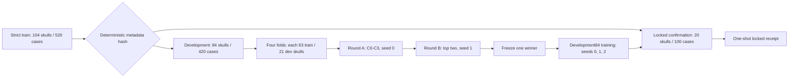

# Mamba O0 多 seed 事后诊断后的下一阶段实验协议与实现

_文档状态：D2 机制开发预注册实现；基于 R1/P1 冻结版本；任何候选训练开始后不得追溯修改规则。_

---

## 结论

用户提供的《Mamba O0 Multiseed Posthoc Next Experiment Protocol》总体正确且合理。它正确地把 R1/P1 结果视为假设来源，而不是继续在已经消费的 monitor 或 official test 上调参；也正确地要求先建立新的 skull-level development protocol，再比较机制候选。

实现时对原报告中的四处模糊表述作了预注册收紧：

| 原表述 | 固定后的可执行规则 |
| --- | --- |
| 灾难病例“明显增多” | 候选灾难率不得高于同轮 C0；灾难定义为任一核心指标非有限值，或 `rim_contact_hd95_mm > 50.0` |
| Final 重建“不能明显退化” | 作为排名前的硬门槛：相对 C0，Final CD 增量不超过 `0.10 mm`、Final HD95 增量不超过 `0.50 mm`、Final NSD@1 增量不低于 `-0.01` |
| 效率“不可接受” | 相对 C0，峰值显存不超过 `1.25x`、中位推理延迟不超过 `1.75x`、稳态 epoch 时间不超过 `1.75x` |
| 固定 checkpoint | 统一使用 epoch 100 的 `ckpt-last.pth`，随后仅以对应 fold-train 全部数据做 BatchNorm recalibration；禁止按开发集挑 checkpoint |

因此，本阶段不是继续优化 v1.1-xyz 的旧 monitor 分数，而是在新的开发样本上检验“跨层残差预算、幅值归一化、共享权重双向扫描”三个机制假设。

## 实验边界

### 冻结基础

| 项目 | 固定值 |
| --- | --- |
| 基础 Git tag | `mamba-adapter-v11-o0-xyz-out8192-multiseed-r1-p1-seed012` |
| 基础 commit | `82b07550b4457b34b06be834565a306265fe3f35` |
| 数据输入与目标 | `partial -> implant` |
| 输入与输出点数 | `8192 -> 8192` |
| adapter 深度 | `2` |
| ordering | `xyz` |
| `alpha_init` | `0.01` |
| alpha warmup | epoch 0 至 20，线性从 `0.0` 到 `1.0` |
| 主训练轮数 | `100` |
| Round A seed | `0` |
| Round B seed | `1` |

### 禁止事项

- 不得把旧 `monitor_split=monitor` 用于训练、选择、阈值设定或候选修改
- 不得在 D2 候选选择阶段运行 SkullBreak official test
- 不得在 Round A 启动后修改候选公式、灾难阈值、非劣阈值、效率阈值或排序规则
- 不得根据单个 fold 的结果提前淘汰候选
- 不得根据 Round A seed-0 的结果修改 Round B seed-1 的候选实现
- confirmation20 一旦运行，不得返回修改候选、获胜机制或规则

## 数据协议

严格训练池定义为：

```text
official_split == train
and monitor_split != monitor
```

预期池规模为 104 个 skull、520 个 case，每个 skull 必须恰好包含五种 defect type。分组只使用元数据中的 `skull_id`，禁止按 case 随机切分。



锁定器使用常量 salt 对 skull ID 做 SHA256 排序：先固定 20 个 confirmation skull，再把其余 84 个 skull 固定分成 A-D 四折，每折 21 个 skull。该过程不读取图像、点云、标签几何或模型结果。

锁定目录包含：

- `protocol.json`
- `skull_assignments.csv`
- `case_assignments.csv`
- `development84_case_ids.txt`
- `confirmation20_case_ids.txt`
- `foldA` 至 `foldD` 的 train/dev case ID 清单
- `files.sha256`

如果目录已存在但任一字节不同，锁定器会拒绝覆盖。

## 候选机制

### C0：冻结 O0-xyz

保持 v1.1 的单向 xyz 序列与逐层残差：

```text
y_l = x_l + warmup * alpha_l * DropPath(Mamba(LN(x_l)))
```

该候选既是机制基线，也是非劣与效率比较基线。

### C1：固定总跨层残差预算

两层共享固定总预算 `G=2*alpha_init=0.02`，只学习层间分配：

```text
g = 0.02 * softmax(budget_logits)
y_l = x_l + warmup * g_l * DropPath(Mamba(LN(x_l)))
sum(g_l) = 0.02
```

`budget_logits` 初始化为零，因此初始两层各分得 `0.01`。各 block 原 `alpha` 保留为不可训练状态字段，避免它与预算分配同时学习。

### C2：逐样本 RMS 归一化 gate

先按每个样本的全部 token 和 feature 计算输入与 Mamba 输出 RMS：

```text
s = clamp(RMS(x) / max(RMS(mixed), 1e-6), 0.1, 10.0)
y = x + warmup * alpha * DropPath(s * mixed)
```

该候选检验跨 seed 幅值漂移是否是灾难病例的重要来源，同时用固定上下界避免极小 `mixed` 引起放大失控。

### C3：共享权重双向 xyz

同一个 Mamba mixer 分别处理正向序列和翻转序列：

```text
forward = Mamba(LN(x))
reverse = flip(Mamba(flip(LN(x))))
mixed = 0.5 * (forward + reverse)
y = x + warmup * alpha * DropPath(mixed)
```

正反方向完全共享参数，不增加第二套 mixer，也不引入可学习融合权重。效率门槛用于约束额外计算成本。

## Instrumentation

全链路 instrumentation 默认关闭，且仅允许在 `model.eval()` 下启用。它观察但不改写以下状态：

| 阶段 | 记录内容 |
| --- | --- |
| encoder | adapter 前后 token、坐标、memory、global feature |
| adapter | 每层 input、normalized、mixed、residual、output、alpha、归一化倍率 |
| query | learned coarse、FPS coarse、候选与选择索引、decoder 前 query |
| decoder | 每层 input、self-attention 后、cross-attention 后、MLP 后 |
| rebuild | coarse、rebuild feature、relative xyz、grouped points、最终 prediction |

`verify_mamba_full_instrumentation_zero_perturbation.py` 要求：

- 关闭和开启 observer 时，完整模型输出逐 bit 相同
- CPU 与全部 CUDA RNG state 逐 bit 相同
- observer 确实产出 adapter、decoder 与 rebuild 记录

任何一项失败都禁止启动 Round A。

## 训练与选择

### Round A

运行 `C0-C3 x fold A-D x seed 0`，共 16 次训练。所有候选完成前不执行选择。

每次训练固定执行：

1. epoch 100 `ckpt-last.pth`
2. fold-train 315 cases、batch size 8，共 40 个 batch 的完整 BNCal
3. 对对应 fold-dev 105 cases 运行点云指标评估
4. 对 fold-dev 运行 observation-only 全链路 instrumentation
5. 在同一 GPU 上执行 10 次 warmup 与 50 次 batch-1 推理计时
6. 写入含所有输入 SHA256 的不可变 `run_record.json`

硬门槛通过后，按以下字典序升序选择前二：

1. 灾难率
2. Rim HD95 P95
3. Rim HD95 maximum
4. Implant HD95 mean
5. Rim CD mean
6. Rim NSD@1 mean 的相反数

### Round B

只对 Round A 冻结的前二候选运行四折 seed 1，共 8 次训练。选择器联合 seed 0 与 seed 1 的开发折结果，使用相同硬门槛和排序规则冻结一个 winner。

若 C0 未进入前二，Round B 不额外训练 C0 seed 1；选择器只把 Round A 的 C0 seed-0 结果作为非劣与效率参考，并用灾难率而非原始计数消除样本数差异。

### Round C

获胜候选在 development84 上分别用 seed 0、1、2 完整训练。三次训练和 train-only BNCal 全部完成后，才允许三个已冻结 checkpoint 对 confirmation20 各运行一次。该阶段生成 `confirmation_receipt.json`，明确标记：

- confirmation 已消费
- 不允许回退修改
- 未使用旧 monitor
- 未使用 official test

## 文件实现

| 类别 | 文件 |
| --- | --- |
| 数据白名单 | `datasets/SkullBreakDataset.py` |
| 协议锁定 | `tools/lock_skullbreak_mamba_v12_development_protocol.py` |
| 配置生成 | `tools/generate_skullbreak_mamba_v12_dev_configs.py`、`tools/generate_skullbreak_mamba_v12_followup_configs.py` |
| 候选机制 | `models/AdaPoinTr.py` |
| 全链路观察 | `tools/instrument_mamba_full_pipeline.py` |
| 零扰动验证 | `tools/verify_mamba_full_instrumentation_zero_perturbation.py` |
| 效率测试 | `tools/benchmark_mamba_v12_efficiency.py` |
| 结果锁定 | `tools/write_mamba_v12_run_record.py` |
| 自动选择 | `tools/select_mamba_v12_round.py` |
| Round A | `scripts/launch_skullbreak_mamba_v12_round_a_tmux.sh` |
| Round B | `scripts/launch_skullbreak_mamba_v12_round_b_tmux.sh` |
| Round C | `scripts/launch_skullbreak_mamba_v12_round_c_tmux.sh` |

## 启动顺序

服务器 overlay 部署并通过测试后，依次运行：

```bash
TMUX_SESSION=mamba-v12-round-a-seed0 \
bash scripts/launch_skullbreak_mamba_v12_round_a_tmux.sh
```

Round A 自动完成并生成冻结 top-two receipt 后，再运行：

```bash
TMUX_SESSION=mamba-v12-round-b-seed1 \
bash scripts/launch_skullbreak_mamba_v12_round_b_tmux.sh
```

Round B 自动冻结 winner 后，再运行：

```bash
TMUX_SESSION=mamba-v12-round-c-confirmation \
bash scripts/launch_skullbreak_mamba_v12_round_c_tmux.sh
```

不得并行启动三个阶段，也不得跳过 receipt 直接构造下一阶段配置。

## 验证状态

当前本地已通过：

- 协议锁定合成测试
- 84/20 与四折互斥性测试
- 旧 monitor 与 official test 排除测试
- 不可变目录拒绝覆盖测试
- 灾难、Final 非劣与字典序选择器合成测试
- 全部新增 Python 文件静态编译

仍需在服务器 `adapointr-mamba` 环境执行：

- `PyYAML` 配置生成测试
- C0-C3 Torch 单元测试
- CUDA fast path 前向测试
- 全模型 bitwise/RNG 零扰动测试
- 全部 shell 脚本的 `bash -n` 检查

这些测试已被放入 Round A prepare gate；任一失败时，训练不会启动。

## 解释边界

R1/P1 事后相关性只能用于提出 C1-C3，不能被视为因果证据。D2 的新 development folds 用于机制选择，confirmation20 只用于冻结后确认稳定性。即使 confirmation 结果不理想，也只能记录失败并开启一个具有新协议和新数据边界的后续阶段，不能返回本阶段修改候选。

SkullBreak official test 在本协议中保持未消费状态。是否以后运行，应在 winner 与后续研究问题完全冻结后另行预注册；本实现不会自动调用它。
