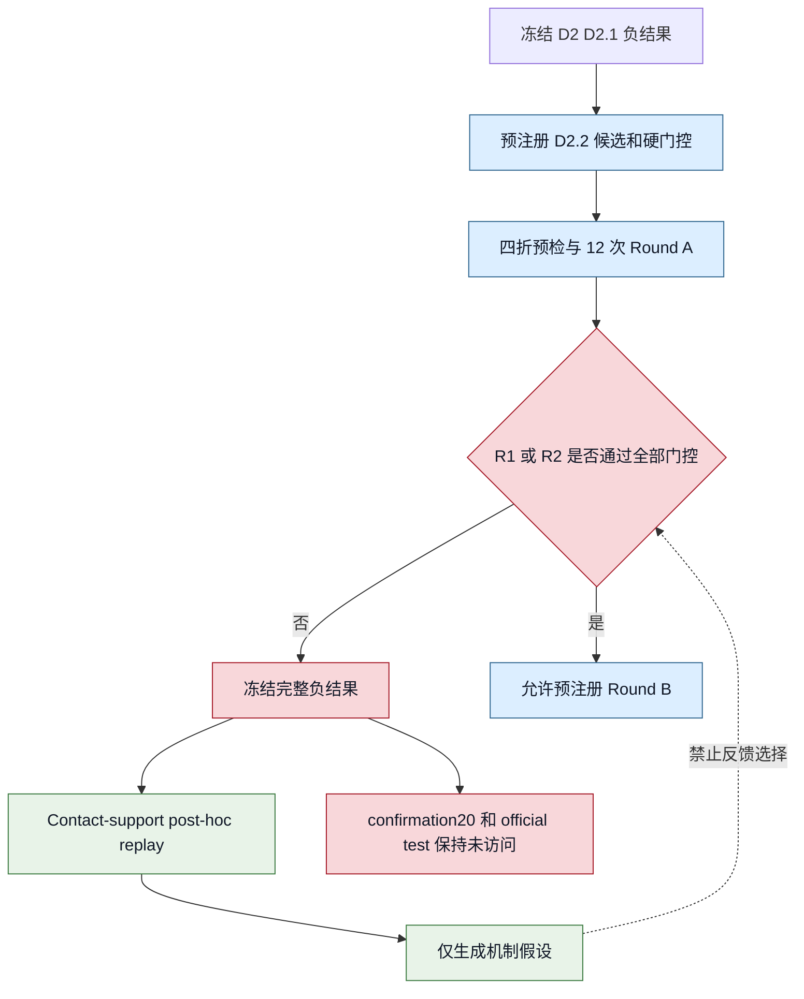
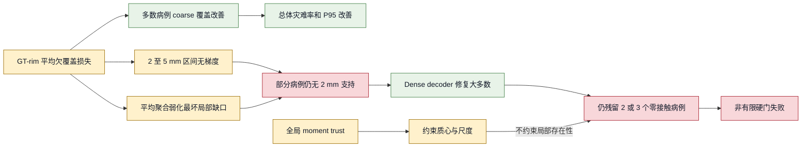

# Mamba Adapter v1.2 D2.2 完整负结果与 Contact-Support Post-hoc 实验报告

> 实验阶段：D2.2 Local Rim Coverage + Teacher Trust Region
> 数据集：SkullBreak，partial skull 到 implant 点云补全，输出点数 8192
> 实验日期：2026-08-08 至 2026-08-10
> 随机种子：seed 0
> 报告性质：冻结实验记录、负结果分析与明确标注的事后机制诊断
> 重要边界：未访问 confirmation20、旧 monitor split 或 official test；post-hoc 结果不参与候选选择

## 1. 执行摘要

D2.2 的目标是在 D2/D2.1 全局机制与粗粒度几何约束失败后，验证一个更局部、更贴近临床接触边界的假设：如果直接约束 GT 缺损边缘附近必须得到预测粗点云覆盖，并用冻结 R0 教师的全局几何矩约束候选不要偏离基线，是否能够降低 rim-contact 灾难失败，同时保持最终重建质量和推理效率。

实验严格使用预注册的 `development84` 四折协议，共完成 `3 candidates x 4 folds x 1 seed = 12` 次训练、BN 校准、开发折评估、内部 instrumentation 和效率测试。结果显示：

- R1 将灾难病例数从 R0 的 `45/420` 降至 `37/420`，降低 `17.78%`；
- R2 将灾难病例数降至 `36/420`，降低 `20.00%`；
- R1 的 rim-contact HD95 第 95 百分位从 `61.0475 mm` 降至 `55.1834 mm`，改善 `5.8641 mm`；
- R1、R2 的最终重建 CD、HD95、NSD 和效率门均未出现实质退化；
- 但是 R1 仍有 `2` 个、R2 仍有 `3` 个非有限 rim-contact 指标，违反预注册的硬门控 `nonfinite == 0`；
- 因此 R1、R2 均不具备进入 Round B 的资格，D2.2 的正式结论是：**存在积极机制信号，但未通过安全门控，属于完整负结果。**

冻结后开展的 contact-support post-hoc replay 进一步确认：所有非有限指标都由预测 implant 在严格 `2 mm` 接触带内没有任何支持点导致。R1 和 R2 都能修复 R0 的两个零接触病例，但分别引入 `2` 个和 `3` 个新的零接触病例。局部损失改善了总体和多数病例，却没有提供逐病例的接触存在性保证。

因此，本阶段不能据此选择 R1 或 R2，也不能在已消费的 `development84` 上继续扫描权重、dead-zone、rim band 或 trust tolerance。后续若继续研究，应另立新协议、使用新的开发病例来源，并把“至少存在接触支持”或尾部覆盖约束作为新的、预注册的结构性假设。

## 2. 研究背景与问题定义

### 2.1 与 D2/D2.1 的关系

D2/D2.1 已验证多种全局 Mamba 残差调控和粗几何守卫，但候选均未通过预注册安全门控。其主要启示是：

1. 全局残差预算、归一化或双向序列机制不足以直接控制局部缺损边缘；
2. 粗点云整体几何改善不等价于 rim-contact 安全性改善；
3. 灾难失败由少数极端病例主导，平均指标不能替代病例级硬门控。

D2.2 因此不再继续扩大 Mamba 全局调制，而是把干预位置前移到 coarse implant 的局部边缘覆盖，并增加一个只约束全局矩的教师 trust region。

前序负结果详见 [D2/D2.1 完整负结果报告](./mamba_v12_d2_d21_complete_negative_results_report_zh.md)。

### 2.2 核心研究问题

D2.2 预先提出两个问题：

1. **局部覆盖问题**：单向约束 GT rim 到预测 coarse implant 的欠覆盖，能否减少接触边缘灾难？
2. **全局稳定问题**：在局部损失之外，以冻结 R0 教师的质心和径向尺度作为 trust region，能否进一步降低由局部优化引起的全局漂移？

这两个问题分别对应 R1 和 R2。R0 作为同轮、同数据、同训练预算的参考组。

## 3. 协议、数据隔离与不可回看原则

### 3.1 数据划分

本实验沿用已经冻结的 skull-level 机制开发协议：

| 分区 | 用途 | 本阶段状态 |
|---|---|---|
| `development84` | D2.2 四折开发与门控 | 已使用 |
| fold A-D train | 每折 63 个 skull、315 个 case | 已用于训练 |
| fold A-D dev | 每折 21 个 skull、105 个 case | 已用于评估 |
| `confirmation20` | 获胜候选一次性确认 | 未访问 |
| 旧 monitor split | 历史 ordering 选择 | 未访问 |
| official test | 最终一次性测试 | 未访问 |

四折合并后每个候选恰好得到 `420` 条开发病例记录。病例按 skull 隔离，训练折和开发折不存在同 skull 泄漏。

### 3.2 预注册约束

正式协议与实现修订分别冻结在：

- [D2.2 预注册中文协议](./mamba_v12_d22_local_rim_trust_preregistered_protocol_zh.md)
- [D2.2 机器可读协议](./mamba_v12_d22_local_rim_trust_protocol_v1.json)
- [D2.2 实现修订说明](./mamba_v12_d22_local_rim_trust_implementation_amendment_v1_zh.md)
- [D2.2 实现修订 JSON](./mamba_v12_d22_local_rim_trust_implementation_amendment_v1.json)

实现修订发生在训练前，只处理 GT-rim cache、教师 cache、哈希和等价性检查，没有改变候选、阈值、选择规则或科学问题。

### 3.3 选择隔离

预注册规定：

- Round A 只有 R1/R2 通过全部门控时才可能进入 Round B；
- 任何核心指标非有限都直接判定为灾难，并使候选失去资格；
- Round A 失败后不得扫描局部损失权重、dead-zone、rim band、教师 tolerance 或新增 D2.2b；
- 不得访问 confirmation20、旧 monitor 或 official test 来修正候选；
- post-hoc 只解释冻结结果，不产生新赢家，也不恢复 Round B。



## 4. 候选设计与实现

### 4.1 公共基线 R0

R0 为冻结的 O0-xyz Mamba Adapter 路径：

- `alpha_init = 0.01`；
- `alpha warmup = 20 epochs`；
- ordering 为 `xyz`；
- 两层 Mamba Adapter；
- 不加入新的 rim loss 或 trust loss；
- 与 R1/R2 使用相同四折、epoch、seed、BNCal 和评估流程。

R0 不是从历史 monitor 结果复制的静态数字，而是在 D2.2 的同一开发协议下重新训练，因而能够控制数据与运行预算差异。

### 4.2 R1：单向 GT-rim 欠覆盖损失

设 defective partial 点集为 $P$，GT implant 为 $G$，预测 coarse implant 为 $C$。首先在物理空间中定义 GT-rim proxy：

$$
R_{GT}=\{p\in P\mid d(p,G)\le 2\ \mathrm{mm}\}.
$$

对每个 $p\in R_{GT}$ 计算其到预测 coarse implant 的最近距离 $d(p,C)$。只惩罚超过 `5 mm` dead-zone 的欠覆盖：

$$
e(p)=\max\left(d(p,C)-5\ \mathrm{mm},0\right).
$$

将误差按 GT implant 的径向 RMS 尺度归一化，再使用 `SmoothL1(beta=0.1)`。病例内先对 rim 点求均值，随后对 batch 求均值：

$$
L_{rim}=\frac{1}{B}\sum_{i=1}^{B}
\frac{1}{|R_i|}\sum_{p\in R_i}
\operatorname{SmoothL1}
\left(\frac{e(p)}{s_i+10^{-6}}\right).
$$

总损失增加：

$$
L=L_{reconstruction}+0.01L_{rim}.
$$

该损失具有三个关键性质：

- **单向**：只约束 GT-rim 到预测 coarse implant，不把任意预测点拉向 defective skull；
- **欠覆盖导向**：dead-zone 内梯度严格为零；
- **平均聚合**：优化病例内平均欠覆盖，不直接限制最坏 rim 点，也不保证 `2 mm` 内至少存在一个接触点。

### 4.3 R2：R1 加冻结 R0 教师 trust region

R2 保留 R1 的全部设置，并从同 fold、同 seed 的冻结 R0 BNCal 模型生成教师 coarse implant。教师模型处于 `eval` 和 `no_grad` 状态，不更新 BN 统计。

Trust region 只比较两个全局矩：

1. 候选 coarse implant 与教师 coarse implant 的质心偏差，容忍范围 `3 mm`；
2. 候选和教师的径向 RMS 尺度对数比，容忍范围 `log(1.05) = 0.0487901642`。

超过容忍范围的部分使用 SmoothL1，并以权重 `0.01` 加入总损失。该约束用于抑制整体平移和尺度漂移，但不约束局部 rim 接触点是否存在。

### 4.4 实现文件

核心实现位于：

| 文件 | 作用 |
|---|---|
| `models/AdaPoinTr.py` | R1/R2 损失接入、候选机制配置 |
| `utils/mamba_d22_geometry.py` | 物理尺度换算、GT-rim proxy、局部损失和全局矩 trust loss |
| `datasets/SkullBreakDataset.py` | case ID 过滤、尺度与缓存数据传递 |
| `tools/prepare_mamba_v12_d22_gt_rim_cache.py` | 四折训练集 GT-rim cache 生成与哈希 |
| `tools/generate_mamba_v12_d22_teacher_cache.py` | R0 教师输出 cache 生成与哈希 |
| `tools/generate_mamba_v12_d22_configs.py` | 12 个不可变 Round-A 配置生成 |
| `tools/select_mamba_v12_d22_round_a.py` | 预注册硬门控与冻结 receipt |

## 5. 预检与可复现性验证

正式训练前完成以下检查：

| 检查项 | 结果 |
|---|---|
| 分块最近邻距离与完整 `cdist` 等价 | 通过 |
| manifest 归一化尺度正确还原毫米距离 | 通过 |
| 空 GT-rim proxy | 硬错误，不静默跳过 |
| dead-zone 内损失与梯度 | 均为零 |
| 局部损失方向 | 确认为单向 GT-rim 到预测 coarse |
| trust tolerance 内损失 | 为零 |
| GT-rim cache 与在线 evaluator 等价 | 最大世界坐标差约 `5.68e-14 mm` |
| cache 重跑 | 字节一致 |
| protected split 泄漏检查 | 未发现泄漏 |

每折 GT-rim cache 覆盖 `315` 个训练 case，空 rim 数为 `0`。所有 cache、配置、协议和 run record 都通过 SHA256 固定。

## 6. Round A 实验流程

每个候选在 fold A-D 上执行相同流水线：

1. 在 63 个 skull、315 个 case 上训练 100 epochs；
2. 保存最终 checkpoint；
3. 使用本折训练数据重新校准 BatchNorm，得到 `ckpt-last-bncal.pth`；
4. 在本折 21 个 skull、105 个开发 case 上评估点云指标；
5. 保存逐病例 CSV、summary、instrumentation 和效率结果；
6. 写入不可变 `run_record.json`；
7. 四折合并后执行预注册门控。

共完成 `12/12` 个 run record。选择器最终以非零退出码终止，是预注册安全停止，不是训练或评估程序崩溃。

## 7. 评价指标与灾难定义

### 7.1 主要指标

| 指标 | 趋势 | 含义 |
|---|---:|---|
| Implant CD-L1 | 越低越好 | 预测 implant 与 GT implant 的平均对称距离 |
| Implant HD95 | 越低越好 | implant 的尾部距离误差 |
| Implant NSD@1mm | 越高越好 | 1 mm 容差内表面一致性 |
| Final CD-L1 / HD95 / NSD | 同上 | defective skull 与预测 implant 合成后的最终重建质量 |
| Rim-contact CD-L1 | 越低越好 | 缺损边缘接触区域的平均距离 |
| Rim-contact HD95 | 越低越好 | 接触区域尾部误差和灾难风险的主要指标 |
| Rim-contact NSD@1mm | 越高越好 | 严格接触精度 |
| Coarse GT-rim 到预测 P95 | 越低越好 | D2.2 局部机制的直接作用指标 |

### 7.2 预注册灾难失败

病例满足下列任一条件即记为灾难：

1. 任一核心指标为 NaN、Inf 或缺失；
2. `rim_contact_hd95_mm > 50 mm`。

当 `2 mm` rim-contact 带内预测 implant 点数为零时，接触 CD、HD95 和 NSD 无法定义，因此属于硬灾难，不能从均值中静默删除。

### 7.3 候选资格门

R1/R2 必须同时满足：

- 四折 `420` 条记录完整；
- 非有限核心指标数严格等于 `0`；
- 灾难数不高于 R0；
- Final CD 相对 R0 不劣于 `+0.1 mm`；
- Final HD95 相对 R0 不劣于 `+0.5 mm`；
- Final NSD@1mm 相对 R0 不劣于 `-0.01`；
- rim-contact HD95 P95 不高于 R0；
- 新诱发灾难数不超过被修复灾难数；
- coarse GT-rim 到预测 P95 的均值不高于 R0；
- 直接局部指标改善病例数不少于恶化病例数；
- 延迟、峰值显存和 epoch 时间不超过各自预算。

这是“全部通过”规则，而不是加权总分规则。任何一项失败都禁止 Round B。

## 8. Round A 完整结果

### 8.1 安全性和尾部指标

| 指标 | R0 | R1 | R2 |
|---|---:|---:|---:|
| 开发病例数 | 420 | 420 | 420 |
| 灾难病例数 | 45 | 37 | 36 |
| 灾难率 | 10.714% | 8.810% | 8.571% |
| 相对 R0 灾难数变化 | 参考 | -8 | -9 |
| 相对灾难降幅 | 参考 | 17.778% | 20.000% |
| 灾难 skull 数 | 36 | 29 | 29 |
| 非有限病例数 | 2 | 2 | 3 |
| Rim HD95 P95, mm | 61.0475 | 55.1834 | 59.3938 |
| Rim HD95 P95 相对 R0, mm | 参考 | -5.8641 | -1.6537 |
| Rim HD95 最大值, mm | 100.3230 | 110.2417 | 104.9416 |

R1 和 R2 都降低了总体灾难数，且 R1 显著改善 rim HD95 P95。但是最大值反而恶化：R1 比 R0 高约 `9.9187 mm`，R2 高约 `4.6186 mm`。这说明机制改善了总体尾部分布，却没有消除最极端失败。

### 8.2 Implant 与最终重建指标

| 指标 | R0 | R1 | R1-R0 | R2 | R2-R0 |
|---|---:|---:|---:|---:|---:|
| Implant HD95, mm | 10.0073 | 8.8508 | -1.1565 | 9.5233 | -0.4840 |
| Final CD-L1, mm | 2.3796 | 2.3752 | -0.0044 | 2.3880 | +0.0084 |
| Final HD95, mm | 5.5422 | 5.4981 | -0.0441 | 5.5500 | +0.0078 |
| Final NSD@1mm | 0.147651 | 0.147910 | +0.000259 | 0.147622 | -0.000029 |

R1 在 implant HD95 和全部 final 指标上均略优于 R0。R2 的 final CD 和 HD95 略差，但幅度远低于预注册容忍阈值。两者都没有以明显牺牲最终重建质量换取局部改善。

### 8.3 直接局部机制指标

| 指标 | R0 | R1 | R2 |
|---|---:|---:|---:|
| Coarse GT-rim 到预测 P95 均值, mm | 18.5673 | 17.0589 | 17.7811 |
| 相对 R0 变化, mm | 参考 | -1.5084 | -0.7862 |
| 相对改善率 | 参考 | 8.124% | 4.234% |
| 相对 R0 改善病例数 | 参考 | 235 | 223 |
| 相对 R0 恶化病例数 | 参考 | 185 | 197 |

R1 的直接局部机制信号强于 R2。加入全局 moment trust 并未进一步提升 rim 覆盖，反而削弱了 R1 的平均改善幅度。这提示全局教师约束与局部覆盖优化之间可能存在竞争，但本轮结果只能支持描述性判断，不能据此调整 trust 权重。

### 8.4 灾难病例转移

| 比较 | 被修复灾难 | 新诱发灾难 | 净变化 |
|---|---:|---:|---:|
| R1 相对 R0 | 26 | 18 | -8 |
| R2 相对 R0 | 28 | 19 | -9 |

净灾难数虽然下降，但候选不是对同一批病例做一致性修复，而是在病例之间重新分配风险。这一现象后来由零接触病例集合完全不重叠进一步证实。

### 8.5 效率

| 指标比值，相对 R0 | R1 | R2 | 预注册上限 |
|---|---:|---:|---:|
| 推理延迟 | 0.9380 | 0.9639 | 1.75 |
| 峰值显存 | 1.0000 | 1.0000 | 1.25 |
| 每 epoch 时间 | 1.0248 | 1.0398 | 1.75 |

R1/R2 的额外训练约束没有造成推理显存增加，推理延迟也没有恶化。训练时间仅增加约 `2.5%` 和 `4.0%`。因此 D2.2 的失败不是效率问题，而是安全完备性问题。

## 9. 门控审计与正式结论

### 9.1 门控状态

| 门控 | R1 | R2 |
|---|---:|---:|
| 420 条完整记录 | 通过 | 通过 |
| 非有限指标严格为 0 | **失败：2** | **失败：3** |
| 灾难数不高于 R0 | 通过 | 通过 |
| Final CD 安全界 | 通过 | 通过 |
| Final HD95 安全界 | 通过 | 通过 |
| Final NSD 安全界 | 通过 | 通过 |
| Rim HD95 P95 不高于 R0 | 通过 | 通过 |
| induced 不多于 rescued | 通过 | 通过 |
| 直接 coarse rim 指标改善 | 通过 | 通过 |
| 改善病例不少于恶化病例 | 通过 | 通过 |
| 延迟、显存、训练时间预算 | 通过 | 通过 |
| 最终资格 | **不合格** | **不合格** |

### 9.2 为什么一个非有限病例也不能放宽

Rim-contact 指标非有限不是数值格式问题，而是模型在预定义接触带中没有生成任何可评估点。若忽略这些病例后再计算均值，会产生三重偏差：

1. 最严重的失败被从统计中删除；
2. 模型看起来在剩余简单病例上更好；
3. 不同候选缺失的是不同病例，均值失去可比性。

因此，`nonfinite == 0` 必须保持硬门，而不能改成允许少量缺失、填入常数或只比较有限病例。

### 9.3 冻结决定

`round_a_selection.json` 记录：

- `winner = null`；
- `round_b_allowed = false`；
- R1/R2 均因非有限门失败；
- confirmation20、旧 monitor 和 official test 均未访问。

正式结论为：

> D2.2 证明局部 GT-rim 欠覆盖损失可以改善多数病例、总体灾难率和 rim HD95 尾部，但不能保证每个病例都存在严格接触支持。R1/R2 均未通过预注册安全门控，因此本阶段不产生获胜模型，不进入 Round B，也不运行 protected split。

## 10. 非有限病例审计

所有非有限病例都只在三项 rim-contact 指标上非有限，且 `rim_predicted_rim_points = 0`。其他 implant 和 final 指标保持有限。

| 候选 | Fold | Case ID | 缺损类型 | 2 mm 预测接触点数 |
|---|---|---|---|---:|
| R0 | D | `train__010__random_1` | random_1 | 0 |
| R0 | B | `train__017__random_2` | random_2 | 0 |
| R1 | D | `train__005__parietotemporal` | parietotemporal | 0 |
| R1 | A | `train__006__frontoorbital` | frontoorbital | 0 |
| R2 | D | `train__008__random_1` | random_1 | 0 |
| R2 | D | `train__022__frontoorbital` | frontoorbital | 0 |
| R2 | A | `train__092__random_1` | random_1 | 0 |

三个候选的零接触集合两两没有交集：

- R1 修复 R0 的 2 个零接触病例，同时引入 2 个新病例；
- R2 修复 R0 的 2 个零接触病例，同时引入 3 个新病例；
- R1 和 R2 的零接触病例也没有重叠。

因此，D2.2 并非简单地对固定困难病例无效，而是改变了病例级风险分配。

## 11. Contact-Support Post-hoc 诊断协议

### 11.1 诊断性质

Post-hoc 协议在 Round A 完整冻结后建立，详见：

- [Contact-support post-hoc 中文协议](./mamba_v12_d22_contact_support_posthoc_protocol_zh.md)
- [Contact-support post-hoc 机器可读协议](./mamba_v12_d22_contact_support_posthoc_v1.json)

该分析明确声明：

- `post_hoc = true`；
- `observation_only = true`；
- `selection_inert = true`；
- 不访问 confirmation20、旧 monitor 或 official test；
- 不改变 `2 mm` 主评价定义；
- 不允许选择 R1/R2、恢复 Round B 或扫描任何超参数。

### 11.2 Replay 范围

Replay 对 R0/R1/R2 的全部 `420` 个开发病例执行配对分析，共 `1260` 条候选-病例记录。对 coarse 和 dense 两个阶段分别计算：

- 接触带宽：`0.5、1、2、3、4、5 mm`；
- 每个带宽内的预测支持点数；
- 支持是否为零；
- 从零支持恢复为非零支持所需的最小带宽；
- 预测 implant 到 defective skull 的最近距离；
- GT-rim 到阶段点云的 P1、P5、P50、P95 距离。

Replay 的 dense `2 mm` 支持点计数与冻结 evaluator 完全一致，最大差值为 `0`。由此排除了 post-hoc 工具与正式 evaluator 定义不一致的可能。

## 12. 多带宽 Contact-Support 结果

### 12.1 Coarse 阶段

| 候选 | Band, mm | 零支持病例 | 非零支持率 | 支持点数中位数 |
|---|---:|---:|---:|---:|
| R0 | 0.5 | 295 | 29.762% | 0 |
| R0 | 1 | 77 | 81.667% | 2 |
| R0 | 2 | 11 | 97.381% | 18 |
| R0 | 3 | 4 | 99.048% | 53 |
| R0 | 4 | 3 | 99.286% | 103.5 |
| R0 | 5 | 0 | 100.000% | 164.5 |
| R1 | 0.5 | 310 | 26.190% | 0 |
| R1 | 1 | 69 | 83.571% | 2 |
| R1 | 2 | 12 | 97.143% | 19 |
| R1 | 3 | 8 | 98.095% | 56.5 |
| R1 | 4 | 5 | 98.810% | 111 |
| R1 | 5 | 2 | 99.524% | 176.5 |
| R2 | 0.5 | 308 | 26.667% | 0 |
| R2 | 1 | 78 | 81.429% | 2 |
| R2 | 2 | 12 | 97.143% | 18 |
| R2 | 3 | 4 | 99.048% | 56 |
| R2 | 4 | 3 | 99.286% | 113 |
| R2 | 5 | 1 | 99.762% | 174 |

局部损失没有降低 coarse `2 mm` 零支持病例总数：R0 为 11，R1/R2 均为 12。R1 在 `1 mm` 的非零支持率略高，但在 `3-5 mm` 反而出现更多零支持病例。这与其 `5 mm` dead-zone 并不矛盾，因为损失是病例内平均 SmoothL1，不是所有 rim 点的硬约束。

### 12.2 Dense 阶段

| 候选 | Band, mm | 零支持病例 | 非零支持率 | 支持点数中位数 |
|---|---:|---:|---:|---:|
| R0 | 0.5 | 20 | 95.238% | 8 |
| R0 | 1 | 3 | 99.286% | 52 |
| R0 | 2 | 2 | 99.524% | 200 |
| R0 | 3 | 0 | 100.000% | 326 |
| R0 | 4 | 0 | 100.000% | 418 |
| R0 | 5 | 0 | 100.000% | 485 |
| R1 | 0.5 | 20 | 95.238% | 8 |
| R1 | 1 | 3 | 99.286% | 53.5 |
| R1 | 2 | 2 | 99.524% | 206 |
| R1 | 3 | 2 | 99.524% | 321 |
| R1 | 4 | 1 | 99.762% | 407 |
| R1 | 5 | 0 | 100.000% | 474.5 |
| R2 | 0.5 | 18 | 95.714% | 8 |
| R2 | 1 | 5 | 98.810% | 51 |
| R2 | 2 | 3 | 99.286% | 202.5 |
| R2 | 3 | 2 | 99.524% | 323 |
| R2 | 4 | 1 | 99.762% | 416 |
| R2 | 5 | 0 | 100.000% | 490.5 |

Dense refinement 将 coarse `2 mm` 零支持病例从 `11/12/12` 大幅降至 `2/2/3`，说明 decoder 能修复绝大多数 coarse 局部缺口。但它不是确定性的接触保证，仍会留下少数完全无支持病例。

### 12.3 配对零接触转移

| 比较 | 修复 R0 零接触 | 新诱发零接触 | 持续零接触 | 始终非零 | 净变化 |
|---|---:|---:|---:|---:|---:|
| R1 vs R0 | 2 | 2 | 0 | 416 | 0 |
| R2 vs R0 | 2 | 3 | 0 | 415 | +1 |

这张表是 D2.2 失败的最直接病例级证据：局部损失改变了哪些病例获得接触支持，但没有降低零接触的绝对数量；R2 甚至净增加 1 个。

## 13. 七个冻结零接触病例的逐病例诊断

| 候选 | Case | Coarse 恢复带宽, mm | Dense 恢复带宽, mm | Coarse 最近距离, mm | Dense 最近距离, mm | Coarse GT-rim P95, mm | Dense GT-rim P95, mm |
|---|---|---:|---:|---:|---:|---:|---:|
| R0 | `train__010__random_1` | 3 | 3 | 2.3379 | 2.4821 | 30.4987 | 18.9787 |
| R0 | `train__017__random_2` | 5 | 3 | 4.4699 | 2.8976 | 45.2337 | 32.5585 |
| R1 | `train__005__parietotemporal` | >5 | 4 | 7.7047 | 3.8815 | 70.7465 | 67.3982 |
| R1 | `train__006__frontoorbital` | >5 | 5 | 10.2459 | 4.4840 | 40.3854 | 26.0687 |
| R2 | `train__008__random_1` | 5 | 3 | 4.6458 | 2.2316 | 48.0180 | 42.0742 |
| R2 | `train__022__frontoorbital` | >5 | 5 | 8.1401 | 4.7213 | 21.6264 | 17.1514 |
| R2 | `train__092__random_1` | 4 | 4 | 3.4340 | 3.7285 | 41.9747 | 32.1536 |

`>5` 表示在 replay 的最大 `5 mm` 带宽内 coarse 仍没有接触支持。

主要观察如下：

1. 七个 dense 零接触病例在 coarse 阶段也全部为 `2 mm` 零支持；
2. 三个新诱发病例的 coarse 最近距离大于 `5 mm`：R1 的 `train__005__parietotemporal`、`train__006__frontoorbital`，以及 R2 的 `train__022__frontoorbital`；
3. 七个病例的 coarse GT-rim P95 均很大，范围约 `21.63-70.75 mm`，不是单个孤立点轻微越界；
4. Dense 阶段在七个病例上都降低了 GT-rim P95，但仍未必把任何点带入 `2 mm` 接触带；
5. `train__010__random_1` 和 `train__092__random_1` 中，dense P95 明显改善，但最近距离略变差，再次说明总体覆盖改善不等价于接触存在性。

## 14. 机制解释

### 14.1 平均欠覆盖损失没有存在性保证

R1 的损失在病例内对所有 GT-rim 点取均值。即使大部分 rim 区域靠近预测 coarse，只要少数区域仍存在严重空缺，平均值也可能下降。反过来，优化平均欠覆盖也不保证至少有一个预测点落入严格 `2 mm` 接触带。

### 14.2 训练 dead-zone 与评价阈值不一致

训练只惩罚超过 `5 mm` 的距离，而正式接触定义使用 `2 mm`。因此 `2-5 mm` 区间在训练中完全无梯度，却在评价时仍属于零接触风险区。这种不一致解释了部分病例，但不是全部原因，因为三个候选病例在 coarse 阶段甚至超过 `5 mm`。

### 14.3 Low-weight 平均损失容易被重建主损失淹没

`lambda_rim = 0.01`，并且经过病例内平均和尺度归一化。局部严重失败对总梯度的贡献可能小于大量普通点的重建贡献。R1 的整体指标改善证明该损失并非完全无效，但其强度和聚合方式不足以形成硬安全属性。

### 14.4 Dense decoder 是强修复器，但不是安全屏障

Dense refinement 修复了大多数 coarse 零支持病例，但没有显式 contact-support 约束，因此修复是经验性的、病例依赖的。它不能作为硬门控的替代品。

### 14.5 全局 moment trust 不能约束局部接触

R2 只约束质心和径向 RMS。两个 coarse implant 可以拥有非常接近的全局质心与尺度，但局部 rim 区域完全不同。R2 没有降低零接触病例数，说明全局 moment trust 对局部存在性问题缺乏足够辨识能力。



## 15. “负结果”应如何准确表述

D2.2 不是“局部 rim loss 完全无效”，也不是“R1 已经成功但门控太严格”。更准确的表述是：

> D2.2 在总体灾难率、rim HD95 P95、implant HD95 和直接 coarse rim 覆盖上观察到一致的积极机制信号，尤其是 R1；但是候选在严格 `2 mm` 接触存在性上仍产生非有限病例，且修复旧失败的同时引入新失败。因此，该机制不足以满足预注册病例级安全要求，不能升级为候选模型。

这个表述同时保留了科学信息和协议完整性：

- 积极信号可以用于提出新假设；
- 失败门控决定本轮没有赢家；
- 不能用 post-hoc 结果将 R1 描述为事实上的获胜者；
- 不能用平均改善覆盖掉极端失败。

## 16. 实验中遇到的工程问题

### 16.1 Preflight 导入路径错误

最初直接运行 `tools/test_mamba_v12_d22_rim_proxy.py` 时出现：

```text
ModuleNotFoundError: No module named 'utils'
```

原因是脚本执行路径没有稳定地把项目根目录加入 Python 模块搜索路径。修复后从仓库根目录显式设置可导入路径，并重新执行全部 preflight。该问题发生在训练前，不影响候选定义或实验结果。

### 16.2 Protected split 字符串审计误报

配置生成测试最初使用全文字符串断言，发现序列化文本中存在 `manifest_split: monitor` 字样即判泄漏。该字符串来自协议的“禁止访问”描述，而非实际 dataset 配置，导致误报。

修复方式是改为解析结构化配置，只审计训练、验证和测试 dataset 节点中的实际 split 字段。修复没有改变任何数据划分，重新生成的 12 个配置与冻结候选语义一致。

### 16.3 选择器以退出码 1 结束

Round A 末尾输出：

```text
RuntimeError: D2.2 terminated: no experimental candidate passed all gates
```

这是选择器按预注册规则主动阻止 Round B 的预期行为，不是训练失败。`round_a_selection.json` 已在抛出异常前写入并通过哈希验证。

### 16.4 中文终端显示问题

部分服务器终端对中文报告出现编码显示异常，但文件本身以 UTF-8 保存，SHA256 校验和后续读取均正常。该问题只影响终端渲染，不影响分析数据。

## 17. 有效性、局限与不可推断事项

### 17.1 有效性保障

- skull-level 四折隔离；
- 预注册候选、阈值、硬门和停止规则；
- 12 次实验全部完成；
- 同 seed、同训练预算和同评估器；
- GT-rim 与教师 cache 有内容哈希；
- 非有限病例不从汇总中删除；
- post-hoc 使用完整 420 病例配对 replay；
- replay 与冻结 evaluator 在主 `2 mm` 指标上完全一致；
- protected split 全程未访问。

### 17.2 局限

1. 仅运行 seed 0，不能估计 D2.2 候选的跨 seed 方差；
2. `development84` 已被 D2/D2.1/D2.2 多阶段消费，不能继续作为无限调参集；
3. post-hoc 多带宽分析是描述性的，没有独立验证集；
4. 零接触病例数较少，不能对缺损类型做稳定的统计推断；
5. 点云 contact-support 是几何代理指标，不等同于临床可用性或生物力学稳定性；
6. R2 只测试一种全局 moment trust 形式，不能推出所有教师约束都无效。

### 17.3 本报告不能支持的结论

- 不能宣称 R1 优于 R0 并应进入 official test；
- 不能根据 post-hoc 结果把 dead-zone 改成某个具体数值后在同一开发集重跑；
- 不能从七个病例推断特定缺损类型必然失败；
- 不能宣称 Mamba 是零接触的唯一原因；
- 不能把 confirmation20 当成新的调参集。

## 18. 下一步方案

### 18.1 当前阶段应立即执行

1. 将 D2.2 协议、实现、12 个 run record、门控 receipt、冻结负结果和 post-hoc 输出统一归档；
2. 为归档建立树级 SHA256，并在本地完成完整性和语义验证；
3. 提交 D2.2 代码、协议、分析工具和本报告，创建明确标注负结果的 Git tag；
4. 保持 confirmation20、旧 monitor 和 official test 未访问；
5. 清理服务器冗余 checkpoint 前，先保留必要 BNCal、配置、逐病例指标和哈希链。

### 18.2 后续科学路线的边界

若继续研究，必须建立新的预注册阶段，并使用独立于已消费 `development84` 的开发病例来源。可以把以下内容作为待验证假设，而不是直接实现后在原开发集重跑：

1. **接触存在性约束**：显式优化“至少一个预测点进入严格接触带”，而不是只优化平均欠覆盖；
2. **尾部聚合**：对 GT-rim 最近距离使用 CVaR、top-k 或分位数型聚合，直接针对最坏局部区域；
3. **Rim-aware query allocation**：在 coarse query 生成阶段保留或分配接触边缘锚点，降低 decoder 完全遗漏局部区域的概率；
4. **推理期安全回退**：当预测接触支持为零时，触发确定性 fallback，而不是让不可评估结果直接输出；
5. **结构性局部约束**：比较局部形状、法向、边界连通或 patch-level 覆盖，而非只约束质心和尺度；
6. **多 seed 安全复核**：只有新候选在新开发协议中先通过零非有限硬门，才值得增加 seed 评估。

这些方向必须重新冻结候选、阈值、灾难定义和停止规则。不得依据本次七个病例的数值选择一个最有利的阈值。

## 19. 冻结产物与审计路径

### 19.1 正式 Round A

| 产物 | 服务器路径 |
|---|---|
| 12 个候选折运行记录 | `logs/skullbreak_mamba_v12_d22_local_rim/round_a/*/run_record.json` |
| Round-A 门控 receipt | `logs/skullbreak_mamba_v12_d22_local_rim/round_a_selection.json` |
| 冻结负结果 | `logs/skullbreak_mamba_v12_d22_local_rim/frozen_negative_result_v1/` |
| GT-rim cache | `logs/skullbreak_mamba_v12_d22_local_rim/gt_rim_cache/` |
| R0 教师 cache | `logs/skullbreak_mamba_v12_d22_local_rim/teacher_cache/` |
| tmux 主日志 | `logs/skullbreak_mamba_v12_d22_local_rim/tmux_*.log` |

### 19.2 Contact-support post-hoc

| 产物 | 服务器路径 |
|---|---|
| Replay 逐病例结果 | `logs/skullbreak_mamba_v12_d22_local_rim/posthoc_contact_support_v1/replay/contact_support_per_case.csv` |
| Replay summary | `logs/skullbreak_mamba_v12_d22_local_rim/posthoc_contact_support_v1/replay/contact_support_replay_summary.json` |
| Post-hoc 中文报告 | `logs/skullbreak_mamba_v12_d22_local_rim/posthoc_contact_support_v1/analysis/contact_support_posthoc_report_zh.md` |
| Post-hoc summary | `logs/skullbreak_mamba_v12_d22_local_rim/posthoc_contact_support_v1/analysis/contact_support_posthoc_summary.json` |
| 零接触病例矩阵 | `logs/skullbreak_mamba_v12_d22_local_rim/posthoc_contact_support_v1/analysis/zero_contact_case_matrix.csv` |
| 树级哈希清单 | `logs/skullbreak_mamba_v12_d22_local_rim/posthoc_contact_support_v1/posthoc_tree_sha256.txt` |

Replay 结束时已验证树级 SHA256，输出明确记录：选择不变、Round B 仍禁止、三个 protected split 均未访问。

## 20. 最终冻结声明

| 项目 | 冻结状态 |
|---|---|
| D2.2 候选定义 | 已冻结 |
| development84 四折结果 | 已冻结 |
| 灾难定义与安全门控 | 已冻结 |
| Round-A winner | 无 |
| Round B | 禁止 |
| confirmation20 | 未访问 |
| 旧 monitor | 未访问 |
| official test | 未访问 |
| Contact-support replay | 明确标注 post-hoc |
| Post-hoc 对模型选择的影响 | 无 |
| D2.2 科学结论 | 有积极机制信号，但未通过安全门控的完整负结果 |

本报告将 D2.2 的平均改善、尾部风险和病例级零接触失败同时保留下来。它既不把负结果简化为“方法无效”，也不因多数指标改善而绕过安全门。后续工作的价值在于把本次失败转化为新的、可证伪的结构性假设，而不是在已经消费的开发集上继续寻找一个能够通过门控的参数组合。
