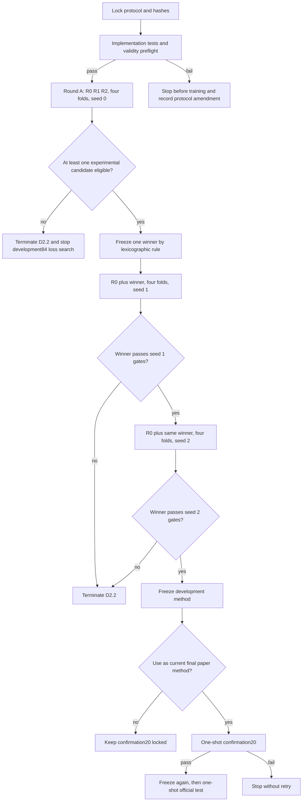

# Mamba v1.2 D2.2 局部 GT-rim 与 R0 trust region 预注册协议

_SkullBreak partial-to-implant，AdaPoinTr-Implant-8192 + Mamba Adapter；协议版本 `d22-v1`_

---

## 协议状态

| 字段 | 冻结值 |
| --- | --- |
| 协议版本 | `mamba-v12-d22-local-rim-trust-v1` |
| 研究性质 | 最后一次、范围受限的机制证伪实验 |
| 基础版本 | D2/D2.1 冻结负结果，Git tag `mamba-adapter-v12-d2-d21-negative-result-skullbreak-seed0` |
| 开发数据 | 已消费的 `development84`，固定 A-D 四折 |
| 保护数据 | `confirmation20`、旧 monitor、SkullBreak official test |
| 当前阶段 | 仅完成预注册；实现、预检和训练均尚未开始 |
| 生效条件 | 本协议和机器可读 JSON 被提交并记录 Git commit 后生效 |

> 本协议不是独立验证协议。D2.2 结果只能解释为在已消费 `development84` 上获得的迭代开发证据。

## 研究问题

### 主问题

带 dead-zone 的单侧局部 GT contact-rim 欠覆盖监督，是否能在不破坏 Final 非劣效的前提下，降低接触边缘灾难失败；相对冻结 R0 的全局矩 trust region 是否能抑制该局部目标引起的整体平移或收缩。

### 可证伪结论

- 若 R1 或 R2 通过全部硬门槛，则局部目标对齐假设获得开发集支持
- 若 R1、R2 均失败，则停止在 `development84` 上继续 loss、guard、alpha 或 gate 搜索
- D2.2 失败后转向新的 skull-level 开发数据和 query/coarse 局部表示重构
- 任一 post-hoc 分析均不得恢复被门槛禁止的 Round B

## 数据边界

### 允许使用

- `development84` 固定 A-D 四折
- 每折 `63` 个训练 skull、`21` 个开发 skull
- 每个 skull 的五种 defect type 必须留在同一折
- GT implant、GT-rim proxy 仅可用于训练 loss 和训练期诊断
- defect type 仅可用于分层报告

### 禁止使用

- `confirmation20`
- 旧 monitor
- SkullBreak official test
- GT implant、GT rim、完整 skull、defect type 或人工 defect center 作为推理输入
- 根据 defect type 选择 loss、权重、checkpoint 或推理分支
- 根据 D2.2 结果修改本协议中的阈值后重跑 D2.2b

## 候选定义

| ID | 角色 | 机制 | 推理图 |
| --- | --- | --- | --- |
| R0 | 同轮 reference | 冻结 O0-xyz，原始 reconstruction loss | 与冻结 O0 完全一致 |
| R1 | 实验候选 | R0 + 单侧局部 GT-rim 欠覆盖 loss + dead-zone | 与 R0 完全一致 |
| R2 | 实验候选 | R1 + 相对同折 R0 teacher 的 centroid/radius trust region | 与 R0 完全一致 |

R0 永远作为配对 reference，不接受“相对自身改善”的资格判定。R1、R2 分别相对同 fold、同 seed 的 R0 接受硬门槛判定。

禁止新增 R3、权重扫描、dead-zone 扫描、rim-band 扫描或 trust tolerance 扫描。

## 坐标与单位

### 归一化关系

SkullBreak 存储点云采用：

```text
world_mm = normalized * normalization.scale + normalization.centroid
```

每个 case 的 `normalization.scale` 必须来自冻结 manifest，并通过 `case_id` 传入训练 loss。禁止把归一化坐标中的常数误写成毫米阈值。

### 冻结毫米阈值

| 参数 | 物理值 | 归一化实现 |
| --- | ---: | --- |
| GT-rim band | `2.0 mm` | `2.0 / scale` |
| coarse dead-zone | `5.0 mm` | `5.0 / scale` |
| centroid trust tolerance | `3.0 mm` | `3.0 / scale` |
| radius trust tolerance | `log(1.05)` | 无量纲 |

实现可以在归一化空间计算最近邻距离后乘以 `scale`，也可以将阈值除以 `scale`；单元测试必须证明两种表达严格等价。

## GT-rim proxy

令：

```text
P = defective partial skull surface
G = GT implant surface
C = predicted coarse implant
```

训练期 reference rim 定义为：

```math
R_{gt} = \{p \in P \mid \min_{g \in G}\|p-g\|_2 \le 2.0\text{ mm}\}.
```

该定义必须与 `utils/skullfix_metrics.py::point_rim_metrics()` 中的 `reference_rim` 逐点一致。

### 有效性规则

- 使用全部 `R_gt` 点，不进行随机下采样
- 若任一允许训练 case 的 `R_gt` 为空，validity preflight 必须失败
- 不允许在 loss 中静默跳过空 rim case
- preflight 仅输出 point-count 的 `min/p1/p5/median/p95/max` 和空集数量
- preflight 后不得据此修改 `2.0 mm` rim band
- 大矩阵距离允许确定性分块计算，但结果必须与未分块实现一致

## R1 单侧 dead-zone loss

对每个 `r_i` 属于 `R_gt`：

```math
d_i = \min_{c \in C}\|r_i-c\|_2,
\qquad
e_i = \max(0,d_i-5.0\text{ mm}).
```

只计算 `GT-rim -> coarse`，禁止加入 `coarse -> GT-rim` 对称项。

令 `s` 为该 case 的 GT implant radial RMS，单位为 mm，并使用 `epsilon=1e-6 mm` 防止除零。冻结损失为：

```math
L_{rim} = \operatorname{mean}_{case}\left[
  \operatorname{mean}_{i}\operatorname{SmoothL1}
  \left(\frac{e_i}{\max(s,10^{-6})},0;\beta=0.1\right)
\right].
```

R1 总损失：

```math
L_{R1}=L_{base}+0.01L_{rim}.
```

冻结参数：

| 参数 | 值 |
| --- | ---: |
| `lambda_rim` | `0.01` |
| `smooth_l1_beta` | `0.1` |
| `epsilon_mm` | `1e-6` |
| rim reduction | case 内均值，再做 batch 均值 |

## R2 全局矩 trust region

### Teacher 生成

每个 fold 和 seed 必须按以下顺序执行：

1. 训练同轮 R0
2. 完成 R0 BNCal
3. 冻结 `ckpt-last-bncal.pth`
4. 使用 `eval()`、`torch.no_grad()`、无 BN 更新生成 cache
5. 对 cache 内容和来源 checkpoint 计算 SHA256
6. cache 完成后才允许启动该 fold/seed 的 R2

SkullBreak 当前训练通路不得包含改变几何坐标的随机增强；若实现检查发现存在此类增强，离线 teacher cache 协议立即失效，训练不得开始。

### Cache 字段

```text
protocol_version
candidate=R0
fold
seed
case_id
normalization_scale
coarse_centroid_normalized[3]
coarse_radial_rms_normalized
checkpoint_path
checkpoint_sha256
config_sha256
cache_sha256
```

### Trust loss

令 candidate coarse centroid/radius 为 `c,r`，teacher 为 `c0,r0`：

```math
e_c=\max(0,\|(c-c_0)\|\cdot scale-3.0\text{ mm}),
```

```math
e_r=\max(0,|\log((r+\epsilon)/(r_0+\epsilon))|-\log(1.05)).
```

冻结：

```math
L_{TR}=\operatorname{SmoothL1}
\left(\frac{e_c}{\max(s,10^{-6})},0;\beta=0.1\right)
+\operatorname{SmoothL1}(e_r,0;\beta=0.1).
```

R2 总损失：

```math
L_{R2}=L_{base}+0.01L_{rim}+0.01L_{TR}.
```

R2 只约束 centroid 和 radial RMS，因此准确名称是“全局矩 trust region”，不得把它解释为完整 coarse distribution 或 query-position trust region。

## 实现前测试门槛

训练前必须全部通过：

| 测试 | 冻结要求 |
| --- | --- |
| reference-rim equivalence | 训练 proxy 与 evaluator reference rim 的索引完全相同 |
| mm conversion | normalized 与 world-mm 两种计算误差不超过 `1e-6 mm` |
| dead-zone | `d <= 5 mm` 时 loss 和梯度均为 0 |
| one-sided | 不存在 coarse-to-rim 对称项 |
| empty rim | 明确抛错，不静默跳过 |
| R2 inside tolerance | centroid/radius 均在容差内时 trust loss 和梯度为 0 |
| R2 outside tolerance | 超出容差时 loss 有限且梯度非零 |
| disabled equivalence | D2.2 功能关闭时 R0 输出与冻结 O0 严格一致 |
| inference interface | forward 输入仍只有 defective partial |
| protected split audit | 配置与运行记录中无保护集 case ID |
| deterministic cache | 相同输入重复生成 cache 的 SHA256 一致 |

## Round A

```text
R0/R1/R2 x folds A-D x seed0 = 12 trainings
```

每个 fold 先完成 R0 和 teacher cache，再运行 R1/R2。所有训练固定 `100` epochs、`ckpt-last`、同一 BNCal、同一 evaluator、同一硬件类别和确定性设置。

## 指标与聚合

### 核心灾难定义

任一条件成立即为 disaster：

```text
任一核心指标为 NaN/Inf
or rim_contact_hd95_mm > 50.0 mm
```

`undefined_contact=true` 指 predicted contact footprint 为空，必须按 non-finite disaster 处理。

### 聚合口径

- 四折 dev prediction 拼接为 420 个互斥 case
- case-level hard gate 保持与 D2/D2.1 一致
- P95 固定使用 NumPy `percentile(..., 95, method="linear")`
- Rim P95 只在 finite cases 上计算，同时单独报告 undefined 数量
- paired improvement 使用相同 case 的 candidate-R0 差值
- `abs(delta) <= 1e-6` 记为 tie
- 额外报告 catastrophic skull count
- 置信区间仅用于解释，采用按 skull 聚类的 `2000` 次 bootstrap、`seed=0`
- bootstrap 不参与资格判定和候选排序

## R1/R2 硬门槛

| 门槛 | 相对同轮 R0 的冻结规则 |
| --- | --- |
| 完整性 | 4 folds、420 cases 全部存在且 case ID 一致 |
| Non-finite | `0` 个 case |
| Disaster | candidate disaster count `<= R0` |
| Final CD | mean delta `<= +0.10 mm` |
| Final HD95 | mean delta `<= +0.50 mm` |
| Final NSD@1 | mean delta `>= -0.01` |
| Rim tail | candidate finite-case Rim HD95 P95 `<= R0` |
| Transition | `induced <= rescued` |
| Direct target | GT-rim-to-coarse P95 的 case mean `<= R0` |
| Direct target cases | paired improved case count `>=` worsened case count |
| 推理延迟 | `<= 1.75x R0` |
| 峰值显存 | `<= 1.25x R0` |
| 稳态 epoch 时间 | `<= 1.75x R0` |

任何一项失败即 `ineligible`。不得以均值改善覆盖 hard-gate 失败。

## 排序规则

若 R1、R2 中至少一个 eligible，仅在 eligible 实验候选中按以下字典序选出一个 winner：

1. disaster count
2. undefined contact count
3. Rim HD95 P95
4. Rim HD95 maximum
5. `induced - rescued`
6. Rim HD95 mean
7. Implant HD95 mean
8. Final 非劣效 margin
9. inference latency

选择器必须生成不可变 receipt，记录全部输入文件 SHA256、资格布尔值、排序向量和 winner。

## Round B 与 seed robustness

### Round B

若 R1、R2 均 ineligible：

```text
Round B forbidden
D2.2 terminated
```

若至少一个实验候选 eligible：

```text
R0 + frozen winner
x folds A-D
x seed1
= 8 trainings
```

seed1 winner 必须再次独立通过全部相对 seed1 R0 的硬门槛，否则 D2.2 终止。

### Seed 2

仅当 seed1 通过时运行：

```text
R0 + same frozen winner
x folds A-D
x seed2
= 8 trainings
```

seed2 也必须通过同样硬门槛。seed0/1/2 之间禁止修改模型、loss、阈值、epoch、BNCal 或 evaluator。

## Confirmation 与 official test

完成三 seed 开发复核并冻结方法后，不自动消费 `confirmation20`。

仅当该方法被决定作为当前论文最终方法时，才允许：

1. 用 `development84` 全量训练 R0 和 winner
2. 固定 `seed0`、`100` epochs、`ckpt-last` 和 BNCal
3. 冻结 checkpoint、配置、选择器和 evaluator SHA256
4. 对 `confirmation20` 执行一次配对评估

若 confirmation 未通过预注册 hard gate，方法停止，不得修改后重试 confirmation。

只有 confirmation one-shot 通过后，才允许冻结最终方法并运行一次 SkullBreak official test。official test 后不得返回修改候选、阈值、seed、checkpoint 或选择规则。

## 决策流程



## 停止规则

D2.2 出现以下任一情况即停止：

- validity preflight 发现空 GT-rim 或单位映射不一致
- 实现测试未全部通过
- Round A 无 eligible 实验候选
- seed1 或 seed2 winner 未通过硬门槛
- confirmation one-shot 未通过

D2.2 停止后禁止：

```text
修改 lambda_rim
修改 dead-zone
修改 rim band
修改 trust tolerance
增加 R3/R4
重跑 D2.2b
继续在 development84 上做 D2.3/D2.4 loss engineering
```

## 归档要求

必须归档：

- 本协议和机器可读 JSON
- Git commit、tag 和 clean status
- development84/confirmation20 case-ID hash
- 所有生成配置及 SHA256
- R0 teacher checkpoint、config 和 cache SHA256
- unit/preflight 测试结果
- training logs、BNCal、point/rim CSV、run records
- hard-gate receipt 和停止状态
- CUDA、PyTorch、Mamba、GPU、pip freeze
- `protected_splits_accessed=false` 证明

## 下一执行动作

本协议接受后，下一步只实现 `case_id -> normalization.scale` 数据通路和 GT-rim proxy，不同时实现 R1/R2，不启动训练。

