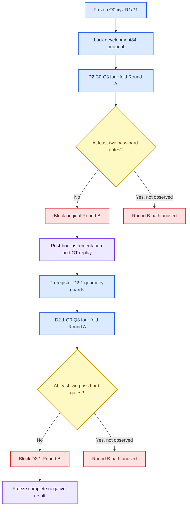

# Mamba v1.2 D2/D2.1 完整负结果实验报告

_SkullBreak out8192 机制开发阶段 | D2 与 D2.1 | seed 0 | 2026-08-07_

---

## 摘要

本报告完整记录 Mamba Adapter v1.2 在 SkullBreak 上的 D2 机制开发实验与 D2.1 coarse geometry guard 修订实验。两轮实验均建立在冻结的 `Mamba v1.1 O0-xyz` 基础上，使用新建的 skull-level `development84` 四折协议，严格排除旧 monitor、SkullBreak official test 和锁定的 `confirmation20`。实验的核心问题是：能否在保持 Final 重建质量和计算效率非劣的前提下，降低 `rim_contact_hd95_mm > 50 mm` 或核心指标非有限所定义的灾难失败。

D2 比较冻结 O0、固定跨层残差预算、逐样本 RMS 归一化和共享权重双向扫描四种机制。四者均通过 Final 非劣效和效率门槛，但灾难数分别为 `29/420`、`40/420`、`37/420` 和 `43/420`，没有任何候选通过灾难门槛，Round B 因而被协议自动禁止。随后开展的、明确标记为 post-hoc 和 selection-inert 的全链路 instrumentation 与 GT-aware replay 显示，灾难病例在 query/coarse 阶段已经出现显著偏心、径向收缩、GT 覆盖不足和 GT-rim 长尾，decoder/rebuild 虽提供部分补偿，但不能恢复局部接触边缘。

D2.1 根据该定位结论预注册了 centroid、centroid + radius 和 coarse coverage CVaR 三类训练期 GT 几何约束。三种约束均改善了各自直接优化的部分几何量，证明实现和梯度并非失效；然而相对同轮 Q0，它们分别净增加 `10`、`7`、`11` 个灾难病例，灾难率由 Q0 的 `7.38%` 上升到 `9.76%`、`9.05%`、`10.00%`。整体、局部 rim 和 defect-type 分层结果表明，全局 coarse 几何目标与局部接触边缘目标存在系统性错配，并伴随明显的缺损构型交互。

因此，D2 与 D2.1 是信息充分的负结果，而不是未完成实验：原 D2 Round B 和 D2.1 Round B 均保持禁止；`confirmation20`、旧 monitor 和 official test 均未访问；当前证据不支持增加几何损失权重、组合 Q1-Q3 或按 defect type 条件化。若继续 D2.2，只应进行一次范围受限的新协议修订，测试局部、单侧、带 dead-zone 的 GT-rim 欠覆盖监督，并用 Q0 分布锚定或 trust region 限制 coarse 漂移。

**关键词：** Mamba Adapter、AdaPoinTr、SkullBreak、coarse geometry、rim contact、灾难失败、负结果、预注册、post-hoc

## 结论先行

1. **D2 四个机制全部失败。** C0-C3 的 Final 和效率均非劣，但均有非有限 rim 病例，且灾难数不低于 C0；没有候选具备进入 Round B 的资格。
2. **D2 的失败首先是 coarse/query 几何失败。** 灾难病例的 coarse centroid offset 明显增大、radial RMS ratio 降低、GT coverage@5mm 大幅下降；Final 阶段保留相同异常方向。
3. **D2.1 的三种损失均真实生效。** Q1 明显降低 centroid offset，Q2 降低 radial log error，Q3 小幅降低 coarse GT-to-stage 和 GT-rim P95。不能把负结果归因为损失没有接入或梯度为零。
4. **直接目标改善没有转化为 rim 稳定性。** Q1-Q3 相对 Q0 均诱发多于挽救的灾难病例，整体 Rim HD95 分别恶化 `+2.0505`、`+1.2860`、`+0.5226 mm`。
5. **均值和尾部风险不能互相替代。** 某些 defect type 的平均 Rim HD95 改善时，灾难转换仍可能净恶化；因此后续选择必须继续以灾难硬门槛优先。
6. **本轮没有 winner。** 不运行 Round B，不访问 `confirmation20`，不运行旧 monitor 或 official test，也不根据 post-hoc 结果重排 D2/D2.1 候选。
7. **下一步不能只调权重。** 证据指向目标错配，而不是单纯正则强度不足。后续若开展 D2.2，应转向局部 rim 欠覆盖监督和 coarse trust region，并限制为一次受控修订。

## 研究背景与问题

### 冻结基础

| 项目 | 固定值 |
| --- | --- |
| 基础版本 | Mamba v1.1 O0-xyz |
| 基础 Git tag | `mamba-adapter-v11-o0-xyz-out8192-multiseed-r1-p1-seed012` |
| 基础 commit | `82b07550b4457b34b06be834565a306265fe3f35` |
| 数据任务 | SkullBreak `partial -> implant` |
| 输入 / 输出点数 | `8192 -> 8192` |
| Mamba ordering | 单向 `xyz` |
| Adapter depth | `2` |
| `alpha_init` | `0.01` |
| Alpha warmup | epoch 0 至 20，线性 `0.0 -> 1.0` |
| 训练轮数 | `100` |
| Round A seed | `0` |

R1/P1 多 seed 结果已经证明 O0-xyz 的平均 Final 指标相对稳定，但 rim 长尾和灾难病例仍随 seed 与病例构型变化。D2 不再修改 ordering，也不返回已消费的 monitor 或 official test，而是建立新的开发数据边界，检验跨层残差、幅值归一化和扫描方向机制能否降低尾部风险。

### 研究问题

本阶段回答以下问题：

1. 固定跨层残差预算能否减少不同层学习到极端残差分配所带来的不稳定？
2. 逐样本 RMS 归一化能否抑制跨样本、跨 seed 的 Mamba 幅值漂移？
3. 共享权重双向扫描能否减弱单向序列边界与扫描方向偏置？
4. 如果上述特征机制失败，灾难几何最早在哪个阶段形成？
5. 直接约束 coarse centroid、radius 或 GT coverage 能否消除该失败？

### 实验路线



## 数据与防泄漏协议

### Skull-level 数据划分

严格训练池定义为：

```text
official_split == train
and monitor_split != monitor
```

| 数据分区 | Skull 数 | Case 数 | 用途 | 当前状态 |
| --- | ---: | ---: | --- | --- |
| Strict train pool | 104 | 520 | 重新划分来源 | 已锁定 |
| `development84` | 84 | 420 | D2/D2.1 机制开发 | 已消费 |
| `confirmation20` | 20 | 100 | winner 一次性确认 | 未访问 |
| 旧 monitor | 10 | 50 | 历史 ordering 选择 | 禁止访问 |
| SkullBreak official test | 20 | 100 | 最终外部评估 | 禁止访问 |

`development84` 由 skull ID 的确定性 SHA256 排序生成 A-D 四折。每折包含 `63` 个训练 skull、`21` 个开发 skull，对应 `315` 个训练 case 和 `105` 个开发 case。一个 skull 的五种 defect type 始终留在同一折，避免同一颅骨跨 train/dev 泄漏。

> **边界说明：** D2.1 复用了已经被 D2 消费的 `development84`，因此 D2.1 属于迭代开发，不是独立验证。D2.1 的任何收益或失败都只能描述为开发集结果。

### 禁止事项

- 不根据旧 monitor 或 official test 修改候选、阈值或排序规则
- 不在候选冻结后按单折结果提前淘汰或修改实现
- 不从 D2 的失败结果恢复原 Round B
- 不从 D2.1 的 post-hoc 结果恢复 D2.1 Round B
- 不把 `confirmation20` 用于损失设计、权重选择或停止规则
- 不按 synthetic `defect_type` 标签在推理时切换模型或损失分支
- 不临时放宽灾难、Final 非劣效或效率阈值

## 评价指标与硬门槛

### 核心评价指标

| 类别 | 指标 | 方向 | 解释 |
| --- | --- | --- | --- |
| Implant | `implant_hd95_mm` | 越低越好 | 植入体表面长尾误差 |
| Final | `final_cd_l1_mm` | 越低越好 | 修复后整体表面平均误差 |
| Final | `final_hd95_mm` | 越低越好 | 修复后整体长尾误差 |
| Final | `final_nsd_at_1mm` | 越高越好 | 1 mm 容差内表面一致性 |
| Rim | `rim_contact_cd_l1_mm` | 越低越好 | 接触边缘平均误差 |
| Rim | `rim_contact_hd95_mm` | 越低越好 | 接触边缘长尾误差 |
| Rim | `rim_contact_nsd_at_1mm` | 越高越好 | 接触边缘 1 mm 一致性 |

### 灾难失败定义

任一条件成立即记为灾难失败：

```text
任一核心指标为 NaN / Inf
or rim_contact_hd95_mm > 50.0 mm
```

这个定义在结果产生前冻结。非有限 rim 指标来自接触区域为空或无法形成有效评估足迹时的“未定义”，不是网络张量发生 NaN 的同义词；但按临床几何风险原则仍作为灾难失败处理。

### 候选资格门槛

| 门槛 | 预注册规则 |
| --- | --- |
| 非有限值 | 必须为 `0` 个 case |
| 灾难率 | 不高于同轮基线 C0/Q0 |
| Final CD | 相对基线增量不超过 `+0.10 mm` |
| Final HD95 | 相对基线增量不超过 `+0.50 mm` |
| Final NSD@1 | 相对基线增量不低于 `-0.01` |
| 推理延迟 | 不超过基线 `1.75x` |
| 峰值显存 | 不超过基线 `1.25x` |
| 稳态 epoch 时间 | 不超过基线 `1.75x` |

只有通过全部硬门槛的候选才允许按灾难率、Rim HD95 P95、Rim HD95 maximum、Implant HD95 mean、Rim CD mean、负 Rim NSD@1 mean 的字典序排序。若少于两个候选合格，选择器必须写入不可变 gate-failure receipt 并以非零状态退出。

## D2 实验设计

### 候选机制

| 候选 | 机制 | 固定公式或行为 | 所检验假设 |
| --- | --- | --- | --- |
| C0 | 冻结 O0 | `x + warmup * alpha_l * Mamba(LN(x))` | 同轮参考 |
| C1 | 固定总残差预算 | `g = 0.02 * softmax(logits)`，两层 `sum(g)=0.02` | 层间预算漂移是否导致尾部失败 |
| C2 | 逐样本 RMS gate | `clamp(RMS(x)/RMS(mixed), 0.1, 10.0)` | 样本幅值漂移是否导致尾部失败 |
| C3 | 共享权重双向扫描 | 正向与反向输出等权平均 | 单向扫描方向偏置是否导致尾部失败 |

所有候选保持相同的数据、训练轮数、BNCal、point evaluator、全链路 instrumentation 和同 GPU 效率测试。Round A 共运行：

```text
4 candidates x 4 folds x seed 0 = 16 trainings
```

### D2 Round A 预注册结果

| 候选 | 灾难数 | 灾难率 | 非有限 Rim | Final CD | Final HD95 | Final NSD@1 | Implant HD95 | Rim HD95 P95 |
| --- | ---: | ---: | ---: | ---: | ---: | ---: | ---: | ---: |
| C0 | 29 / 420 | 6.90% | 1 | 2.3576 | 5.4235 | 0.147681 | 9.2469 | 53.7609 |
| C1 | 40 / 420 | 9.52% | 1 | 2.3633 | 5.4574 | 0.147692 | 9.1569 | 62.4529 |
| C2 | 37 / 420 | 8.81% | 2 | 2.3791 | 5.5334 | 0.147311 | 9.1285 | 57.9291 |
| C3 | 43 / 420 | 10.24% | 2 | 2.3916 | 5.5674 | 0.147688 | 8.7048 | 62.4040 |

单位为 mm 的列均为毫米；NSD 为无量纲比例。Final 与 Implant 表中的均值可正常解释。非有限 rim case 在冻结选择器内部由 `1e30/-1e30` 哨兵参与硬门槛，因此原 receipt 中的 Rim mean 和 Rim maximum 不代表实际毫米量，本报告不引用这些哨兵污染值。

### D2 门槛判定

| 候选 | 灾难门槛 | Final 非劣效 | 效率 | Eligible |
| --- | --- | --- | --- | --- |
| C0 | 失败 | 通过 | 通过 | 否 |
| C1 | 失败 | 通过 | 通过 | 否 |
| C2 | 失败 | 通过 | 通过 | 否 |
| C3 | 失败 | 通过 | 通过 | 否 |

C1-C3 相对 C0 的灾难率分别增加 `2.62`、`1.90` 和 `3.33` 个百分点。C3 的 Implant HD95 均值改善最大，但同时具有最高灾难率和明显更差的 Rim HD95 P95。这说明平均 Implant 指标不能替代局部 rim 尾部风险。

选择器生成 `round_a_top2_gate_failure.json`，状态为 `blocked_insufficient_eligible_candidates`，`eligible_order=[]`、`selected=[]`、`round_b_allowed=false`。这是协议预期的安全终止，不是脚本异常。

### D2 灾难复现

D2 四候选合计涉及 `79` 个独立灾难 case。按同一 case 在多少候选中复现：

| 复现候选数 | 独立病例数 | 含义 |
| ---: | ---: | --- |
| 1 | 42 | 机制特异或优化交互较强 |
| 2 | 14 | 中等复现 |
| 3 | 13 | 高复现 |
| 4 | 10 | 跨机制共同脆弱病例 |

`10` 个病例在 C0-C3 中全部灾难，说明失败并非只由某个新增机制产生；但 `42` 个病例只在单一候选中失败，也说明模型机制会改变个体病例的尾部风险分配。

## D2 post-hoc 定位诊断

### 分析边界

D2 选择已经因硬门槛终止。此后运行的 instrumentation 和 GT-aware replay 具有以下固定标签：

- `post_hoc=true`
- `observation_only=true`
- `selection_inert=true`
- `round_b_allowed=false`
- `locked_confirmation_used=false`
- `old_monitor_used=false`
- `official_test_used=false`

GT-aware replay 共 `1680` 条记录，即 `4 candidates x 420 cases`，并验证冻结的 `implant_hd95_mm` 最大重放误差为 `0.0 mm`。

### Coarse 与 Final 几何对照

下表比较每个候选内部的灾难组与非灾难组。`radial RMS ratio` 为预测相对 GT 的径向尺度，接近 `1` 更理想；coverage 越高越好。

| 候选 | 阶段 | Centroid offset 灾难 / 对照 | Radial RMS ratio 灾难 / 对照 | GT coverage@5 灾难 / 对照 |
| --- | --- | ---: | ---: | ---: |
| C0 | Coarse | 32.638 / 11.622 | 0.786 / 0.918 | 0.212 / 0.558 |
| C0 | Final | 30.593 / 10.275 | 0.774 / 0.897 | 0.497 / 0.912 |
| C1 | Coarse | 24.577 / 11.663 | 0.757 / 0.915 | 0.293 / 0.554 |
| C1 | Final | 22.049 / 10.201 | 0.744 / 0.892 | 0.624 / 0.905 |
| C2 | Coarse | 24.219 / 11.199 | 0.752 / 0.916 | 0.276 / 0.556 |
| C2 | Final | 22.157 / 9.895 | 0.743 / 0.895 | 0.609 / 0.908 |
| C3 | Coarse | 23.500 / 10.324 | 0.742 / 0.886 | 0.278 / 0.559 |
| C3 | Final | 21.524 / 9.007 | 0.736 / 0.871 | 0.570 / 0.903 |

主要效应方向在四个机制中一致：

- coarse centroid offset 的灾难组标准化差异 `SMD=0.8816-1.1814`
- coarse radial RMS ratio 显著下降，灾难组约 `0.74-0.79`，对照约 `0.89-0.92`
- coarse GT coverage@5 从对照约 `0.55-0.56` 降至灾难组约 `0.21-0.29`
- GT-to-coarse P95 的 `SMD=1.2782-1.5409`
- GT-rim-to-coarse P95 的 `SMD=1.3697-1.6748`

Final centroid offset 相对 coarse 有所下降，且灾难病例的 coarse-to-final GT P95 改善量更大，说明 decoder/rebuild 确实尝试补偿。但 Final 阶段的偏心、收缩和覆盖不足依旧远高于对照，补偿不足以修复接触边缘。

### D2 机制结论

```mermaid
flowchart LR
    accTitle: D2 Failure Localization
    accDescr: Post-hoc replay localizes the dominant geometry anomaly to query and coarse prediction, followed by partial decoder compensation and persistent rim-tail failure.

    adapter_state["Adapter representation"] --> query_coarse["Biased or contracted coarse geometry"]
    query_coarse --> low_coverage["Low GT and rim coverage"]
    low_coverage --> decoder["Decoder and rebuild compensation"]
    decoder --> residual_error["Persistent local rim error"]
    residual_error --> catastrophe["Rim HD95 catastrophe"]

    classDef upstream fill:#dbeafe,stroke:#2563eb,stroke-width:2px,color:#1e3a5f
    classDef middle fill:#fef9c3,stroke:#ca8a04,stroke-width:2px,color:#713f12
    classDef failure fill:#fee2e2,stroke:#dc2626,stroke-width:2px,color:#7f1d1d

    class adapter_state,query_coarse upstream
    class low_coverage,decoder middle
    class residual_error,catastrophe failure
```



该分析只支持“异常在 coarse 阶段已经可见”，不证明 Mamba residual 是唯一因果来源，也不证明加强任一全局 coarse 损失一定有效。D2.1 正是为了检验后一个问题而单独预注册。

## D2.1 实验设计

### 修订原则

D2.1 不恢复 D2 Round B，而是创建新的独立修订：

- 复用 O0-xyz、depth 2、`alpha_init=0.01` 和 20 epoch warmup
- 仅在训练期间使用 GT implant，推理输入仍只有 defective partial skull
- Q1-Q3 的辅助损失总权重统一为 `0.01`
- 距离按每个样本 GT radial RMS 归一化
- 仍运行 `Q0-Q3 x folds A-D x seed 0 = 16` 次训练
- 仍使用相同灾难、Final 非劣效和效率门槛

### D2.1 候选

| 候选 | 几何约束 | 核心定义 | 直接目标 |
| --- | --- | --- | --- |
| Q0 | 无附加 guard | 原始 coarse Chamfer + fine loss | 同轮基线 |
| Q1 | Centroid guard | 归一化 centroid offset 的 SmoothL1 | 全局偏心 |
| Q2 | Centroid + log-radius | centroid 与 log radial ratio 等权 | 偏心与整体收缩 |
| Q3 | Coverage CVaR | GT-to-coarse 最差 10% 归一化距离均值 | 全局欠覆盖长尾 |

### D2.1 预注册结果

| 候选 | 灾难数 | 灾难率 | 非有限 Rim | Rim HD95 P95 | Final CD Δ | Final HD95 Δ | Final NSD Δ | 延迟比 | 显存比 | Epoch 比 |
| --- | ---: | ---: | ---: | ---: | ---: | ---: | ---: | ---: | ---: | ---: |
| Q0 | 31 / 420 | 7.38% | 1 | 56.6427 | 0 | 0 | 0 | 1.000 | 1.000 | 1.000 |
| Q1 | 41 / 420 | 9.76% | 1 | 64.6899 | +0.0432 | +0.2422 | -0.000103 | 0.995 | 1.000 | 1.011 |
| Q2 | 38 / 420 | 9.05% | 3 | 65.8733 | +0.0319 | +0.1178 | +0.000080 | 1.033 | 1.000 | 1.009 |
| Q3 | 42 / 420 | 10.00% | 1 | 60.9141 | +0.0380 | +0.2003 | +0.000022 | 0.987 | 1.000 | 0.990 |

Q1-Q3 全部通过 Final 非劣效和效率门槛，但均失败于灾难门槛。相对 Q0，灾难率分别增加 `2.38`、`1.67`、`2.62` 个百分点。Q0 本身也有 1 个非有限 rim case，因此不具备候选资格；协议要求至少两个候选通过全部门槛，故 `round_b_allowed=false`。

Q0 是 D2.1 同轮重新训练参考，不应把它与 D2 的 C0 数值混作同一个 checkpoint。C0 的 `29/420` 与 Q0 的 `31/420` 差异进一步提示尾部病例对具体训练运行敏感，也说明新候选必须与同轮基线配对比较。

### D2.1 非有限病例

| 候选 | Case | Defect type | 非有限字段 |
| --- | --- | --- | --- |
| Q0 | `train__005__parietotemporal` | parietotemporal | 三个 rim-contact 指标 |
| Q1 | `train__025__random_2` | random_2 | 三个 rim-contact 指标 |
| Q2 | `train__092__random_1` | random_1 | 三个 rim-contact 指标 |
| Q2 | `train__099__parietotemporal` | parietotemporal | 三个 rim-contact 指标 |
| Q2 | `train__074__frontoorbital` | frontoorbital | 三个 rim-contact 指标 |
| Q3 | `train__099__parietotemporal` | parietotemporal | 三个 rim-contact 指标 |

这些记录的 Implant 和 Final 指标仍为有限值，只有 rim-contact 区域指标未定义。它们不能被静默丢弃；硬门槛将其计为灾难是合理的，但描述性均值应使用有效对并同时报告缺失数。

### 灾难类型分布

| Defect type | Q0 | Q1 | Q2 | Q3 |
| --- | ---: | ---: | ---: | ---: |
| bilateral | 5 | 6 | 7 | 6 |
| frontoorbital | 4 | 4 | 7 | 9 |
| parietotemporal | 5 | 5 | 6 | 8 |
| random_1 | 7 | 15 | 11 | 5 |
| random_2 | 10 | 11 | 7 | 14 |
| **总计** | **31** | **41** | **38** | **42** |

D2.1 共出现 `79` 个独立灾难 case。复现直方图为：仅 1 个候选失败 `39` 例、2 个候选失败 `20` 例、3 个候选失败 `7` 例、4 个候选全部失败 `13` 例。跨 Q0-Q3 全部失败的病例为：

```text
train__004__random_2
train__005__parietotemporal
train__008__random_2
train__010__random_1
train__013__frontoorbital
train__022__frontoorbital
train__024__random_2
train__057__random_1
train__072__random_1
train__074__frontoorbital
train__084__random_2
train__099__parietotemporal
train__105__random_2
```

与 D2 类似，既有跨机制共同脆弱病例，也有候选特异失败。D2.1 没有把风险整体消除，而是重新分配了哪些病例被挽救、哪些病例被诱发。

## D2.1 post-hoc 配对诊断

### 灾难转换

每个 Q 候选与同一 case 的 Q0 结果配对：

| 候选 | 稳定非灾难 | 挽救 | 诱发 | 共同灾难 | 净变化 |
| --- | ---: | ---: | ---: | ---: | ---: |
| Q1 | 368 | 11 | 21 | 20 | +10 |
| Q2 | 370 | 12 | 19 | 19 | +7 |
| Q3 | 367 | 11 | 22 | 20 | +11 |

三种 guard 都能挽救一部分 Q0 灾难病例，但诱发数始终更多。负结果不是“所有病例都变差”，而是平均小幅变化掩盖了风险重新分配和新增严重失败。

### 直接目标是否生效

下表为候选减 Q0 的配对均值。距离类负值为改善，coverage/NSD 正值为改善。

| 指标 | Q1 Δ | Q2 Δ | Q3 Δ |
| --- | ---: | ---: | ---: |
| Coarse centroid offset | **-0.9690** | -0.2583 | +0.7419 |
| Coarse radial log error | +0.01031 | **-0.01217** | -0.00433 |
| Coarse GT coverage@5mm | -0.01787 | -0.00419 | -0.00455 |
| Coarse GT-to-stage P95 | +0.11371 | +0.29741 | **-0.04296** |
| Coarse GT-rim-to-stage P95 | +0.09495 | +0.34753 | **-0.04951** |
| Final GT-rim-to-stage P95 | +0.27336 | +0.48561 | +0.34009 |
| Implant HD95 | +0.04279 | +0.05775 | +0.54011 |
| Rim HD95 | +2.05045 | +1.28604 | +0.52256 |
| Rim NSD@1 | -0.01070 | +0.00093 | -0.00294 |

直接目标呈现预期方向：

- Q1 在 `245/420` 个配对中降低 centroid offset，均值改善 `0.9690 mm`
- Q2 在 `246/420` 个配对中降低 radial log error，均值改善 `0.01217`
- Q3 在 `215/420` 个配对中改善 coarse GT-to-stage P95，并在 `214/420` 个配对中改善 coarse GT-rim P95

因此，Q1-Q3 的实现和训练信号确实改变了 coarse 几何。问题在于这些全局变化没有稳定传递到 Final rim，反而引入新的局部覆盖失败。

### Defect-type 灾难转换

| 候选 | bilateral 挽救/诱发 | frontoorbital | parietotemporal | random_1 | random_2 |
| --- | ---: | ---: | ---: | ---: | ---: |
| Q1 | 3 / 4 | 1 / 1 | 1 / 1 | 2 / 10 | 4 / 5 |
| Q2 | 2 / 4 | 1 / 4 | 3 / 4 | 2 / 6 | 4 / 1 |
| Q3 | 2 / 3 | 1 / 6 | 1 / 4 | 4 / 2 | 3 / 7 |

最明显的交互包括：

- Q1 在 `random_1` 中净增加 8 个灾难，是其整体失败的主要来源
- Q2 在 `random_2` 中净减少 3 个灾难，但其余四类均净增加
- Q3 在 `random_1` 中净减少 2 个灾难，却在 frontoorbital、parietotemporal 和 random_2 中分别净增加 5、3、4 个

### Defect-type Rim HD95 均值变化

| Defect type | Q1 Δ | Q2 Δ | Q3 Δ |
| --- | ---: | ---: | ---: |
| bilateral | -1.0476 | +1.7495 | -0.9230 |
| frontoorbital | +1.6724 | +1.8376 | +1.6639 |
| parietotemporal | +1.9628 | +0.9616 | +3.5540 |
| random_1 | +4.6060 | +1.7270 | -2.9041 |
| random_2 | +3.0698 | +0.1586 | +1.2942 |

Q3 对 `random_1` 的效果具有内部一致性：coarse GT-rim P95 改善 `-1.9193 mm`、Final GT-rim P95 改善 `-1.2035 mm`、Rim HD95 改善 `-2.9041 mm`，灾难转换净减少 2 个。但相同 Q3 对 frontoorbital 和 parietotemporal 明显恶化，不能作为全局候选进入下一轮。

此外，Q3 在 bilateral 的平均 Rim HD95 改善 `-0.9230 mm`，灾难转换却是挽救 2、诱发 3，净增加 1 个。这是均值与尾部风险分离的直接例子，进一步验证灾难硬门槛不能被平均指标替代。

## 综合分析

### 被证伪或不受支持的假设

| 假设 | 证据 | 结论 |
| --- | --- | --- |
| 固定总 residual budget 能降低灾难 | C1 灾难率由 6.90% 升至 9.52% | 不支持 |
| 逐样本 RMS 归一化能降低灾难 | C2 灾难率 8.81%，高于 C0 | 不支持 |
| 共享权重双向扫描能降低灾难 | C3 灾难率 10.24%，为 D2 最高 | 不支持 |
| Coarse centroid guard 足以稳定 rim | Q1 直接改善 centroid，但净增 10 个灾难 | 被证伪 |
| Centroid + radius guard 足以稳定 rim | Q2 改善 radial error，但净增 7 个灾难 | 被证伪 |
| 全局 coverage CVaR 足以稳定 rim | Q3 小幅改善 coarse tail，但净增 11 个灾难 | 被证伪 |
| 负结果来自损失未生效 | 三个 Q 的直接目标均出现预期变化 | 被证伪 |
| 只提高 loss weight 即可解决 | 当前问题表现为目标间权衡与 defect 交互 | 不受支持 |

### 当前最可信的机制解释

1. Mamba Adapter 输出进入 query/coarse 生成后，部分病例形成偏心、收缩或局部欠覆盖的 coarse 几何。
2. Decoder/rebuild 具有补偿能力，但 coarse query 的局部支持不足限制了后续恢复上限。
3. 全局 centroid、radius 和 top-10% coverage 约束会改变整体 coarse 分布，却没有明确聚焦缺损接触 rim。
4. 同一种全局修正对不同 defect geometry 的收益方向不同，导致部分病例被挽救、另一些病例被诱发。
5. 结果最终表现为 Final 均值近似非劣，但局部 rim 长尾和灾难率恶化。

该解释仍是由 post-hoc 配对证据支持的工作假设，不是因果证明。尤其不能据此声称某个特定 defect type 应使用不同模型。

### 为什么这是有效的负结果

- 候选、数据边界、阈值和停止规则均在训练前冻结
- 每个候选都完成四折训练、BNCal、完整开发折评估和效率测试
- 失败由自动硬门槛判定，而不是观察结果后主观拒绝
- 两轮选择器均写入不可变 gate-failure receipt
- post-hoc 工具明确禁止选择、禁止 Round B、禁止保护集访问
- D2.1 的直接目标确实改善，排除了明显的“代码没工作”解释
- 负结果缩小了后续设计空间：全局 coarse 约束不是可靠方向

## 执行中遇到的问题

### 协议与配置准备问题

| 问题 | 表现 | 处理 | 是否影响结果 |
| --- | --- | --- | --- |
| 配置泄漏检查误报 | 合法的 monitor 排除字段被文本扫描识别为泄漏 | 修正检查逻辑并重新通过确定性协议测试 | 否，训练前解决 |
| 协议目录额外文件 | 零扰动验证产物使 immutable writer 拒绝覆盖 | 分离协议所有权与派生验证产物，保持字节级锁定 | 否，训练前解决 |
| `get_loss` 参数不兼容 | Runner 传入 `partial`，旧模型签名不接受 | 对齐调用契约并通过训练 smoke test | 否，首个正式训练前解决 |
| Checkpoint 路径推导错误 | BNCal 在旧目录层级查找 `ckpt-last.pth` | 按生成配置的真实实验目录修正脚本 | 否，重新执行后产物完整 |

这些问题都发生在正式候选结果锁定前，且修复后 prepare gate、静态检查、单元测试和正式运行均重新执行。未使用失败运行的部分结果参与选择。

### 结果聚合与解释问题

1. **非有限 rim 哨兵污染描述性聚合。** 冻结选择器把非有限距离替换为 `1e30`、NSD 替换为 `-1e30`，用于保证硬门槛和排序把失败放在最差位置。该设计不影响灾难计数，但会使 Rim mean 和 maximum 变成 `1e27-1e30` 量级的非物理数。本报告只引用未被污染的 Final/Implant 均值、Rim P95 和有效配对统计。
2. **“非有限”不等于网络 NaN。** 本轮非有限仅出现在三个 rim-contact 指标，原因是预测没有形成可评估接触区域。后续报告应同时保留 `undefined_contact=true`、有效配对数和灾难标签。
3. **D2.1 使用已消费开发集。** D2 post-hoc 生成了 D2.1 假设，因此 D2.1 不能再被称为独立验证。该限制已在协议和本报告中明确。
4. **服务器中文终端可能出现乱码。** 报告与 JSON/CSV 均为 UTF-8；乱码属于终端 locale 显示问题，不应通过转码覆盖冻结文件。

## 有效性与局限

### 内部有效性

有利因素：skull-level 四折、固定 seed、统一训练与 BNCal、零扰动 instrumentation、哈希锁定 run record、自动硬门槛和同 case 配对分析。

剩余限制：

- D2 和 D2.1 Round A 只使用 seed 0，不能估计候选跨 seed 方差
- D2.1 复用 D2 的 development84，存在迭代开发偏差
- 灾难阈值 `50 mm` 是任务协议定义，不能替代连续风险分布
- 非有限 contact footprint 需要单独语义化，当前仍与大距离灾难合并
- defect-type 分层每类为 `84` 个 case，但同 skull 的五类构型相关，不能当作完全独立样本
- post-hoc 的 SMD、配对变化和 defect 交互不能证明因果

### 外部有效性

本报告只支持 SkullBreak、8192 输入/输出、AdaPoinTr + depth-2 Mamba Adapter、O0-xyz 和当前数据规范。不能直接推广到 SkullFix、其他点数、纯 Mamba block 替换或不同 decoder。`confirmation20` 和 official test 尚未运行，因此不存在 D2/D2.1 的独立确认结果。

## 冻结决定

### 立即生效

- D2 C0-C3：全部标记为 `negative, Round B forbidden`
- D2.1 Q0-Q3：全部标记为 `negative, Round B forbidden`
- 不选择 D2 或 D2.1 winner
- 不运行 seed 1 Round B
- 不运行 development84 full-train Round C
- 不访问 `confirmation20`
- 不访问旧 monitor
- 不运行 SkullBreak official test
- 不根据 D2.1 post-hoc 结果返回修改 Q1-Q3 权重

### 必须归档的证据

| 类别 | 关键产物 |
| --- | --- |
| D2 协议 | `logs/skullbreak_mamba_v12_development/protocol_v1/` |
| D2 16 次运行 | `logs/skullbreak_mamba_v12_development/round_a/*/run_record.json` |
| D2 gate receipt | `logs/skullbreak_mamba_v12_development/selection/round_a_top2_gate_failure.json` |
| D2 post-hoc | `logs/skullbreak_mamba_v12_development/posthoc_round_a*` |
| D2.1 协议 | `logs/skullbreak_mamba_v12_d21_geometry/protocol_v1/` |
| D2.1 16 次运行 | `logs/skullbreak_mamba_v12_d21_geometry/round_a/*/run_record.json` |
| D2.1 gate receipt | `logs/skullbreak_mamba_v12_d21_geometry/round_a_top2_gate_failure.json` |
| D2.1 post-hoc labels | `posthoc_paired_geometry/labels/round_a_case_labels.csv` |
| D2.1 GT replay | `posthoc_paired_geometry/gt_replay/` |
| D2.1 配对分析 | `posthoc_paired_geometry/analysis/` |

D2.1 coarse guard overlay 的已验证 SHA256 为：

```text
637fbfe93bcc28c2a6a49e9f6efb18819c0b1f4fc708ce674ca03435939ac9ae
```

D2.1 post-hoc paired replay overlay 的已验证 SHA256 为：

```text
a72686a00449b6d5714854213f97a0163beaf912253d6820b1e1cf4719519d84
```

## 下一步方案

### 先完成冻结，不立即继续训练

1. 将本报告与 D2/D2.1 协议、实现、选择器、post-hoc 工具一起纳入正式 Git commit
2. 创建明确标注 `negative-result` 的 Git tag
3. 在服务器生成包含协议、run receipts、分析输出、必要 checkpoint 和环境信息的归档
4. 在本地完成 SHA256 与 tar 内容验证后再删除服务器 checkpoint 副本
5. 保持 `confirmation20` 未消费状态并写入冻结清单

### D2.2 允许检验的唯一主方向

若决定继续，D2.2 应形成新的预注册修订，并同时包含：

1. **局部 GT-rim 欠覆盖监督。** 从 defective partial 与 GT implant 训练期构建局部接触 rim proxy，只惩罚真正未覆盖的 GT-rim 区域。
2. **单侧 dead-zone。** 在误差低于预设容差时梯度为零，避免为了改善已覆盖区域而移动整个 coarse implant。
3. **Q0 coarse trust region。** 对 coarse 分布或 query position 相对冻结 Q0 施加有限漂移约束，避免局部目标通过整体平移或收缩取巧。
4. **GT 仅训练期使用。** 推理接口不得增加 GT、defect type 或人工 rim 标签。
5. **候选数量严格受限。** 建议包含同轮基线在内不超过 3 个候选，避免在已消费 development84 上进行大规模搜索。

### D2.2 不允许的捷径

- 不直接把 `0.01` 提高到更大权重后重跑 Q1-Q3
- 不把 centroid、radius、CVaR 无约束叠加为新候选
- 不根据 defect type 在推理时选择不同 loss、gate 或 checkpoint
- 不以平均 Rim HD95 改善替代灾难门槛
- 不把 `confirmation20` 当作新的调参折
- 不在 D2.2 失败后继续无限复用 development84 生成 D2.3、D2.4

### 停止条件

若一次受限 D2.2 仍不能同时满足以下条件，应停止在 `development84` 上继续机制搜索：

- 非有限核心指标为 0
- 灾难率不高于同轮基线
- Final 非劣效门槛通过
- Rim HD95 P95 不恶化
- 直接局部目标与 Final rim 指标方向一致
- 至少两个候选具备进入下一阶段的资格

届时应优先增加新的 skull-level 开发数据、重新设计 query/coarse 局部表示，或转向结构级替换研究，而不是继续在同一开发集上微调损失。

## 最终结论

D2 证明，固定跨层 residual budget、逐样本 RMS 归一化和共享权重双向扫描都不能在当前 O0-xyz 框架下解决 SkullBreak 的 rim 灾难失败。D2 post-hoc 进一步把异常定位到 query/coarse 几何阶段：灾难病例在 coarse 输出时已经偏心、收缩且明显欠覆盖，decoder/rebuild 只能部分补偿。

D2.1 随后严格检验了三个全局 coarse geometry guard。它们分别改善了 centroid、radius 或 coarse coverage 的直接目标，却没有降低灾难风险；相反，三个候选均诱发多于挽救的病例，并在不同 defect geometry 之间产生方向相反的效应。这说明当前瓶颈不是“正则还不够强”，而是全局 coarse 目标与局部接触 rim 目标不一致。

因此，本阶段应以完整负结果冻结：不恢复任何 Round B，不访问保护集，不从均值中挑选看似较好的候选。下一步只有在完成代码、协议和结果归档后，才可考虑一次范围受限的 D2.2，用局部、单侧、带 dead-zone 的 GT-rim 欠覆盖监督配合 Q0 trust region，直接检验局部目标对齐假设。

---

_报告状态：待与 D2/D2.1 代码和冻结产物共同提交；`confirmation20`、旧 monitor 与 official test 均未用于本报告。_
