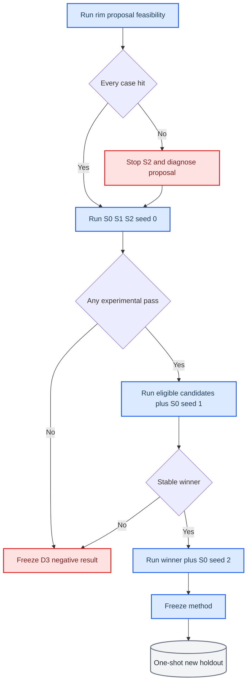

# Mamba v1.3 D3 Contact-Support Structuralization 预注册协议

> 状态：实现已启动；在新外部 skull 数据完成来源、重复和派生审计前，候选训练保持锁定。

## 研究结论

D2.2 的主要判断成立：后续研究应从平均局部损失转向病例级 contact existence 与 coarse query support。D3 只回答两个可证伪问题：

1. 与正式 2 mm evaluator 对齐的 dense existence/tail objective 是否足够消除最终零接触？
2. 仅依赖 defective partial 的 rim-aware query allocation 是否能够消除 coarse 支持遗漏？

当前 `development84` 只保留为历史基准。`confirmation20`、旧 monitor、SkullBreak official test 和 SkullFix 均不参与 D3 候选设计或选择。

## 对原路线的必要修订

| 原建议中的含混点 | 冻结修订 |
|---|---|
| `GT contact rim` 未给出精确定义 | 使用现有 evaluator 的 reference rim：距 GT implant 不超过 2 mm 的 defective-partial 点 |
| 普通 soft-min 随点数产生偏置 | 使用按集合大小归一化的 log-mean-exp soft-min |
| `delta_label` 需要几何统计后选择 | 每个 reference-rim 点归属最近 encoder proxy，不再引入标签半径 |
| S2 同时修改坐标和 query feature | Round A 只修改 coarse 坐标分配，所有 query 继续使用原 `mlp_query` |
| 至少两个候选通过才进入 seed-1 | 任一实验候选通过即可与 S0 进入 seed-1；S0 永远是参考而不是新方法 winner |
| coarse support 是统一的模糊 gate | S2 必须达到 coarse zero-support=0；S1 只承担 dense zero-contact=0 |
| case 数可被当作独立样本 | 不确定性分析以 source skull 为聚类单位 |

## 数据边界

D3 必须使用新的外部完整健康颅骨，经冻结 synthetic defect generator 生成 defective/implant pair。最低要求为 100 个唯一 source skull，其中 20% 在任何候选训练前锁为内部 holdout，其余 skull 进入四折 development。

每条派生记录必须保存：

- `case_id`、`skull_id` 和来源数据集；
- 原始 source asset SHA256；
- 规范化 surface fingerprint SHA256 及其算法 SHA256，用于识别同一 CT 的不同 mesh/volume 导出；
- 派生 case SHA256；
- synthetic generator SHA256；
- partial、implant、完整 skull 及 normalization 元数据。

同一个 source asset 不得映射到多个 skull ID，也不得与 SkullBreak、SkullFix 或既有外部数据指纹重叠。

```mermaid
flowchart LR
    accTitle: D3 protected data flow
    accDescr: New external skulls are audited and split before model development, while all previously protected datasets remain inaccessible until the method is frozen.

    source_data[(New healthy skulls)] --> provenance_audit[Audit provenance and hashes]
    generator_lock[Lock defect generator] --> derived_cases[Generate paired cases]
    provenance_audit --> derived_cases
    derived_cases --> skull_split{Split by source skull}
    skull_split --> development[Four-fold development]
    skull_split --> holdout[(Locked new holdout)]
    protected[(Existing protected data)] -. blocked .-> selection[Candidate selection]
    development --> selection
    selection --> method_freeze[Freeze method]
    method_freeze --> holdout

    classDef data fill:#f3f4f6,stroke:#6b7280,stroke-width:2px,color:#1f2937
    classDef action fill:#dbeafe,stroke:#2563eb,stroke-width:2px,color:#1e3a5f
    classDef locked fill:#fee2e2,stroke:#dc2626,stroke-width:2px,color:#7f1d1d
    class source_data,holdout data
    class provenance_audit,generator_lock,derived_cases,development,selection,method_freeze action
    class protected locked
```



## 候选

### S0：同轮参考

S0 固定为 O0-xyz 架构，但必须在每个新数据 fold 上重新训练。不得复用 D2.2 checkpoint 作为同轮基线。

### S1：Dense Contact-Support Safety Objective

设 `R_ref` 为 reference rim，`P_dense` 为 8192 点 dense implant。先计算每个 reference-rim 点到 dense prediction 的最近距离 `d_i`，单位统一为毫米。

归一化 soft-min 定义为：

```text
softmin_T(d) = -T * (logsumexp(-d/T) - log(number_of_distances))
```

冻结 `T=0.25 mm`、阈值 `2.0 mm`，existence 项使用平滑 hinge；tail 项使用 `relu(d_i-2 mm)` 的最坏 10% 均值。两项均先按病例聚合，再按 batch 求均值。

辅助梯度权重只允许在每个训练 fold 的前 8 个固定 batch 上校准一次，目标为 reconstruction 梯度范数的 7.5%。校准不得读取 dev 指标，并必须生成不可变 receipt。

### S2：Non-leaky Rim-Aware Query Allocation

S2 保持总 query 数 256：

- 224 个原 learned global coarse query；
- 32 个 partial-only rim-context query；
- rim candidate pool 固定为 96；
- 候选先按 rimness score 取 top-96，再用确定性 FPS 选 32 个空间分散 anchor；
- coarse query 坐标直接保留选中的 partial proxy，不添加 offset；
- 所有 query 继续经过原有共享 `mlp_query`。

训练标签不使用可扫描的距离阈值。每个 reference-rim 点分配给最近 encoder proxy，至少接收一个 rim 点的 proxy 为正类。分类损失固定为逐病例 class-balanced BCE，其权重与 S1 一样，只允许在对应训练 fold 的固定 8 个 batch 上按 7.5% 梯度比校准一次并写入凭据。

保留原始 anchor 是 Q2 的必要约束：若允许无界 offset，选中正确 proxy 后仍可能把 coarse query 移出 2 mm contact band，因而不能再声称 query allocation 提供结构性 support。

推理只能使用 defective partial 及其确定性 normalization 信息。GT implant、reference rim、完整 skull、defect type 和人工中心均禁止进入 forward path。

## Rim-proposal feasibility

完整 S2 前必须先冻结同轮 S0 encoder，仅训练 rimness head。该子实验的硬门是：每个 held-out fold 病例选出的 32 个 anchor 中至少包含一个 GT-positive proxy。

同时报告 positive-proxy recall、precision、空间覆盖和 false-positive rate。feasibility head 的权重不得用于初始化完整 S2，以免 S2 获得额外预训练优势。

## Round A 门控

S1 和 S2 都必须满足：

- 记录完整且所有规定指标有限；
- disaster 数不高于同轮 S0；
- dense 2 mm zero-contact 数为 0；
- Rim HD95 P95 不高于 S0；
- Final CD、HD95、NSD 分别满足 `+0.10 mm`、`+0.50 mm`、`-0.01` 的非劣界；
- 参数、延迟、峰值显存分别不超过 S0 的 1.02、1.10、1.10 倍。

此外，S2 必须满足 coarse 2 mm zero-support 数为 0。该条件是 Q2 的结构性判据，不施加给只检验 dense objective 的 S1。

Support count 除原始点数外，还必须报告相对 reference-rim 大小的比例。均值和置信区间按 source skull 聚类，defect-type 结果仅作描述。

## 轮次与停止规则



若 S1/S2 都未通过，冻结负结果并停止 contact-loss/query-allocation 小修。若任一实验候选通过，则该候选与 S0 进入 seed-1。若两者都通过，两者与 S0 一并进入 seed-1，再按预注册门控选择 winner。

新 holdout 只在 winner 和 seed-2 稳定性冻结后使用一次。之后才依次允许 SkullBreak `confirmation20`、SkullFix 只读跨数据集报告和最终一次 official test；任何结果都不得返回修改本协议。

## 当前执行状态

当前允许执行：

- D3 几何函数与 query-allocation 单元测试；
- 新数据 manifest schema、来源审计和重复检测；
- protocol locker 的确定性测试；
- 缺少外部数据时的硬阻断验证。

当前禁止执行：

- 在 `development84` 上试跑 S1/S2；
- 访问 `confirmation20`、旧 monitor、official test；
- 在新外部 manifest 和 generator hash 冻结前生成训练配置；
- 根据 D2.2 七个零接触病例修改 synthetic defect 分布。

## 启动接口

新数据准备完成后，首次预检只接受以下四个冻结输入：

```bash
export D3_EXTERNAL_MANIFEST=/absolute/path/new_external_cases.jsonl
export D3_PROTECTED_FINGERPRINTS=/absolute/path/protected_fingerprints.sha256
export D3_GENERATOR_SHA256=<64-hex>
export D3_SURFACE_FINGERPRINT_ALGORITHM_SHA256=<64-hex>

bash scripts/prepare_mamba_v13_d3_protocol.sh
```

manifest 除训练所需的 `point_path` 和 normalization 外，必须逐病例包含 `source_asset_path`、原文件 SHA256、规范化 surface fingerprint SHA256、fingerprint 算法 SHA256、派生 case SHA256 和 generator SHA256。脚本先执行数值与确定性测试，再逐文件复算哈希；缺任一变量或发现重合时以非零状态退出，并且不会生成候选配置或启动训练。

所有后续长时训练、评估和 replay 必须由 tmux 启动，训练与逐病例处理必须显示 tqdm，并保留 master log 与最终退出状态。
