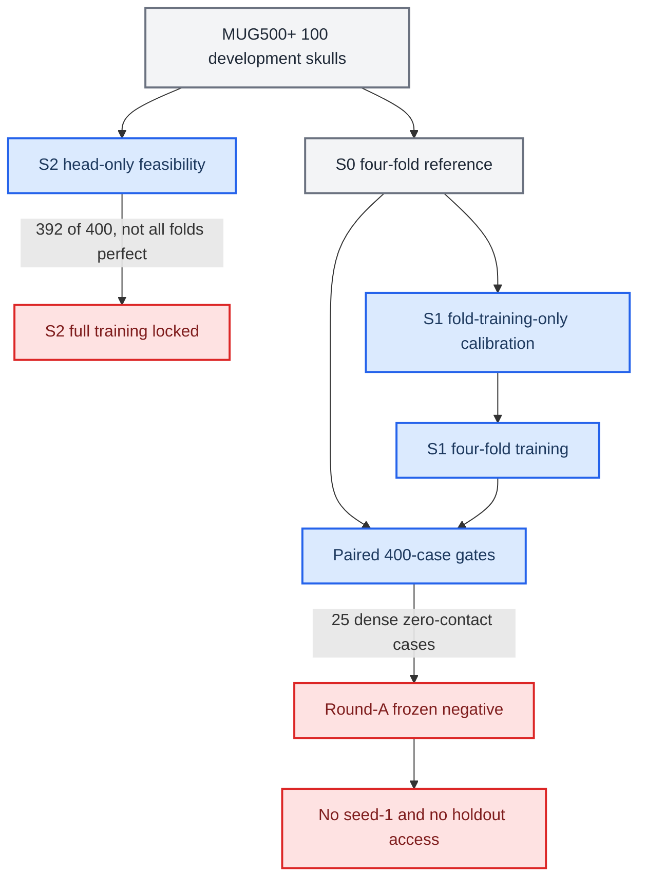

# Mamba v1.3 D3 Round-A S0/S1/S2 完整负结果报告

_MUG500+ M2 synthetic defects v1，seed 0，四折 development，冻结日期：2026-08-26_

---

> **冻结状态：** Round-A 已按训练前预注册规则完成配对门控。S1 未通过全部硬门控，S2 未取得完整训练资格，没有实验候选进入 seed-1。25 个 source-skull locked holdout、SkullBreak confirmation20、旧 monitor、SkullBreak official test 和 SkullFix 均未用于本轮选择。

## 摘要

本阶段针对 D2/D2.1/D2.2 暴露的 contact-support omission，使用独立的 MUG500+ 健康颅骨来源建立 500 个冻结合成缺损病例，并在 100 个 development source skull 上比较同轮参考 S0、dense contact objective 候选 S1，以及 partial-only rim-aware query allocation 候选 S2。S2 在完整训练前进行 head-only feasibility，达到 `392/400` 病例命中，但未满足每折 `100/100` 的全病例硬门控，因此完整 S2 被锁定。S1 经训练折专用 gradient-ratio calibration 后完成四折训练，在 400 个配对 development 病例上将灾难数从 `248` 降至 `233`，dense 2 mm zero-contact 从 `33` 降至 `25`，coarse 2 mm zero-support 从 `135` 降至 `122`；final CD-L1 和 HD95 分别改善 `0.171408 mm` 和 `0.454879 mm`，效率门控也全部通过。然而，S1 仍有 25 个 dense zero-contact 病例，导致 rim-contact HD95 仅 `375/400` 有限，无法满足“所有必需指标有限”和“dense zero-contact 必须为 0”的预注册硬门控，rim-contact HD95 P95 也依法保持为 `null`。最终结论是：S1 提供了积极但不足的机制信号，S2 提供了高命中率但非全病例保证的结构信号，D3 当前 S1/S2 实例均为正式负结果，不得进入 seed-1 或访问 locked holdout。

**关键词：** Mamba Adapter、AdaPoinTr、MUG500+、颅骨修复、contact support、dense contact objective、rim-aware query allocation、负结果

## 1. 研究问题与判定

### 1.1 背景

D2/D2.1 的全局 coarse geometry guard 和 D2.2 的 local rim loss/trust regularization 均未能消除接触支持失败。D2.2 的 contact-support post-hoc replay 进一步表明，一部分失败不是平均重建误差过大，而是 coarse 或 dense 输出在 2 mm 接触带内完全没有预测点。D3 因而把问题拆分为两个可证伪问题：

1. **Q1：** 与评估器 2 mm 定义一致的 dense contact-existence 与 GT-rim tail objective，能否消除 dense zero-contact？
2. **Q2：** 不使用 GT 或目标信息的 partial-only rim-aware query allocation，能否从结构上消除 coarse zero-support？

### 1.2 冻结决策路径

### 1.3 最终判定

| 候选 | 对应问题 | 结果 | 是否进入 seed-1 |
|---|---|---|---|
| S0 | 同轮参考 | 只用于门控，不可作为新方法获胜 | 否 |
| S1 | Q1：dense contact objective | 有改善，但未消除 25 个 dense zero-contact | 否 |
| S2 | Q2：rim-aware query allocation | feasibility `392/400`，未达到全病例保证 | 否 |

因此，Round-A 状态冻结为 `round_a_frozen_negative_no_experimental_candidate_passed`。

## 2. 数据、划分与防泄漏边界

### 2.1 数据来源

| 项目 | 冻结设置 |
|---|---|
| 原始来源 | MUG500+ 健康完整颅骨 |
| 纳入来源颅骨 | 125 |
| 每个来源颅骨派生病例 | 4 |
| 派生病例总数 | 500 |
| Development source skulls | 100，400 病例 |
| Locked holdout source skulls | 25，100 病例 |
| 划分单位 | source skull |
| 交叉验证 | A、B、C、D 四折 |
| 每折训练/开发来源颅骨 | 75/25 |
| 每折训练/开发病例 | 300/100 |

同一来源颅骨的四种缺损不得跨分区或跨折。生成资产、来源 STL、case manifest、数据锁和划分凭据均由 SHA256 绑定。训练病例中的 `reference_rim_mask` 只用于训练监督和离线 development 评分，不进入推理输入。

### 2.2 受保护数据

本轮未访问：

- 25 个 MUG500+ locked holdout source skulls
- D2 development84
- SkullBreak confirmation20
- SkullBreak 旧 monitor
- SkullBreak official test
- SkullFix 选择结果

由于 Round-A 没有实验候选通过，locked holdout 不得被消费。

## 3. 共同模型与训练设置

| 项目 | 设置 |
|---|---|
| 基础模型 | AdaPoinTr + Mamba Adapter v1.1 |
| Ordering | `xyz` |
| 输入点数 | 8192 |
| 输出点数 | 8192 |
| Coarse queries | 256 |
| Mamba depth | 2 |
| `alpha_init` | 0.01 |
| Alpha warmup | 20 epochs，0 到 1 |
| Seed | 0 |
| Epochs | 100 |
| 总 batch size | 8 |
| Optimizer | AdamW，lr `1e-4`，weight decay `5e-4` |
| Scheduler | LambdaLR，decay step 21，decay 0.9，最低 decay 0.02 |
| Checkpoint | epoch-100 `ckpt-last` 后执行 full fold-train BN calibration |
| 长任务 | tmux |
| 进度 | tqdm |

四折均保留不可变 run record、point metrics、efficiency、训练日志和 `ckpt-last-bncal.pth`。

## 4. 候选定义

### 4.1 S0：同轮参考

S0 是在相同 MUG500+ 四折、相同 seed 和相同训练流程下重新训练的 O0-xyz v1.1。它不包含 dense contact objective，也不包含 rim query allocation，只用于定义灾难数、P95、final 非劣和效率参照。

### 4.2 S1：dense contact-existence 与 tail objective

S1 在 dense 8192 输出上增加与评估器对齐的 2 mm 接触目标：

- threshold：`2.0 mm`
- smooth-min temperature：`0.25 mm`
- GT-rim tail fraction：最差 `10%`
- 方向：reference rim 到 dense prediction
- 汇总：case-balanced

辅助权重不得手工选择。每折在 optimizer step 之前，仅使用训练折前 8 个完整 batch 计算辅助梯度与重建梯度的全局 L2 比值，中位数记为 raw ratio，权重固定为 `0.075 / raw_ratio`。

| Fold | Raw ratio median | 冻结权重 |
|---|---:|---:|
| A | 464.0803776615 | 0.0001616099357 |
| B | 465.9677559959 | 0.0001609553430 |
| C | 462.2914591689 | 0.0001622353139 |
| D | 472.7584056921 | 0.0001586433982 |

校准共消费 `4 × 8 = 32` 个训练 batch、256 个 case slots，optimizer step 为 0，未使用 development 或 holdout 指标。

### 4.3 S2：partial-only rim-aware query allocation

S2 计划把 256 个 queries 分为 224 个全局 learned queries 和 32 个 rim-aware queries。从 defective partial 的 encoder proxies 中进行 score top-96，再通过确定性空间选择得到 32 个 anchor。推理时不允许使用 GT implant、GT rim、完整颅骨、缺损类型或人工中心。

正式 S2 训练前必须通过 head-only feasibility：每一折的每一个 development 病例都至少选中一个 GT-positive proxy。feasibility head 仅用于可行性判断，不得初始化完整 S2。

## 5. 执行与问题记录

### 5.1 MUG500+ 元数据网络限制

实验服务器访问 Figshare API 时返回 HTTP 403。M0 改为在本机获取 article v20 和 files v20 JSON，经 JSON 与哈希校验后上传服务器，后续 inventory、批次选择和数据锁均只消费冻结元数据。这是获取路径调整，没有改变文章版本、文件列表或样本选择。

### 5.2 S2 development GT-rim 配置缺失

S2 fold A 首次执行在 head 完成训练后、第一次 development 读取时因 val dataset 未配置 `reference_rim_mask` 而停止。修复只把冻结 train 配置中的同一 GT-rim key 复制到内存中的 val 配置，用于 one-shot development scoring；没有修改模型、head、训练 schedule、query 数、top-pool 或硬门控。失败运行未产生 development 指标和可复用 head checkpoint，随后按同 seed 完整重跑。

### 5.3 S1 实现谱系与 tensor hash 修复

S1 校准授权首先检测到 `models/AdaPoinTr.py` 与父级绑定哈希不一致，系统按 hard failure 停止，避免在未声明实现漂移下继续。后续通过独立 amendment/hotfix 重新绑定当前实现。首次校准又在对 0 维 tensor 执行字节视图时触发 `self.dim() cannot be 0`，修复为兼容标量 tensor 的只读 hash 路径。所有失败均发生在 optimizer step 之前；最终 completion receipt 证明 optimizer steps 为 0、四折各 8 个 batch，权重完全由预注册公式产生。

### 5.4 授权和幂等性

S1 依次经历 calibration freeze、runtime config materialization、training authorization 和 zero-step CUDA preflight。每个阶段都拒绝覆盖非相同输出；重复执行只返回 byte-identical。正式训练只在 preflight 通过后由 tmux 启动。

## 6. S0 参考结果

| 指标 | S0 |
|---|---:|
| Development cases | 400 |
| 灾难病例 | 248，62.00% |
| Dense 2 mm zero-contact | 33，8.25% |
| Coarse 2 mm zero-support | 135，33.75% |
| Final CD-L1 有限病例 | 400/400 |
| Final HD95 有限病例 | 400/400 |
| Final NSD@1 mm 有限病例 | 400/400 |
| Rim-contact HD95 有限病例 | 367/400，91.75% |
| Rim-contact HD95 P95 | `null` |

灾难定义为任一必需门控指标非有限，或 rim-contact HD95 大于 50 mm。由于存在 33 个 zero-contact 病例，S0 的 pooled 400-case rim-contact P95 不可定义。

## 7. S2 feasibility 结果

### 7.1 全病例硬门控

| Fold | 命中病例 | 命中率 | 门控 |
|---|---:|---:|---|
| A | 98/100 | 98% | 失败 |
| B | 96/100 | 96% | 失败 |
| C | 98/100 | 98% | 失败 |
| D | 100/100 | 100% | 通过 |
| 合计 | 392/400 | 98% | 总体失败 |

只有 D 折满足 100/100。预注册规则要求四折全部达到 100/100，因此 S2 full training、S2 gradient-ratio calibration 和 S2 参数扫描均继续锁定。

### 7.2 聚合信号

| 指标 | 400 病例均值 |
|---|---:|
| Case hit rate | 0.980000 |
| Positive proxy recall | 0.275186 |
| Precision | 0.082422 |
| False-positive rate | 0.119282 |
| Selected-anchor spatial coverage | 39.486298 mm |

S2 的结果说明 partial-only proxy features 确实包含 rim 定位信息，但固定 scorer 与 top-96 后确定性空间选择不能提供全病例保证。该结论只否定当前 S2 实例，不等价于否定所有 non-leaky query allocation 方法。

## 8. S1 配对结果

### 8.1 安全计数

| 指标 | S0 | S1 | 绝对变化 | 相对变化 |
|---|---:|---:|---:|---:|
| 灾难病例 | 248 | 233 | -15，-3.75 个百分点 | -6.05% |
| Dense 2 mm zero-contact | 33 | 25 | -8，-2.00 个百分点 | -24.24% |
| Coarse 2 mm zero-support | 135 | 122 | -13，-3.25 个百分点 | -9.63% |
| Rim-contact HD95 有限病例 | 367 | 375 | +8，+2.00 个百分点 | +2.18% |

S1 在所有四项计数上均优于 S0，说明 evaluator-aligned dense objective 不是完全无效。但是 25 个病例仍没有任何 2 mm dense contact，核心安全目标没有实现。

### 8.2 Final 重建配对差值

差值定义为 400 个病例的 `S1 - S0` 配对均值：

| 指标 | 配对均值差 | 预注册边界 | 门控 |
|---|---:|---:|---|
| Final CD-L1 | -0.171408 mm | 不高于 +0.1 mm | 通过 |
| Final HD95 | -0.454879 mm | 不高于 +0.5 mm | 通过 |
| Final NSD@1 mm | -0.000160 | 不低于 -0.01 | 通过 |

CD-L1 和 HD95 为负，表示 S1 的 final reconstruction 在均值上优于 S0。NSD 轻微下降 `0.000160`，远在非劣界内。因此 S1 的负结果不是由 final reconstruction 明显退化导致。

### 8.3 效率

| 指标 | 四折最大 S1/S0 比值 | 上限 | 门控 |
|---|---:|---:|---|
| 参数量 | 1.000000 | 1.02 | 通过 |
| 推理延迟 | 1.094545 | 1.10 | 通过 |
| 峰值 GPU 显存 | 1.000000 | 1.10 | 通过 |

S1 不增加参数和峰值显存，最大延迟增加约 9.45%。延迟仍通过门控，但距离 10% 上限只剩约 0.55 个百分点，属于接近边界而非宽裕通过。

## 9. Round-A 全部门控

| 门控 | S1 结果 | 是否通过 |
|---|---|---|
| 400 个病例记录完整 | 完整 | 是 |
| `case_id + fold` 精确配对 | 精确 | 是 |
| 所有必需指标有限 | Rim HD95 仅 375/400 有限 | 否 |
| 灾难数不高于 S0 | 233 <= 248 | 是 |
| Dense 2 mm zero-contact 为 0 | 25 | 否 |
| Rim-contact HD95 P95 不高于 S0 | S0/S1 均因非有限值为 `null` | 否 |
| Final CD-L1 非劣 | -0.171408 mm | 是 |
| Final HD95 非劣 | -0.454879 mm | 是 |
| Final NSD@1 mm 非劣 | -0.000160 | 是 |
| 参数比不高于 1.02 | 1.000000 | 是 |
| 延迟比不高于 1.10 | 1.094545 | 是 |
| 峰值显存比不高于 1.10 | 1.000000 | 是 |

P95 不允许通过删除 25 个非有限病例后在 375 个有限病例上事后重算。预注册定义要求 pooled 400-case P95，并先满足所有必需指标有限；因此 P95 门控必须失败，而不是“缺失但忽略”。

## 10. 机制解释

### 10.1 S1 的积极信号

S1 同时改善灾难数、dense zero-contact、coarse zero-support、final CD-L1 和 final HD95，且没有参数量或显存代价。这支持以下有限结论：与 2 mm 评估定义对齐的 dense existence/tail supervision 能把优化压力传递到接触区域，并减少一部分完全脱离接触带的病例。

### 10.2 S1 的决定性不足

辅助目标只在 dense stage 施加，而且权重由全模型 gradient-ratio 校准得到约 `1.6e-4`。它可以改善平均行为，却不能保证每个病例产生接触支持。现有结果无法仅凭主实验区分：

- contact objective 在困难病例中的有效梯度是否仍然不足
- coarse support 缺失是否限制 dense decoder 的可恢复性
- smooth-min 与 worst-10% tail 是否允许少量极端病例被总体优化稀释
- synthetic defect 几何与 partial proxy 分布是否存在结构性不可辨识病例

这些只能作为后续新协议的假设，不能在当前 400-case development 上继续扫描权重、温度、tail fraction 或阈值。

### 10.3 S2 的积极信号与不足

S2 feasibility 的 98% case hit rate 说明非泄漏 partial-only 查询分配方向有信息基础。然而八个病例仍完全未命中 positive proxy，表明当前 scorer、top-96 和空间选择组合无法提供全病例结构保证。当前协议禁止调整 head、候选池、query 数或选择规则后在同一 development 上重跑。

### 10.4 两个研究问题的回答

| 问题 | 回答 |
|---|---|
| Q1：当前 dense contact objective 是否足够？ | 否。它明显减少 zero-contact，但未将其降为 0。 |
| Q2：当前 non-leaky query allocation 是否保证 coarse support？ | 否。feasibility 为 392/400，未达到全病例保证。 |

这里的“否”严格限定于冻结的 S1/S2 实现和当前协议，不应外推为对所有 contact loss 或 query allocation 的普遍否定。

## 11. 有效性与局限性

### 11.1 内部有效性

- 候选、门控、配对和效率界限在训练前冻结
- S0/S1 使用相同 source-skull 四折、seed、epoch、BNCal 和评估流程
- S1 权重只由训练折梯度校准，不使用 development 指标
- S2 feasibility 在完整训练前执行，失败后没有启动完整 S2
- gate analyzer 绑定预注册协议 SHA256，并声明为训练后实现的机械执行器
- 400 个病例精确配对，所有输出由不可变 receipt 和 hash tree 冻结

### 11.2 局限性

- Round-A 只有 seed 0，负结果阻止了 seed-1，因此不能估计跨 seed 稳定性
- 数据来自健康颅骨上的冻结 synthetic defects，不能直接代表真实 craniotomy 缺损分布
- 点云 2 mm 接触指标不是临床植入物适配的完整替代指标
- zero-contact 导致 P95 不可定义，无法比较完整 pooled rim tail 分布
- 当前主分析不提供失败病例的因果机制，只提供门控和描述性结果
- locked holdout 保持未访问，因此没有独立 holdout 性能估计，这是遵守停止规则的结果

## 12. 正式结论与后续边界

1. D3 Round-A 是一个包含积极机制信号的正式负结果。
2. S1 未通过完整有限性、dense zero-contact 和 rim-contact P95 三项硬门控。
3. S2 未通过 head-only feasibility 的全病例门控，完整训练资格为 false。
4. 没有候选进入 seed-1，MUG500+ locked holdout 保持未访问。
5. 不允许在当前 development 上继续扫描 S1 权重、2 mm 阈值、temperature、tail fraction，或 S2 query 数、candidate pool、head 和选择规则。
6. 不允许把 S1 的均值改善解释为候选获胜，也不允许用有限子集重算 P95。
7. 下一步首先归档代码、协议、数据锁、校准、S0/S1 八个 BNCal checkpoint、S2 feasibility 负凭据、Round-A 配对结果、运行环境和本报告。
8. 若继续研究，应创建新的独立协议和新的开发数据边界，提出区别于当前 loss/query 微调的结构假设；当前 400-case development 只能用于明确标注为 post-hoc、selection-inert 的描述性诊断。

## 13. 归档清单

### 13.1 必须保留

- MUG500+ M0/M1/M2 元数据、获取 QC、生成与 overlap audit 凭据
- 100/25 source-skull 数据锁、case IDs、manifest 与 SHA256
- D3 scientific protocol 与 Round-A execution protocol
- S0 四折授权、smoke、run records、point metrics、efficiency 和 BNCal checkpoints
- S2 feasibility protocol、hotfix、四折结果、completion、负结果 receipt 和报告
- S1 calibration amendment、四折 batch IDs、gradient metrics、completion 和四个冻结权重
- S1 materialization、training authorization、preflight、四折 run records、point metrics、efficiency 和 BNCal checkpoints
- Round-A `s1_vs_s0_paired_metrics.csv`、gate report、selection receipt 与 hash tree
- tmux master logs、Python/Conda/CUDA/PyTorch/Mamba 运行环境
- 本完整负结果报告

### 13.2 可以在本地归档验证后删除的服务器冗余项

- S0/S1 非 BNCal checkpoint
- 已下载并校验的 overlay 压缩包和 SHA256 副本
- Python `__pycache__`、临时 E2E 目录和中间缓存
- 已由冻结 run record 覆盖且不再需要的重复预测副本

### 13.3 禁止删除

- 八个 S0/S1 `ckpt-last-bncal.pth`，直到完整归档在本机通过 SHA256 与语义验证
- S2 feasibility 负结果归档与 lineage
- Round-A selection receipt 和配对 CSV
- 100/25 数据锁与 M2 资产哈希凭据
- 任何尚未完成本机双重验证的服务器唯一副本

## 14. 关键文件

| 类别 | 路径 |
|---|---|
| 科学协议 | `docs/mamba_v13_d3_contact_support_structuralization_protocol_v1.json` |
| Round-A 协议 | `docs/mamba_v13_d3_round_a_candidate_execution_protocol_v1.json` |
| S2 负结果报告 | `docs/mamba_v13_d3_s2_head_feasibility_negative_result_zh.md` |
| S1 校准协议 | `docs/mamba_v13_d3_s1_gradient_ratio_calibration_preregistered_protocol_zh.md` |
| S1 授权协议 | `docs/mamba_v13_d3_s1_seed0_training_authorization_protocol_v1.json` |
| S0 completion | `logs/mamba_v13_d3_mug500plus/s0_seed0_completion_v1/s0_seed0_completion_receipt.json` |
| S1 completion | `logs/mamba_v13_d3_mug500plus/s1_seed0_completion_v1/s1_seed0_completion_receipt.json` |
| S2 negative freeze | `logs/mamba_v13_d3_mug500plus/s2_head_feasibility_negative_freeze_v1/negative_result_receipt.json` |
| Round-A gate receipt | `logs/mamba_v13_d3_mug500plus/round_a_seed0_gate_v1/round_a_selection_receipt.json` |
| Round-A paired metrics | `logs/mamba_v13_d3_mug500plus/round_a_seed0_gate_v1/s1_vs_s0_paired_metrics.csv` |

---

本报告中的所有数值均来自冻结 completion receipts、四折 run records 和 Round-A selection receipt。报告不构成候选或规则修订，也不授权 seed-1、S2 full training、locked holdout、SkullBreak confirmation20、SkullFix 或 official test。
