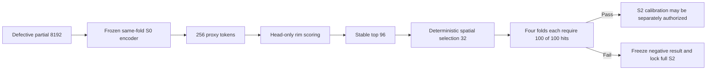

# Mamba v1.3 D3 S2 Head-only Feasibility 完整负结果报告

> 实验状态：预注册硬门控失败并冻结。本文记录的是 S2 完整训练之前的结构可行性实验，不构成候选选择，不允许据此修改参数后重跑。25-skull holdout、SkullBreak confirmation20、旧 monitor 和 official test 均未访问。

## 1. 实验目的

D3 的 S2 候选拟把 AdaPoinTr 的 256 个 coarse queries 分为 224 个全局 learned queries 和 32 个 partial-only rim-aware queries。正式训练 S2 前，协议要求回答一个更基础的问题：冻结同折 S0 encoder 后，仅训练轻量 rim-score head，是否能让最终选出的 32 个 anchor 在每一个独立 development 病例中至少包含一个 GT-positive proxy？

## 2. 数据与实验边界

| 项目 | 冻结设置 |
|---|---|
| 数据 | MUG500+ M2 synthetic defects v1 |
| Development source skulls | 100 |
| 每个来源颅骨病例数 | 4 |
| 四折 | A、B、C、D |
| 每折训练/开发病例 | 300/100 |
| 划分单位 | source skull |
| Seed | 0 |
| Encoder | 同折 S0 `ckpt-last-bncal.pth`，完全冻结并保持 eval |
| Head | `Linear(768,128) -> GELU -> Linear(128,1)` |
| Head 训练 | 50 epochs，batch size 8，AdamW，lr `1e-3`，weight decay `1e-4` |
| 训练目标 | per-case class-balanced BCE |
| 选择 | stable score top-96 后确定性空间选择 32 个原始 proxy anchor |
| Dev 使用 | 训练结束后仅评估一次 |
| 硬门控 | 每折 100/100 病例至少命中一个 GT-positive proxy |

GT rim 只用于训练标签和离线 development 评分，不进入 inference feature graph。feasibility head 明确禁止用于初始化正式 S2。

## 3. 实现修复记录

首次 fold A 执行在 head 完成 50 epochs 后、第一次 development 数据读取时停止。原因是冻结 S2 template 只在 train dataset 配置了 `reference_rim_mask`，val dataset 未配置离线评分所需的同一标签键，因此抛出 `SkullBreak GT-rim supervision is not configured`。

该问题通过 hotfix1 修复：把已冻结的 train `GT_RIM_KEY=reference_rim_mask` 复制到内存中的 val dataset 配置，仅供 one-shot development scoring 使用。修复没有改变模型参数、inference graph、head、训练 schedule、32/96 选择或硬门控。失败运行没有生成 development 指标，也没有落盘 head checkpoint，因此 fold A 按相同 seed 从初始化完整重跑。原 base lock 未覆盖，hotfix1 通过独立 receipt 绑定旧、新 runner SHA256。

## 4. 主要结果

### 4.1 硬门控

| Fold | 命中病例 | 命中率 | 门控 |
|---|---:|---:|---|
| A | 98/100 | 98% | 失败 |
| B | 96/100 | 96% | 失败 |
| C | 98/100 | 98% | 失败 |
| D | 100/100 | 100% | 通过 |
| 合计 | 392/400 | 98% | 总体失败 |

四折中只有 D 满足门控。由于预注册条件要求四折全部达到 100/100，completion receipt 正确冻结为 `failed_preregistered_hard_gate`。

### 4.2 聚合指标

| 指标 | 400 病例均值 |
|---|---:|
| Case hit rate | 0.980000 |
| Positive proxy recall | 0.275186 |
| Precision | 0.082422 |
| False-positive rate | 0.119282 |
| Selected-anchor spatial coverage | 39.486298 mm |

precision 为 0.082422，意味着 32 个 anchor 中平均约有 `2.64` 个 GT-positive proxy。positive proxy recall 只有 27.52%，说明 scorer 和固定空间选择能在绝大多数病例中找到至少一个 positive proxy，但对全部 positive support 的覆盖仍有限。

## 5. 八个未命中病例

| Fold | Case ID | Defect | Positive proxies | Coverage (mm) |
|---|---|---|---:|---:|
| A | `mug500plus__A0041__ellipsoid_small` | ellipsoid_small | 6 | 38.060414 |
| A | `mug500plus__A0313__ellipsoid_small` | ellipsoid_small | 5 | 39.538769 |
| B | `mug500plus__A0072__ellipsoid_small` | ellipsoid_small | 8 | 39.651285 |
| B | `mug500plus__A0216__ellipsoid_small` | ellipsoid_small | 9 | 41.641119 |
| B | `mug500plus__A0227__ellipsoid_medium` | ellipsoid_medium | 5 | 44.105882 |
| B | `mug500plus__A0462__ellipsoid_large` | ellipsoid_large | 14 | 39.821062 |
| C | `mug500plus__A0029__ellipsoid_medium` | ellipsoid_medium | 6 | 43.295292 |
| C | `mug500plus__A0373__ellipsoid_small` | ellipsoid_small | 7 | 43.825580 |

失败分布为 ellipsoid_small 5 例、ellipsoid_medium 2 例、ellipsoid_large 1 例，且来自 8 个不同来源颅骨。这个分布只能作描述性记录，不能用于修改候选或选择规则。

## 6. 机制分析

### 6.1 积极信号

392/400 的命中表明，partial-only frozen-S0 proxy features 中包含较强的 rim 定位信息。D 折达到 100/100，也说明 head-only 学习在部分 source-skull 划分上能够满足目标。

### 6.2 决定性负信号

八个失败病例各自仍有 5 至 14 个 GT-positive proxies。因此失败不是 grouper/encoder 完全没有生成 positive proxy，而是这些 positive proxies 没有进入最终 32 个 selected anchors。

现有主结果不能区分两个阶段：positive proxies 可能没有进入 score top-96，也可能进入 top-96 后被确定性空间选择排除。这个问题可以在明确标记为 post-hoc、selection-inert 的 replay 中描述，但不得据此改变 S2 并重新运行当前协议。

### 6.3 为什么 98% 仍然失败

S2 的目标是从结构上消除 coarse contact-support omission，而不是改善平均命中率。只要存在一个病例完全没有 positive anchor，正式 S2 仍可能在该病例中保留 coarse zero-support 风险。因而 98% 是有价值的机制信号，但不满足 safety-oriented 的全病例保证。

## 7. 正式结论

1. S2 head-only feasibility 是一个高命中率但未通过全病例安全门控的负结果。
2. 完整 S2 training、S2 gradient-ratio calibration 和任何 S2 参数扫描继续锁定。
3. 不允许调整 head、epoch、learning rate、selected query 数、candidate pool 或空间选择后重跑。
4. feasibility head checkpoints 仅用于审计，不得初始化正式 S2。
5. holdout 和所有受保护 SkullBreak split 保持未访问。

## 8. 下一步

按原协议，S1 与 S2 回答不同问题。S2 失败不阻止 S1 使用训练折数据执行预注册的 gradient-ratio weight calibration，但必须先完成本负结果归档，再创建独立、receipt-bound 的 S1 calibration 授权。

S1 后续仍必须遵守：

- 只消费每折训练数据；
- seed-0 candidate initialization，optimizer step 为零；
- 前 8 个完整 batch，batch size 8，drop-last；
- auxiliary/reconstruction gradient L2 ratio 的 8-batch median；
- 权重严格等于 `0.075 / fold_raw_ratio`，不裁剪、不手调；
- calibration 期间禁止 development、holdout 和选择结果访问；
- calibration receipt 冻结后，才可单独授权 S1 四折完整训练。

## 9. 局限性

- 只有 seed 0，不能估计 head feasibility 的跨 seed 波动；
- 100% 硬门控使结果对极少数失败高度敏感，但这是预注册的安全目标；
- 当前主分析没有保存 top-96 membership，无法定位 scorer 与 diversification 的相对责任；
- synthetic defect 到真实 craniotomy 缺损的外推尚未验证；
- 所有 failure-subgroup 观察均为描述性，不支持新的当前数据调参。
