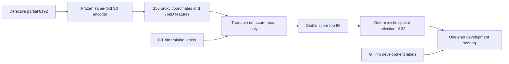

# Mamba v1.3 D3 S2 Head-only 可行性执行修订 v1

> 本修订在 S0 四折结果完成后、任何 S2 feasibility 训练或开发集输出产生前登记。它只补足原协议中未明确的执行参数，不修改 S2 科学候选、`32/96` query 规则或全病例命中硬门控。

## 1. 当前边界

S0 seed-0 已完成四折冻结，共 400 个 development 病例。S0 结果只用于确认协议规定的下一步是 S2 head-only feasibility，不用于选择本修订的轮数、学习率或 head 结构。

- 允许：同折 S0 BNCal checkpoint、同折 300 个训练病例、同折 100 个 development 病例；
- 禁止：25-skull holdout、SkullBreak 旧 monitor、confirmation20、official test；
- 当前不允许：S1 完整训练、S2 完整训练、候选选择；
- feasibility head 不得被完整 S2 初始化或复用。

## 2. 可证伪问题

在保持 S0 encoder 和 Mamba adapter 完全冻结时，只依赖 defective partial 产生的 256 个 proxy token，固定的轻量 rim-score head 能否在每一个独立 development 病例中，使 `32` 个选中 anchor 至少包含一个 GT-positive proxy？

GT rim 仅充当监督标签和离线评分真值，不进入 inference feature graph。

## 3. 冻结执行参数

### 3.1 Encoder 与特征

- 每折加载同折、同 seed 的 `S0 ckpt-last-bncal.pth`；
- 整个 S0 模型保持 `eval()`，全部参数 `requires_grad=False`；
- 不更新 BatchNorm；
- proxy feature 为 `concat(post-Mamba encoder feature, positional embedding)`，维度为 `768`；
- proxy 坐标和 token 顺序与正式 S2 前向完全一致。

### 3.2 Head 与优化

- head：`Linear(768,128) -> GELU -> Linear(128,1)`；
- seed：`0`；权重使用 `trunc_normal_(std=0.02)`，bias 为零；
- optimizer：AdamW，`lr=1e-3`，`weight_decay=1e-4`；
- 固定训练 `50` epochs，batch size `8`，`drop_last=False`；
- 每个 epoch 使用 seed-0 generator 的确定性 `randperm`；
- 无 scheduler、无 early stopping、无 checkpoint 选择；
- objective 仅为逐病例正负类各占一半权重的 balanced BCE；
- development 在第 50 epoch 完成后只评估一次。

训练折共有 300 个病例，因此每折固定执行 `50 x ceil(300/8) = 1900` 个 optimizer steps。

## 4. 选择规则和指标

先按 logit 稳定降序取前 `96` 个 proxy，再从最高分 proxy 起执行确定性最远点选择，输出 `32` 个原始 proxy anchor，不学习坐标 offset。

逐病例记录：

- `case_hit`：32 个 anchor 中至少一个为 GT-positive proxy；
- positive proxy recall：命中的 positive proxy 数除以全部 positive proxy 数；
- precision：命中的 positive proxy 数除以 32；
- false-positive rate：选中的 negative proxy 数除以全部 negative proxy 数；
- spatial coverage：32 个 anchor 各自到最近其他选中 anchor 的距离均值，并乘 manifest normalization scale 转换为 mm。

## 5. 硬门控与结果解释

每折必须达到 `100/100` 病例命中，且 A-D 四折全部通过。该规则不允许人工豁免。

- 通过：只表示 S2 可进入训练折权重校准；完整 S2 仍需新 receipt 单独授权；
- 未通过：S2 完整训练继续锁定；结果冻结为可行性负结果；
- 无论通过或失败，都不构成模型选择，也不得修改 query 数、pool 大小、head、epoch 或门控后重跑；
- S1 的训练集-only 权重校准在科学上独立，但也必须由后续 receipt 单独授权。

## 6. 可审计要求

每折输出 head-only checkpoint、逐病例 CSV、summary 和 run receipt；四折完成后生成 completion receipt。所有凭据绑定：

- 本修订 JSON；
- 原 D3 协议和 template lock；
- S0 completion receipt；
- 四个 S0 BNCal checkpoint 及对应 run record；
- 模型 proxy-token 接口、loss/query helper、训练工具与运行脚本。

所有长任务在 tmux 中运行，训练与特征提取使用 tqdm；holdout 标志始终为 `false`。
