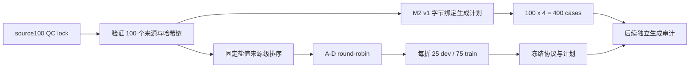

# Mamba v1.4 D4 MUG500+ M2 合成生成与来源级四折预注册协议

> 状态：协议与来源级四折规则已冻结，400 个派生病例尚未生成。本阶段不训练模型、不选择候选、不访问任何保护集。

## 1. 目的

D4 已冻结 100 个与旧 D3 healthy125 完全独立、结构 QC 全部通过的 MUG500+ 健康来源颅骨。本协议在查看任何 D4 派生几何或模型结果之前，固定合成缺损生成规则和四折划分，消除按生成难度或结果重新分折的自由度。

## 2. 冻结输入

- 输入只能来自 `mamba-v14-d4-mug500plus-source100-final-qc-lock-v1`。
- 必须验证 source100 锁的 `files.sha256`、receipt 和 assets CSV 的固定 SHA256。
- 来源必须恰好 100 个、全部 QC 通过，D4 内部重复及与 D3 healthy125 的重叠必须均为 0。
- 来源 ID、资产 SHA256、表面指纹及 portable path 在生成前全部冻结。

## 3. M2 生成规则

D4 复用既有 M2 v1 引擎的以下部分，且要求字节/哈希绑定：

- 三角形面积加权表面采样；
- Fibonacci sphere 位置候选及固定重试规则；
- `ellipsoid_small`、`ellipsoid_medium`、`ellipsoid_large`、`irregular_medium` 四类缺损；
- 缺损面积、三角形数量、reference rim 及有限值硬门；
- 仅由 defective partial 计算的共享归一化。

D4 只改变协议域、随机种子域、来源数据集名称和病例总数。每个来源固定生成 4 个病例，总计 `100 x 4 = 400`；任一来源缺少一种缺损即判定整次生成审计失败。

## 4. 来源级四折

1. 以 source skull 为唯一划分单位。
2. 使用固定盐值计算 `SHA256(salt|fold|source_id)`。
3. 对 100 个来源按哈希键和 source ID 排序。
4. 按顺序 round-robin 分配到 A、B、C、D。
5. 每折固定 `25 dev / 75 train` 来源，即 `100 dev / 300 train` 病例。
6. 每个来源只作为一次 dev，另外三折作为 train。
7. 同一来源的 4 个缺损病例始终属于同一折，不允许病例级拆分。

## 5. 权限边界

协议锁通过后只授权执行冻结的 D4 M2 生成。生成工具不得自动训练、选择或访问保护集。生成完成后必须另行执行 400 例完整性、NPZ、几何硬门、哈希和折叠重联审计；该审计通过前，D4-A feasibility 和 T0/T1/T2 训练均保持关闭。

禁止根据生成失败率、缺损形态、模型指标或人工观察修改来源、seed、四折分配或 M2 v1 几何参数。任何失败必须原样冻结并通过单独 amendment 处理。
