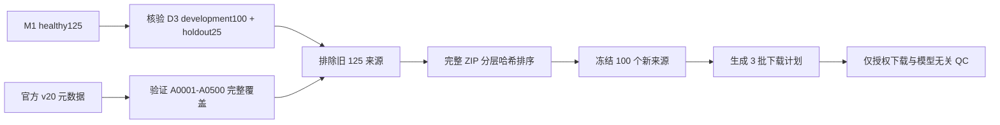

# Mamba v1.4 D4 MUG500+ 新来源 100 例获取预注册协议

> 状态：来源选择规则已预注册，数据载荷尚未下载。本阶段只冻结来源 ID 与官方下载计划，不生成缺损、不训练模型、不访问任何保护集。

## 1. 目的

P-D3 已把 S2 feasibility 的 8 个漏检分解为 `2` 个 top-96 ranking miss 和 `6` 个 selector drop。D4 将检验新的 contact-support representation，但不能继续复用 D3 的 100 个 development 来源，也不能动用已锁定的 25 个 holdout 来源。因此，D4 首先需要一个结果无关、可复现、来源级完全独立的新 100-skull 数据锁。

本协议只回答一个问题：**在查看新几何、QC 结果或模型输出之前，如何从 MUG500+ v20 的未使用健康 A-series 来源中确定 100 个 D4 来源颅骨。**

## 2. 冻结输入

- 官方 Figshare article：`9616319`，version `20`。
- 官方 `article` 与 `files` JSON 必须匹配协议中写死的 SHA256。
- D3 旧来源必须由两条独立凭据共同确认：
  - M1 `healthy125_case_ids.txt`；
  - D3 `development100 + locked holdout25`。
- 上述两个集合必须完全相等，且 development 与 holdout 必须互斥；否则硬失败。
- 父级 D4 协议固定在 commit `a5e6f60067599cc4f1cf81b22975d1adade9e19a` 和 tag `mamba-adapter-v14-pd3-s2-failure-decomposition-seed0`。
- 最终 receipt 必须记录本次 selection implementation 与 hard-failure test 脚本的 SHA256；实现漂移后不得覆盖既有锁。

## 3. 来源选择

1. 只允许官方健康 `A0001-A0500` ZIP。
2. `craniotomy skull.zip`、B-series、PNG、NRRD 和其他非健康归档不进入候选池。
3. 选择单位是完整官方 ZIP，不从 ZIP 内部挑选个别来源。
4. 若一个 ZIP 与旧 125 来源部分重叠，则直接硬失败；不得静默取剩余成员。
5. 未使用 ZIP 按 A-series 编号划入十个固定的 50-skull 区间。
6. 每个区间内部使用写死盐值和归档名、MD5、字节数计算 SHA256 顺序。
7. 按区间 `0..9` 逐层交错扫描；完整加入后不超过 100 skull 的 ZIP 才被接受。
8. 只有累计数恰好达到 100 才能成功；不得人工换例、补例或基于 QC 难度改例。

## 4. 下载与 QC 边界

- 目标为 3 批，每批约 40 个来源，始终保持 ZIP 边界。
- 下载后必须同时核验官方字节数和 MD5。
- 只提取选中来源的 `Axxxx_clear.stl`。
- QC 只能检查文件完整性、三角网格可读性、非空几何、哈希和既定几何质量门槛。
- QC 失败不得自动替补；必须冻结失败并另行修订协议。

## 5. 本锁授权与禁止事项

本锁通过后仅授权：

- 下载冻结的 17 个官方 ZIP；
- 提取冻结的 100 个 clear STL；
- 运行模型无关 QC。

本锁不授权：

- 生成 D4 synthetic defects；
- 训练或选择 T0/T1/T2；
- 访问旧 D3 holdout、SkullBreak confirmation20 或 official test；
- 根据下载后的形状、QC 结果或模型表现修改来源名单。

后续顺序固定为：载荷下载与 QC，D4 M2 数据生成与来源级四折锁，D4-A out-of-fold proposal feasibility，最后才可能进入 T0/T1/T2 训练。
