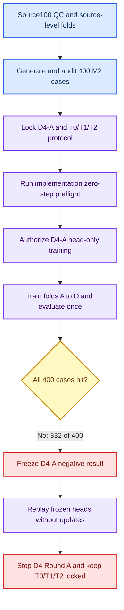
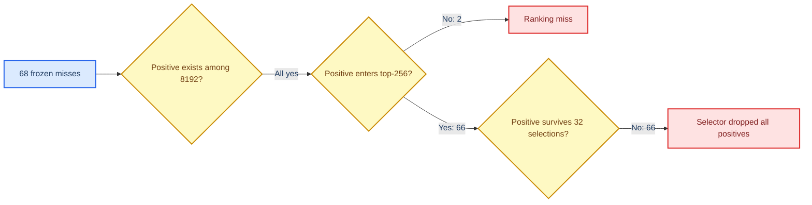
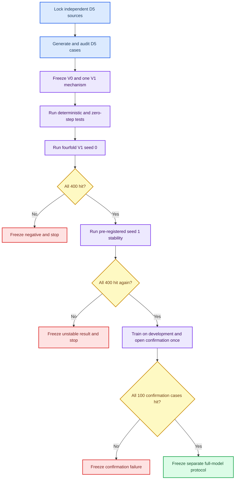

# Mamba v1.4 D4-A 完整实验、负结果分析与下一阶段建议

_MUG500+ D4 source100 · head-only non-leaky contact-support feasibility · seed 0 · 2026-08-30_

---

## 执行摘要

D4-A 的目标不是直接训练完整颅骨修复网络，而是先回答一个更严格的前置问题：仅依赖缺损颅骨 partial point cloud 的非泄漏几何信息，能否为每个病例稳定选出至少一个 reference-rim positive candidate，从而为后续 32 个 rim-aware query 提供可靠 contact support。

实验在 100 个相互独立的 MUG500+ 健康来源颅骨上生成 400 个冻结合成缺损病例。每个来源生成 `ellipsoid_large`、`ellipsoid_medium`、`ellipsoid_small` 和 `irregular_medium` 四种病例；四例始终绑定同一来源折。D4-A 使用每点 13 维非泄漏描述符、一个 `13-128-64-1` proposal head，以及“mandatory top-8 + top-256 内 conditioned deterministic FPS-24”的固定 selector。四折均按 75 个训练来源和 25 个开发来源执行 head-only 训练，每折 50 epochs、1900 optimizer steps，并只在最终 epoch 后打开一次 out-of-fold development 数据。

四折共命中 `332/400` 例，漏失 68 例，未满足预注册的 `400/400` 全病例安全门控。因此 D4-A 被正式冻结为负结果，D4 `T0/T1/T2` Round A、候选选择及所有保护数据访问均保持禁止。结果不是数值错误或正候选不存在造成的：所有 required outputs 均有限，400 个病例均存在 8 至 73 个 positive candidate。

随后执行的 observation-only post-hoc replay 精确复现原 `332/400` 结果，并将 68 个漏失分解为：2 例 positive 未进入 top-256，66 例 positive 已进入 top-256 但被固定 top-8 + FPS-24 selector 全部丢弃。该结果表明 D4-A 的主要瓶颈位于“局部描述符排序能力、point-wise 训练目标与 set-level 选择目标之间的不一致”，而不是候选点缺失。下一阶段不应继续在 D4 development 上扫描 top-K、pool size 或 loss 权重；建议建立完全独立的 D5 source-skull 数据锁，验证一个新的 context-aware、set-level-aligned support allocation 机制。

| 项目 | 冻结结论 |
| --- | --- |
| D4-A all-case gate | `False` |
| Out-of-fold hits | `332/400`，83.0% |
| Misses | 68 |
| Ranking miss outside top-256 | 2 |
| Selector dropped all pool-positive | 66 |
| T0/T1/T2 | 未物化、未训练、继续禁止 |
| Protected data | 未访问 |
| 正式 Git commit | `93a047f03245f7ca25f2281c71442197bad2a980` |
| Annotated tag | `mamba-adapter-v14-d4a-negative-posthoc-seed0` |
| 本地归档 SHA256 | `2f720557fccbc0d03a50b3c2e96605ee66bdcd7f56e2ad1da67073ca3a87ab5d` |

## 研究背景与问题定义

### 前序证据

D2、D2.1 和 D2.2 已表明，仅在 coarse/fine 输出上增加全局几何 guard、局部 rim loss 或 contact-support loss，不能可靠消除 contact support 灾难。D3 进一步把问题拆成 dense contact objective 与 non-leaky rim-aware query allocation 两条路径。D3 的 S1 dense objective 仅获得有限改善，S2 head-only feasibility 在 400 例中命中 392 例，仍未通过严格安全门控。

P-D3 对 S2 的 8 个漏失进行冻结重放后发现：2 例是 top-96 ranking miss，6 例是 selector 丢弃全部 positive。由此，D4 将研究重点从“继续调 completion loss”转向“在更高分辨率 partial geometry 上验证 query support allocation 本身是否可行”。

### 核心研究问题

本实验回答三个问题：

1. **RQ1：候选存在性** — 在冻结的 8192 个 partial points 中，所有病例是否都存在 reference-rim positive candidate？
2. **RQ2：非泄漏排序与选择** — 仅使用 partial geometry 的 13 维描述符和小型 proposal head，固定 32-query selector 能否在每个 out-of-fold 病例中保留至少一个 positive？
3. **RQ3：失败阶段** — 若 all-case gate 失败，主要原因是 positive 未进入排序池，还是 positive 进入池后被 selector 丢弃？

### 结论等级

| 等级 | 可用于什么结论 | 本报告中的内容 |
| --- | --- | --- |
| 预注册结果 | 决定 D4-A 是否通过以及后续训练是否合法 | `332/400`、all-case gate 失败、T0/T1/T2 禁止 |
| Post-hoc 解释 | 解释失败机制，不改变门控或授权 | `2/66` 阶段分解、recall@K、来源聚集分析 |
| 下一阶段建议 | 形成新的可证伪假设，必须在新协议和新数据上验证 | D5 context-aware set-level allocation |

## 实验谱系与执行流程

### 冻结谱系

| 层级 | 冻结对象 | 关键凭据 |
| --- | --- | --- |
| 数据生成 | D4 M2 generation audit | 100 sources、400 cases、哈希与几何门控全部通过 |
| 候选协议 | D4 candidate/training protocol v1 | commit `581ecf4` 后的冻结协议与 12 个不可运行模板 |
| 实现预检 | D4-A zero-step preflight | commit/tag `c59eece` / `mamba-adapter-v14-d4a-zero-step-preflight-v1` |
| 训练授权 | D4-A training authorization v1 | 四折 config、实现哈希和单次 dev 规则绑定 |
| 负结果与解释 | D4-A completion + post-hoc | commit/tag `93a047f` / `mamba-adapter-v14-d4a-negative-posthoc-seed0` |

## 数据、折划分与完整性审计

### 数据规模

| 项目 | 数量或范围 |
| --- | ---: |
| 来源颅骨 | 100 |
| 每来源病例 | 4 |
| 派生病例 | 400 |
| 缺损族 | 4，每族 100 例 |
| 四折病例 | A/B/C/D 各 100 例 |
| 每折训练来源/病例 | 75 / 300 |
| 每折开发来源/病例 | 25 / 100 |
| Reference-rim positive points | min 8，mean 24.5425，max 73 |
| Removed surface area fraction | min 0.00912，mean 0.03767，max 0.20116 |

### 防泄漏约束

- 四个缺损病例始终与其来源颅骨绑定在同一折
- 折划分单位是 source skull，而不是单个病例
- 同一折的训练和开发来源互斥
- proposal 特征只来自 normalized partial point cloud
- reference-rim mask 仅用于训练标签和冻结开发门控，不进入推理输入
- MUG500+ D3 holdout、SkullBreak confirmation20、old monitor、official test 及 SkullFix selection 均未访问

### 生成审计结果

独立 generation audit 验证了 400 个 NPZ 与 portable manifest 的双射、来源 SHA256、派生 SHA256 唯一性、四缺损族绑定、折绑定、shape/dtype/finite/normalization 以及 reference-rim 几何门控。审计状态为 `generation_integrity_passed_training_and_selection_still_locked`，说明数据完整性通过，但审计本身不授权训练。

## D4-A 方法与冻结协议

### 候选表示

每个病例保留原始冻结顺序中的全部 8192 个 normalized partial points。每点构建 13 维描述符：

| 组成 | 维度 | 含义 |
| --- | ---: | --- |
| Normalized XYZ | 3 | 归一化空间坐标 |
| Radial norm | 1 | 相对归一化原点的半径 |
| kNN distance mean/std/max | 3 | `k=16` 局部距离统计 |
| Offset to kNN centroid | 3 | 点到局部质心的偏移 |
| Covariance eigenvalues / trace | 3 | 升序归一化局部协方差谱 |
| 合计 | 13 | 全部由 partial geometry 计算 |

距离使用 normalized Euclidean space，自邻居排除，数值稳定项为 `1e-8`，不使用数据增强。

### Proposal head

- 网络：`13 -> 128 -> GELU -> 64 -> GELU -> 1`
- 参数量：10,113
- Dropout：0
- 损失：case-balanced binary cross entropy
- 训练对象：仅 proposal head
- Backbone/completion checkpoint：不加载

该设计刻意把 feasibility 与完整 AdaPoinTr/Mamba completion network 解耦：若轻量 head 连 32 个 query 的 support existence 都无法保证，则不允许投入 12 次完整 T0/T1/T2 四折训练。

### 固定 selector

1. 对 8192 个 candidate 计算 score，candidate-index ascending 作为 score tie-break
2. 保留 score 最高的 8 点
3. 取 score-ranked top-256 作为 diversity pool
4. 在已保留 top-8 的条件下执行 deterministic Euclidean FPS，再选 24 点
5. 总计输出 32 个 rim-query anchors

FPS distance tie-break 依次使用 score rank 和 candidate index。协议禁止在结果出来后扫描 candidate count、top-score quota、pool size、kNN 或 query budget。

### 训练与评估预算

| 超参数 | 冻结值 |
| --- | --- |
| Seed | 0 |
| Folds | A、B、C、D |
| Epochs per fold | 50 |
| Batch size | 8 |
| Optimizer | AdamW |
| Learning rate | `1e-3` |
| Weight decay | `1e-4` |
| Scheduler | CosineAnnealingLR |
| Minimum learning rate | `1e-5` |
| Gradient clip norm | 1.0 |
| Optimizer steps per fold | 1900 |
| Total optimizer steps | 7600 |
| Checkpoint policy | final epoch only |
| Development evaluation | 每折 final epoch 后一次 |
| Early stopping | 禁止 |

### All-case hard gate

D4-A 只有同时满足以下条件才能通过：

- 四折精确覆盖全部 400 个 out-of-fold development 病例
- 每例均存在至少一个 oracle positive candidate
- 每例最终 32 个 selected points 中至少包含一个 positive
- 所有 required outputs 有限
- 四折全部通过
- 不访问任何保护数据

任一病例漏失即冻结 D4-A 为负结果，并禁止 D4 `T0/T1/T2` Round A。

## 实现预检与运行环境

### Zero-step preflight

Zero-step 阶段完成了以下检查：

- chunked 13D descriptor 与 full reference 一致
- `13-128-64-1` head 的 forward/backward 有限
- case-balanced BCE backward 有限
- top-8、top-256 与 conditioned FPS-24 tie rule 确定
- 四折各读取一个 training probe，共 4 个 backward passes
- optimizer 未构造，optimizer steps 为 0
- checkpoint 未读写，model updates 为 0
- dev cases accessed 为 0，protected data accessed 为 `false`

只有 zero-step receipt、实现 SHA256 与全部父级凭据匹配后，才单独签发 D4-A head-only training authorization。

### 运行环境

| 项目 | 环境 |
| --- | --- |
| OS | Linux 5.4.0-216-generic，glibc 2.31 |
| Python | 3.10.20，conda-forge |
| PyTorch | 2.4.1+cu118 |
| CUDA | 11.8 |
| cuDNN | 90100 |
| NumPy | 2.2.6 |
| GPU | NVIDIA GeForce RTX 4090 D |

服务器部署树在运行时不含 `.git` 元数据，因此归档环境凭据正确记录 `git_repository=false`。实验结束后，代码、协议、报告和归档验证工具已在本地正式 Git 工作树中筛选并冻结。

## 预注册实验结果

### 四折结果

| Fold | Train loss | Max preclip grad norm | Hits | Misses | Hit rate | Fold gate |
| --- | ---: | ---: | ---: | ---: | ---: | --- |
| A | 0.484576 | 1.118227 | 85 | 15 | 85% | fail |
| B | 0.476458 | 1.004213 | 80 | 20 | 80% | fail |
| C | 0.481850 | 1.073239 | 83 | 17 | 83% | fail |
| D | 0.487604 | 1.040012 | 84 | 16 | 84% | fail |
| 合计 | — | — | 332 | 68 | 83% | fail |

四折结果相对接近，命中率范围为 80% 至 85%。这降低了“单一异常折或一次明显训练崩溃导致总体失败”的可能性。所有折均完成 1900 optimizer steps，只保留 final-epoch head，且所有 required outputs 有限。

### 按缺损族分层

| 缺损族 | Hits | Misses | Hit rate | Miss rate |
| --- | ---: | ---: | ---: | ---: |
| `ellipsoid_large` | 89 | 11 | 89% | 11% |
| `ellipsoid_medium` | 77 | 23 | 77% | 23% |
| `ellipsoid_small` | 75 | 25 | 75% | 25% |
| `irregular_medium` | 91 | 9 | 91% | 9% |

`ellipsoid_small` 与 `ellipsoid_medium` 的漏失最多，提示局部尺度较小或边界信号较弱时，13 维局部描述符更难稳定排序。但四类均存在漏失，因此不能把问题归结为单一缺损族。

### 候选和选择统计

| 指标 | 全部 400 例 | 332 个 hit | 68 个 miss |
| --- | --- | --- | --- |
| Positive candidate count min/median/mean/max | 8 / 22 / 24.5425 / 73 | 8 / 22 / 24.5181 / 73 | 10 / 22 / 24.6618 / 59 |
| Selected positive count min/median/mean/max | 0 / 2 / 1.815 / 8 | 1 / 2 / 2.1867 / 8 | 0 / 0 / 0 / 0 |

Hit 与 miss 病例的 positive candidate count 中位数均为 22，均值也非常接近。由此可以排除“miss 主要是因为输入候选中 positive 极少”这一简单解释。

## Post-hoc failure decomposition

### 分析边界

Post-hoc replay 加载四个冻结 final head checkpoint，对相同 400 个 out-of-fold development 病例重新计算 logits、top-256、top-8 与 FPS-24。Replay 的 optimizer steps 和 model updates 均为 0，逐例 selected-positive count 与原结果完全一致。

该分析只解释失败阶段：不改变原 `332/400` gate，不授权阈值修订，不授权 D4 `T0/T1/T2`，不进行候选选择，也不访问保护数据。

### 失败阶段结果

| Failure stage | Cases | 占全部 miss | 占全部病例 |
| --- | ---: | ---: | ---: |
| `ranking_miss_top256` | 2 | 2.94% | 0.50% |
| `selector_dropped_all_pool_positive` | 66 | 97.06% | 16.50% |

两个 ranking miss 为：

- `mug500plus__A0094__irregular_medium`，fold C，best positive rank 291
- `mug500plus__A0292__ellipsoid_small`，fold A，best positive rank 312

### Miss 排序统计

| 指标 | Min | Median | Mean | Max |
| --- | ---: | ---: | ---: | ---: |
| Positive candidates among 8192 | 10 | 22 | 24.6618 | 59 |
| Positive candidates in top-256 | 0 | 4.5 | 5.0441 | 12 |
| Best positive rank | 9 | 22 | 47.8676 | 312 |
| Positive in mandatory top-8 | 0 | 0 | 0 | 0 |
| Positive in FPS-24 output | 0 | 0 | 0 | 0 |

66 个 selector miss 的 positive 已进入 top-256，但 mandatory top-8 未命中，纯坐标 FPS-24 也没有保留任何 positive。扩大 top-256 pool 只能影响 2 个 ranking miss，无法解释或解决主要失败。

### Post-hoc recall@K

下表只用于设计诊断，不是预注册门控结果：

| Frozen ranking K | 至少一个 positive 的病例 | Recall |
| ---: | ---: | ---: |
| 8 | 279/400 | 69.75% |
| 16 | 329/400 | 82.25% |
| 24 | 348/400 | 87.00% |
| 32 | 356/400 | 89.00% |
| 64 | 381/400 | 95.25% |
| 96 | 387/400 | 96.75% |
| 128 | 392/400 | 98.00% |
| 256 | 398/400 | 99.50% |

现有 top-8 命中 279 例，FPS-24 额外挽救 53 例，得到 332 例。若对冻结 logits 直接取 top-32，聚合命中会增至 356 例，但它会挽救当前 42 个 miss，同时丢失当前 selector 已命中的 18 例。因此“把 8+24 简单改成 top-32”虽然总体更好，却仍有 44 个漏失，也不是逐例支配现有 selector 的安全替代。

### 来源级聚集

68 个 miss 来自 46 个 source skull，其中：

- 26 个来源各有 1 个 miss
- 18 个来源各有 2 个 miss
- 2 个来源各有 3 个 miss
- 20 个来源属于 multi-miss source

这说明失败既有病例级因素，也包含来源颅骨级难度；下一阶段必须继续以 source skull 为划分和统计单位。

## 结果解释

### 可以支持的结论

1. **候选存在性不是主要瓶颈。** 所有 400 例都有 positive candidate，68 个 miss 也有 10 至 59 个 positive。
2. **D4-A 的 non-leaky 13D point-wise ranker 不足以满足全病例安全门控。** 即使 top-256 recall 达到 99.5%，top-32 recall 仍只有 89.0%。
3. **固定几何 diversification 不具备 support-preserving 性。** 66 例中 positive 已在 top-256，但 conditioned Euclidean FPS 未保留任何 positive。
4. **训练目标与实际门控存在层级错配。** Head 使用 point-wise BCE，而最终 gate 是 32 点集合上的“至少一个 positive”事件；point classification 变好不等于 selected set 的 existence risk 被最小化。
5. **失败不是单折偶然现象。** 四折命中率均在 80% 至 85%，且四类缺损都出现 miss。

### 不能支持的结论

- 不能据此认定 rim-aware query allocation 在原则上无效；D4-A 只否定当前 13D ranker 和固定 selector 的组合
- 不能据此比较 T0、T1 和 T2 的 completion quality，因为它们从未合法物化或训练
- 不能把 post-hoc recall@K 用作修改 D4 gate 或重跑 D4 的依据
- 不能推广到真实临床 craniotomy、SkullBreak official test 或其他保护数据
- 不能把 seed-0 结果解释为随机种子稳定性证据

### 主要机制判断

D4-A 的失败不是单一 selector 参数问题。排序本身在 top-32 下仍漏 44 例，而现有 FPS 又同时挽救部分低排名 positive 并丢弃大量 pool-positive。真正需要解决的是：如何利用 partial-only 上下文学习一个与“32 点集合至少保留一个 support”直接对齐的表示和选择过程。

## 有效性、局限与风险

| 类型 | 局限或风险 | 对结论的影响 |
| --- | --- | --- |
| 数据 | 400 例为健康颅骨上的合成缺损 | 不能直接外推真实手术缺损 |
| 模型 | 只训练 10,113 参数 proposal head | 只验证 allocation feasibility，不代表完整网络上限 |
| 随机性 | 仅 seed 0 | 未验证训练稳定性 |
| Gate | `400/400` 极严格 | 适合作为安全前置门控，但不等同平均性能指标 |
| Post-hoc | recall@K 和 `2/66` 来自已观察 D4 development | 只能用于提出新假设，不能在 D4 上重新选规则 |
| 表征 | 13D 描述符主要是单尺度局部几何 | 可能缺少缺损边界的多尺度与全局上下文 |
| Selector | FPS 仅按归一化坐标做几何多样化 | 不保证保留高 support probability 区域 |

## 冻结、归档与当前状态

### Git 固化

- 分支：`feature/mamba-v12-mechanism-dev`
- Zero-step commit：`c59eece3ca37e5d6a1bfa755013b5721f04fac2d`
- Zero-step annotated tag：`mamba-adapter-v14-d4a-zero-step-preflight-v1`
- 完整负结果 commit：`93a047f03245f7ca25f2281c71442197bad2a980`
- 完整负结果 annotated tag：`mamba-adapter-v14-d4a-negative-posthoc-seed0`
- GitHub 远端分支与两个 tag 已完成对象级 SHA 核验

### 本地可信归档

- 路径：`E:\ResearchBackups\AdaPoinTr\MUG500plus_mamba_v14_D4A_negative_posthoc_seed0\server_archive`
- 文件：`mamba_v14_d4a_head_only_negative_posthoc_seed0_v1.tar.gz`
- Bytes：815,446
- SHA256：`2f720557fccbc0d03a50b3c2e96605ee66bdcd7f56e2ad1da67073ca3a87ab5d`
- 内容：4 个 final head、fold receipts、completion、post-hoc、协议、代码和环境凭据
- 排除：400 个 derived NPZ 和保护数据

### Checkpoint 凭据

| Fold | Final head SHA256 |
| --- | --- |
| A | `a20e1956ca666ec9e67542b2793bd54c94a71f68fe5bd992fcdf78dfc958779c` |
| B | `3d55dbe057b1e3511c0f62444c9521594dc5de0512047f673916b0aa5ba47e8c` |
| C | `0c67e11525dbf32cce602553611ab8f8c9d85a1d057a6f20fe95639c56fdb64c` |
| D | `ed0ed1fe1fe3ad158d171a7566110900cda23814fd7473e2c51d446e93731e4e` |

本地 `verification_restore`、服务器归档副本和服务器 4 个 head checkpoint 已在最终归档与 GitHub 推送验证后删除。服务器继续保留 fold metrics、run receipts、completion、post-hoc、协议、报告和清理凭据。

## 下一阶段实验建议

### 总体决定

当前 D4 Round A 应保持停止状态，不得重新授权 `T0/T1/T2`，也不得在 D4 development 上扫描 top-K、FPS quota、pool size、kNN、loss weight 或 seed 来寻找通过规则。

建议新建独立阶段：**Mamba v1.5 D5 context-aware set-level support allocation**。D5 不是 D4 的阈值修订，而是新数据、新候选编号、新协议和新门控下的机制检验。

### 新的可证伪假设

> 若 proposal representation 同时包含 partial-only 多尺度局部上下文，并以与 32-point set existence 对齐的 listwise/set-level 目标训练，那么在不使用 GT 作为推理输入的前提下，可以在完全独立来源上实现稳定的 `selected-32 contains positive`。

该假设包含两个必要部分：

1. **Context-aware ranking** — 解决冻结 ranker 在 top-32 下仍漏 44 例的问题
2. **Set-level-aligned selection** — 解决 point-wise BCE 与 final selected-set gate 的目标错配

只改变 selector 而保留当前 ranker，或只增加 point-wise loss 权重，都不足以由 D4 证据支持。

### 推荐数据设计

从未用于 D3/D4 的 MUG500+ 来源中重新冻结：

| Partition | 推荐来源数 | 推荐病例数 | 用途 |
| --- | ---: | ---: | --- |
| D5 development | 100 | 400 | source-level 四折开发与 seed 稳定性 |
| D5 confirmation | 25 | 100 | 协议完全冻结后的一次性独立确认 |

要求：

- 与 D3 source125、D4 source100 完全来源互斥
- 每来源仍生成四种冻结缺损族，以隔离 representation/selection 改动
- source skull 仍是折划分、bootstrap 和配对统计单位
- confirmation 在 development 结果、代码和门控全部冻结前不可访问
- 只提取所需 clear STL，生成和审计完成后可按现有归档流程删除服务器源 STL

### 推荐候选

为避免多重扫描，D5 feasibility 只预注册一个 reference 和一个 experimental candidate：

| Candidate | 作用 | 关键定义 |
| --- | --- | --- |
| `V0` | 新数据上的冻结参考 | 精确复现 D4-A 13D head 与 8+24 selector，不参与获胜排名 |
| `V1` | 唯一实验候选 | Partial-only multiscale context encoder + set-level-aligned top-32 support allocation |

`V1` 建议采用：

- 保留 D4 的 13D 特征作为低层输入
- 增加冻结定义的多尺度 partial-only neighborhood context，例如 `k=16/32`
- 增加只由 partial cloud 计算的全局位置/尺度上下文
- 使用轻量共享 local graph/PointNet block，避免加载 completion backbone
- 将训练目标从单独 point-wise BCE 扩展为“point calibration + pre-registered top-32 positive-mass/listwise margin”
- 最终 32 个 support queries 与训练的 top-32 set-level 目标严格对齐
- 不在 D4 上选择层数、K、quota 或 loss 权重；所有值必须在 D5 数据打开前冻结

### 分阶段执行

### Feasibility hard gates

建议 D5-A 继续使用安全前置门控，而不是平均 recall：

1. 400 个 development OOF 病例精确配对且全部 finite
2. 每例均存在 oracle positive candidate
3. `V1 selected-32 contains positive = 400/400` at seed 0
4. 仅当 seed 0 通过，才运行预注册 seed 1；seed 1 也必须 `400/400`
5. 两个 seed 均通过后，冻结实现并训练 development-all final head
6. 一次性打开 25-source confirmation，要求 `100/100`
7. 任何阶段失败立即冻结负结果，不改门控、不换 seed、不调 quota

同时报告但不用于放宽门控的诊断指标应包括：recall@8/16/32/64/128/256、selected positive count、best positive rank、来源级 miss 聚集和四缺损族分层。

### Full-model 阶段的授权条件

只有 D5-A development 双 seed 与独立 confirmation 全部通过后，才另行预注册完整 completion 候选。新候选必须使用新的 D5 编号，不能复活 D4 `T0/T1/T2`。

完整模型至少应比较：

- 新协议下的 same-seed/same-fold reference completion baseline
- 224 global queries + 32 frozen V1 support queries 的唯一实验候选

完整模型 hard gates 应继续包括：

- 所有 required metrics finite
- dense zero-contact at 2 mm 为 0
- disaster count 不高于同折 baseline
- contact relevance directional event vector 不劣于 baseline
- final CD/HD95/NSD 非劣效
- latency、参数量和 peak GPU memory 在预注册上限内

### 失败后的替代路线

若 context-aware `V1` 在独立 D5 source data 上仍不能通过 `400/400`，应停止 per-point ranking + fixed 32 selection 路线。下一条机制路线应转为显式边界结构表示，例如 partial-surface graph boundary segmentation、局部 patch proposal 或 voxel/mesh context model，而不是继续扫描 MLP、top-K 或 loss 权重。

## 最终结论

D4-A 是一个信息量充分的负结果。它证明：高分辨率 8192-point candidate pool 中并不缺少 contact-support positive，但当前 13D non-leaky point representation、point-wise BCE 与固定 top-8 + FPS-24 selector 的组合无法提供全病例安全保证。四折 `332/400` 和精确重放的 `2/66` 分解共同把问题定位到 ranking 与 set selection 的接口。

因此，下一阶段的正确动作不是重新运行 D4 或放宽 `400/400` 门控，而是在全新来源数据上预注册一个 context-aware、set-level-aligned 的 D5 feasibility experiment。只有该前置机制在双 seed development 和一次性独立 confirmation 上均达到全病例命中，才值得启动完整 AdaPoinTr/Mamba completion training。

## 冻结证据索引

- [D4 candidate/training protocol](mamba_v14_d4_candidate_training_protocol_v1.json)
- [D4 candidate/training preregistration](mamba_v14_d4_candidate_training_preregistered_protocol_zh.md)
- [D4-A zero-step protocol](mamba_v14_d4a_zero_step_preflight_protocol_v1.json)
- [D4-A zero-step result](mamba_v14_d4a_implementation_zero_step_preflight_result_zh.md)
- [D4-A training authorization protocol](mamba_v14_d4a_training_authorization_protocol_v1.json)
- [D4-A training authorization report](mamba_v14_d4a_training_authorization_preregistered_protocol_zh.md)
- [D4-A frozen negative result](mamba_v14_d4a_head_only_feasibility_complete_negative_result_zh.md)
- [D4-A post-hoc protocol](mamba_v14_d4a_failure_decomposition_posthoc_protocol_v1.json)
- [D4 M2 generation audit result](mamba_v14_d4_mug500plus_m2_generation_audit_result_zh.md)
- [P-D3 S2 failure decomposition](mamba_v14_pd3_s2_failure_decomposition_result_zh.md)

---

_报告生成日期：2026-08-30。本文是对已冻结 D4-A 证据的综合记录；其下一阶段建议尚不构成 D5 训练授权。_
