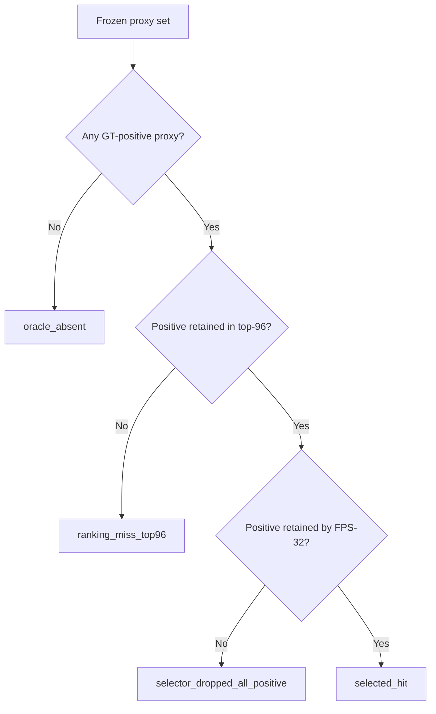

# Mamba v1.4 P-D3 S2 failure decomposition 正式结果报告

_MUG500+ D3 S2 head-only feasibility 的 selection-inert 事后诊断，seed 0，冻结日期 2026-08-28_

---

> 本报告只回答冻结 S2 feasibility 的 8 个 miss 在哪一阶段丢失 contact-support。它不重开 D3，不选择 D4 的 candidate、K、pool、scorer 或 selector，也不授权 seed 1、holdout、confirmation20 或 official test。

## 实验定位

P-D3 位于 D3 Round-A 完整负结果和 D4 新数据实验之间。D3 已经冻结为 `winner=null`：S0/S1 未通过硬门，S2 head-only feasibility 在 400 个 development cases 上命中 `392` 个、漏失 `8` 个，因并非所有折通过而禁止 full S2。P-D3 不训练模型，只对冻结 S2 路径进行 exact replay 和阶段归因。

本阶段检验三个预先定义、互斥且穷尽的失败位置：

1. `oracle_absent`：冻结 proxy set 中不存在 GT-positive proxy；
2. `ranking_miss_top96`：存在 GT-positive proxy，但冻结 scorer 的 top-96 中没有 positive；
3. `selector_dropped_all_positive`：top-96 中存在 positive，但冻结 FPS-32 selector 未保留任何 positive。

若最终选择中至少保留一个 positive，则记为 `selected_hit`。

## 冻结输入与方法

| 项目 | 冻结值 |
|---|---|
| 父 Git commit | `02476c6723d3738bd158c24cdcf7fd2909ecf63a` |
| 父 Git tag | `mamba-adapter-v13-d3-round-a-negative-result-mug500plus-seed0` |
| P-D3 overlay SHA256 | `774dfd4f3d9e66b3de2f9f20ba72bf4c37bff45e19780f4c5ceb1b31168e7bac` |
| 数据范围 | D3 development，4 folds，400 cases |
| checkpoint | 4 个冻结 S0 BNCal checkpoint |
| proposal head | 4 个冻结 S2 head-only checkpoint |
| scorer pool | 冻结 top-96 |
| selector | 冻结 deterministic FPS-32 |
| 模型更新 | `0` |
| optimizer steps | `0` |
| 保护数据访问 | 全部为 `false` |

四个 S0 BNCal checkpoint 在 replay 前按冻结 receipt 的 SHA256 恢复并核验。每折加载相同折的 S0 checkpoint 和 S2 head-only checkpoint；模型参数保持只读，逐病例复现原冻结 `case_hit`、positive proxy count 和 selected-positive count。replay 与冻结 per-case 结果要求完全一致，否则整个 P-D3 失败。

诊断额外记录 positive proxy fraction、best positive rank、top-32/64/96/128 positive count、top-96 与 FPS-32 retention、GT-rim 到全部 proxy 和最终 anchors 的 P50/P95，以及 2/5/10 mm Euclidean coverage。由于当前点云产物没有可审计的 rim mesh adjacency，本报告不声称 geodesic segment coverage。

## 数据完整性与锁定状态

| 检查项 | 结果 |
|---|---:|
| 总病例数 | 400 |
| 唯一病例数 | 400 |
| 冻结命中复现 | 392 |
| 冻结 miss 复现 | 8 |
| replay 与冻结结果完全一致 | `true` |
| 模型更新 | 0 |
| optimizer steps | 0 |
| D3 winner | `null` |
| D3 rerun authorized | `false` |
| D4 candidate selection authorized | `false` |
| holdout accessed | `false` |
| confirmation20 accessed | `false` |
| official test accessed | `false` |

输出目录的 `files.sha256`、外层归档 SHA256 和本地恢复语义校验均已通过。正式本地归档为 `mamba_v14_pd3_s2_failure_decomposition_seed0_v1.tar.gz`，大小 `1,559,957` bytes，SHA256 为 `a89f0c3ce3910ed6df2bdb635b5370ea5428565bd4e4e97f2a1bf9ad58ce6bf5`。

## 主要结果

### 全部病例的阶段分布

| 阶段 | 病例数 | 占全部病例 | 占 8 个 miss |
|---|---:|---:|---:|
| `selected_hit` | 392 | 98.0% | 不适用 |
| `oracle_absent` | 0 | 0.0% | 0.0% |
| `ranking_miss_top96` | 2 | 0.5% | 25.0% |
| `selector_dropped_all_positive` | 6 | 1.5% | 75.0% |

8 个 miss 均具有 GT-positive proxy，positive proxy count 范围为 `5-14`。因此，本批 miss 不是 candidate oracle 缺失造成的；主要失败发生在已有局部支持经过全局 diversity selector 时被全部丢弃。

### 八个 miss 的病例级归因

| Case | Fold | Defect | Positive | Best rank | Top-96 positive | Selected positive | Stage |
|---|---|---|---:|---:|---:|---:|---|
| `mug500plus__A0041__ellipsoid_small` | A | ellipsoid_small | 6 | 15 | 6 | 0 | `selector_dropped_all_positive` |
| `mug500plus__A0313__ellipsoid_small` | A | ellipsoid_small | 5 | 2 | 5 | 0 | `selector_dropped_all_positive` |
| `mug500plus__A0072__ellipsoid_small` | B | ellipsoid_small | 8 | 131 | 0 | 0 | `ranking_miss_top96` |
| `mug500plus__A0216__ellipsoid_small` | B | ellipsoid_small | 9 | 125 | 0 | 0 | `ranking_miss_top96` |
| `mug500plus__A0227__ellipsoid_medium` | B | ellipsoid_medium | 5 | 20 | 2 | 0 | `selector_dropped_all_positive` |
| `mug500plus__A0462__ellipsoid_large` | B | ellipsoid_large | 14 | 34 | 2 | 0 | `selector_dropped_all_positive` |
| `mug500plus__A0029__ellipsoid_medium` | C | ellipsoid_medium | 6 | 3 | 5 | 0 | `selector_dropped_all_positive` |
| `mug500plus__A0373__ellipsoid_small` | C | ellipsoid_small | 7 | 9 | 2 | 0 | `selector_dropped_all_positive` |

两个 ranking miss 均为 `ellipsoid_small`，其 best positive rank 分别为 `131` 和 `125`，明确落在冻结 top-96 之外。六个 selector drop 中，best positive rank 为 `2-34`，且 top-96 内仍有 `2-6` 个 positive，但 FPS-32 最终保留数为 `0`。

## 结果解释

### 支持的结论

1. 冻结 proxy representation 在 8 个 miss 中都包含至少一个 GT-positive candidate，因此 oracle availability 不是本组失败的直接瓶颈。
2. `6/8` miss 发生于 selector 阶段，说明全局空间多样性目标可以覆盖整体形状，同时完全遗漏数量少、空间局部集中的 contact-support。
3. `2/8` miss 发生于 ranking 阶段，说明仅修 selector 不能保证解决全部失败；D4 仍需要更高分辨率、partial-only 的局部 rim 表示和 scorer。
4. P-D3 只提供机制证据。它不能在旧 D3 development 上决定新的 pool size、query count、scorer 或 selector。

### 不支持的结论

- 不能声称把 pool 从 96 扩大到 128 就会改善泛化；top-128 只属于描述性 replay。
- 不能根据 6 个 selector miss 直接选择某个新 selector；该选择必须在新的 D4 source-skull development 数据锁之前预注册。
- 不能把 `positive_proxy_count > 0` 解释为 proposal representation 已充分；它只证明冻结 proxy set 中存在 Voronoi-positive proxy。
- 不能利用本结果授权 D3 rerun、seed 1 或任何受保护 split。

## 对 D4 的约束

P-D3 之后的 D4 路线保持预注册规则不变：

1. 获取 100 个未进入 D3 development 或 25-source holdout 的新 MUG500+ 来源颅骨；
2. 使用相同 M2 v1 generator 生成 400 cases，并完成模型无关 geometry audit；
3. 在查看 D4 development 结果前冻结唯一的 high-resolution partial-only proposal representation、scorer 和 rim-support-aware selector；
4. 按 source skull 做 75/25 out-of-fold feasibility；
5. 只有所有 400 cases 的 oracle availability 和 learned proposal hit 均通过，才允许 T0/T1/T2 full Round-A；
6. T2 同时接受 all-output 与 generated-only zero-contact 门控，避免通过复制 defective partial anchor 机械刷过存在性指标。

## 冻结结论

P-D3 exact replay 成功复现 D3 S2 feasibility 的 `392/400` 命中和 `8/400` miss。8 个 miss 中没有 oracle absence；`2` 个来自 scorer top-96 ranking miss，`6` 个来自 FPS-32 selector 丢弃全部 positive。该结果把 D4 的可证伪目标限定为两部分：改进局部 contact-support 的高分辨率表示与排名，同时在固定 32-query budget 下显式保留局部 rim support。

本结论为 selection-inert 的冻结机制诊断。D3 winner 继续为 `null`，D3 不得重开，D4 候选不得由旧 development 结果选择，所有保护 split 继续锁定。
