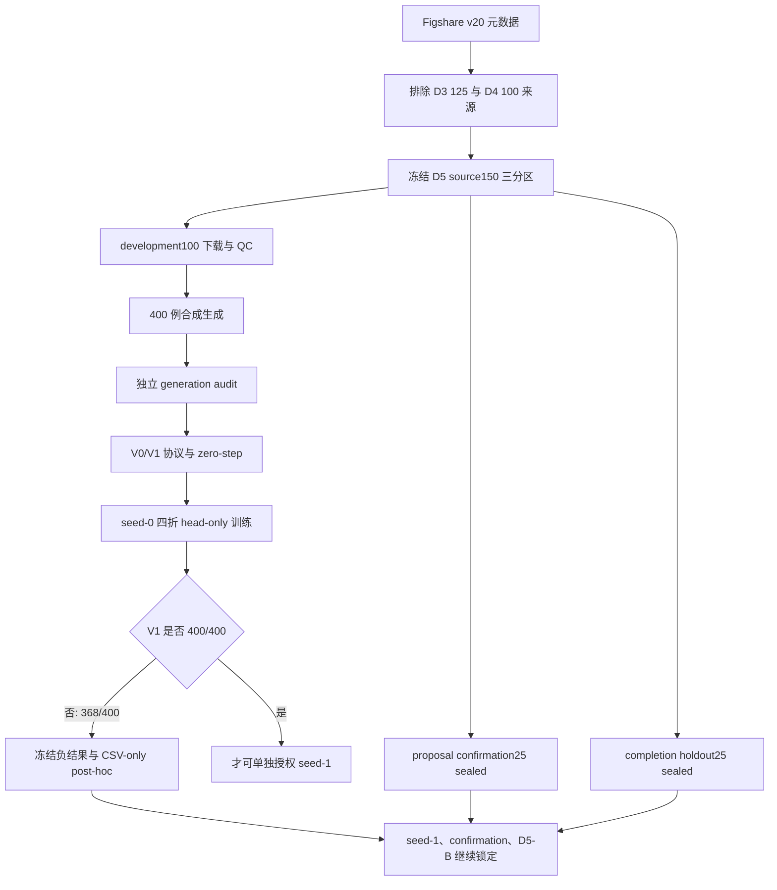
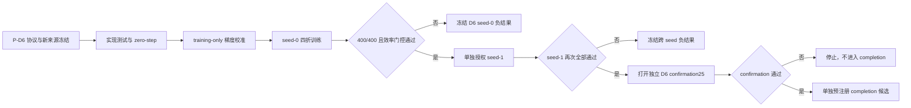

# Mamba v1.5 D5 完整实验报告与下一阶段建议

> 文档性质：D5 阶段完整实验记录、结果解释与下一阶段方案建议。
>
> 冻结边界：本报告汇总已经冻结的 acquisition、QC、generation、zero-step、training 与 CSV-only post-hoc 结果；报告中的新增统计推断均明确标记为“报告期事后分析”，不改变任何原始门控、授权或候选选择结论。
>
> 当前结论：D5-A V1 相对 V0 取得稳定且显著的机制改进，但未达到预注册的 `400/400` all-case gate。因此 D5 seed-1、proposal confirmation、D5-B、candidate selection 以及所有 sealed partition 访问继续保持禁止。

## 1. 执行摘要

D5 的目标不是直接训练完整缺损修复网络，而是在严格隔离的 MUG500+ 新来源数据上，检验一个更具体的前置机制问题：在固定 32 个 proposal 的预算内，能否让 partial-only 的候选排序器在每一个病例中至少选中一个与真实缺损边界相关的正候选。

本阶段完成了以下闭环：

1. 从 Figshare v20 元数据中排除 D3 与 D4 已用来源，冻结 D5 的 development、proposal confirmation 和 completion holdout 三分区。
2. 仅提取 development100 的 100 个 canonical clear STL；两个 sealed 分区保持未解压、未上服务器、未进入任何 QC、生成或模型流程。
3. 完成 100 个来源的跨批模型无关 QC，并冻结 `development100` final QC lock。
4. 按固定 M2 几何协议生成 400 个合成病例，并完成独立 generation audit。
5. 冻结 D5-A 的两个候选：D4-A 参考候选 V0，以及引入 partial-only 多尺度上下文和集合级损失的 V1。
6. 完成 V0/V1 deterministic implementation tests 与 CUDA zero-step preflight，证明实现路径可运行且没有训练副作用。
7. 在四折来源级互斥划分上完成 V0/V1 seed-0 head-only 训练与一次性 dev 评估。
8. 冻结 seed-0 负结果，并仅使用冻结 CSV 完成 observation-only post-hoc 分解。
9. 完成本地归档、恢复验证、Git commit、annotated tag、远端核验以及服务器 checkpoint 清理。

核心结果如下：

| 候选 | 命中 | 未命中 | all-case 命中率 | 预注册门控 |
|---|---:|---:|---:|---|
| V0 | 322 / 400 | 78 | 80.5% | 不具备推进资格，仅作参考 |
| V1 | 368 / 400 | 32 | 92.0% | 失败，要求 400 / 400 |

V1 相对 V0 净增加 46 个命中，命中率提高 11.5 个百分点，未命中数减少 58.97%。四个 fold 和四类缺损均出现改善，说明结果不是由单个 fold 或单类缺损驱动。然而，`368/400` 仍不等于 `400/400`，且存在 10 个 `V0 hit -> V1 miss` 回退病例。因此，D5 的正式结论必须保持为冻结负结果。

## 2. 研究问题与治理原则

### 2.1 核心研究问题

D5 研究的核心问题是：

> 在保持 proposal 数量为 32、不使用完整颅骨或真实 implant、不访问 sealed partition 的条件下，partial-only 多尺度上下文和集合级排序损失能否使所有 development 病例的 top-32 proposal 至少包含一个正候选？

该问题位于完整修复模型训练之前。proposal support gate 未通过时，后续 completion 模型即使具有较强拟合能力，也可能因候选集合完全遗漏缺损支持区域而发生结构性失败。

### 2.2 实验治理原则

D5 全程遵循以下原则：

- 来源级隔离：同一 skull 的四个缺损病例始终位于同一 fold。
- 候选预算固定：V1 使用稳定 top-32，不因事后结果扩大 K。
- 一次性 dev：每个 candidate-fold 仅在训练完成后打开一次 dev。
- 最终 epoch：只保存 final-epoch head，不根据 dev 选择 best checkpoint。
- 严格前进门控：V1 seed-0 必须达到 `400/400` 才可能授权 seed-1。
- sealed 隔离：proposal confirmation、completion holdout 和 official test 均未访问。
- 负结果不可改写：事后分析只能解释失败，不能修改阈值、重跑 D5 或自动启动下一候选。



## 3. 数据获取、分区与 QC 冻结

### 3.1 来源池构建

D5 使用官方 Figshare v20 元数据。来源选择前明确排除：

- D3 已使用的 125 个来源 skull；
- D4 已使用的 100 个来源 skull。

从剩余 275 个完整 A-series 来源中，以固定 salt
`mamba-v15-d5-source150-three-partition-v1-20260830`
进行仅依赖元数据的确定性分层选择，冻结：

- development：100 个来源；
- proposal confirmation：25 个来源，sealed；
- completion holdout：25 个来源，sealed。

### 3.2 下载规模

| 分区/批次 | ZIP 数 | 来源数 | 字节数 | 约合 GiB | 状态 |
|---|---:|---:|---:|---:|---|
| Development Batch 001 | 8 | 40 | 14,240,731,429 | 13.26 | 已下载、校验、提取与 QC |
| Development Batch 002 | 8 | 40 | 15,181,922,344 | 14.14 | 已下载、校验、提取与 QC |
| Development Batch 003 | 4 | 20 | 11,852,738,862 | 11.04 | 已下载、校验、提取与 QC |
| Development 合计 | 20 | 100 | 41,275,392,635 | 38.44 | 已冻结 |
| Proposal confirmation | 5 | 25 | 9,767,972,838 | 9.10 | sealed，未解压 |
| Completion holdout | 5 | 25 | 12,866,729,685 | 11.98 | sealed，未解压 |
| Source150 总计 | 30 | 150 | 63,910,095,158 | 59.52 | 元数据分区已冻结 |

### 3.3 提取约束

development ZIP 只允许流式提取一个 canonical `A????_clear.stl`。以下内容被显式禁止：

- B-series；
- NRRD；
- PNG；
- 非 clear STL；
- 一个来源对应多个 clear STL；
- 计划外成员或来源 ID。

### 3.4 模型无关 QC

每个批次和最终跨批 lock 检查：

- 文件存在性与来源 ID 双射；
- 文件大小及 SHA256/MD5 绑定；
- STL triangle count；
- 坐标 finite；
- 退化三角形；
- bounding box 与基本几何合理性；
- surface fingerprint；
- 批内及跨批重复；
- 与 D3 healthy125、D4 source100 的来源重叠。

最终 `development100` QC lock 的结论为：

- 100 个预期来源全部存在；
- 100 个 canonical clear STL 与来源 ID 一一对应；
- 三批内部及跨批无重复；
- 与 D3、D4 来源无重叠；
- sealed geometry 文件数为 0；
- final QC 状态为 `development100_qc_locked_complete`。

服务器上该 100 个 STL 的冻结树曾包含 100 个文件，共 16,820,263,850 字节。在本地归档、hash chain 和 generation audit 均验证后，服务器 STL 副本已安全删除，仅保留锁、审计和清理凭据。

## 4. D5 development400 生成与独立审计

### 4.1 合成病例设计

D5 严格继承冻结的 M2 v1 几何与采样协议。每个来源 skull 生成四个病例：

1. `ellipsoid_large`；
2. `ellipsoid_medium`；
3. `ellipsoid_small`；
4. `irregular_medium`。

因此总量为：

```text
100 source skulls × 4 defect families = 400 derived cases
```

### 4.2 来源级四折

固定 hash salt 将 100 个来源确定性分配到 A/B/C/D 四折：

- 每折 dev：25 个来源，100 个病例；
- 每折 train：75 个来源，300 个病例；
- 同一来源的四个病例不跨折；
- 四折 dev 合并后恰好覆盖 400 个病例一次。

### 4.3 独立 generation audit

独立审计状态为：

`generation_integrity_passed_model_training_selection_and_sealed_still_locked`

审计通过项包括：

- 100 个来源、400 个派生病例；
- A/B/C/D 各 100 个病例；
- 派生 SHA256 全部复核且 400 个哈希唯一；
- manifest 与 NPZ 文件双射；
- NPZ shape、dtype、finite 和 normalization contract；
- 四类缺损绑定；
- 来源与 fold 绑定；
- 几何硬门控及 reference rim；
- 全部路径为可解析相对路径；
- sealed/protected 数据未使用。

关键审计量：

| 指标 | 结果 |
|---|---:|
| Source skulls | 100 |
| Derived cases | 400 |
| Fold case counts | A/B/C/D 各 100 |
| Reference rim points min / mean / max | 8 / 25.4525 / 81 |
| Removed surface area fraction min | 0.0083578943 |
| Removed surface area fraction mean | 0.0404411285 |
| Removed surface area fraction max | 0.1442763752 |

关键 lineage SHA256：

| 绑定对象 | SHA256 |
|---|---|
| Generator bundle | `ef0664bf17435d7aa7c5efbba076ef4dc1cc49701483bdd29f743af1e0ac27e8` |
| Source manifest | `58b23c47be8da5dd801f2e5b527d7a978b6d7c97f0cec788d28681a8dc96f8ef` |
| Audit protocol | `7cb4ceb37b47191a6102468194fe793f530e8a7107b82c8b86fd9d288a64171e` |
| Audit implementation | `d2984c6e1a82157dca688578e826ee44999a78ea1c00269695f365bd4a783f91` |
| Audit tests | `b310c317e42dffa24ca570ddd78c4f61a6fd5b39226b1954f9c11925be2b1ed8` |
| Portable manifest | `f653a82ac29c98909d987ad0b6bb618841d006ddf3144ba732d4911cff32bf8d` |

## 5. D5-A 候选定义

### 5.1 V0：D4-A 冻结参考

V0 是 D4-A 的精确参考实现：

- 13D point descriptor；
- head：`13-128-64-1`；
- 参数量：10,113；
- loss：case-balanced point BCE；
- selector：top-256 池内 mandatory top-8 + conditioned deterministic FPS-24；
- proposal 总数：32。

V0 只作为机制参考，不具备直接推进资格。

### 5.2 V1：partial-only 多尺度上下文候选

V1 的 27D point descriptor 包含：

- V0 的 13D descriptor；
- k=32 的 9 个局部统计量；
- 到 partial 全局质心的 3D offset；
- 以全局 RMS 归一化的半径；
- k=16 与 k=32 局部尺度的 log ratio。

网络结构：

- shared point encoder：`27-64-64`；
- 对 8192 个点做 mean/max pooling，得到 128D global context；
- 拼接 64D point feature、128D context 与 27D descriptor，形成 219D；
- classifier：`219-128-64-1`；
- 参数量：42,433。

V1 的总损失为三个等权项之和：

1. case-balanced point BCE；
2. temperature=1 的 positive-mass NLL；
3. margin=1 的 best-positive 对第 32 个 negative 的 top-32 margin loss。

V1 selector 固定为 stable score top-32，以 point index 升序处理并列，不使用 FPS，不扩大 query 数。

### 5.3 预注册假设与门控

V1 的预注册假设是：partial-only 多尺度上下文和集合级损失可以让每个病例的 top-32 至少包含一个正候选。

V1 seed-0 的硬门控为：

- 400 个病例全部 finite；
- case pairing 完整且精确；
- 每折 100/100；
- 总计 400/400；
- 不访问 sealed 或 protected 数据。

只有所有条件均通过，才可能在独立授权下运行 seed-1。任何 recall@K、平均指标、p 值或视觉案例都不能替代该 all-case gate。

## 6. Zero-step implementation preflight

### 6.1 目的

Zero-step 的目的仅是验证：

- descriptor 与 selector 的确定性；
- chunk invariance；
- forward/backward finite；
- 两个候选在 CUDA 上可运行；
- lineage、数据 lock 和实现 hash 绑定正确；
- 没有 optimizer、checkpoint、dev 或 sealed 访问副作用。

### 6.2 结果

冻结状态：`V0_V1_implementation_zero_step_preflight_passed`。

| 项目 | 结果 |
|---|---:|
| Folds | 4 |
| Train probe cases | 4 |
| Candidates per probe | 2 |
| Backward passes | 8 |
| Optimizer constructed | False |
| Optimizer steps | 0 |
| Model updates | 0 |
| Dev cases accessed | 0 |
| Checkpoint loaded/written | False / False |
| GPU | NVIDIA GeForce RTX 4090 D |

Zero-step 只证明实现路径正确，不提供训练授权，也不提供候选有效性证据。随机初始化下的 selected-hit 仅是路径观测，不构成 gate。

## 7. Seed-0 训练执行协议

### 7.1 授权范围

训练授权状态：`D5A_V0_V1_seed0_folds_A_D_training_authorized`。

授权严格限定为：

- 候选：V0、V1；
- folds：A、B、C、D；
- seed：0；
- 顺序：V0 A-D，随后 V1 A-D；
- head-only；
- development-only。

### 7.2 训练预算

| 项目 | 固定值 |
|---|---:|
| Epochs per candidate-fold | 50 |
| Batch size | 8 |
| Optimizer | AdamW |
| Learning rate | 1e-3 |
| Weight decay | 1e-4 |
| Schedule | Cosine |
| Minimum learning rate | 1e-5 |
| Gradient clip | 1.0 |
| Optimizer steps per fold | 1,900 |
| Candidate-fold runs | 8 |
| Maximum total optimizer steps | 15,200 |
| Checkpoint policy | Final epoch only |
| Dev evaluations | 每个 candidate-fold 一次 |

训练过程中不允许：

- 中间 dev；
- best-checkpoint 选择；
- seed-1；
- proposal confirmation；
- completion holdout；
- D5-B；
- official test。

## 8. Seed-0 正式实验结果

### 8.1 四折结果

| Candidate | Fold A | Fold B | Fold C | Fold D | Total | Rate |
|---|---:|---:|---:|---:|---:|---:|
| V0 | 77/100 | 75/100 | 85/100 | 85/100 | 322/400 | 80.5% |
| V1 | 92/100 | 89/100 | 92/100 | 95/100 | 368/400 | 92.0% |
| V1 - V0 | +15 | +14 | +7 | +10 | +46 | +11.5 pp |

V1 在四个 fold 上均优于 V0，但每个 fold 均未达到 100/100。因此 formal completion 状态为：

`D5A_seed0_frozen_negative_V1_all_case_gate_failed`

### 8.2 训练数值

| Candidate | Fold | Final loss | Max pre-clip grad norm | Parameters | Steps |
|---|---|---:|---:|---:|---:|
| V0 | A | 0.499932 | 1.079646 | 10,113 | 1,900 |
| V0 | B | 0.491159 | 1.059884 | 10,113 | 1,900 |
| V0 | C | 0.496877 | 1.308181 | 10,113 | 1,900 |
| V0 | D | 0.498357 | 1.458117 | 10,113 | 1,900 |
| V1 | A | 2.592061 | 31.412560 | 42,433 | 1,900 |
| V1 | B | 2.571945 | 29.907585 | 42,433 | 1,900 |
| V1 | C | 2.634786 | 29.766771 | 42,433 | 1,900 |
| V1 | D | 2.630247 | 24.341230 | 42,433 | 1,900 |

V0 与 V1 的 loss 不能直接横向比较，因为 V1 是三个损失项之和。V1 的 pre-clip gradient norm 显著更大，但全部 finite，且训练使用固定 clip=1.0。该现象提示下一阶段应在 training-only 数据上预注册分项梯度审计，而不能仅凭最终总 loss 判断优化稳定性。

### 8.3 配对转移

| V0 状态 | V1 状态 | 病例数 | 解释 |
|---|---|---:|---|
| Hit | Hit | 312 | 稳定保留 |
| Hit | Miss | 10 | V1 回退 |
| Miss | Hit | 56 | V1 救回 |
| Miss | Miss | 22 | 两者均失败 |

由此得到：

- 净改善：`56 - 10 = 46` 个病例；
- 未命中数从 78 降至 32；
- 未命中减少比例：`46 / 78 = 58.97%`；
- V1 并非单调改进，因为存在 10 个回退病例。

### 8.4 按缺损族结果

| Defect family | V0 hits | V1 hits | Improvement | V1 misses |
|---|---:|---:|---:|---:|
| Ellipsoid large | 85/100 | 96/100 | +11 | 4 |
| Ellipsoid medium | 80/100 | 92/100 | +12 | 8 |
| Ellipsoid small | 76/100 | 87/100 | +11 | 13 |
| Irregular medium | 81/100 | 93/100 | +12 | 7 |

V1 在四类缺损上均改善。`ellipsoid_small` 仍是最困难类别，但失败并不局限于单一缺损族，因此不支持只为某一类别追加特例规则。

### 8.5 V1 未命中分布

| 维度 | 结果 |
|---|---|
| Misses by fold | A=8，B=11，C=8，D=5 |
| Misses by family | large=4，medium=8，small=13，irregular=7 |
| Miss source skulls | 30 |
| Multi-miss source skulls | 2 |
| Maximum misses per source | 2 |
| Best-positive rank min / median / max | 33 / 45 / 119 |

32 个 V1 miss 分散在 30 个来源 skull 上，说明失败不是少数异常 skull 的集中效应。

## 9. CSV-only 事后失败分解

### 9.1 分析边界

该分析只读取冻结的 all-case CSV：

- 不加载 checkpoint；
- 不读取几何；
- 不运行模型；
- optimizer steps=0；
- model updates=0；
- selection inert；
- 不访问 sealed 数据；
- 不改变原 top-32 gate。

冻结状态：`D5A_seed0_negative_csv_posthoc_complete`。

### 9.2 Counterfactual recall@K

| K | V1 counterfactual recall | Rate |
|---:|---:|---:|
| 8 | 308/400 | 77.0% |
| 16 | 343/400 | 85.75% |
| 32 | 368/400 | 92.0% |
| 64 | 393/400 | 98.25% |
| 128 | 400/400 | 100.0% |
| 256 | 400/400 | 100.0% |

在 32 个冻结 top-32 miss 中：

- top-64 可事后覆盖 25/32；
- top-128 可事后覆盖 32/32；
- rank 33-40：9 例；
- rank 41-64：16 例；
- rank 65-128：7 例。

这一结果说明 V1 的剩余失败主要是固定 top-32 边界之外的 ranking-tail 问题，而不是候选池中完全没有正候选。

但必须强调：top-128 的 `400/400` 是使用冻结真值标签计算的反事实 recall，不是一个经过训练、效率评估和独立验证的新候选，也不能授权把 D5 的 proposal budget 从 32 改为 128。

### 9.3 报告期附加统计推断

以下统计是在完成冻结结果后，为本报告提供效应量解释而进行的事后分析，不属于原门控，也不产生新的实验授权。

以 100 个 source skull 为 cluster，对病例命中率进行确定性 100,000 次配对 bootstrap：

| 统计量 | 95% percentile interval |
|---|---|
| V0 hit rate | 0.765 至 0.845 |
| V1 hit rate | 0.895 至 0.945 |
| Paired rate difference | +0.0775 至 +0.1525 |

对 56 个 `miss -> hit` 与 10 个 `hit -> miss` 做 exact two-sided McNemar 检验，得到：

```text
p = 6.90 × 10^-9
```

来源级完整命中情况：

- V0：45/100 个来源的四个病例全部命中；
- V1：70/100 个来源的四个病例全部命中。

这些结果支持“V1 的改进具有一致性且不太可能由偶然配对波动造成”的解释，但统计显著性不能替代预注册的逐病例 `400/400` 安全门控。

## 10. 专业结果分析

### 10.1 已获得的可靠证据

第一，V1 的机制改进是真实且广泛的。它在每个 fold 和每个缺损族上都提高命中数，并把未命中从 78 降到 32。配对转移、来源级 bootstrap 和 McNemar 检验均指向一致方向。

第二，多尺度 partial-only 上下文与集合级损失对候选排序有效。V1 没有使用完整颅骨、implant 或 sealed 数据，却将 top-32 recall 从 80.5% 提高到 92.0%，说明 D4-A 的局部 13D 表征确实缺少对整体结构和集合目标的充分建模。

第三，剩余瓶颈已经发生转移。D4-A 阶段主要表现为 selector 丢弃 pool-positive；D5 V1 中，所有 32 个 miss 的最佳正候选都位于 rank 33-119。当前问题不再是正候选是否存在，而是如何在固定预算内把长尾正候选稳定推入前 32。

### 10.2 不能据此得出的结论

不能声称 D5-A 成功。预注册目标是 400/400，而不是平均改善或统计显著。32 个 miss 中任何一个都足以使 all-case gate 失败。

不能启动 seed-1。Seed-1 是确认稳定性的第二阶段资源，只在 seed-0 通过时才有资格运行。用 seed-1“看看能否碰巧通过”会改变序贯决策语义并引入选择偏倚。

不能打开 proposal confirmation 或 completion holdout。Development gate 未通过，sealed 数据不应被用于调参、诊断或决定 K。

不能直接把 top-32 改为 top-128 并宣称问题解决。这样做同时改变 proposal 数、下游计算量、显存、延迟以及 completion 模型输入分布，并且 top-128 结论来自事后真值分析。

不能把 V1 的较大梯度范数直接解释为训练不稳定。三个损失项、模型规模和参数化均与 V0 不同；目前只能说该现象值得在新协议中做 training-only 分项梯度审计。

### 10.3 主要风险与局限

1. 数据仍是合成缺损，未证明对真实术后或临床缺损分布的泛化。
2. 当前只有 seed-0，因为门控失败后 seed-1 被正确锁定。
3. 这是 head-only proposal feasibility，不是完整 AdaPoinTr completion 性能。
4. 400 个病例来自 100 个来源，病例并非完全独立；来源级统计比病例级独立假设更合适。
5. V1 仍有 10 个相对 V0 的回退病例，说明新排序器没有经验上的单调保留性质。
6. V1 参数量约为 V0 的 4.20 倍；本阶段关注可行性，尚未形成完整部署效率结论。
7. 事后 rank-band 结果只能用于提出新假设，不能反向修改 D5。

## 11. 下一阶段建议

### 11.1 总体决策

建议将 D5 正式关闭为“机制显著改善但安全门控失败”的负结果，不重跑、不改 K、不解封数据。下一步应建立一个新的独立阶段，建议命名为 D6，而不是在 D5 内追加热修式候选。

D6 的研究问题应收窄为：

> 在保持 32 个 proposal 和 partial-only inference 的前提下，能否通过固定预算的集合式排序机制，消除 V1 的 rank-33 至 rank-119 长尾，同时不产生新的回退？

### 11.2 新数据设计

D5 source150 冻结后，原 275 个剩余来源中仍有约 125 个未进入 D5。建议：

- 从未用来源中冻结新的 D6 development100；
- 余下约 25 个作为 D6 独立 confirmation；
- 不复用 D5 proposal confirmation25 或 completion holdout25；
- 继续排除 D3、D4、D5 的全部已绑定来源；
- 先冻结元数据分区，再下载和 QC；
- 保持来源级四折和四病例同折。

这一设计能避免在已经观察过 D5 结果的数据上验证新机制，从而降低事后过拟合风险。

### 11.3 候选设计原则

建议 D6 只比较两个候选：

- R0：D5 V1 的精确冻结参考；
- R1：一个新的固定 32-slot、partial-only、set-aware 候选。

R1 不应只是扩大 top-K。优先考虑：

1. 共享 point encoder 后的 32-slot set predictor；
2. 显式的 listwise positive-mass 目标；
3. 针对 rank-tail 的 hard-negative/listwise margin；
4. 固定 32 个输出槽位及确定性 tie rule；
5. inference 完全不使用 GT、implant、完整颅骨或 defect family 标签。

可以将 rank-band coverage 作为设计动机，但不建议直接把 D5 事后观察到的 `33-64`、`65-128` 数量写成可调超参数搜索空间。若采用分带策略，分带边界、槽位数和 tie rule 必须在任何 D6 几何或 dev 结果打开前一次性冻结。

### 11.4 Training-only 梯度校准

鉴于 V1 三个损失项的总梯度明显高于 V0，建议在正式 D6 训练授权前增加独立的 training-only gradient-ratio calibration：

- 只使用每折 train 来源；
- 固定每折 batch 数与 case slot；
- 分别计算 BCE、positive-mass NLL 和 rank-tail loss 的梯度范数；
- 使用预注册的中位数比值公式确定损失权重；
- optimizer steps=0；
- 不加载 checkpoint；
- 不打开 dev；
- 每折独立校准并由 receipt 绑定。

该步骤的目的不是提高 D5 成绩，而是防止 D6 的复合损失被某一项在数值上支配。

### 11.5 建议的 D6 阶段门控

建议按以下顺序执行：

1. **P-D6 协议冻结**：来源排除、候选、损失、32-slot selector、预算、tie rule、效率阈值和失败语义。
2. **实现测试**：chunk invariance、stable ordering、no-GT inference、极端输入、finite 与重复运行一致性。
3. **Zero-step CUDA preflight**：optimizer=0、dev=0、model updates=0。
4. **Training-only gradient calibration**：仅训练折，不进行模型更新。
5. **Seed-0 四折训练**：final epoch only、一次性 dev。
6. **硬门控**：R1 必须 400/400、四折各 100/100、四类各 100/100、全部 finite、配对完整。
7. **效率门控**：参数量、descriptor/head latency 和 peak memory 不超过预注册上限。
8. **Seed-1**：仅在 seed-0 全部门控通过后单独授权。
9. **独立 confirmation**：仅在两个 seed 均通过后打开 D6 confirmation25。

建议的起始效率边界可设为：

- head 参数量不超过 100,000；
- descriptor+head latency 不超过 R0 的 1.15 倍；
- peak GPU memory 不超过 R0 的 1.10 倍。

这些数值应在 D6 协议预注册时结合实际部署目标最终确定，不能在看到训练结果后调整。



### 11.6 明确禁止的捷径

下一阶段不建议：

- 在 D5 上修改阈值后重跑；
- 直接运行 D5 seed-1；
- 用 D5 sealed 分区挑选 top-K；
- 将 top-128 反事实 recall 当作新模型结果；
- 同时测试多个未预注册 selector 并择优报告；
- 先观察 dev 再确定 loss 权重或 rank-band；
- 在 proposal gate 未通过时启动完整 completion 训练。

## 12. 可复现性、版本与归档

### 12.1 Git 冻结点

| 阶段 | Commit | Annotated tag |
|---|---|---|
| V0/V1 zero-step | `1480a9bc0957528182c11bfddd722b53517b5388` | `mamba-adapter-v15-d5a-zero-step-preflight-v1` |
| Seed-0 training authorization | `d19e7858494da9c5e519e1ff0423d8eb089db0fa` | `mamba-adapter-v15-d5a-seed0-training-authorization-v1` |
| Seed-0 negative + CSV post-hoc | `a6ce92c4330687251d8ad98908612e79c7dabe39` | `mamba-adapter-v15-d5a-seed0-negative-csv-posthoc-v1` |

当前工作分支：`feature/mamba-v12-mechanism-dev`。上述分支和 tag 均已推送并进行远端 peeled-tag 核验。

### 12.2 正式 D5-A 归档

本地归档：

```text
E:\ResearchBackups\AdaPoinTr\
MUG500plus_mamba_v15_D5A_seed0_negative_csv_posthoc_v1\
server_archive\
mamba_v15_d5a_v0_v1_seed0_negative_csv_posthoc_v1.tar.gz
```

| 属性 | 值 |
|---|---|
| Archive bytes | 1,477,198 |
| Archive SHA256 | `7f392c5672939d5e0d5345576fb7d167baf356784ac4cfd1eb1fad5a620a991d` |
| Tar members | 304 |
| Payload files | 263 |
| Final head checkpoints | 8 |

归档已在本机完成恢复验证，验证器确认：

- 八个 final head checkpoint 与 fold receipt 匹配；
- V0=`322/400`、V1=`368/400` 冻结负语义匹配；
- top-K、配对转移和 rank-band CSV-only post-hoc 语义匹配；
- seed1、confirmation、D5-B、selection、sealed 均为 false。

归档和本地恢复验证完成后，服务器归档副本与 8 个 final head checkpoint 已安全删除。服务器继续保留协议、授权、fold metrics、completion receipt、报告、post-hoc 输出和清理凭据。

### 12.3 运输格式修复

D5 部署过程中出现过 CRLF/LF 差异。所有修复均满足：

- 先证明 raw bytes 不同但 LF-normalized bytes 相同；
- 安装 canonical Git bytes；
- 生成独立 transport/lineage receipt；
- 不修改协议语义、模型结果、门控或授权。

因此这些修复属于运输规范化，不属于实验方案修订。

## 13. 最终结论

D5 建立了一个治理完整、可恢复验证、负结果不可逆向美化的 proposal feasibility 实验链。V1 相对 V0 的提升明确、跨 fold、跨缺损族且具有较强配对统计证据：命中率从 80.5% 提高到 92.0%，未命中减少 58.97%。这证明 partial-only 多尺度上下文和集合级损失是有效方向。

但 D5 的科学结论仍是负结果。V1 在 400 个病例中仍遗漏 32 个，且产生 10 个回退，未达到预注册的逐病例安全要求。后续工作不应通过放宽门控、扩大 K、运行 seed-1 或打开 sealed 数据来修饰这一结论。

最合理的下一步是结束 D5，并在新来源上预注册 D6：保持 32 个 proposal，针对 rank-tail 设计真正的固定预算 set-aware selector，增加 training-only 梯度校准，并继续采用 seed-0 硬门控、通过后才授权 seed-1 和独立 confirmation 的序贯流程。

## 14. 关联冻结文档

- [D5 source150 acquisition 预注册](./mamba_v15_d5_source150_acquisition_preregistered_protocol_zh.md)
- [D5 development batch QC 预注册](./mamba_v15_d5_development_batch_qc_preregistered_protocol_zh.md)
- [D5 development100 final QC lock 预注册](./mamba_v15_d5_development100_final_qc_lock_preregistered_protocol_zh.md)
- [D5 development generation/fourfold 预注册](./mamba_v15_d5_mug500plus_development_generation_fourfold_preregistered_protocol_zh.md)
- [D5 development400 generation audit 完整结果](./mamba_v15_d5_development400_generation_audit_complete_result_zh.md)
- [D5 candidate/training 预注册](./mamba_v15_d5_candidate_training_preregistered_protocol_zh.md)
- [D5-A V0/V1 zero-step 完整结果](./mamba_v15_d5a_v0_v1_zero_step_complete_result_zh.md)
- [D5-A seed-0 training authorization 预注册](./mamba_v15_d5a_seed0_training_authorization_preregistered_protocol_zh.md)
- [D5-A seed-0 完整负结果与 CSV post-hoc](./mamba_v15_d5a_seed0_complete_negative_result_and_csv_posthoc_zh.md)

