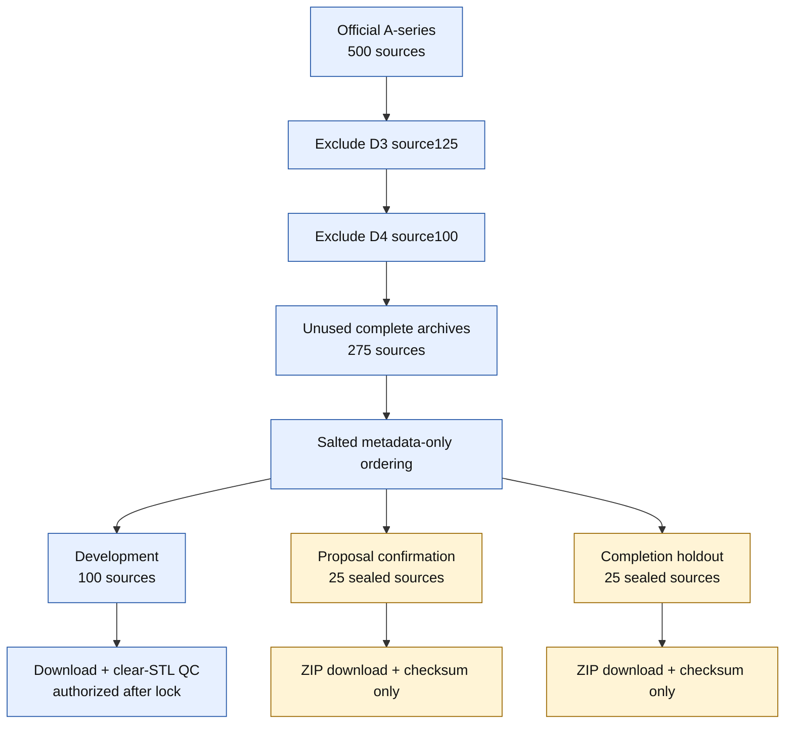

# Mamba v1.5 D5 MUG500+ source150 获取与三分区预注册

> 本协议只使用 Figshare v20 官方元数据和既有 D3/D4 来源锁。它不读取新 STL、不进行几何 QC、不生成缺损、不实现或训练模型。

## 研究依据

D4-A head-only feasibility 在冻结的 400 个病例中命中 332 例。Observation-only failure decomposition 将 68 个漏失分为 2 个 top-256 ranking miss 和 66 个 selector 丢弃全部 pool-positive。D4 development 已经用于训练、门控和 post-hoc 解释，不能继续承担候选开发。

D5 因此必须先建立新的来源边界，再验证 context-aware、set-level-aligned support allocation。数据锁先于模型协议，防止依据新几何、QC 或模型输出挑选来源。

## 对原计划的修订

原计划的主方向合理，但本锁加入四项更严格的约束：

1. 同时预留 development、proposal confirmation 和 completion-only holdout，避免同一保护集同时证明 proposal 与完整补全。
2. 三个分区在同一次 metadata-only 选择中冻结，避免后续根据 D5 结果重新抽取更有利的来源。
3. 两个 25-source 分区当前只允许离线下载 ZIP 并核验 MD5/字节数；禁止提取 STL、几何 QC、上传服务器、可视化和模型访问。
4. 将未来的 400/400 与 100/100 明确定义为操作性安全门控，而不是总体失效率为零的统计证明；仍须报告来源聚类不确定性。

## 冻结谱系

- D3 source125：100 个 development 来源加 25 个锁定 holdout 来源。
- D4 source100：与 D3 完全互斥的 100 个来源。
- D5 排除集合：D3 与 D4 的并集，共 225 个来源。
- D5 可选池：官方 A0001-A0500 中剩余的 275 个完整来源。
- craniotomy/B-series：始终属于保护数据，不参与选择。

## 元数据选择规则

选择单位是完整官方 A-series ZIP，而不是单个 STL。任何 ZIP 只要与 D3/D4 排除集合部分重叠，就立即失败。

排序规则固定为：

1. 将 ZIP 按 source index 分入十个 50-source strata。
2. 每个 stratum 内按
   `SHA256(salt|archive|archive_name|normalized_md5|size_bytes)`
   升序。
3. 按 stratum 0 至 9 逐层交错。
4. 依序接受不会使累计来源数超过 150 的完整 ZIP。
5. 只有精确达到 150 才允许生成锁。

固定 salt：

`mamba-v15-d5-source150-three-partition-v1-20260830`

不得因下载失败、几何 QC、模型结果或缺损难度修改 salt、顺序或来源。

## 三分区边界

按冻结 selected-archive 顺序的前缀确定分区：

| Partition | Source skulls | Planned derived cases | 当前用途 |
| --- | ---: | ---: | --- |
| D5 development | 100 | 400 | 四折 V0/V1 head-only feasibility |
| D5 proposal confirmation | 25 | 100 | 双 seed 通过后的 one-shot proposal confirmation |
| D5 completion holdout | 25 | 100 | D5-B 完整补全的独立 one-shot holdout |

分区边界必须恰好落在完整 ZIP 边界；否则协议失败，不允许拆 ZIP 或人工调换。

## 当前访问权限

### Development

当前锁完成后仅授权：

- 下载冻结 ZIP；
- 核验官方字节数和 MD5；
- 只提取 selected `A????_clear.stl`；
- 执行模型无关 QC；
- QC 锁通过后部署到服务器。

仍不授权合成生成、D5-A 实现、训练或候选选择。

### Proposal confirmation

当前只允许：

- 将冻结 ZIP 下载到本地离线归档；
- 核验字节数和 MD5。

禁止提取、QC、可视化、服务器部署、派生生成和模型访问。

### Completion holdout

访问边界与 proposal confirmation 相同。它不能在 D5-A 阶段使用，即使 proposal confirmation 已解封。

## 未来四折原则

D5 development 的 100 个来源必须在后续独立协议中进行 source-level 四折：

- 每折 75 train sources、25 dev sources；
- 同一来源的四个缺损病例始终同折；
- 折分配只依赖预注册 salt 与 source ID；
- confirmation 和 completion holdout 不进入任何 development 折。

本获取锁不生成四折，也不生成缺损。

## 统计解释

未来 V1 的 `400/400` 是停止/继续的预注册安全门控。即使通过，也不能证明总体失效率为零。后续报告必须同时给出：

- 来源聚类的置信区间或 bootstrap 区间；
- 四类缺损分层；
- best-positive rank；
- selected-positive count；
- positive 与第 32 个 negative 的 margin；
- V0 到 V1 的来源级配对转移。

Proposal confirmation 的 `100/100` 同样只是独立一次性门控。

## 失败处理

以下任一情况发生时立即停止：

- D3、D4 与 D5 有任意来源重叠；
- 任一 prior ZIP 出现部分重叠；
- 无法在完整 ZIP 边界达到 150/100/25/25；
- 官方元数据、既有锁或父结果哈希漂移；
- sealed partition 被提前提取或访问；
- QC 失败后试图自动替换来源。

失败后只能通过明确标注的新修订协议处理，不能静默重选。

## 锁定后的下一步

1. 核验并保存 source150 锁。
2. 只下载 development 的三个批次并执行模型无关 QC。
3. 可下载两个 sealed partition 的 ZIP 作为离线备份，但不得解压。
4. development QC 锁通过后，单独冻结 D5 合成生成和 source-level 四折。
5. 之后才冻结 V0/V1、gradient-ratio calibration、zero-step preflight 与顺序门控。

## 当前锁定状态

- D5 synthetic generation：`false`
- D5-A implementation：`false`
- D5-A training：`false`
- D5-B training：`false`
- Candidate selection：`false`
- Proposal confirmation access：`false`
- Completion holdout access：`false`
- SkullBreak confirmation20：`false`
- Official test：`false`
