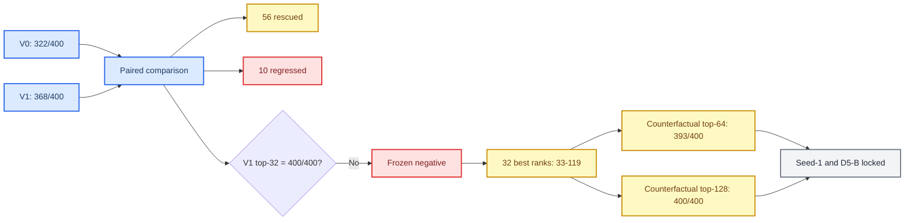

# Mamba v1.5 D5-A V0/V1 seed-0 完整负结果与 CSV-only post-hoc 报告

_Development100 四折 head-only feasibility、冻结 all-case gate 与 selection-inert 排序尾部分解_

---

## 摘要

D5-A 在 100 个 development 来源颅骨、400 个合成缺损病例上比较两个候选：冻结 D4-A 参考候选 V0，以及引入 27 维多尺度上下文、set-level loss 和稳定 top-32 选择的 V1。每个候选均按来源互斥的 A–D 四折完成 seed-0 head-only 训练，每个 candidate-fold 固定训练 50 epoch、1,900 optimizer step，并且只在训练结束后打开一次对应 out-of-fold development 子集。

V0 达到 `322/400`，V1 达到 `368/400`。V1 相比 V0 救回 56 个病例，同时引入 10 个新 miss，净增加 46 个 hit。该结果证明 27 维上下文与 set-level objective 具有显著积极机制信号，但 V1 没有达到预注册的 `400/400` all-case 硬门控，因此 D5-A seed-0 被正式冻结为负结果。seed-1、proposal confirmation、D5-B、candidate selection、completion holdout 和 official test 均未获得授权。

冻结 CSV 的 post-hoc 分解显示，32 个 V1 miss 全部存在 GT-positive candidate，但最佳 positive 排名位于 33–119，精确落在冻结 top-32 预算之外。反事实 recall@64 为 `393/400`，仍不足以清除全部 miss；recall@128 为 `400/400`，但只用于解释排序尾部，不改变原 top-32 门控，也不能作为扩大预算后模型有效性的证据。

## 实验问题

D5-A 检验的核心问题不是继续调节 loss 权重，而是：在固定 32 个 proposal 的预算下，多尺度局部上下文和集合级排序目标能否让每一个 development 病例至少保留一个 contact-positive candidate。

具体可证伪条件如下：

| 项目 | 冻结条件 |
| --- | --- |
| 候选 | V0 reference；V1 27D context + set-level loss + stable top-32 |
| 数据 | Development100，400 cases，100 sources |
| 划分 | A–D 四折；每折 75 train sources / 25 dev sources |
| 随机种子 | seed-0 |
| 训练预算 | 每 candidate-fold 50 epoch、1,900 optimizer step |
| dev 访问 | 每 candidate-fold 训练完成后一次性访问 |
| V1 硬门控 | 400/400 cases 的 frozen top-32 均含 positive |
| 自动后续 | 禁止自动 seed-1、confirmation 或 D5-B |

## 协议与安全边界

训练授权由 zero-step 结果、candidate protocol lock、fourfold lock、generation audit、transport normalization 和 parent-lineage 凭据共同约束。运行顺序固定为 `V0_A` 至 `V0_D`，随后 `V1_A` 至 `V1_D`。授权与 preflight 均先证明 `optimizer_steps=0` 和 `training_started=false`，训练只在独立 tmux 命令后开始。

训练完成后的 analysis 只读取：

- `d5a_seed0_training_completion_receipt.json`
- `d5a_seed0_all_case_metrics.csv`
- `files.sha256`

CSV-only post-hoc 不读取 checkpoint、NPZ、STL、proposal confirmation、completion holdout 或 official test，不执行 optimizer，不更新模型，不重算候选，也不改变候选选择。

### 冻结 lineage 与执行状态

服务器真实执行完成后，CSV-only post-hoc 绑定到以下冻结输入：

| 输入 | SHA256 |
| --- | --- |
| completion `files.sha256` | `46bfb67ddeedd5be0b2c168fe2a4e4d4f75d79bb76115556acddc4bba5cfa6eb` |
| all-case metrics CSV | `840ec391e9b628a698750d56637aedb7fa86beaa2675317db3bd46905c304f73` |
| completion receipt | `b233c3cf1cd330e3ec986f44354481c5b2c861024c01ca8ef06f03268dad611c` |
| post-hoc protocol | `845471043fe344305c3c0a244d15dc6c7b8eb3a97b5921bd72641823af73f454` |

最终 post-hoc 状态为 `D5A_seed0_negative_csv_posthoc_complete`。其凭据明确记录 `model_updates=0`、`optimizer_steps=0`、`checkpoint_accessed=false`、`geometry_accessed=false` 和 `original_top32_gate_changed=false`，因此该分析只解释冻结结果，不构成训练、调参或门控修订。

## 主要结果

### All-case 结果

| 候选 | Hits | Misses | Hit rate | 门控 |
| --- | ---: | ---: | ---: | --- |
| V0 | 322 | 78 | 80.50% | reference only |
| V1 | 368 | 32 | 92.00% | failed, requires 400/400 |

V1 相对 V0 提高 11.5 个百分点，miss 数从 78 降至 32，减少 58.97%。然而预注册问题是全病例 contact-existence，而不是平均命中率改善；任何剩余 miss 都会使硬门控失败。

### 配对转移

| V0 状态 | V1 状态 | 病例数 | 解释 |
| --- | --- | ---: | --- |
| hit | hit | 312 | 稳定成功 |
| hit | miss | 10 | V1 新诱发回退 |
| miss | hit | 56 | V1 救回 |
| miss | miss | 22 | 持续失败 |

净增益为 `56 - 10 = 46`。10 个 `hit → miss` 表明 V1 不是对 V0 的单调安全扩展；即使总体改善显著，也不能将其描述为不会伤害既有成功病例的机制。

### 缺损类型分解

| 缺损类型 | hit→hit | hit→miss | miss→hit | miss→miss | V1 misses |
| --- | ---: | ---: | ---: | ---: | ---: |
| ellipsoid_large | 83 | 2 | 13 | 2 | 4 |
| ellipsoid_medium | 78 | 2 | 14 | 6 | 8 |
| ellipsoid_small | 72 | 4 | 15 | 9 | 13 |
| irregular_medium | 79 | 2 | 14 | 5 | 7 |

V1 的救回效应存在于四类缺损中，不是由单一类别驱动。`ellipsoid_small` 仍最困难，包含 13/32 个 V1 miss、9 个持续失败和 4 个新回退，应在后续结构性方案中作为预注册分层门控，而不能仅用于事后挑选样例。

### 折间分解

| Fold | V1 misses |
| --- | ---: |
| A | 8 |
| B | 11 |
| C | 8 |
| D | 5 |

所有折均存在 miss，说明失败不是单折训练异常。fold B 较高，但 32 个 miss 分布在 30 个来源颅骨上，仅 2 个来源出现多个 miss，单一来源最多 2 个，因此结果也不是少数异常来源集中造成。

## 排序尾部 post-hoc

### 冻结 top-K 观察

| K | V1 recall@K | 相对 top-32 新恢复 |
| ---: | ---: | ---: |
| 8 | 308/400 | -60 |
| 16 | 343/400 | -25 |
| 32 | 368/400 | reference gate |
| 64 | 393/400 | +25 |
| 128 | 400/400 | +32 |
| 256 | 400/400 | +32 |

32 个冻结 top-32 miss 中，25 个可在 top-64 找到 positive，全部 32 个可在 top-128 找到 positive。最佳 positive 排名分布如下：

| 排名带 | 病例数 | 比例 |
| --- | ---: | ---: |
| 33–40 | 9 | 28.13% |
| 41–64 | 16 | 50.00% |
| 65–128 | 7 | 21.88% |
| >128 | 0 | 0.00% |

### 合理解释

该结果排除了三种过度简化解释：

1. 不是 positive candidate 缺失。32 个 V1 miss 的 `positive_candidate_count` 均大于 0。
2. 不是仅将 top-32 翻倍即可完全解决。top-64 仍有 7 个 miss。
3. 不是少数异常来源主导。32 个 miss 分散在 30 个来源上。

更准确的解释是：V1 显著改善了上下文排序，但在固定 32 proposal 预算下仍缺乏全病例尾部鲁棒性。部分 positive 与截断边界很近，另有 7 例进入 65–128 的更深尾部。

### 不能得出的结论

- 不能把 top-128 的 `400/400` 当作 V1 通过原实验。
- 不能推断将实际 query 数扩展到 128 后仍保持相同效率、下游性能或训练动态。
- 不能根据当前 seed-0 结果启动 seed-1；seed-1 的前置条件是 V1 原 top-32 门控通过。
- 不能访问 proposal confirmation、completion holdout 或 official test。
- 不能把 10 个新回退隐藏在总体净提升中。

## 结论

D5-A V1 是一个具有明显积极机制信号但未达到安全门控的负结果。它将 all-case hit 从 322 提高到 368，并跨四类缺损救回 56 个病例；同时产生 10 个回退，并留下 32 个分散于 30 个来源的 top-32 miss。全部 miss 都是 positive 排名低于 32 的排序尾部事件，且 top-64 不能完全覆盖。

因此，D5-A seed-0 必须按协议停止。该结论不支持通过事后扩大 K、调整门控或重跑 seed-0 继续搜索。当前实验应与完整授权、八个 fold 结果、completion receipt、CSV-only post-hoc 和 transport/hotfix 凭据一起归档。

## 下一阶段建议

下一阶段不应直接恢复 D5-B，也不应简单把 query budget 改为 128。更合理的是另立一个新的、明确预注册的固定预算结构问题：在仍只输出 32 个 proposal 的条件下，能否通过非泄漏的分区配额、集合覆盖或多样性约束，使排序尾部 positive 不被同质高分候选挤出。

建议按以下顺序开展：

1. 冻结本报告、completion lineage 与 CSV-only post-hoc 输出。
2. 对 32 个 miss 做仅基于冻结 CSV 的来源、缺损类型和排名带分层，禁止 checkpoint 调参。
3. 预注册新的固定 32 预算候选，明确限制参数量、延迟、显存和每个空间分区的最小覆盖。
4. 在任何训练前先做 oracle-free selector 单元测试和 zero-step preflight。
5. 继续使用来源级四折和 `400/400` contact-existence 硬门控，并增加 `hit→miss=0` 的单调安全门控。
6. 只有新候选在 seed-0 同时达到 `400/400` 且不诱发 V1/V0 已成功病例回退时，才单独授权 seed-1。

在新的预注册协议签发之前，`D5A_seed1_training_authorized=false`、`proposal_confirmation_access_authorized=false`、`D5B_training_authorized=false`、`D5_candidate_selection_authorized=false` 和 `protected_or_sealed_data_accessed=false` 保持不变。
