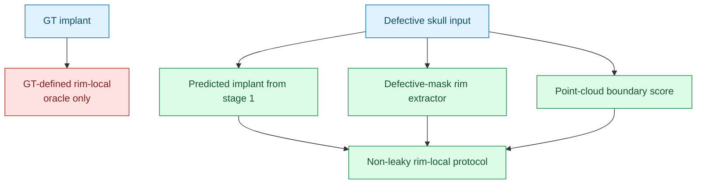

# Rim-local 输入方案与 8192-output 点数消融分析

_AdaPoinTr-Implant 在 SkullFix/SkullBreak 后续实验中的输入增强与输出点数协议决策记录，整理于 2026-07-08。_

---

## 背景

当前 AdaPoinTr-Implant baseline 已经在 SkullFix 与 SkullBreak 上跑通，核心任务定义为：

```text
input  = defective skull point cloud
target = implant / defect-region point cloud
output = predicted implant point cloud
final reconstruction = defective skull union predicted implant
```

当前固定 baseline 使用：

| 项目 | 设置 |
|---|---:|
| defective skull 输入点数 | 8192 |
| implant 输出点数 | 4096 |
| target | implant / defect-region point cloud |
| 主要评价区域 | implant / defect region、rim contact、final reconstruction |

近期补充了 SkullFix 点数消融实验，重点回答两个问题：

- `4096` 个 implant 输出点是否限制了体积表达和 surface/voxel 指标？
- 后续 Mamba 改进实验是否应将输出点数增加到 `8192`？

---

## Rim-local 输入的非泄漏方案

### 问题定义

`rim-local` 的目的，是给模型提供更多缺损边界附近的局部信息。理想输入形式为：

```text
global defective skull points = 8192
rim-local defective points    = 2048 或 4096
model input                   = global + rim-local
```

但如果直接用 GT implant 定义 rim-local：

```text
rim-local = defective skull points near GT implant
```

这会引入潜在信息泄漏，因为 GT implant 在推理阶段不可用。该方案只能作为 oracle upper-bound 诊断，不能作为正式实验协议。

### 方法一：基于 defective mask 的缺损开口边界提取

如果原始数据有 defective skull 体素 mask，可以只从输入 mask 提取缺损边界：

```text
defective mask -> defective surface -> candidate open boundary -> rim-local points
```

可行步骤：

1. 从 defective skull mask 提取表面体素或表面点
2. 利用局部邻域不完整性、曲率突变或拓扑开口检测 candidate boundary
3. 过滤正常解剖孔洞，例如眼眶、鼻腔、枕骨大孔等
4. 在 candidate rim 附近采样 `2048` 或 `4096` 个 defective surface points

优点：

- 不使用 GT complete 或 GT implant
- 与临床推理场景一致
- 对 SkullFix/SkullBreak 的 NRRD 体素数据较适合

风险：

- 正常解剖孔洞可能被误检为缺损 rim
- 大缺损、不规则缺损、边界破碎时需要较稳健的过滤规则

### 方法二：基于 morphology closing / filling 的缺损候选区域

仅使用 defective skull mask，先估计可能缺失区域：

```text
candidate_missing = close_or_fill(defective) - defective
rim = defective surface near candidate_missing
```

这种方法不直接使用 GT implant，而是用形态学闭运算或孔洞填充估计缺损区域。

优点：

- 实现相对简单
- 适合做第一个 non-leaky rim extractor
- 可以明确控制闭运算半径和候选区域大小

风险：

- closing 半径太小会补不住大缺损
- closing 半径太大会误填正常解剖孔
- 对 defect size 的泛化能力需要单独验证

### 方法三：基于点云局部几何的 boundary score

如果希望完全从点云输入出发，可以对 defective point cloud 计算局部边界评分：

```text
defective point cloud
-> local PCA / normal variation / density drop / angular coverage
-> high boundary score points
-> rim-local points
```

候选特征包括：

| 特征 | 含义 |
|---|---|
| local density drop | 缺损边缘附近邻域点分布不完整 |
| normal variation | 边界处法向变化大 |
| PCA curvature | 局部曲率较高 |
| angular coverage | 邻域在切平面上的角度覆盖不完整 |
| distance-to-convex/filled surface | 与估计完整外形偏差较大 |

优点：

- 完全点云化，不依赖 NRRD
- 后续可直接迁移到 Mamba 点云模型

风险：

- 对采样密度、噪声和法向估计敏感
- 需要调参，可能不如体素 mask 方法稳定

### 方法四：两阶段预测引导的 predicted-rim

先用一个粗模型预测 implant，再用预测结果定义 rim-local：

```text
stage 1: defective skull -> coarse implant
predicted rim = defective surface near coarse implant
stage 2: global defective + predicted rim-local -> refined implant
```

优点：

- 不使用 GT implant
- 与 iterative refinement / Mamba refinement 很契合
- 可以把当前 AdaPoinTr-Implant 作为 stage-1 baseline

风险：

- stage-1 预测偏差会传递到 stage-2
- 训练和评估协议更复杂
- 需要区分 teacher-forcing、self-prediction 和 inference-time pipeline

### 推荐命名

为了避免混淆，建议后续实验明确区分以下输入协议：

| 输入协议 | 是否泄漏 | 用途 |
|---|---|---|
| `global8192` | 否 | 当前正式 baseline |
| `global8192_gt_rim2048` | 是 | oracle 上限诊断 |
| `global8192_defective_rim2048` | 否 | 正式可用的 rim-local 输入增强 |
| `global8192_pred_rim2048` | 否 | 两阶段 refinement |

### Rim-local 方案关系图



---

## 8192-output 点数消融结果

### GT 采样上限

先用 GT implant 自身做采样上限分析，结果如下：

| GT implant 点数 | point CD ↓ | point HD95 ↓ | voxel DSC ↑ | Surface Dice@1 ↑ | RVE |
|---:|---:|---:|---:|---:|---:|
| 1024 | 0.9188 | 3.5693 | 0.1078 | 0.6689 | -0.9112 |
| 2048 | 0.6547 | 2.5487 | 0.1833 | 0.8662 | -0.8374 |
| 4096 | 0.4588 | 1.7868 | 0.2824 | 0.9733 | -0.7209 |
| 8192 | 0.3132 | 1.2246 | 0.3765 | 0.9985 | -0.5775 |
| 16384 | 0.1962 | 0.8562 | 0.4341 | 1.0000 | -0.4560 |

解释：

- 从 `4096` 到 `8192`，GT point CD 与 HD95 明显下降，说明 `8192` 更能表达 implant 表面。
- voxel DSC 从 `0.2824` 提升到 `0.3765`，RVE 从 `-0.7209` 改善到 `-0.5775`，说明 `4096` 点确实存在体积表达不足。
- 即使 GT 采样到 `16384` 点，RVE 仍为 `-0.4560`，说明 `splat_radius=1mm` 的点云转体素协议天然会低估体积。

### 同 split 的 AdaPoinTr 8192-output 结果

为了公平对比，使用与 SkullFix seed-0 baseline 完全一致的 test split：

```text
000, 001, 014, 030, 047, 053, 054, 056, 079, 092
```

point-level 对比：

| 指标 | 4096-output baseline | 8192-output | 变化 |
|---|---:|---:|---|
| implant CD ↓ | 2.9560 | 2.8210 | 小幅改善 |
| implant HD95 ↓ | 6.3255 | 6.5811 | 略差 |
| implant NSD@1 ↑ | 0.1268 | 0.1986 | 明显改善 |
| final CD ↓ | 2.6191 | 2.8151 | 变差 |
| final HD95 ↓ | 5.8998 | 6.6819 | 变差 |
| final NSD@1 ↑ | 0.1070 | 0.0941 | 变差 |
| rim CD ↓ | 8.1547 | 5.9522 | 改善 |
| rim HD95 ↓ | 29.0267 | 29.8651 | 基本不变/略差 |
| rim NSD@1 ↑ | 0.3454 | 0.4256 | 改善 |

voxel-level 对比：

| 指标 | 4096-output baseline | 8192-output | 变化 |
|---|---:|---:|---|
| implant DSC ↑ | 0.2686 | 0.3294 | 明显提升 |
| implant RVE | -0.4572 | -0.4100 | 体积低估减轻 |
| implant absolute RVE ↓ | 0.4959 | 0.4100 | 改善 |
| implant ASSD ↓ | 2.4570 | 2.8086 | 变差 |
| implant HD95 ↓ | 7.1255 | 6.8949 | 小幅改善 |
| implant Surface Dice@1 ↑ | 0.3566 | 0.3388 | 略差 |
| final DSC ↑ | 0.9470 | 0.9543 | 小幅提升 |
| final absolute RVE ↓ | 0.0611 | 0.0397 | 明显改善 |
| final ASSD ↓ | 0.2971 | 0.3414 | 变差 |
| final HD95 ↓ | 2.2036 | 2.9236 | 变差 |
| final Surface Dice@1 ↑ | 0.9074 | 0.9157 | 小幅提升 |
| rim CD ↓ | 2.9853 | 2.7019 | 改善 |
| rim HD95 ↓ | 15.4752 | 16.1085 | 略差 |
| rim NSD@1 ↑ | 0.5933 | 0.5845 | 基本持平/略差 |

paired final vs input for 8192-output：

| 指标 | improved cases | mean delta | 95% CI |
|---|---:|---:|---|
| DSC | 7/10 | +0.0002 | [-0.0073, 0.0060] |
| absolute RVE | 10/10 | -0.0481 | [-0.0530, -0.0433] |
| surface ASSD | 9/10 | -0.0872 | [-0.2314, 0.1347] |
| surface HD95 | 0/10 | +2.9236 | [1.6782, 4.9021] |
| Surface Dice@1 | 0/10 | -0.0483 | [-0.0638, -0.0365] |

---

## 分析

### 8192-output 解决了什么

8192-output 明确改善了体积表达：

- implant DSC 提升：`0.2686 -> 0.3294`
- implant absolute RVE 降低：`0.4959 -> 0.4100`
- final absolute RVE 降低：`0.0611 -> 0.0397`

这说明 `4096` output 的稀疏性确实限制了 implant 的体积覆盖。若后续论文把 DSC/RVE 作为重要指标，继续使用 `4096` output 可能会人为压低点云模型的体积表达能力。

### 8192-output 没有解决什么

8192-output 没有稳定改善 surface/rim 精度：

- implant ASSD 变差：`2.4570 -> 2.8086`
- final HD95 变差：`2.2036 -> 2.9236`
- final Surface Dice@1 虽小幅提高，但 paired comparison 中相对 input 仍为 `0/10` 改善
- rim HD95 与 rim NSD 没有稳定提升

这说明更多输出点让模型“填得更多”，但不一定“填得更准”。新增点可能补充了体积，但也可能产生偏离 GT 表面的离群点或边界不贴合点。

### 对 Mamba 改进方向的启示

点数消融说明，后续改进不应只依赖增加输出点数。真正需要解决的是：

- 缺损边界定位
- implant 表面贴合
- rim contact 一致性
- 离群点抑制
- 局部 refinement
- 体积覆盖与表面精度之间的平衡

因此 Mamba 阶段更适合围绕以下方向展开：

- defect-local / rim-aware feature modeling
- coarse-to-fine 或 iterative refinement
- predicted-rim guided refinement
- surface-aware / rim-aware loss
- outlier-robust reconstruction constraint

---

## 是否建议后续增加输出点数到 8192

### 结论

我的建议是：**后续正式 Mamba 主实验可以考虑采用 `8192` implant output，但前提是必须重新固定一个 8192-output 的 AdaPoinTr baseline，并把它作为新的公平对照；不建议只在 Mamba 上使用 8192，而继续拿 4096-output AdaPoinTr 做主对比。**

更具体地说：

| 场景 | 是否建议使用 8192 output | 理由 |
|---|---|---|
| 继续报告当前 AdaPoinTr seed-0 baseline | 不替换 | 4096-output baseline 已归档，可作为历史基线 |
| 后续 Mamba 主实验 | 建议考虑 | 8192 更符合 implant 体积表达需求 |
| AdaPoinTr vs Mamba 公平对比 | 必须同点数 | 两者都应使用相同 output 点数 |
| 只为了提高最终 DSC/RVE | 可以用 | 8192 对体积指标更友好 |
| 只为了提高表面/rim 精度 | 不够 | 需要 rim-aware/local refinement，而不是只加点 |

### 推荐实验协议

建议后续保留两个层级的 baseline：

1. `AdaPoinTr-Implant-4096`
   - 已完成、已归档
   - 用作历史 baseline 和方法迁移起点

2. `AdaPoinTr-Implant-8192`
   - 作为 Mamba 公平对比的新点数协议 baseline
   - 需要正式归档 config、ckpt、logs、point/voxel metrics、visualizations

Mamba 实验应至少包含：

```text
AdaPoinTr-Implant-8192 vs Mamba-Implant-8192
```

而不是：

```text
AdaPoinTr-Implant-4096 vs Mamba-Implant-8192
```

后者会把点数优势和模型结构优势混在一起，不利于论文论证。

### 最终建议

如果你的论文主指标包含 implant DSC、RVE、final RVE、体积完整性，我建议把后续主实验协议升级到：

```text
input  = defective skull 8192 points
output = implant 8192 points
```

但同时需要在论文中明确：

> 8192-output improves implant volume representation but does not by itself solve surface/rim accuracy. Therefore, subsequent model improvements focus on boundary-aware and local-refinement mechanisms rather than point-count scaling alone.

如果你的论文主指标更强调 surface HD95、Surface Dice、rim contact，那么单纯升级到 8192 output 不够，应优先发展 non-leaky rim-local 输入或局部 refinement 模块。

---

## 下一步建议

短期不继续 Step 3 的情况下，建议完成以下收尾：

1. 将 `8192-output` 消融结果整理进实验记录
2. 保留当前 `4096-output` baseline tag，不覆盖
3. 归档 `AdaPoinTr-Implant-8192` 消融实验的 config、ckpt、summary、voxel summary、per-sample CSV 和可视化
4. 若后续 Mamba 采用 `8192 output`，先明确声明新的公平对比协议：

```text
All compared methods use the same input point count, output point count,
normalization, train/test split, evaluation metrics, and voxelization protocol.
```

5. Mamba 阶段优先关注边界与局部质量，而不是继续单纯提高点数
