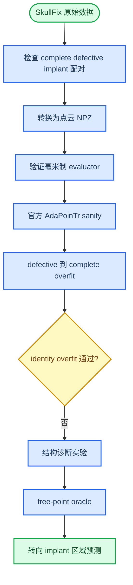

# AdaPoinTr 在 SkullFix 点云实验阶段总结

_截至 2026-06-30，本报告整理 SkullFix 点云接入、医学指标验证、单样本过拟合诊断、结构性问题分析与下一步实验决策。本文不重复 ShapeNet34 AdaPoinTr 官方配置 full training 的内容。_

---

## 阶段结论

本阶段已经完成了 SkullFix 点云数据接入、毫米制评价器验证、AdaPoinTr 在 SkullFix 上的 sanity/overfit 流程，以及多组针对性诊断实验。核心发现是：**直接把 AdaPoinTr 用作 defective skull -> complete skull 的完整颅骨补全，在当前点云任务定义下不适合作为后续正式 baseline 的主路径**。

主要证据如下：

- 数据链路本身基本可信：SkullFix triplet 配对、点云采样、统一归一化、服务器读取、forward/backward、checkpoint 和可视化流程均已跑通
- 毫米制评价器已通过合成样例验证：完全相同点集、整体平移 1 mm、归一化坐标还原均符合预期
- `defective -> complete` 单样本 overfit 失败：预测完整颅骨的 CD/HD95 反而差于输入缺损颅骨
- `complete -> complete` identity overfit 也失败：即使输入和目标完全相同，AdaPoinTr 仍无法把 8192 点完整颅骨稳定重构到接近零误差
- 2x2 诊断显示 `fps_preserve` 能显著改善 coarse/fine 覆盖，但仍远未达到 identity overfit 应有水平
- directional Chamfer、patch-local loss 均未解决覆盖不足，反而常常恶化 NSD 或 CD
- free-point oracle 证明即便把预测点坐标本身作为自由参数优化，仍会卡在 many-to-one 最近邻匹配盆地，最终 CD 只能降到约 1.01 mm，未通过 0.5 mm gate

因此，下一步不建议继续在完整颅骨重建目标上堆 loss 或做常规学习率 sweep。更合理的方向是改成：

```text
input: defective skull point cloud
target: implant / defect-region point cloud
reconstruction: defective skull union predicted implant
```

这与后续论文应围绕 implant/defect region 的评价口径一致，也避开了“让模型重复生成已经观测到的健康颅骨表面”这一不必要负担。

## 工作流概览



## 数据接入与预处理

### 数据定位

当前阶段使用 SkullFix 作为医学点云接入和 baseline 跑通集，SkullBreak 暂不进入主实验。这样做的理由是 SkullFix 数据量较小、triplet 结构清晰，适合先验证数据格式、训练入口、评价器和可视化流程。

本阶段采用的数据任务定义最初为：

```text
input:  defective skull point cloud
target: complete skull point cloud
label:  implant point cloud, reserved for defect-region evaluation
```

### 数据转换结果

已经完成从 SkullFix 原始体数据到点云 NPZ 的转换，并在服务器上解压到：

```text
~/datasets/SkullFixPC
```

仓库内通过软链接接入：

```text
~/adapointr_work/PoinTr/data/SkullFixPC
```

转换后的固定设置如下：

| 项目 | 当前设置 |
| --- | --- |
| Triplet 数量 | 100 |
| Split | train 80 / val 10 / test 10 |
| Split seed | 20260628 |
| defective/partial points | 8192 |
| complete/gt points | 8192 |
| implant points | 4096 |
| 归一化来源 | defective skull surface |
| 归一化策略 | defective、complete、implant 使用同一 centroid 和 scale |
| 服务器检查样本数 | 100 |
| implant/missing IoU min | 1.0 |
| implant/missing IoU mean | 1.0 |

服务器检查输出确认：

```text
samples_checked: 100
split_counts: {'test': 10, 'train': 80, 'val': 10}
implant_missing_iou_min: 1.000000
implant_missing_iou_mean: 1.000000
[ok] all checked point-cloud files are valid
```

### 已实现的 Dataset 能力

当前 `datasets/SkullFixDataset.py` 已支持：

- 从 `manifest.jsonl` 读取样本
- 按 `manifest_split` 指定真实 split
- 通过 `max_samples` 做小样本 sanity
- 通过 `repeat` 重复同一病例以组成较大 batch
- 通过 `input_key` 切换输入点云为 `partial` 或 `gt`

其中 `input_key=gt` 主要用于 identity overfit 诊断，而不是正式任务。

## 毫米制评价器

### 实现内容

已实现 `utils/skullfix_metrics.py`，用于把归一化点云还原到原始物理坐标并计算点云层面的毫米制表面指标。当前实现包括：

- `normalized_to_world`
- `world_to_normalized`
- symmetric CD-L1 [mm]
- ASSD [mm]
- HD95 [mm]
- directed prediction-to-reference mean [mm]
- directed reference-to-prediction mean [mm]
- point-sampled NSD@0.5/1/2 mm

对应验证脚本为：

```text
tools/validate_skullfix_metric_units.py
```

### 已通过的验证

服务器验证已通过，覆盖以下情况：

- 完全相同点集：CD、ASSD、HD95 为 0，NSD 为 1
- 整体平移 1 mm：CD、ASSD、HD95 为 1 mm
- 1 mm 平移下：NSD@0.5 mm 为 0，NSD@1/2 mm 为 1
- 人工 centroid/scale 往返还原正确
- 真实 SkullFix NPZ 的 normalized -> world -> normalized 往返误差接近机器精度

### 当前评价器边界

当前 evaluator 是点云表面采样层面的 sanity/overfit 评价器，还不是最终论文中的完整临床评价器。尚未包括：

- 体素级 implant DSC
- AutoImplant 官方 bDSC
- 基于三角网格表面积加权的精确 Surface Dice
- 从 predicted complete skull 稳定提取 predicted implant 的后处理

因此，本阶段的 CD/HD95/NSD 适合用于定位模型是否能学会一个样本，但不能直接替代正式论文表格中的体素和边界指标。

## 初始 SkullFix sanity 与 overfit

### 训练入口

已准备并运行过以下脚本：

```text
scripts/run_skullfix_adapointr_sanity.sh
scripts/run_skullfix_adapointr_overfit1.sh
scripts/run_skullfix_adapointr_overfit1_controlled.sh
```

这些脚本验证了：

- SkullFix dataset 能被官方训练入口加载
- AdaPoinTr 前向传播、Chamfer loss、反向传播能运行
- checkpoint 能保存
- 可视化脚本能输出输入、预测、GT 和 implant

### 第一轮 defective -> complete overfit

第一轮单样本 overfit 使用 `defective skull -> complete skull`，结果未通过。关键指标如下：

| 对象 | CD-L1 [mm] | HD95 [mm] | NSD@1 mm |
| --- | ---: | ---: | ---: |
| 输入 defective vs GT complete | 2.8448 | 5.3350 | 0.0948 |
| 预测 complete vs GT complete | 5.2648 | 12.2129 | 0.0172 |

结论：预测完整颅骨反而明显差于原始缺损输入，说明模型没有学会“保留已知颅骨并补齐缺损”。

### 第二轮受控 overfit

第二轮做了更受控的设置：

- 同一训练病例
- `repeat=8` 形成 `batch=8`
- `lr=5e-5`
- `weight_decay=0`
- 训练 1000 epoch
- 每 25 epoch 验证与保存

最佳 checkpoint 约在 epoch 975：

| 对象 | CD-L1 [mm] | HD95 [mm] | NSD@1 mm | Pred -> Ref [mm] | Ref -> Pred [mm] |
| --- | ---: | ---: | ---: | ---: | ---: |
| 输入 defective vs GT complete | 2.8448 | 5.3350 | 0.0948 | 2.5643 | 3.1253 |
| 预测 complete vs GT complete | 3.6884 | 9.3093 | 0.0940 | 2.3293 | 5.0475 |

这一轮相比第一轮有所改善，但仍未超过输入 defective baseline。尤其是 `Ref -> Pred` 很大，说明预测点云没有覆盖完整 GT 表面。

## 可视化观察

`experiments/visualizations/skullfix_adapointr_overfit1_best/000_002` 与后续 controlled overfit 可视化显示：

- 输入 defective 和 GT complete 形状接近，缺损局限于局部
- 预测 complete 不是在缺损处补片，而是整体生成一个更小、更稀疏、更低频的颅骨状点云
- 对完整颅骨任务而言，这会损伤大量本来已经观测到的健康区域

需要注意：旧版 PNG 可视化每张图会独立自适应坐标范围，所以不能仅凭图上显示尺寸判断物理缩放。真正的结论以 mm 指标为准。

## Identity overfit 诊断

### 实验目的

为了区分“defective -> complete 任务不适配”与“AdaPoinTr 在 SkullFix 颅骨点云上连 identity 都学不会”，进行了 `complete -> complete` 诊断。

配置核心为：

```text
input_key: gt
target: gt
repeat: 8
batch size: 8
weight_decay: 0
```

如果模型结构和损失对 SkullFix 点云适配良好，这个任务应当很容易 overfit 到接近零误差。

### Identity 结果

实际结果显示 identity overfit 仍失败。训练 loss 从约 `256.4390` 降到约 `119.4`，但验证指标仍停留在较大误差：

```text
best epoch: 450
F-Score: 0.0142
CDL1: 47.0432
CDL2: 7.2927
```

用 mm evaluator 进一步检查：

| 模式 | CD-L1 [mm] | HD95 [mm] | NSD@1 mm | Pred -> Ref [mm] | Ref -> Pred [mm] |
| --- | ---: | ---: | ---: | ---: | ---: |
| eval_standard | 5.0287 | 11.7512 | 0.0333 | 3.6933 | 6.3640 |
| eval_branch_batch_bn | 4.4262 | 11.8789 | 0.1602 | 2.5561 | 6.2962 |
| train_branch_eval_layers | 4.9759 | 11.6718 | 0.0328 | 3.6440 | 6.3078 |
| train_full | 4.3535 | 11.9988 | 0.2065 | 2.3752 | 6.3317 |

结论：

- BatchNorm batch statistics 能改善一部分 `Pred -> Ref`
- 训练/推理分支差异不是主因
- `Ref -> Pred` 始终很大，说明根因是覆盖不足，而不是单纯的 BN 或 eval mode 问题

## Loss 与梯度分解

### 关键发现

使用 `tools/diagnose_skullfix_loss_gradients.py` 对 identity 任务进行 loss 和梯度拆解，得到几个重要结论：

1. 官方 `query_ranking + argsort` 路径对 query 选择不可微，`query_ranking` 的梯度为零
2. coarse 阶段预测点接近真实表面，但只覆盖一部分区域
3. fine 阶段能把点贴近某些表面局部，但没有覆盖完整表面
4. denoise loss 与 fine decoder 的梯度方向存在明显冲突

典型分解如下：

| 层级 | CD-L1 [mm] | Pred -> Ref [mm] | Ref -> Pred [mm] | 解释 |
| --- | ---: | ---: | ---: | --- |
| coarse | 8.475 | 0.069 | 16.880 | 点在真实表面附近，但覆盖极差 |
| fine | 4.353 | 2.375 | 6.332 | 覆盖有所改善，但仍大面积缺失 |

这说明当前问题不是“模型完全不会生成颅骨形状”，而是生成点严重集中在部分区域，无法实现全局均匀覆盖。

## 2x2 identity 对照

### 对照因素

围绕两个因素做了 2x2 对照：

- Query 选择：`ranking` vs `fps_preserve`
- Denoise 权重：`0.5` vs `0.0`

| 组别 | Query | Denoise weight |
| --- | --- | ---: |
| A | ranking | 0.5 |
| B | ranking | 0.0 |
| C | fps_preserve | 0.5 |
| D | fps_preserve | 0.0 |

### 结果

| 组别 | Coarse CD [mm] | Coarse Ref -> Pred [mm] | Fine CD [mm] | Fine HD95 [mm] | Fine NSD@1 mm | Fine Pred -> Ref [mm] | Fine Ref -> Pred [mm] |
| --- | ---: | ---: | ---: | ---: | ---: | ---: | ---: |
| A | 8.4749 | 16.8805 | 5.0286 | 11.7503 | 0.0325 | 3.6935 | 6.3638 |
| B | 8.4949 | 16.9123 | 5.0623 | 11.2077 | 0.0153 | 4.5806 | 5.5439 |
| C | 4.5792 | 9.1042 | 3.3855 | 7.5623 | 0.1008 | 2.1882 | 4.5828 |
| D | 4.5827 | 9.1043 | 3.3744 | 7.0618 | 0.1182 | 2.6795 | 4.0693 |

### 分析

`fps_preserve` 是最有效的修复项。它强制保留输入 FPS anchor，避免官方 ranking 路径把大量 coarse query 选到局部区域。

但即使 D 组最佳，identity 任务的 CD 仍有 3.37 mm，HD95 仍有 7.06 mm，NSD@1 mm 只有 0.1182。这说明 `fps_preserve` 是必要修复，但远不是充分修复。

## Directional Chamfer 对照

### 实验目的

D 组仍有 `GT -> Prediction` 覆盖不足，因此测试是否提高 `GT -> Prediction` 方向权重能够改善覆盖。

| 组别 | Coverage weight |
| --- | ---: |
| D | 1 |
| E | 2 |
| F | 4 |

### 结果

| 组别 | Fine CD [mm] | Fine HD95 [mm] | Fine NSD@1 mm | Pred -> Ref [mm] | Ref -> Pred [mm] |
| --- | ---: | ---: | ---: | ---: | ---: |
| D | 3.3744 | 7.0618 | 0.1182 | 2.6795 | 4.0693 |
| E | 3.6711 | 7.0251 | 0.0288 | 3.2780 | 4.0643 |
| F | 3.5766 | 7.1253 | 0.0331 | 3.2457 | 3.9074 |

### 分析

简单提高 `GT -> Prediction` 权重没有解决覆盖问题：

- `Ref -> Pred` 改善非常有限
- `Pred -> Ref` 明显恶化
- NSD@1 mm 大幅下降
- 对称 CD 反而变差

这说明全局最近邻 Chamfer 的方向加权不能解决 patch 重复覆盖和局部竞争问题。

## Patch-local reconstruction loss 对照

### 实验目的

AdaPoinTr 的 FC decoder 会为每个 coarse query 生成固定数量 fine 子点。为了减少 patch 条带和重复覆盖，测试了 patch-local KNN 监督。

| 组别 | Local weight |
| --- | ---: |
| D | 0.0 |
| G | 0.5 |
| H | 1.0 |

### 结果

| 组别 | Fine CD [mm] | Fine HD95 [mm] | Fine NSD@1 mm | Pred -> Ref [mm] | Ref -> Pred [mm] |
| --- | ---: | ---: | ---: | ---: | ---: |
| D | 3.3744 | 7.0618 | 0.1182 | 2.6795 | 4.0693 |
| G | 3.8675 | 8.0073 | 0.0303 | 2.9306 | 4.8044 |
| H | 3.5184 | 7.5201 | 0.1017 | 2.4729 | 4.5639 |

### 分析

当前 patch-local KNN loss 不但没有改善 D，反而整体变差。原因很可能是不同 coarse query 的 GT KNN 邻域高度重叠，导致多个 patch 被拉向相同局部表面，进一步削弱全局覆盖。

因此，继续叠加这种局部 loss 不适合作为主方向。

## Free-point oracle

### 实验设计

为了判断“问题是否只是 AdaPoinTr 参数化/学习率导致”，设计了 free-point oracle：

1. 加载 D 组 checkpoint
2. 得到一组预测完整颅骨点云
3. 删除模型
4. 直接把预测点坐标本身设为可学习参数
5. 只用稳定版 L1 Chamfer 优化到同一 GT

如果这样也不能充分恢复 GT，说明问题更偏向 Chamfer 最近邻匹配本身，而不是普通模型学习率或 decoder 参数化。

### 结果

```text
Initial CD:        3.374400 mm
Best/final CD:     1.013344 mm
Final HD95:        4.793316 mm
Final NSD@1 mm:    0.699524
Final Pred -> GT:  0.055584 mm
Final GT -> Pred:  1.971104 mm
Pass CD < 0.5 mm:  false
```

### 分析

free-point oracle 把 CD 从 3.37 mm 降到 1.01 mm，说明点坐标直接优化确实能改善。但它没有通过 `<0.5 mm` gate，并且最终出现强烈的方向不平衡：

- `Pred -> GT` 约 0.056 mm，说明预测点几乎都贴到了某些 GT 表面
- `GT -> Pred` 约 1.97 mm，说明仍有大量 GT 区域没有预测点覆盖

这证明当前 global nearest-neighbor Chamfer 容易陷入 many-to-one 匹配盆地。许多预测点会贴到已有局部区域，而不是重新分配到未覆盖区域。

这也是为什么继续对 D 组做普通学习率 sweep、epoch 增加或简单 loss 权重调整，很可能收益有限。

## 已沉淀的代码与配置

### 数据与评价相关

| 文件 | 作用 |
| --- | --- |
| `datasets/SkullFixDataset.py` | SkullFix 点云 Dataset，支持 split、repeat、input_key |
| `tools/prepare_skullfix_pointcloud.py` | 原始 SkullFix 数据转点云 |
| `tools/check_skullfix_pointcloud.py` | 点云数据完整性检查 |
| `utils/skullfix_metrics.py` | 毫米制点云表面评价 |
| `tools/validate_skullfix_metric_units.py` | evaluator 单位和坐标还原验证 |
| `tools/visualize_skullfix_completion.py` | SkullFix 点云预测可视化 |

### 诊断相关

| 文件 | 作用 |
| --- | --- |
| `tools/diagnose_skullfix_train_eval_gap.py` | 比较 eval/train 分支和 BN 影响 |
| `tools/diagnose_skullfix_loss_gradients.py` | loss 与梯度分解 |
| `tools/summarize_skullfix_identity_2x2.py` | 2x2 identity 结果汇总 |
| `tools/summarize_skullfix_identity_directional.py` | directional Chamfer 结果汇总 |
| `tools/summarize_skullfix_identity_patch_local.py` | patch-local 结果汇总 |
| `tools/run_skullfix_free_point_oracle.py` | 自由点 oracle |

### 模型改动

| 改动 | 目的 | 当前结论 |
| --- | --- | --- |
| `query_selection=ranking` | 保留官方行为 | 在 SkullFix identity 中覆盖不足严重 |
| `query_selection=fps_preserve` | 强制保留输入 FPS anchors | 明显改善覆盖，是必要修复 |
| `denoise_weight` | 控制 denoise loss 梯度贡献 | 单独关闭 denoise 不是主解 |
| `fine_coverage_weight` | 加权 `GT -> Prediction` 方向 | 没能改善整体指标 |
| `fine_local_weight` | 加入 patch-local KNN loss | 当前版本恶化整体结果 |
| `ChamferDistanceL1Stable` | 避免 free-point oracle 中 `sqrt(0)` 梯度异常 | 已用于 oracle hotfix |

### 主要配置

| 配置 | 作用 |
| --- | --- |
| `cfgs/SkullFix_models/AdaPoinTr_sanity.yaml` | 小样本 sanity |
| `cfgs/SkullFix_models/AdaPoinTr_overfit1.yaml` | 第一轮单样本 overfit |
| `cfgs/SkullFix_models/AdaPoinTr_overfit1_controlled.yaml` | 第二轮受控 overfit |
| `cfgs/SkullFix_models/AdaPoinTr_identity_overfit_controlled.yaml` | identity overfit 基础诊断 |
| `cfgs/SkullFix_models/AdaPoinTr_identity_D_fpspreserve_nodenoise.yaml` | 当前最佳 identity 诊断组 D |
| `cfgs/SkullFix_models/AdaPoinTr_identity_E_coverage2.yaml` | coverage weight 2 |
| `cfgs/SkullFix_models/AdaPoinTr_identity_F_coverage4.yaml` | coverage weight 4 |
| `cfgs/SkullFix_models/AdaPoinTr_identity_G_local05.yaml` | patch-local weight 0.5 |
| `cfgs/SkullFix_models/AdaPoinTr_identity_H_local10.yaml` | patch-local weight 1.0 |

## 主要问题归纳

### 问题一：完整颅骨目标稀释了真正任务

颅骨修复的核心是 implant/defect region，而不是重新生成完整健康颅骨。完整颅骨点云中绝大多数区域已经由输入 defective skull 给出，让模型重建完整 skull 会把学习能力消耗在重复生成已知区域上。

从医学评价角度看，完整 skull 的全局 CD 也不适合作为主指标，因为它会被健康区域主导，掩盖 implant 区域的关键误差。

### 问题二：AdaPoinTr 的 query ranking 对 SkullFix 覆盖不友好

官方 `query_ranking + argsort` 在当前路径上不可微，且会造成 coarse query 覆盖不足。`fps_preserve` 能显著改善这一点，但仍不足以解决完整颅骨 identity。

### 问题三：global Chamfer 存在 many-to-one 匹配盆地

Directional Chamfer、patch-local loss 和 free-point oracle 共同说明，最近邻 Chamfer 容易让多个预测点覆盖同一局部区域，而不是主动填补未覆盖区域。这对于完整颅骨大曲面尤其明显。

### 问题四：FC patch decoder 更像低频形状生成器

可视化显示 fine 输出呈现规则条带和低频轮廓，对复杂颅骨表面覆盖不稳定。它能生成“像颅骨”的形状，但不能稳定保留和覆盖每个局部细节。

## 目前不建议继续做的方向

以下方向短期内不建议作为主线：

- 直接开完整 SkullFix `defective -> complete` baseline
- 在 D 组上继续单纯加 epoch
- 对 D 组做普通学习率 sweep
- 继续堆 global Chamfer 方向权重
- 继续堆当前形式的 patch-local KNN loss
- 用完整 skull CD/HD95 作为论文主结论

这些方向都不能直接解决任务定义与覆盖机制的问题。

## 建议的下一步

### 推荐任务重定义

下一阶段应转为 implant 区域预测：

```text
input: defective skull point cloud
target: implant point cloud
output: predicted implant point cloud
complete reconstruction: defective skull union predicted implant
```

这会带来三个好处：

1. 训练目标直接对齐临床修复区域
2. 评价指标直接围绕 implant/defect region
3. 模型不需要重复生成已知健康颅骨

### 推荐最小实验

建议先做一个新的单样本 overfit：

| 项目 | 建议 |
| --- | --- |
| 输入 | defective skull, 8192 points |
| 目标 | implant, 4096 points |
| 模型输出 | predicted implant |
| `num_points` | 4096 |
| `num_query` | 可先试 256 |
| query 策略 | 新增 `learned_only` 或 implant-specific query，不使用 `fps_preserve` |
| denoise | 先关闭 |
| 评价 | predicted implant vs GT implant 的 CD/HD95/NSD [mm] |

这里不建议继续使用 `fps_preserve` 作为 implant 预测的 query anchor，因为 defective skull 上的 FPS 点位于已知颅骨表面，而 implant 位于缺损区域内部/边界附近。对于 implant target，输入 anchor 可能会把 query 锚定到错误区域。

### 推荐代码改动

下一步需要新增或修改：

- `SkullFixDataset` 支持 `target_key=implant`
- `AdaPoinTr` 支持 `query_selection=learned_only`
- 新增 `cfgs/SkullFix_models/AdaPoinTr_implant_overfit1.yaml`
- 新增 implant 预测可视化脚本或扩展当前可视化脚本
- 新增 implant mm evaluator 调用脚本，直接比较 `prediction_implant` 和 `ground_truth_implant`

### 推荐通过标准

在进入 SkullFix 全集 baseline 之前，implant 单样本 overfit 至少应满足：

| 指标 | 建议门槛 |
| --- | ---: |
| Implant CD-L1 | 明显低于 defective-to-complete 旧路线 |
| Implant HD95 | 明显下降且无大范围离群 |
| NSD@1 mm | 明显高于完整颅骨旧路线 |
| 可视化 | predicted implant 位于缺损区域，形状接近 GT implant |
| 完整重建 | defective skull union predicted implant 不破坏已知颅骨 |

## 阶段性判断

目前最重要的收获不是“SkullFix baseline 已经失败”，而是已经定位到：**完整颅骨补全目标与 AdaPoinTr 的通用物体点云补全机制，在 SkullFix 医学任务上存在明显不匹配**。

这对小论文反而是有价值的。它给后续方法设计提供了明确动机：

- 医学颅骨修复不应只套用通用物体补全范式
- 评价应围绕 implant/defect region，而不是完整 skull
- 输入已知健康区域应被保留，而不是被重新生成
- 后续 Mamba/医学先验改进可以围绕缺损区域建模、边界约束和 implant 局部生成展开

下一步建议停止完整颅骨 identity 诊断主线，进入 `defective -> implant` 的最小 overfit 实验。只有 implant overfit 跑通后，再进入 SkullFix train/val/test baseline，最后再迁移到 SkullBreak 做正式主实验和鲁棒性验证。
